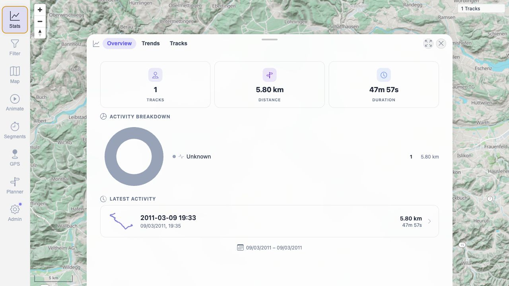
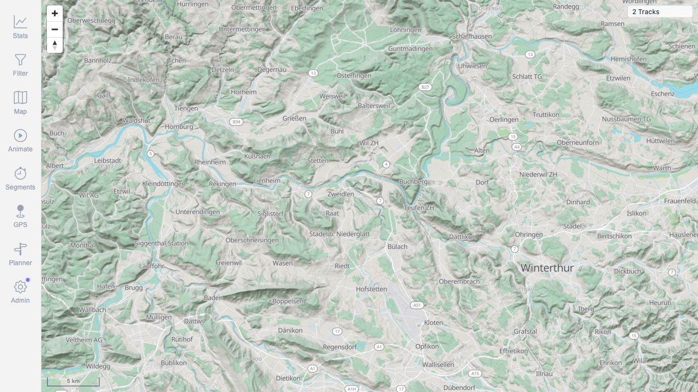
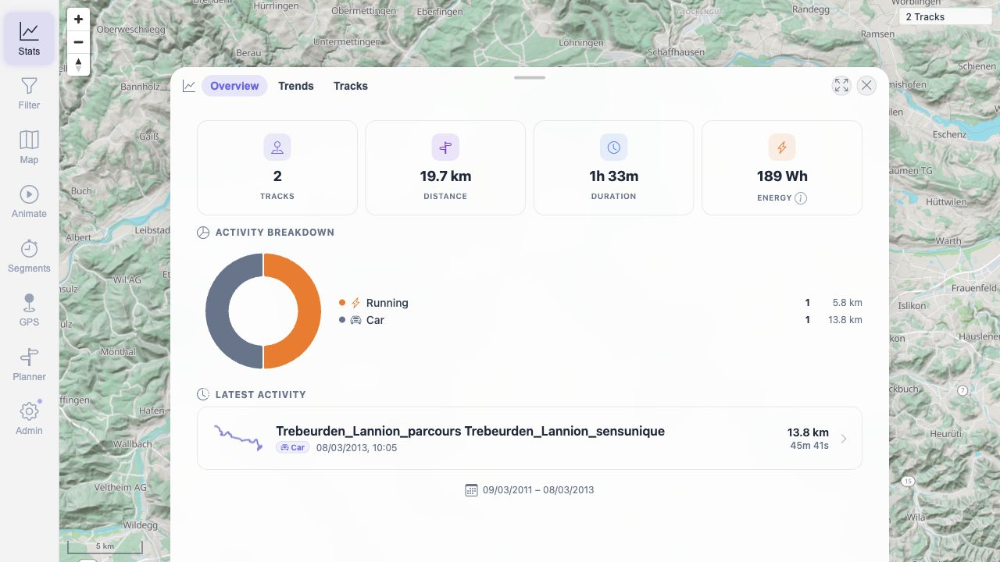

# MTL Explorer Compose Quick Start Server Test - 2026-05-20

## Goal

Validate the main `README.md` quick-start flow for the simplest home/server
installation: Docker Compose using prebuilt images, hosted maps through the
default backend proxy, and track import by copying GPX files into `./data/gpx/`.

This test intentionally did not validate the container-build manual. The current
workspace was unpublished, so the local `docker-compose.yml` was uploaded to the
test server instead of downloading the compose file from GitHub.

## Server

- Server IP: `178.105.200.92`
- App URL tested: `http://178.105.200.92:18080/mtl/`
- SSH user: `root`
- Root password: intentionally omitted from this report
- Hostname: `MTL-TEST-COMPOSE-ONLY`
- OS: Debian GNU/Linux 13 (trixie)
- Memory: 3.7 GiB RAM, no swap
- Disk after test: 75 GB root filesystem, 6.9 GB used, 65 GB available

Only this server was used for the compose quick-start validation.

## Documentation Path Tested

Main quick start in `README.md`:

```bash
mkdir mtl-explorer && cd mtl-explorer
curl -fsSL -o docker-compose.yml https://raw.githubusercontent.com/mindalyze-com/mtl-explorer/main/docker-compose.yml
docker compose up -d
```

Runtime instructions tested:

- Open `http://localhost:18080/mtl/`.
- Log in with the documented default app credentials.
- Import tracks by copying GPX/FIT files into `./data/gpx/`.
- Use the default hosted map setup, leaving the `local-maps` profile off.

Adaptation for unpublished local workspace:

- The literal GitHub `curl` command was not used, because it would fetch the
  published `main` branch instead of the current local workspace.
- The local workspace was uploaded to `/opt/mtl-explorer-test`.
- The actual quick-start test ran in `/opt/mtl-readme-quickstart` with only the
  current local `docker-compose.yml` copied into that directory.

## Prerequisite Setup

The README states: `Prerequisite: Docker with Docker Compose.`

On this fresh Debian server, Docker was not installed. I installed Docker before
running the documented compose flow.

Installed versions:

```text
Docker version 29.5.2
Docker Compose version v5.1.4
docker buildx v0.34.0
```

Documentation gap:

- The quick start is correct once Docker Compose exists, but a fresh VPS needs a
  clearer prerequisite link or short note for installing Docker with the Compose
  plugin.

## Compose Startup

Command run in `/opt/mtl-readme-quickstart`:

```bash
docker compose up -d
```

Images pulled:

- `wauwau0977/mytraillog:latest`
- `wauwau0977/mytraillog-brouter:latest`
- `postgis/postgis:18-3.6`

Final compose status:

```text
mtl-readme-quickstart-app-1       Up        0.0.0.0:18080->8080/tcp
mtl-readme-quickstart-brouter-1   Up        17777-17778/tcp
mtl-readme-quickstart-db-1        Up        healthy
```

Startup evidence:

```text
MtlServerApplication : Started MtlServerApplication in 11.588 seconds
```

HTTP checks:

- `http://127.0.0.1:18080/mtl/` on the server returned HTTP 200.
- `http://178.105.200.92:18080/mtl/` from the local machine returned HTTP 200.

Documentation gap:

- For a remote server, `localhost` in the README means the server itself. VPS
  users need to open `http://<server-ip>:18080/mtl/`, use an SSH tunnel, or put a
  reverse proxy in front.

## Browser Verification

The app opened successfully at:

```text
http://178.105.200.92:18080/mtl/
```

Login with the README default app credentials worked. The first authenticated
view loaded the map and showed `0 Tracks`.

Hosted map verification from app logs:

```text
/mtl/api/map-proxy/prod/planet.pmtiles        status=206
/mtl/api/map-proxy/prod/world-lowzoom.pmtiles status=200
```

This confirms the simple hosted-map setup works without enabling the optional
local map sidecar.

## Local GPX Import Test

The README says:

```text
To import your tracks, copy GPX/FIT files into the ./data/gpx/ folder.
```

Test file copied into the documented folder:

```text
/opt/mtl-readme-quickstart/data/gpx/readme-test-2011-03-09.gpx
```

Backend log evidence:

```text
Live watcher detected CREATE for: readme-test-2011-03-09.gpx
Reading of track id=100000 and path= file=readme-test-2011-03-09.gpx did complete with success=true
Exploration score: trackId=100000 score=100.0%
```

UI result:

- Map counter changed from `0 Tracks` to `1 Tracks`.
- Stats panel showed `1` track, `5.80 km`, `47m 57s`.




## Internet GPX Import Test

Extra test goal: download real public GPX files from the internet and copy them
into the documented `./data/gpx/` folder to verify ingestion behavior with
external files.

Source repository:

- `gps-touring/sample-gpx`: `https://github.com/gps-touring/sample-gpx`

Files downloaded into `/opt/mtl-readme-quickstart/data/gpx/`:

| File | Source URL | Size |
| --- | --- | ---: |
| `internet-Newhaven_Brighton.gpx` | `https://raw.githubusercontent.com/gps-touring/sample-gpx/master/BrittanyJura/Newhaven_Brighton.gpx` | 63 KB |
| `internet-Ouistreham_Caen.gpx` | `https://raw.githubusercontent.com/gps-touring/sample-gpx/master/BrittanyJura/Ouistreham_Caen.gpx` | 36 KB |
| `internet-Trebeurden_Lannion_parcours13.2RE.gpx` | `https://raw.githubusercontent.com/gps-touring/sample-gpx/master/RoscoffCoastal/Trebeurden_Lannion_parcours13.2RE.gpx` | 44 KB |
| `internet-Reims-VitryLeFrancois.gpx` | `https://raw.githubusercontent.com/gps-touring/sample-gpx/master/BrittanyJura/Reims-VitryLeFrancois.gpx` | 22 KB |

Backend log evidence:

```text
Reading of track id=100001 and path= file=internet-Newhaven_Brighton.gpx did complete with success=true
Reading of track id=100002 and path= file=internet-Ouistreham_Caen.gpx did complete with success=true
Reading of track id=100003 and path= file=internet-Trebeurden_Lannion_parcours13.2RE.gpx did complete with success=true
Reading of track id=100004 and path= file=internet-Reims-VitryLeFrancois.gpx did complete with success=true
```

One public GPX file produced outlier logs but still imported:

```text
Outliers Found: true
Outliers Count: 6
file=internet-Trebeurden_Lannion_parcours13.2RE.gpx
```

Database verification after all imports:

```text
gps_track rows: 5
```

Imported track rows:

| Track ID | File/name | Start date | End date | Activity | Exploration status |
| ---: | --- | --- | --- | --- | --- |
| `100000` | `readme-test-2011-03-09.gpx` | `2011-03-09 18:35:04` | `2011-03-09 19:24:46` | `RUNNING` | `CALCULATED` |
| `100001` | `internet-Newhaven_Brighton.gpx` | null | null | `BICYCLE` | `NOT_SCHEDULED` |
| `100002` | `internet-Ouistreham_Caen.gpx` | null | null | `BICYCLE` | `NOT_SCHEDULED` |
| `100003` | `internet-Trebeurden_Lannion_parcours13.2RE.gpx` | `2013-03-08 09:05:06` | `2013-03-08 11:06:01` | `CAR` | `CALCULATED` |
| `100004` | `internet-Reims-VitryLeFrancois.gpx` | null | null | `BICYCLE` | `NOT_SCHEDULED` |

UI result after internet imports:

- The database contained all 5 imported tracks.
- The default map/stats UI showed `2 Tracks`.
- The visible tracks were the local timed GPX and the internet GPX with
  timestamped trackpoints.
- Three internet GPX files were ingested but had null start/end dates, so they
  did not appear in the default dated stats view.





Documentation gap:

- The import docs should clarify that copying a GPX into `./data/gpx/` means the
  file is processed, but a GPX without usable trackpoint timestamps may be stored
  without appearing in the normal date-based map/stats view.
- A short verification hint would help: check `docker compose logs app` for
  `Live watcher detected CREATE` and `did complete with success=true`.

## Runtime Logs And Resource Check

No app errors were found in the final log sweep.

Startup warnings observed:

- default password encoder warning
- SpringDoc endpoints enabled warning
- Thymeleaf template folder warning
- first-run Liquibase/DB changelog lock existence check

These did not block startup, login, map loading, or GPX import.

Runtime resource use during the test:

```text
app       558.1 MiB / 1.5 GiB
db        105.6 MiB / 1 GiB
brouter    35.95 MiB / 1 GiB
```

The test server has 3.7 GiB RAM, which is slightly below the documented
`About 4 GB RAM minimum`, but the stack still worked for this small test.

## Cleanup And Final State

- The compose stack was left running for inspection.
- Test data remains in `/opt/mtl-readme-quickstart/data/gpx/`.
- The temporary SSH key used for automation was removed from the server.
- This report intentionally omits the root password.

Final app URL:

```text
http://178.105.200.92:18080/mtl/
```

## Summary

The main README compose-only quick start works with the current local
`docker-compose.yml` and prebuilt images after Docker Compose is installed.

Confirmed working:

- prebuilt image pull and compose startup
- app HTTP access on port `18080`
- default login
- hosted map proxy
- local GPX folder import
- public internet GPX ingestion
- BRouter sidecar startup

Gaps found:

- Fresh VPS prerequisite setup needs clearer Docker/Compose guidance.
- Remote-server access needs a note about using the server IP, SSH tunnel, or
  reverse proxy instead of local-machine `localhost`.
- Because local changes are unpublished, the README GitHub `curl` command cannot
  validate the local workspace exactly.
- GPX files without timestamps can ingest successfully but remain absent from
  the default visible map/stats count.
