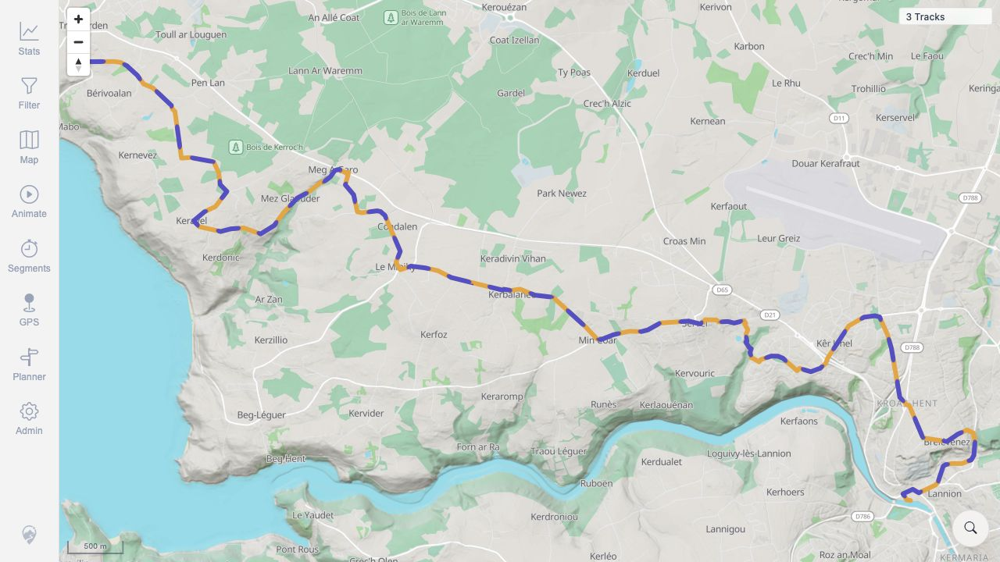
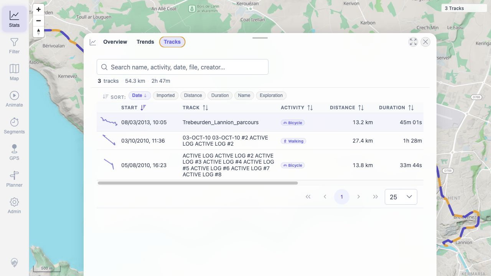

# MTL Explorer Container Build Test - 2026-05-20

## Goal

Validate whether the unpublished local MTL Explorer workspace can be uploaded to a clean Hetzner development VPS and run using only the repository README plus the container build documentation. The test intentionally follows the documented container-image path, verifies startup/runtime behavior, imports GPX files through the documented `./data/gpx/` folder, checks live watcher delete/add behavior, and records any documentation gaps found along the way.

## Scope

- Server used: the supplied development VPS only.
- IPv4: `178.105.74.191/32`
- IPv6: `2a01:4f8:c014:813d::/64`
- SSH user: `root`
- External MTL Explorer URL tested: `http://178.105.74.191:18080/mtl/`
- Source used: local workspace uploaded from `/Users/pheusser/IdeaProjects/mytraillog`.
- Documentation path tested:
  - `README.md` quick start assumptions.
  - `documentation/container-build.md` local image build commands.
- Hetzner-specific workspace notes were not used and `docs-my/hetzner/` was not uploaded.
- Root password and session tokens are intentionally not recorded here.

## Server Baseline

- Hostname: `MTL-TEST-INSTALLATION`
- OS: Debian GNU/Linux 13 (trixie)
- Disk: 75 GB root volume
- Memory: 3.7 GiB RAM, no swap
- Initial Docker state: Docker was not installed.
- First SSH login forced an immediate root password rotation. After that, local SSH key auth was installed.

## Prerequisite Setup

The README says: `Prerequisite: Docker with Docker Compose.`

On this clean VPS that prerequisite was missing. Debian's own repository had `docker.io` and `docker-buildx`, but not the `docker compose` plugin used by the docs. I installed Docker from the official Docker apt repository.

Installed versions:

- Docker: `29.5.2`
- Buildx: `v0.34.0`
- Compose: `v5.1.4`

Documentation gap:

- For clean server installs, the README or a linked prerequisite page should say that Docker must include both `docker buildx` and `docker compose`, not only classic Docker or legacy `docker-compose`.

## Source Upload

Uploaded the local workspace to:

```bash
/root/mtl-explorer-src
```

Explicitly excluded root-local data/build material and private notes:

- `.git/`, `.github/`, IDE folders, caches
- root `data/`, root `logs/`
- `node_modules/`, `target/`, `dist/`
- `docs-my/`

Transfer gotcha found:

- Do not pass `.dockerignore` directly to `rsync --exclude-from`.
- `rsync` exclusion semantics are not the same as Docker build-context semantics.
- In one run this accidentally omitted Java source packages named `logs`, causing the app build to fail with missing `SystemLogService`, `WebRequestLogService`, and related classes.
- A small Docker copy test confirmed Docker itself can include the nested `logs` source package; the problem was the upload method, not the app Dockerfile.

Documentation gap:

- If the manual should support unpublished local workspaces, add a safe upload command. It should use explicit root/build-output excludes rather than reusing `.dockerignore`.

## Container Build

Commands from `documentation/container-build.md`:

```bash
export BUILDKIT_PROGRESS=plain
docker buildx build --load -t mytraillog:local .
docker buildx build --load -t mytraillog-brouter:local docker-brouter

MTL_APP_IMAGE=mytraillog:local \
MTL_BROUTER_IMAGE=mytraillog-brouter:local \
docker compose up -d
```

Results:

- `mytraillog:local` built successfully after the corrected source upload.
- `mytraillog-brouter:local` built successfully.
- Compose pulled `postgis/postgis:18-3.6`, created the default network, and started `db`, `brouter`, and `app`.
- The DB became healthy and the app started after Liquibase ran 79 changesets.

Remote logs:

- `/root/mtl-build-app.log` - first failed app build caused by bad upload filtering.
- `/root/mtl-dockerignore-check.log` - verification that Docker can copy the nested `logs` package.
- `/root/mtl-build-app-rerun.log` - successful app image build.
- `/root/mtl-build-brouter.log` - successful BRouter image build.
- `/root/mtl-compose-up.log` - successful compose startup.

## Runtime Verification

External app URL:

```text
http://178.105.74.191:18080/mtl/
```

Checks:

- `GET /mtl/` returned HTTP 200 externally.
- `POST /mtl/api/auth/login` with README credentials `mtl` / `change-me` returned HTTP 200.
- Authenticated `GET /mtl/api/info/build` returned:

```json
{"version":"0.0.1-SNAPSHOT","buildTime":"2026-05-20T20:16:04.890Z","defaultGpsTrackFilterName":"SmartBaseFilter"}
```

- BRouter admin status from the app network returned available:

```json
{"available":true,"brouterPort":17777,"brouterRunning":true,"segmentsOnDisk":0}
```

- Map status returned hosted-map fallback:

```json
{"phase":"public-fallback","ready":true,"message":"Using hosted map service","tileSource":"public"}
```

Runtime observation:

- The first HTTP check happened before Spring Boot had finished startup and temporarily failed/reset. After startup completed, local and external HTTP checks worked.

Documentation gap:

- For server usage, the README's `localhost` URL needs to be mentally translated to `http://<server-ip>:18080/mtl/`. A short note would help for VPS users, including ensuring port `18080` is reachable.

## Optional Local Maps

Built the optional image:

```bash
docker buildx build --load -t mytraillog-maps:local docker-maps
```

Result:

- `mytraillog-maps:local` built successfully.
- The `local-maps` profile was not started because the docs say it downloads about 130 GB on first startup, while this test server has a 75 GB disk.

Documentation status:

- The existing warning about the 130 GB first startup download is accurate and important.

## GPX Folder Ingest Test

The README says:

```text
To import your tracks, copy GPX/FIT files into the ./data/gpx/ folder.
```

The running compose stack maps that folder to `/app/gpx` in the container:

```yaml
./data/gpx:/app/gpx
```

Baseline before adding files:

- `gps_track`: 0 rows
- `indexed_file`: 0 rows

Downloaded public GPX samples directly into the documented folder on the server:

```bash
cd /root/mtl-explorer-src
mkdir -p data/gpx

curl -fL --retry 3 --retry-delay 2 \
  -o data/gpx/internet-cerknicko-jezero.gpx \
  https://raw.githubusercontent.com/tkrajina/gpxpy/dev/test_files/cerknicko-jezero.gpx

curl -fL --retry 3 --retry-delay 2 \
  -o data/gpx/internet-korita-zbevnica.gpx \
  https://raw.githubusercontent.com/tkrajina/gpxpy/dev/test_files/korita-zbevnica.gpx

curl -fL --retry 3 --retry-delay 2 \
  -o data/gpx/internet-Mojstrovka.gpx \
  https://raw.githubusercontent.com/tkrajina/gpxpy/dev/test_files/Mojstrovka.gpx

curl -fL --retry 3 --retry-delay 2 \
  -o data/gpx/internet-around-visnjan-with-car.gpx \
  https://raw.githubusercontent.com/tkrajina/gpxpy/dev/test_files/around-visnjan-with-car.gpx
```

Results:

| File | Indexer status | Track load status | Points | Length |
| --- | --- | --- | ---: | ---: |
| `internet-around-visnjan-with-car.gpx` | `COMPLETED_WITH_SUCCESS` | `SUCCESS` | 97 | 3,206.87 m |
| `internet-cerknicko-jezero.gpx` | `COMPLETED_WITH_SUCCESS` | `SUCCESS` | 296 | 13,767.43 m |
| `internet-korita-zbevnica.gpx` | `COMPLETED_WITH_SUCCESS` | `SUCCESS` | 871 | 27,396.87 m |
| `internet-Mojstrovka.gpx` | `COMPLETED_WITH_SUCCESS` | `SUCCESS` | 1 | 0.00 m |

Aggregate verification after ingest:

- `gps_track`: 4 rows
- Internet test files in `indexed_file`: 4 rows
- Internet test tracks in `gps_track`: 4 rows
- Derived `gps_track_data`: 29 rows
- Derived `gps_track_data_points`: 4,246 rows

Log evidence:

- The live watcher detected `CREATE` for each `internet-*.gpx` file.
- Normal samples logged `GPS ingest timing ... status=SUCCESS`.
- Duplicate detection ran after ingest.
- `internet-Mojstrovka.gpx` is an edge case: it was marked `SUCCESS`, but the outlier filter removed 183 points and the cleaned result collapsed to a single zero-length point.

Documentation status:

- The documented folder import works with the container setup.
- The docs should add a short verification step, for example `docker compose logs app` and the expected `Live watcher detected CREATE` / `GPS ingest timing ... status=SUCCESS` messages.
- The docs should clarify that `SUCCESS` means the file was processed, not necessarily that it produced a useful non-empty track. A malformed or odd GPX can still import as `SUCCESS` while yielding a one-point/zero-length track.

## GPX Delete And Re-Add Watcher Test

Deleted one already imported GPX from the documented folder:

```bash
cd /root/mtl-explorer-src
rm -f data/gpx/internet-around-visnjan-with-car.gpx
```

Result after the watcher debounce:

| File | File exists on disk | Indexer status | Linked tracks |
| --- | --- | --- | ---: |
| `internet-around-visnjan-with-car.gpx` | no | `REMOVED` | 0 |

The app log showed:

```text
Did delete gpsTrack and it's track data for given id=100003 file=/internet-around-visnjan-with-car.gpx
```

Then downloaded two different public GPX files into the same documented folder:

```bash
curl -fL --retry 3 --retry-delay 2 \
  -o data/gpx/internet-roscoff-morlaix.gpx \
  https://raw.githubusercontent.com/gps-touring/sample-gpx/master/RoscoffCoastal/simplified/1_Roscoff_Morlaix_A_parcours.gpx

curl -fL --retry 3 --retry-delay 2 \
  -o data/gpx/internet-trebeurden-lannion.gpx \
  https://raw.githubusercontent.com/gps-touring/sample-gpx/master/RoscoffCoastal/simplified/Trebeurden_Lannion_parcours13.2RE.gpx
```

Results:

| File | Indexer status | Track load status | Points | Length |
| --- | --- | --- | ---: | ---: |
| `internet-roscoff-morlaix.gpx` | `COMPLETED_WITH_SUCCESS` | `SUCCESS` | 1,741 | 30,997.38 m |
| `internet-trebeurden-lannion.gpx` | `COMPLETED_WITH_SUCCESS` | `SUCCESS` | 248 | 13,167.55 m |

Aggregate state after delete plus two additions:

- Internet test rows in `indexed_file`, all statuses: 6
- Completed internet rows: 5
- Removed internet rows: 1
- Active internet tracks: 5
- Active derived `gps_track_data`: 38 rows
- Active derived `gps_track_data_points`: 10,237 rows

Recognition evidence:

- The deleted file was removed from disk and had no remaining linked `gps_track` row.
- The two new files were detected by the live watcher as `CREATE`.
- Both new files logged `GPS ingest timing ... status=SUCCESS`.
- Duplicate detection ran for the two newly added tracks.

Documentation/status gap:

- Delete recognition works, but the removed `indexed_file.last_message` stayed at `Processing started (DELETE)` even after the linked track and track data were deleted. The status field is correct (`REMOVED`), but the message is misleading for manual verification.

## UI Screenshot Verification

After the delete/re-add cycle, I logged into the running app at:

```text
http://178.105.74.191:18080/mtl/
```

The standard map/statistics UI showed `3 Tracks`. This differs from the active database import count of 5 because the standard UI/filter result did not include the zero-length `internet-Mojstrovka.gpx` track or the `internet-roscoff-morlaix.gpx` track with no start/end timestamp.

Map screenshot with an imported GPX track visible:



Statistics track table screenshot showing the imported tracks visible in the standard UI:



Screenshot observations:

- The map rendered hosted fallback tiles and the imported track geometry.
- The selected visible track was `Trebeurden_Lannion_parcours`, imported from `internet-trebeurden-lannion.gpx`.
- The track table showed 3 standard-filter tracks with distances and activity classification.
- This confirms the import reached the user-facing map/statistics UI, not only the database.

Documentation/status gap:

- Import verification should distinguish between raw import/database counts and tracks visible under the app's standard UI filter. In this test there were 5 active imported tracks in the database, but 3 tracks visible in the standard UI.

## Final Server State

Running containers:

- `mtl-explorer-src-app-1` - `mytraillog:local`
- `mtl-explorer-src-brouter-1` - `mytraillog-brouter:local`
- `mtl-explorer-src-db-1` - `postgis/postgis:18-3.6`, healthy

GPX files remaining on disk in `/root/mtl-explorer-src/data/gpx/`:

- `internet-Mojstrovka.gpx`
- `internet-cerknicko-jezero.gpx`
- `internet-korita-zbevnica.gpx`
- `internet-roscoff-morlaix.gpx`
- `internet-trebeurden-lannion.gpx`

The deleted file `internet-around-visnjan-with-car.gpx` is no longer on disk and is marked `REMOVED` in the indexer table.

Built/pulled image sizes:

- `mytraillog:local` - 1.22 GB
- `mytraillog-brouter:local` - 458 MB
- `mytraillog-maps:local` - 1.82 GB
- `postgis/postgis:18-3.6` - 955 MB

Disk after builds and running stack:

- Root filesystem: 75 GB total, 11 GB used, 62 GB available.
- Docker build cache: 6.39 GB total, 4.10 GB reclaimable.

## Summary Of Gaps

1. Clean VPS prerequisite gap: Docker installation is not documented, and the documented commands require modern Docker with `buildx` and the `docker compose` plugin.
2. Unpublished workspace upload gap: the docs do not provide a safe upload/sync command. Reusing `.dockerignore` for `rsync` is unsafe because the exclude semantics differ.
3. Server URL gap: README uses `localhost`; VPS users need a note to use `http://<server-ip>:18080/mtl/` and ensure that port is reachable.
4. Startup timing note: `docker compose up -d` can return before the app is ready to serve HTTP; users may need to check logs or wait for the Spring Boot startup line.
5. GPX ingest verification gap: the documented `./data/gpx/` import path works, but the docs should show how to verify watcher/import completion from logs and should clarify that a processed file can still produce an unusable one-point/zero-length track if the GPX data is odd.
6. GPX delete verification gap: deleting an imported file works and removes linked track data, but `indexed_file.last_message` can remain at `Processing started (DELETE)`. Verification should rely on `indexer_status = REMOVED` and linked track count, not only the message.
7. UI visibility verification gap: database import counts and the standard UI's visible track count can differ. The docs should clarify whether users should verify raw ingestion in the database/logs, user-visible tracks in the map/statistics UI, or both.
