> **RESULT: FAIL - required end-user coverage remains incomplete**

## Goal

Validate the MTL Explorer README quick install from GitHub `main` on the supplied disposable server, then run a black-box end-user frontend regression using `documentation/testing/frontend-regression-test-plan.md` as the coverage source.

## Scope

- Source read before acting: GitHub `main` `README.md` and `documentation/testing/frontend-regression-test-plan.md`.
- Install method: README quick install only, in disposable parent `/root/mtl-regression-20260525-quick-install`.
- Product source code was not inspected, changed, built, or tested.
- Static/source/API-type checks are marked `NOT APPLICABLE - black-box quick-install regression`.

Requirement corrections applied after the run:

- Direct URL deep links such as `/mtl/stats`, `/mtl/track/:id`, and `/mtl/plan/:id` are not required coverage for this quick-install regression.
- The unauthenticated About/license requirement is the bottom-left **About & license** entry point on the login screen, not direct navigation to `/mtl/about`.
- FIT-backed tracks require both **Download original** and **Download GPX**. GPX-backed tracks require **Download original** only.

## README Facts Used

| Fact | README value | Result |
|---|---|---|
| Prerequisite | Docker Engine and Docker Compose plugin supporting `docker compose` | Docker was missing; installed as prerequisite setup, separate from product result |
| Quick install | `mkdir mtl-explorer && cd mtl-explorer`; download `docker-compose.yml`; `docker compose up -d` | Followed inside disposable parent |
| Local URL | `http://localhost:18080/mtl/` | HTTP 200 from server after first boot |
| Login | `mtl` / `change-me` | Valid login passed; invalid login showed error |
| Import folder | `./data/gpx/` | Used for all GPX/FIT imports and deletion sync |

Documentation gaps: README provides required quick-install URL, credentials, prerequisite, and import folder. It does not document a manual rescan action for deletion fallback or installed-PWA offline test setup.

## Environment

| Item | Value |
|---|---|
| Server | Debian GNU/Linux 13, x86_64, kernel `6.12.88+deb13-cloud-amd64` |
| Server IPv4 | `91.107.232.193` |
| Server IPv6 | `2a01:4f8:1c18:976::1/64` |
| Docker prerequisite | Docker Engine `29.5.2`, Compose `v5.1.4` |
| MTL image | `wauwau0977/mytraillog:latest`, app log image build `1.272`, build time `2026-05-25T13:54:08Z` |
| Browser | Codex in-app browser plus headless Chrome for download checks |
| Browser-accessible IPv4 URL | `http://91.107.232.193:18080/mtl/` |
| Browser-accessible IPv6 URL | `http://[2a01:4f8:1c18:976::1]:18080/mtl/` |

IPv4 remote access returned HTTP 200. IPv6 returned HTTP 200 from the server itself on both `::1` and `2a01:4f8:1c18:976::1`, but the local client could not connect to the IPv6 URL; that external IPv6 check is `BLOCKED` by client/network reachability, not passed.

## Timings

| Step | Timing |
|---|---:|
| Docker prerequisite setup | 11s |
| README quick install / image pull / compose start | 27s |
| First local app HTTP 200 after compose | 16s |
| Initial six-file import monitor | 191s monitored; ingest logs show files processed in seconds |
| Extra GPX import to broaden positive GPX evidence | 12s watcher-to-success |
| Deletion sync for two source files | 17s |
| Desktop regression window | About 19 min |
| Mobile/narrow viewport checks | About 40s |
| Offline/cache | Not covered in installed PWA context |
| Cleanup | 12s |

## Setup And Install Result

Docker was absent on the fresh server, so Docker Engine and the Compose plugin were installed first. The README quick install then succeeded, creating app, database, BRouter, and location-search containers. The server-local URL `http://localhost:18080/mtl/` returned HTTP 200, and the remote IPv4 URL returned HTTP 200.

Evidence: [docker-prereq.txt](assets/docker-prereq.txt), [quick-install.txt](assets/quick-install.txt)

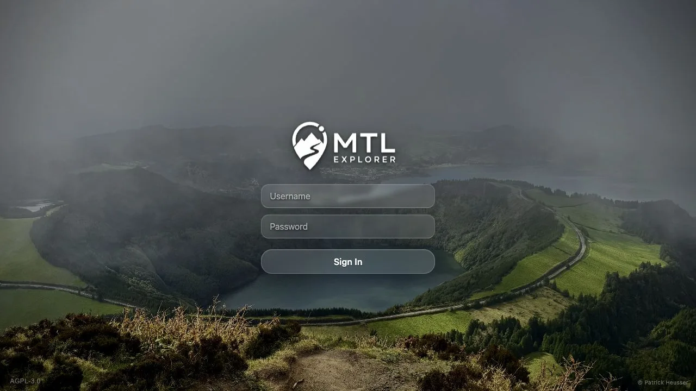

## Import Data

Seven files were used: six GPX files and one FIT file. `mojstrovka.gpx`
was accepted as an allowed empty-geometry result after outlier correction; the
additional `around-visnjan-with-car.gpx` kept the run broad enough to retain
five visible GPX-backed tracks for map/browser/detail evidence.

Evidence manifest: [import-data-manifest.txt](assets/import-data-manifest.txt)

| File | Type | Key validation | Imported evidence |
|---|---|---|---|
| `foxboro.gpx` | GPX | 250 `trkpt`, 250 timestamps | Track `100002`, name `FOXBORO`, later deleted |
| `blue_hills.gpx` | GPX | 1243 `trkpt`, 1243 timestamps | Tracks `100001`, `100003` |
| `mystic_basin_trail.gpx` | GPX | 285 `trkpt`, 285 timestamps | Track `100005` |
| `cerknicko-jezero.gpx` | GPX | 296 `trkpt`, 296 timestamps | Track `100000` |
| `around-visnjan-with-car.gpx` | GPX | 104 `trkpt`, 104 timestamps | Track `100007`, later deleted |
| `mojstrovka.gpx` | GPX | 184 `trkpt`, 184 timestamps | Track `100004`; accepted empty geometry after outlier correction |
| `xpress-4x-2020-10-17.fit` | FIT | 1785 GPS-bearing FIT records, 1816 timestamps | Track `100006`, source and GPX downloads verified |

Indexer evidence: [import-delete-indexer.txt](assets/import-delete-indexer.txt)

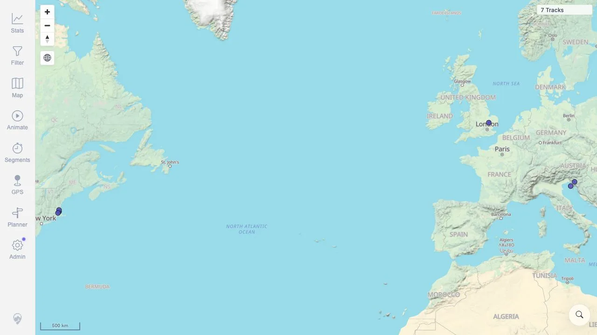

## Issues

### P3-FR-001: Highcharts accessibility warning appears in console

Expected: Regression run should have no unexpected console warnings/errors beyond intentional invalid-login checks.  
Actual: Highcharts warning recommends including `accessibility.js`.  
Evidence: [browser-console.txt](assets/browser-console.txt)  
Release impact: Accessibility warning does not block core use but indicates chart accessibility is not fully configured.

## Coverage Matrix

| Area | Action | Expected | Actual | Status | Evidence |
|---|---|---|---|---|---|
| Static checks | `npm run test`, type-check, build, lint | Source-level checks | Black-box quick install only | NOT APPLICABLE - black-box quick-install regression | Scope |
| API type safety | Generated OpenAPI usage | Source contract review | Black-box quick install only | NOT APPLICABLE - black-box quick-install regression | Scope |
| Login valid | Login with README credentials | Home/map loads | Loaded map with `0 Tracks`, later `7 Tracks` | PASS | 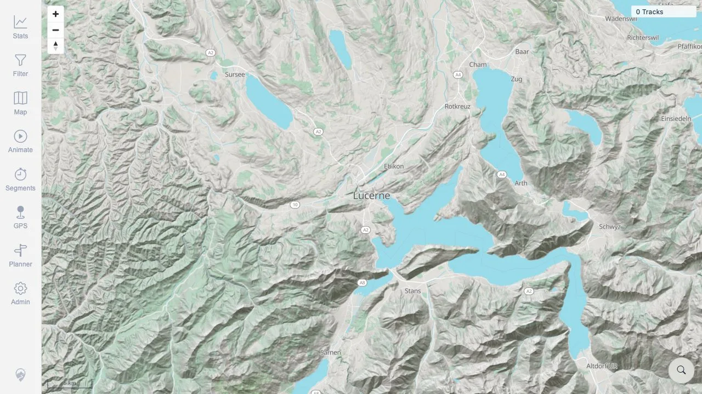 |
| Login invalid | Login with wrong password | Usable error, stay on login | `Invalid username or password.` shown | PASS | browser session |
| Logout/session variants | Logout, expiry, 401/403 variants | Redirect/recovery | Not fully exercised beyond clean-context unauthenticated redirect | PARTIAL | clean-context check |
| Startup curtain | Initial load | Splash then map after tracks load | Map loaded; load-failure retry not induced | PARTIAL | desktop screenshots |
| Routing | In-app navigation, normal reload, back/forward | User-facing views open from UI without router errors | Stats, browser, details, planner, admin, filter, search opened from UI; direct URL probes excluded per corrected requirement; back/forward not exhaustively repeated after correction | PARTIAL | UI screenshots |
| Branding/About | Public copy uses MTL Explorer; unauthenticated bottom-left About/license entry point opens info | Login screen showed **About & license** entry point; click-to-open behavior was not exercised before cleanup; logged-in About route rendered | PARTIAL | , 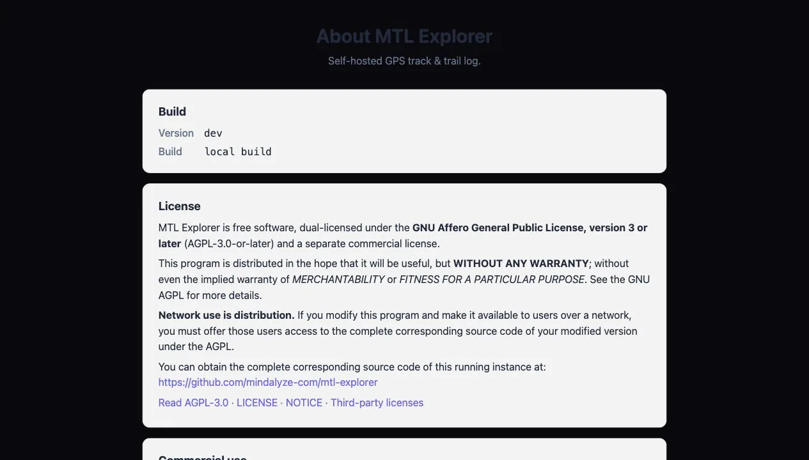 |
| PWA/update | Service worker/update toast/connectivity | No loops, recovery | Normal browser only; no installed PWA context | NOT COVERED | Offline section |
| Map load | Open map after import | Base map and tracks visible | Map displayed imported tracks and count | PASS |  |
| Remote URLs | Server localhost and remote URL | Local and browser URLs accessible | Localhost and IPv4 pass; external IPv6 blocked from client but server-side IPv6 pass | PARTIAL | install checks |
| Precision/pan/zoom | Zoom and pan | No duplicate/stale lines | Spot-checked visually only | PARTIAL | map screenshots |
| Selection/popups | Click single/overlap tracks, point popups | Highlight/details/sheets/popups | Details opened from browser; map click/overlap/point popup not fully exercised | PARTIAL | details screenshots |
| Swiss Mobility | Nearby route popup | Routes display and close | Not deterministically covered on imported sample areas | NOT COVERED | none |
| Map settings | Open map tool, basemap/layer list | Controls visible | Basemap, data layers, reset control visible | PASS | 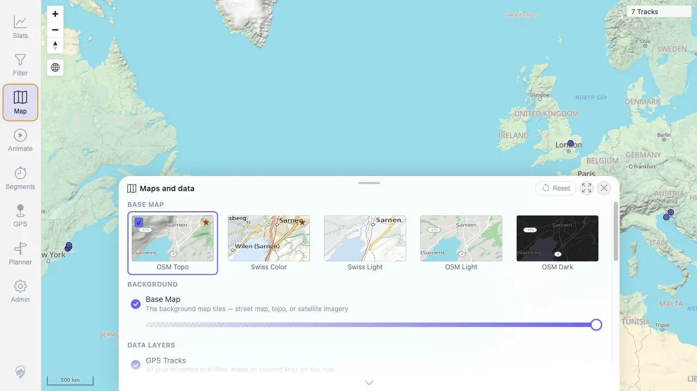 |
| Heatmap | Toggle heatmap | Heatmap toggles without hiding tracks | Toggle state changed in settings; visual density not deeply verified | PARTIAL | 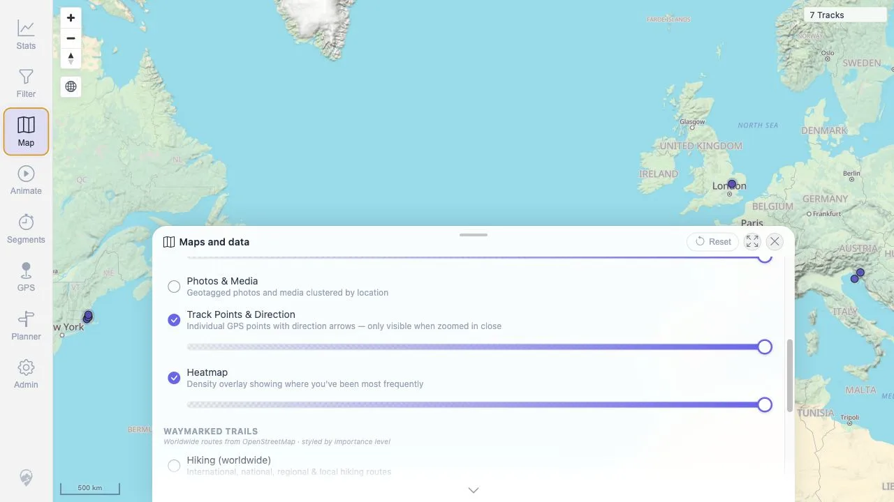 |
| Overlays/opacities/globe | Toggle overlays, opacity, globe thresholds | Layers persist and order correctly | Not exhaustively exercised | NOT COVERED | none |
| Location search | Search Zürich, select result, clear marker | Results, fly-to, marker | Results shown; selecting Zürich placed marker and zoomed map | PASS | 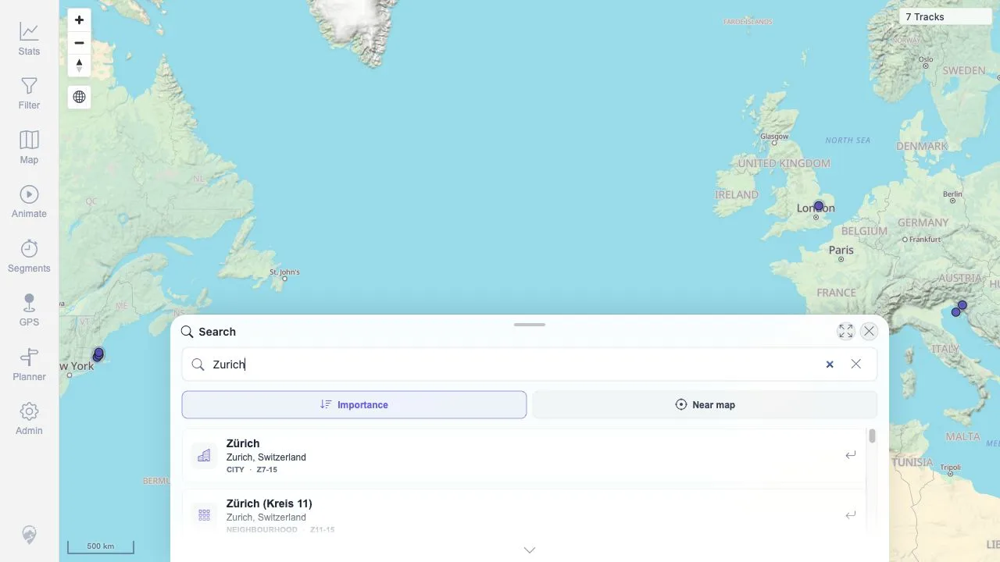, 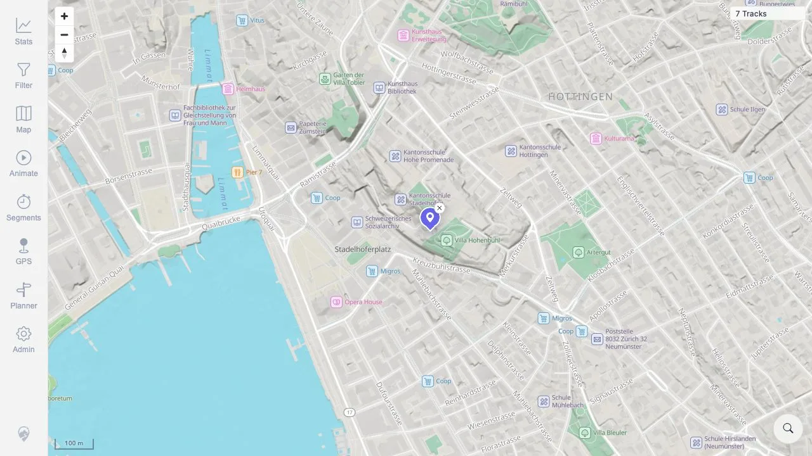 |
| GPS locate | Permission states/follow/drift/disabled | All GPS states | Entry point opened/activated only; permission states not controlled | NOT COVERED | 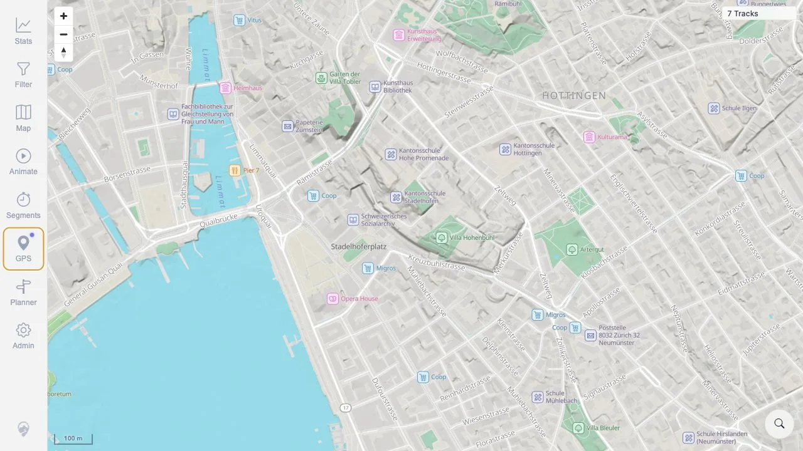 |
| Media layer | Toggle photos/media | Pins and preview navigation | No media dataset prepared in README quick install | BLOCKED | none |
| Filters catalog | Enable filter, catalog/search/groups | Catalog, search, live preview | Enabled filter, saw 18 filters, search worked, live preview count shown | PASS |  |
| Filter params/geo drawing | Date/text/geo params, circle/rect/polygon | Params serialize and persist | Param UI visible; drawing not completed | PARTIAL | filter screenshot |
| Filter colors/legend | Colors tab and legend | Colors available after filter | Colors tab opened; one group limited visible legend variation | PARTIAL | 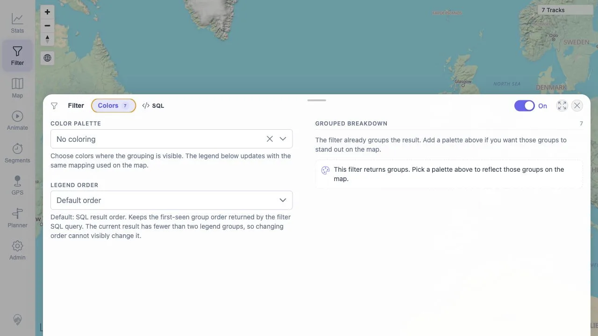 |
| Track browser | Search, sort, summaries, row details | Browser rows and search work | Search by name/file path worked; sort buttons visible; row opened details | PASS | 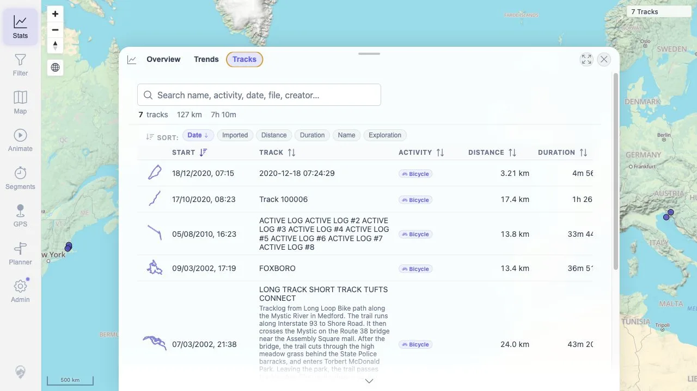 |
| Statistics | Overview metrics/charts/breakdowns | Stats render and update | 7-track stats rendered; after deletion 5-track stats rendered | PASS | 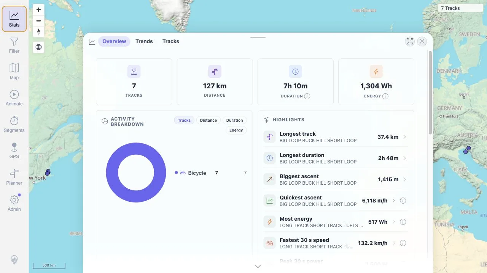,  |
| Detail shell | GPX and FIT details | Overview/Graphs/Quality/Related/Events | Both GPX and FIT opened and tabs rendered | PASS | GPX/FIT detail screenshots |
| Detail charts | Elevation, speed, distance, gain, controls | Charts and controls render | Speed/elevation/gain/distance labels visible; time/distance, range, point-count, height controls exercised | PASS | 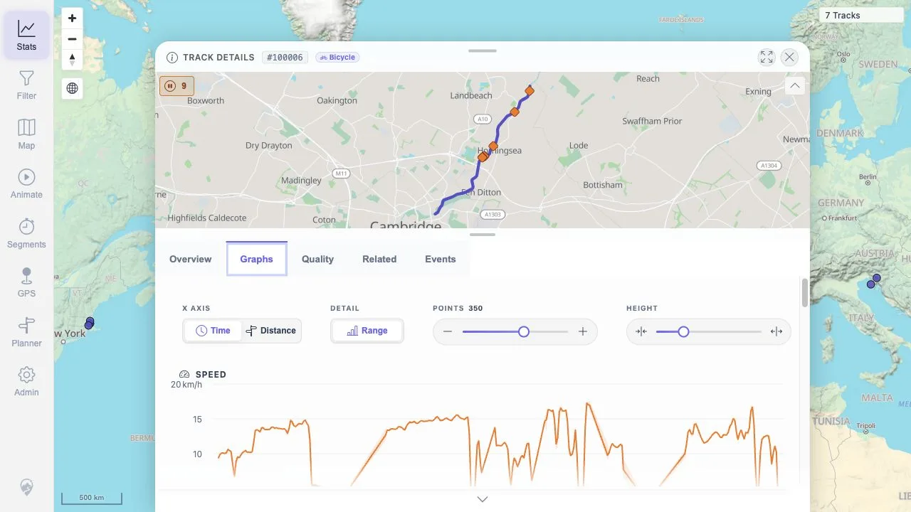 |
| Chart/map sync | Chart hover and mini-map hover sync | Bidirectional hover sync | Attempted screenshots did not provide conclusive visible sync evidence | NOT COVERED | , 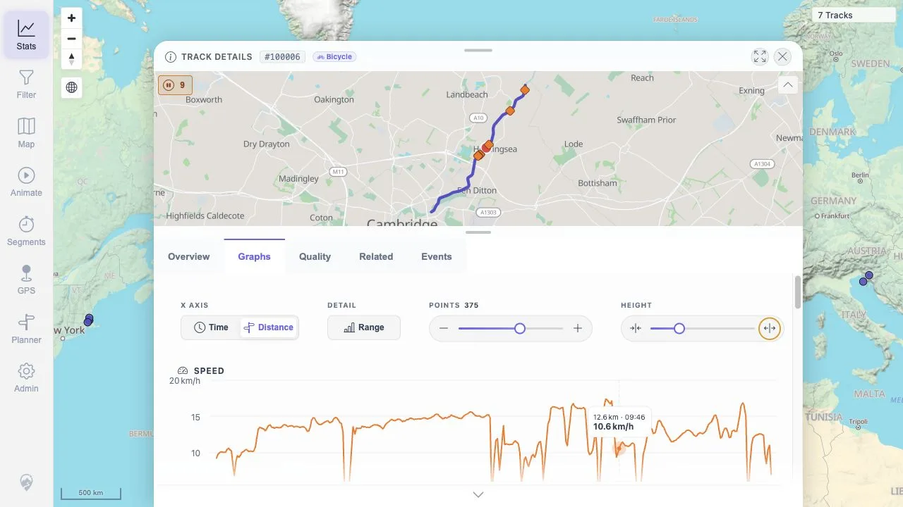 |
| Downloads | FIT: original and GPX export; GPX-backed tracks: original only | Downloads match expectations | FIT original checksum matched; FIT GPX export had 1785 `trkpt`; GPX original checksum matched | PASS | [download-compare.txt](assets/download-compare.txt) |
| Energy/activity/exclude stats | Activity type save, what-if, exclude/reinclude | Values update/persist correctly | Not exercised to avoid mutating extra data beyond requested imports/deletes | NOT COVERED | none |
| Related/events | Related, duplicates, events, event highlight | Lists and highlight work | Related/events tabs visible; event selection/highlight not fully tested | PARTIAL | 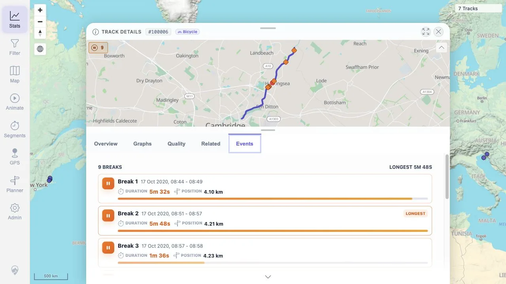 |
| Segment measuring/comparison | Measure, crossing, comparison | Results and cleanup | Entry panel only | NOT COVERED | 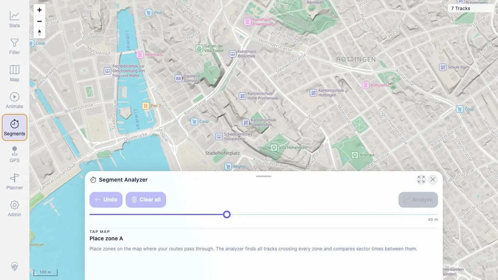 |
| Animation/virtual race | Playback, pause, reset, ranking | Race controls work | Entry panel only | NOT COVERED | 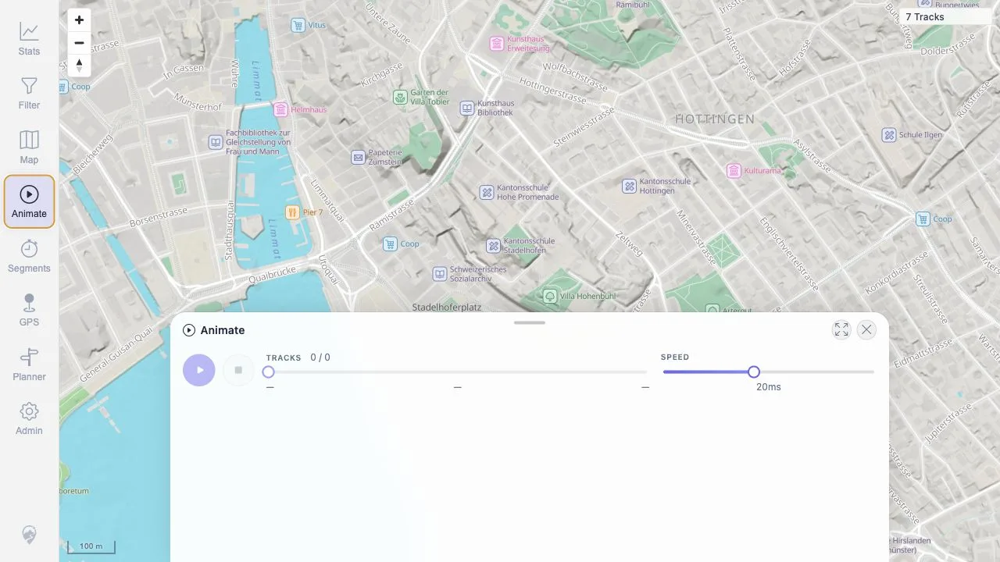 |
| Planner | Open, route, save/list/delete | Route and persistence work | BRouter ready; waypoints added; route computed; save/list/delete worked; undo/redo/export/touch insert not fully covered | PARTIAL | 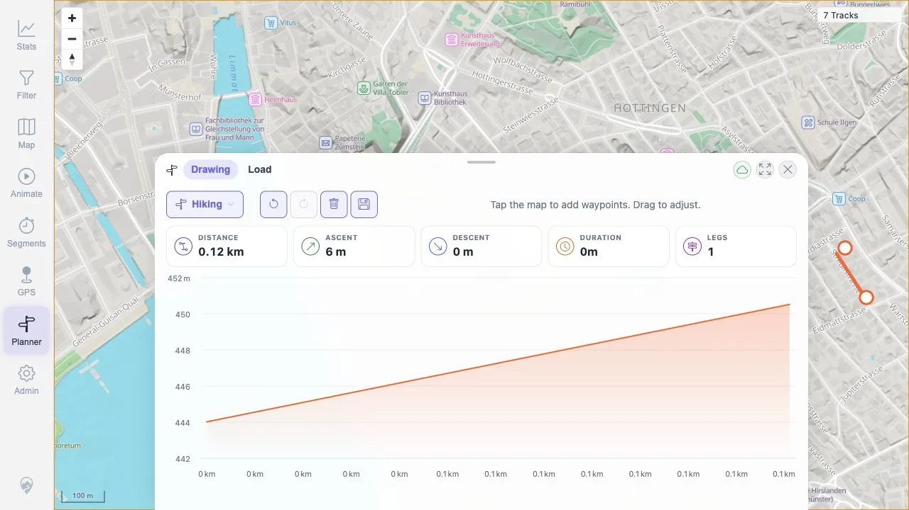, 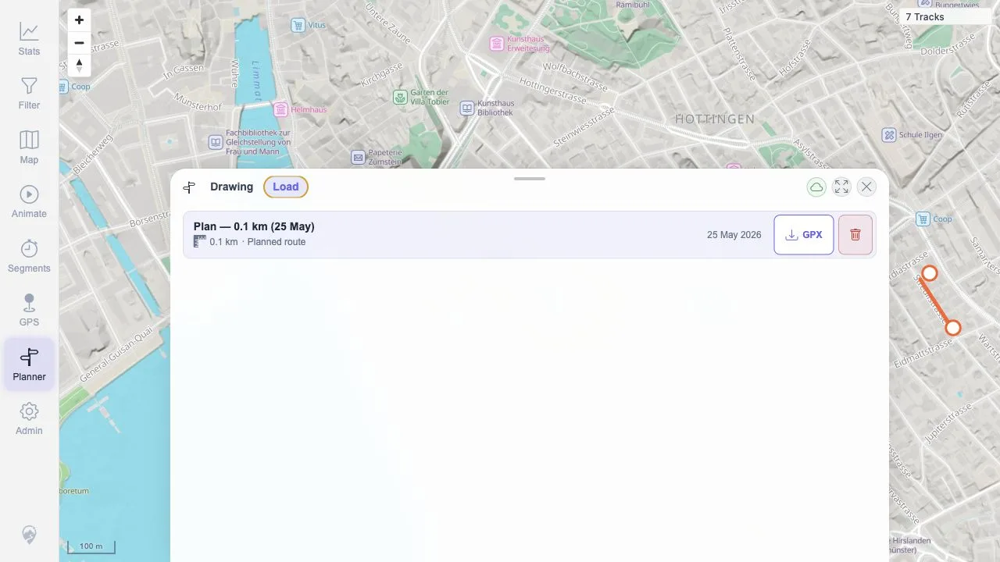 |
| Admin | Upload/jobs/freshness/log/helpers/about/settings/session/attribution | Panels open and report states | Admin workspace and panels opened; upload folder copy was primary import path; rescan and Garmin actions not run | PARTIAL | admin screenshots |
| Shared UI/responsive | Desktop/mobile, no obvious overflow | Usable layout | Desktop and 390px mobile map/filter usable; full touch gestures not exhausted | PARTIAL | 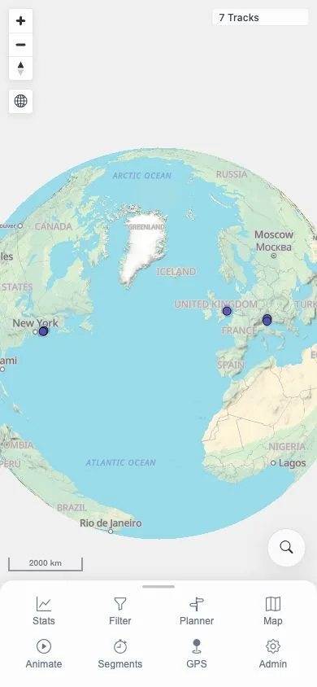, 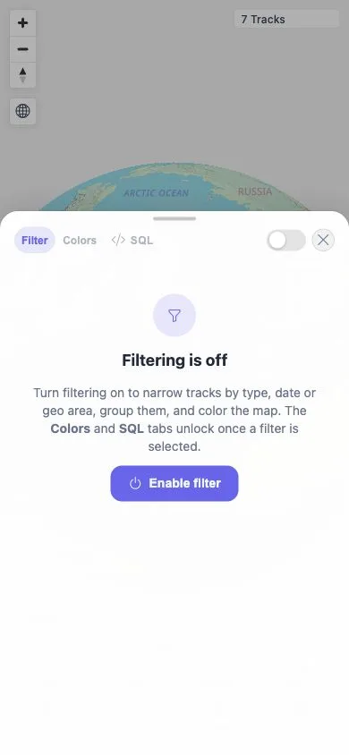 |
| Error states | Invalid login, network/server/empty/error states | Recoverable UI | Invalid login recoverable; broader network/server/empty states not fully induced | PARTIAL | [browser-console.txt](assets/browser-console.txt) |
| Offline/cache | Installed PWA after online load | Cached tracks/tiles offline and recovery | Not run in installed PWA/web-app context; normal browser-tab offline behavior not failed | NOT COVERED | N/A per instruction |

## Data-Change Coverage

| Item | Expected | Actual | Status | Evidence |
|---|---|---|---|---|
| Import via watched folder | Files in `./data/gpx/` indexed | GPX/FIT files indexed; FIT converted by GPSBabel | PASS | [import-delete-indexer.txt](assets/import-delete-indexer.txt) |
| Empty-geometry GPX handling | Empty geometry after outlier correction is accepted | `mojstrovka.gpx` imported as track `100004`; empty geometry accepted | PASS | [import-delete-indexer.txt](assets/import-delete-indexer.txt) |
| Map after import | Imported tracks visible | UI count changed to `7 Tracks` | PASS |  |
| Browser after import | Imported tracks searchable | `FOXBORO`, `xpress`, names and dates searchable | PASS |  |
| Details after import | GPX and FIT details open | GPX `#100002`, FIT `#100006` opened | PASS | detail screenshots |
| Stats after import | Metrics reflect data | 7 tracks, 127 km, 7h 10m | PASS |  |
| Filters after import | Filter preview sees imported data | Smart Base Filter live preview showed 7 matching tracks | PASS |  |
| Delete two source files | Removed tracks disappear | `foxboro.gpx` and `around-visnjan-with-car.gpx` deleted; UI count dropped to 5 | PASS | 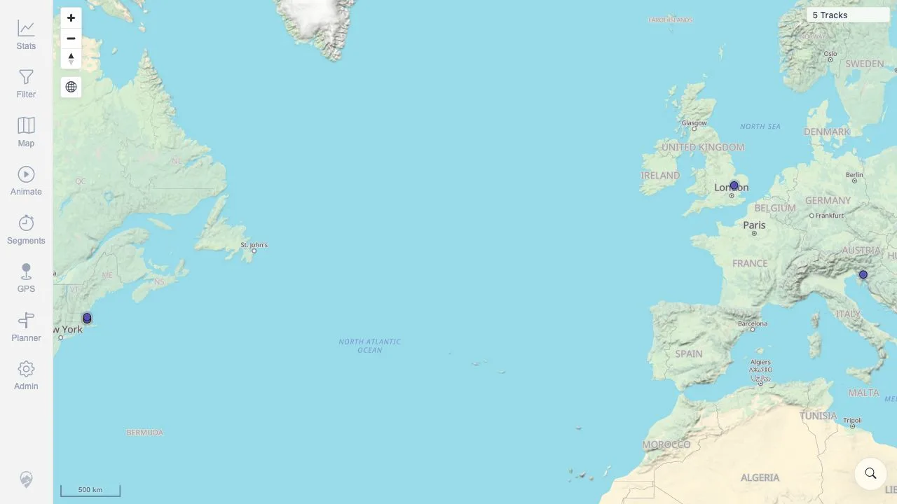 |
| Browser after delete | Deleted tracks absent | Search `FOXBORO` showed `0 of 5 tracks`; around-visnjan absent | PASS | 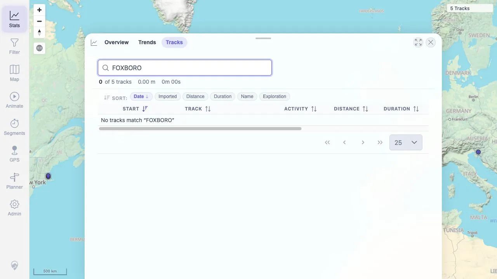 |
| Stats/filter after delete | Totals and filter counts update | Stats and filter preview showed 5 tracks | PASS | , 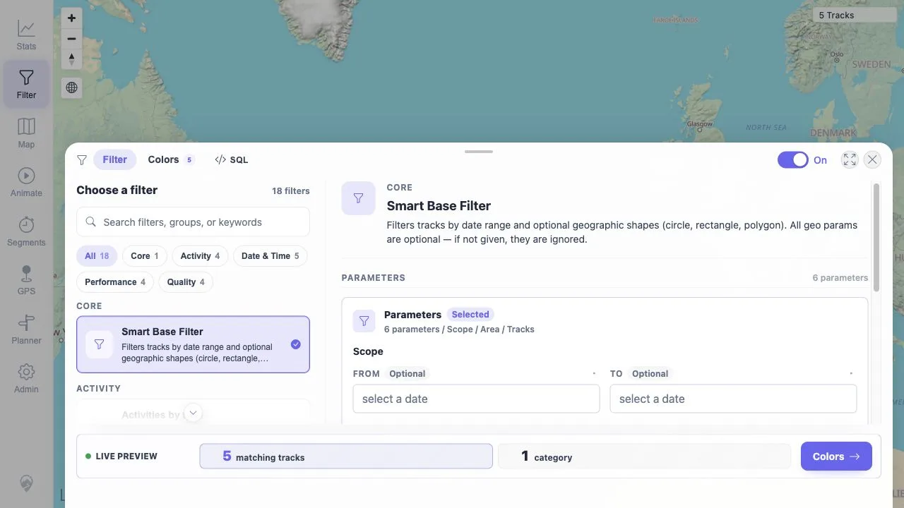 |
| Heatmap after delete | Heatmap reflects removal | Not visually revalidated after deletion | NOT COVERED | none |
| Deleted details stale URL | Deleted detail should not remain reachable | Not probed; user said stale URLs are not pass/fail criteria | NOT APPLICABLE | instruction |

## Console And Network

- Expected invalid-login console error was captured.
- Highcharts accessibility warning was captured.
- Direct URL deep-link probes were excluded after requirement correction.
- No broad happy-path failed network request trace was retained; bulky traces were intentionally avoided.

Evidence: [browser-console.txt](assets/browser-console.txt)

## Cleanup

Cleanup passed. The report/evidence assets were already outside the disposable install directory before cleanup. `docker compose down` was run from `/root/mtl-regression-20260525-quick-install/mtl-explorer`, MTL Explorer quick-install containers were no longer running, `/root/mtl-regression-20260525-quick-install` was removed, and the temporary SSH key was removed from root.

Evidence: [cleanup.txt](assets/cleanup.txt)

## Conclusion

The README quick install itself succeeded and the core import, FIT conversion, track browsing, stats, details, required downloads, basic filters, planner basics, deletion sync, and cleanup worked. The run remains a regression `FAIL` because multiple full-plan areas were only partially covered or not covered in this black-box quick-install pass, including installed-PWA offline behavior, media, GPS permission states, full hover-sync proof, exhaustive overlays, geo drawing, and full mobile/touch gestures.
