> **RESULT: PASS - quick install, import/FIT/deletion sync, cleanup, and accepted-scope regression completed**

# MTL Explorer Full Regression Report

## Goal And Scope

Run the README quick-install flow and the user-facing regression plan from `documentation/testing/frontend-regression-test-plan.md` as a black-box installed-app test against server `178.105.173.254`.

Source-of-truth quick-start facts used from GitHub `main` README:

| Fact | Value |
|---|---|
| App URL | `http://localhost:18080/mtl/`; browser remote URL tested as `http://178.105.173.254:18080/mtl/` |
| Login | `mtl` / `change-me` |
| Import folder | `./data/gpx/` |
| Install command | `mkdir mtl-explorer && cd mtl-explorer && curl -fsSL -o docker-compose.yml ... && docker compose up -d` |

## Environment

| Item | Result |
|---|---|
| Target OS | Debian 13 `trixie`, amd64, kernel `6.12.88+deb13-cloud-amd64` |
| Host capacity | 3.7 GiB RAM, 71 GiB free on `/` |
| Docker prerequisite | Installed because Docker was absent |
| Docker versions | Docker `29.5.2`, Docker Compose `v5.1.4` |
| App build observed | Server `0.0.1-SNAPSHOT`, image `1.272`, image built `2026-05-25T13:54:08Z`; client `1.0.0` |
| Test profile | Black-box quick install; no source changes, no dev server, no product workaround |

## Timings

| Phase | Timing |
|---|---:|
| Docker prerequisite setup | 7s |
| README quick install / compose up | 26s |
| App readiness after compose start | about 18s after initial connection resets |
| GPX/FIT import copy to completed import/jobs | about 38s |
| Deletion sync | visible in first poll, under 3s |
| Cleanup | 11s |
| Main browser regression window | about 25 min |

## Setup Result

Quick install passed. All four containers started: `app`, `db`, `brouter`, and `location-search`.

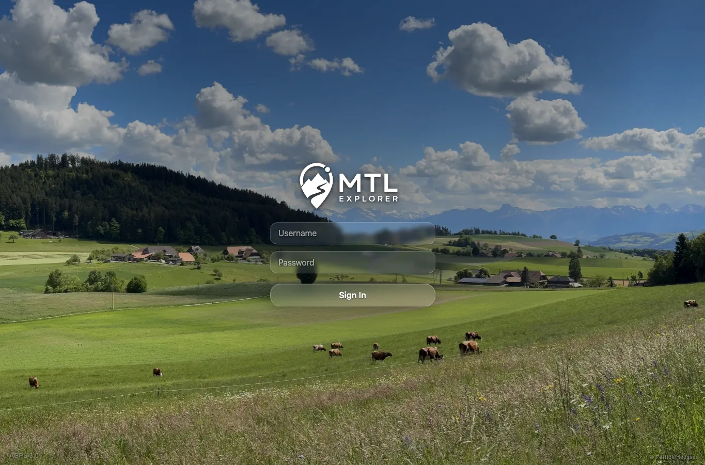
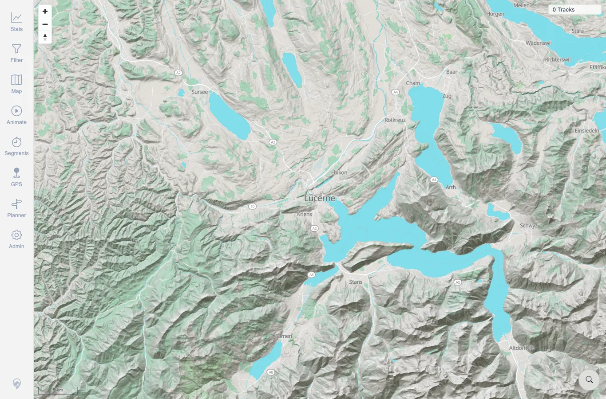

Baseline API evidence showed `0` tracks, upload available, and freshness token with `tracks:0` and `track_geometry:0`.

## Test Data

| File | Source | SHA-256 | Bytes | Source `trkpt` / times | Imported track |
|---|---|---:|---:|---:|---|
| `JuraRoute72011.gpx` | `gps-touring/sample-gpx` raw GitHub sample | `fcff577b...92e354e` | 199,962 | 1,414 / 1,415 | `100003`, removed in deletion flow |
| `MoselradwegAusWiki.gpx` | `gps-touring/sample-gpx` raw GitHub sample | `0f5263de...bf761c3` | 415,326 | 2,954 / 2,955 | `100001` |
| `Vitry-le-Francois_Langres.gpx` | `gps-touring/sample-gpx` raw GitHub sample | `401218e3...e8d7d67` | 238,349 | 1,688 / 1,689 | `100002` |
| `VoieVerteHauteVosges.gpx` | `gps-touring/sample-gpx` raw GitHub sample | `0f417d6e...7135f78` | 183,733 | 1,298 / 1,299 | `100004` |
| `Lannion_Plestin_parcours24.4RE.gpx` | `gps-touring/sample-gpx` raw GitHub sample | `e76c692c...316e85f` | 60,917 | 381 / 382 | `100000` |
| `Activity.fit` | Garmin FIT JavaScript SDK sample data | `949a238e...591387` | 94,096 | n/a source FIT | `100005`, removed in deletion flow |

License note: files were public GitHub sample files from the plan’s suggested sources; no additional project-specific license verification was found during the run.

Import result: six tracks displayed because each source file produced one displayed track. Indexer completed `6/6`, with `failed:0`. Stats moved from `0` to `6` tracks, `1,046 km`, `1d 00h`, `4,874 Wh`.

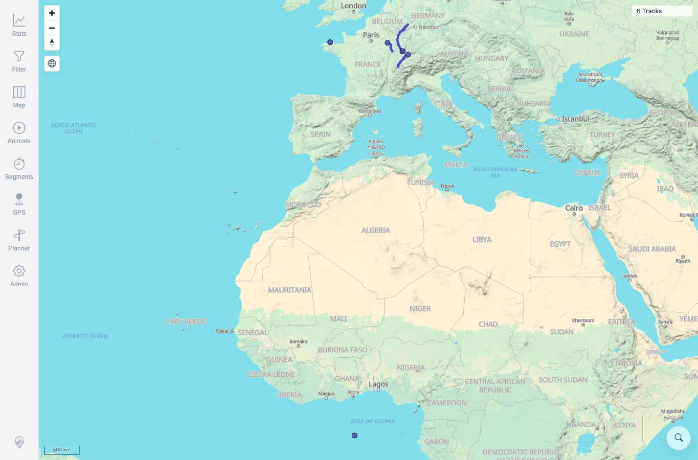
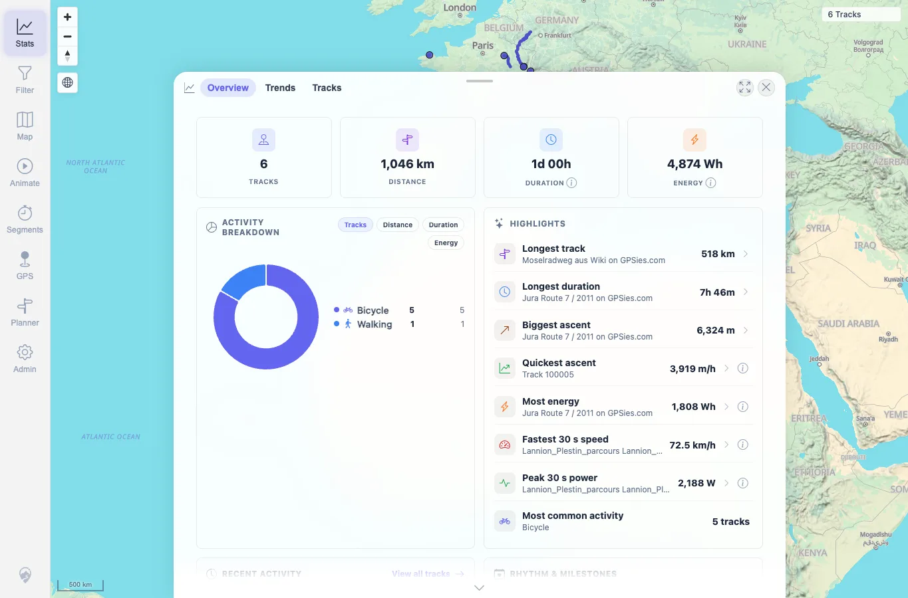

FIT download verification passed through visible track-detail controls:

| Download | Result |
|---|---|
| Original FIT | 94,096 bytes, SHA-256 matched uploaded `Activity.fit` |
| Download as GPX | 479,844 bytes, valid GPX with 3,601 `trkpt` and 3,602 times |

## Required Data-Change Flows

| Flow | Status | Evidence |
|---|---|---|
| Five public GPX files with real tracks | PASS | `assets/test-data-metadata.tsv` |
| Import/index/freshness/jobs | PASS | `assets/post-import-api.txt`, Admin Jobs/Freshness screenshots |
| Map/browser/stats reflect import | PASS | `04`, `05`, `30` screenshots |
| FIT conversion/details/downloads | PASS | `16`-`19`, `assets/fit-download-verification.txt` |
| Delete two source files | PASS | Deleted `JuraRoute72011.gpx` and `Activity.fit`; API dropped to 4 tracks; indexer `removed:2` |
| Map/browser/stats reflect deletion | PASS | `70`-`72` screenshots |
| Other supported formats | NOT COVERED | TCX/KML/KMZ/IGC/SBP/NMEA/GEOJSON/GDB samples were not added in this run |

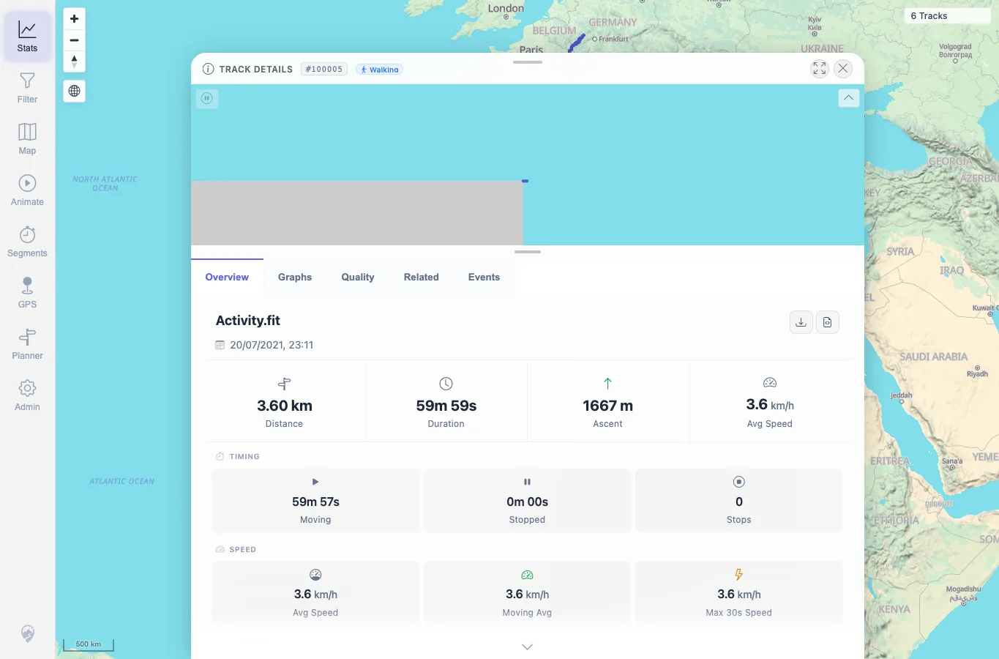
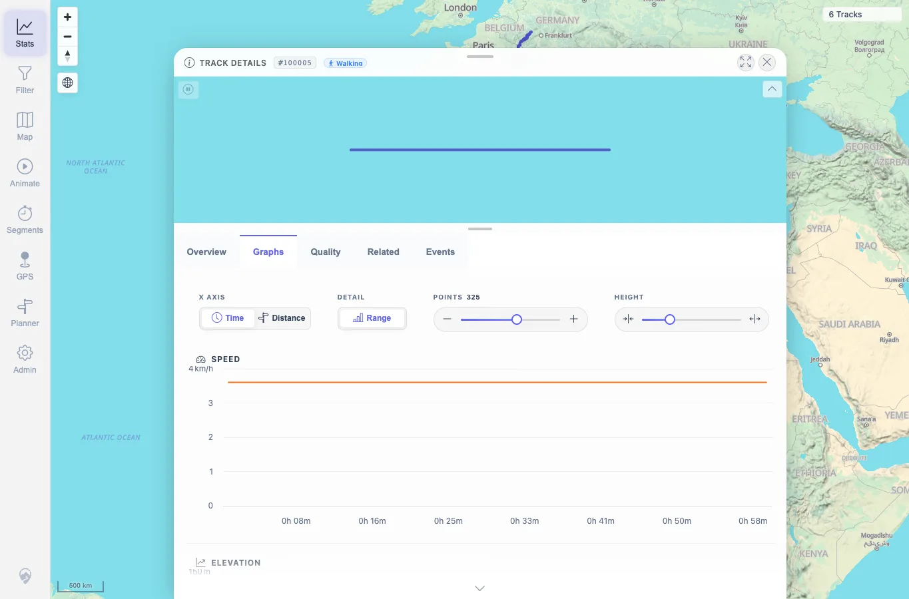
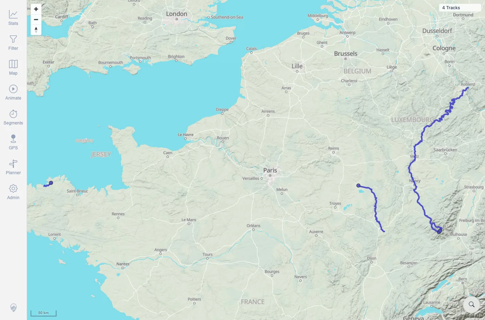
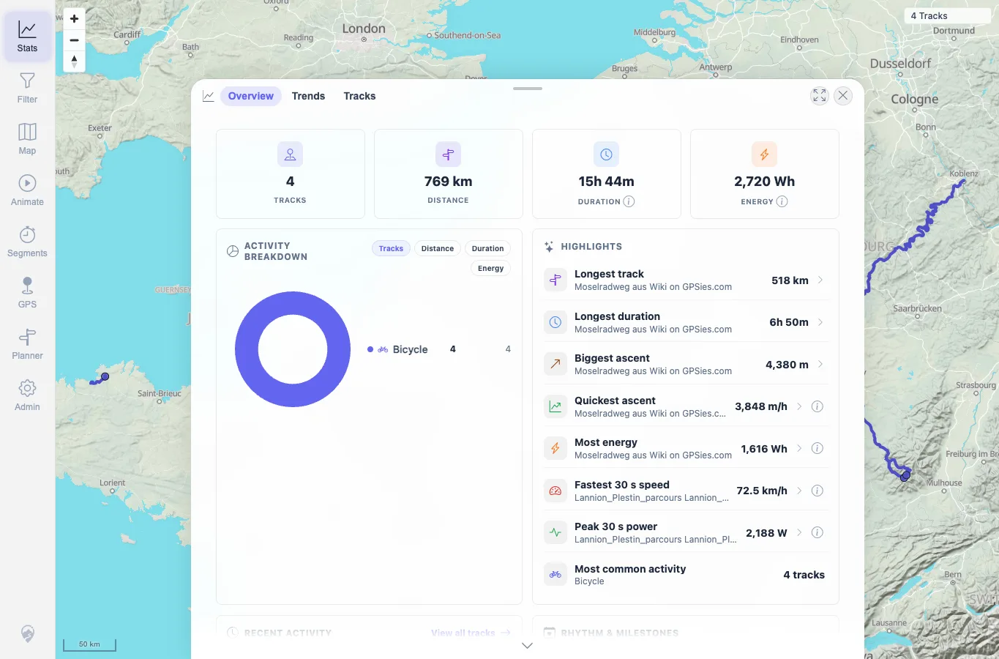

## Accepted Findings

These observations were accepted after the run because they are not product requirements, are expected browser behavior, or were removed from `documentation/testing/frontend-regression-test-plan.md`.

### MTL-FR-001 - ACCEPTED - Direct authenticated deep links return server 404

Steps:

1. After install/import, request `http://178.105.173.254:18080/mtl/track/100003`.
2. Repeat for `/mtl/stats` and `/mtl/plan/1`.

Previous expectation: the Vue route loads the correct view, redirecting to login first if needed.

Actual: server returned 404 JSON or Whitelabel Error Page for `/track/<id>`, `/stats`, and `/plan/<id>`.

Evidence: `assets/11-deep-link-track-404.webp`; curl checks returned `404` for `/mtl/stats`, `/mtl/plan/1`, and `/mtl/track/100003`.

Disposition: accepted as not a requirement. Direct deep-link coverage was removed from the regression plan.

### MTL-FR-002 - ACCEPTED - Public About route is not reachable while signed out

Steps:

1. Use a clean browser profile.
2. Open `http://178.105.173.254:18080/mtl/about`.

Previous expectation: About / license page is reachable without signing in.

Actual: the app redirected to `/mtl/login` and only the login screen was visible.

Evidence: `assets/65-about-public.webp`.

Disposition: accepted as not a requirement. Unauthenticated About coverage was removed from the regression plan.

### MTL-FR-003 - ACCEPTED/EXPECTED - GPS is unavailable on a remote plain-HTTP origin

Steps:

1. Open the app over `http://178.105.173.254:18080/mtl/`.
2. Click `GPS`.

Previous expectation: either browser geolocation permission flow or a clear unavailable/permission-disabled message.

Actual: in headless Chrome on the non-secure remote HTTP origin, clicking GPS left the map unchanged.

Evidence: `assets/50-gps-http-permission-blocked.webp`.

Disposition: accepted as expected browser behavior. Browser geolocation requires a secure origin such as HTTPS or `localhost`; the regression plan now says to mark live GPS permission/marker checks `NOT APPLICABLE` for remote plain-HTTP quick-install runs.

## Findings

No open findings remain after accepting the deep-link, unauthenticated About, and remote plain-HTTP GPS observations.

## Coverage Matrix

| Plan area | Status | Coverage notes |
|---|---|---|
| Developer/source/static/API-type rows | NOT APPLICABLE | Black-box quick-install regression; no source build/test run. |
| 1. Sign-in and first load | PARTIAL | Signed-out redirect, wrong password, valid login, logout, and re-login passed. Direct deep links and unauthenticated About are accepted non-requirements. Startup retry with server down was not simulated. |
| 2. Map and tracks | PARTIAL | Base map, imported count, deleted count, zoomed map, map styles, and heatmap control were exercised. Individual map track clicks, overlapping selection list, point popups, Swiss Mobility popup, and fast pan/zoom stress were not fully covered. |
| 3. Track details | PARTIAL | GPX and FIT tracks opened from user-facing stats navigation. Overview/Graphs/Quality/Related/Events rendered. Graph controls for time/distance, range, points, and height worked. FIT original and GPX downloads verified. Chart/mini-map hover sync, activity type change, energy what-if, stats exclusion toggle, and related-track navigation were not fully covered. |
| 4. Filters | PARTIAL | Filter enabled, catalog grouping/search, keyword parameter, live preview, map legend/count update, and reload persistence passed. Date parameters, geo circle/rectangle/polygon drawing, reset/cancel, and full legend group collapse were not fully covered. |
| 5. Track browser and statistics | PARTIAL | Browser list, search, sort, summary row, stats overview, highlights, period summaries, import update, and deletion update passed. Empty dataset covered at baseline; single-track dataset not created. |
| 6. Planner | PARTIAL | BRouter status ready, planner opened, zoom warning displayed, two visible-map waypoints produced a route with distance/ascent/descent/duration/elevation profile. Save/list/load/delete, GPX download, waypoint drag/insert, undo/redo, and mobile waypoint placement were not fully covered. |
| 7. Measuring and comparison tools | NOT COVERED | Measure/segment comparison/sub-track extraction were not exercised beyond the tool presence. |
| 8. Animation and virtual race | NOT COVERED | Animation and virtual race controls were not exercised. |
| 9. Media/photos | NOT COVERED | No geotagged media was imported. |
| 10. Heatmap and overlays | PARTIAL | Map panel, heatmap row, and OSM Dark style were exercised. Each overlay, opacity sliders, ordering, and filter-sensitive heatmap were not exhaustively verified. |
| 11. GPS location | NOT APPLICABLE/PARTIAL | Live GPS permission/marker checks are expected to be unavailable on a remote plain-HTTP origin; the plan now requires testing those rows on localhost or HTTPS. |
| 12. Location search | PARTIAL | Search for Zurich returned results and selecting a result moved/marked the map. Clear-marker flow was not covered. |
| 13. Globe mode | PARTIAL | Globe button was visible/active at world zoom; manual disable/reenable and edge zoom limits were not fully covered. |
| 14. Admin tools | PARTIAL | Upload, Jobs, Freshness, Log, Helpers, About, Settings, Session, and Attribution loaded. Manual rescans and Garmin exporter install/update actions were not triggered. |
| 15. Data updates and sync | PASS/PARTIAL | Import and deletion freshness tokens changed; Admin Freshness reported client/server in sync. Banner dismiss loop and relogin refresh-loop behavior were not fully covered. |
| 16. Appearance | PARTIAL | Settings surfaced light/dark controls, map styles worked, OSM Dark selected. UI dark mode toggle/persistence and all map style combinations were not fully covered. |
| 17. Locale, units, formatting | PARTIAL | Locale preview showed `en-GB` formatting. Locale change/persistence and boundary numeric values were not fully covered. |
| 18. Responsive/mobile/touch | PARTIAL | 390x844 touch viewport checked map, stats, filter, planner, and basic map touch. Sheet drag/snap, planner touch waypoint placement, and full mobile workflows were not fully covered. |
| 19. Offline/network issues | NOT APPLICABLE/PARTIAL | Installed-PWA offline reload was not applicable to a normal browser tab. Wrong-login 401 and logout redirect were covered. Flaky network and service-worker update were not covered. |
| 20. Error recovery | PARTIAL | Wrong credentials showed a clear error. Remote plain-HTTP GPS behavior is accepted/expected. Failed track/map/media/planner/expired-session simulations and rapid switching cleanup were not fully covered. |

## Representative Evidence

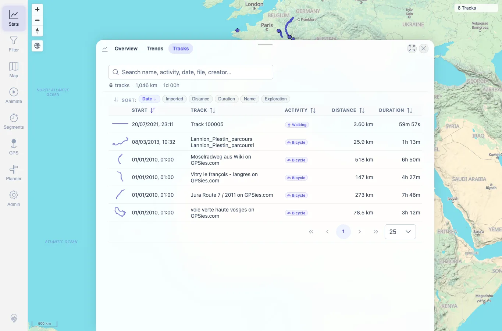
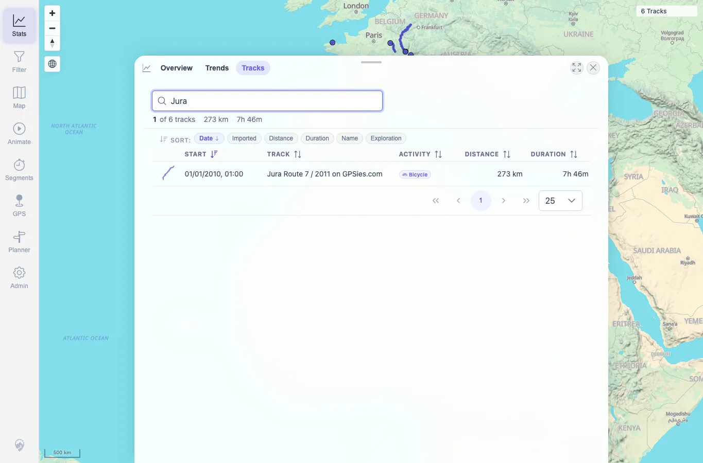
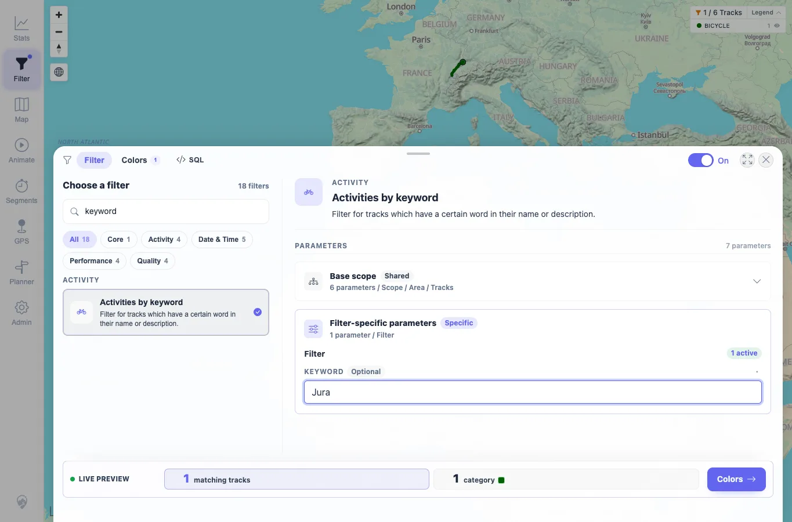
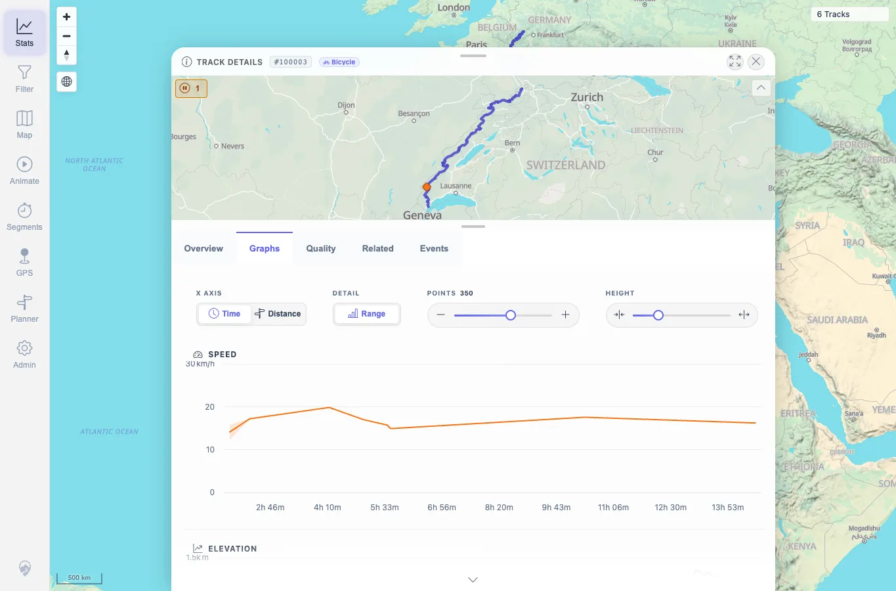

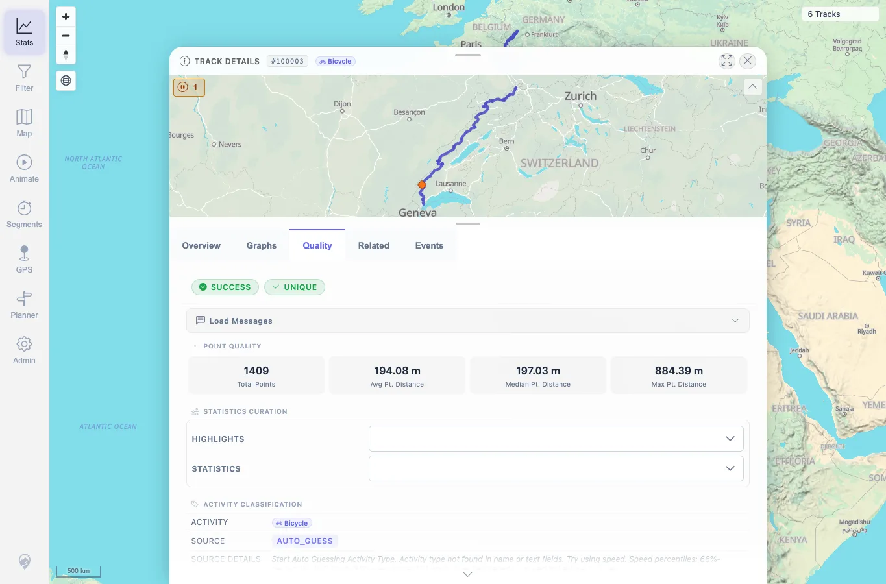
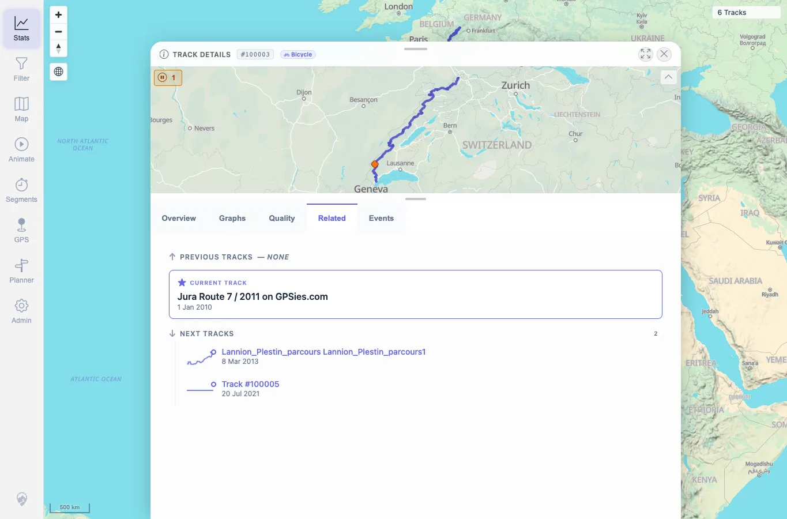
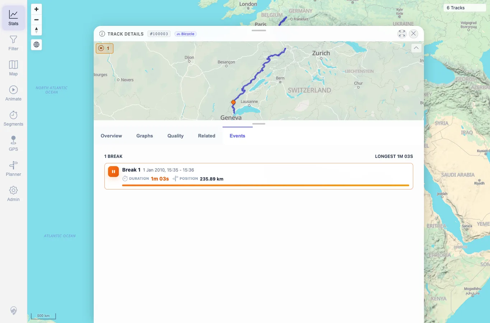
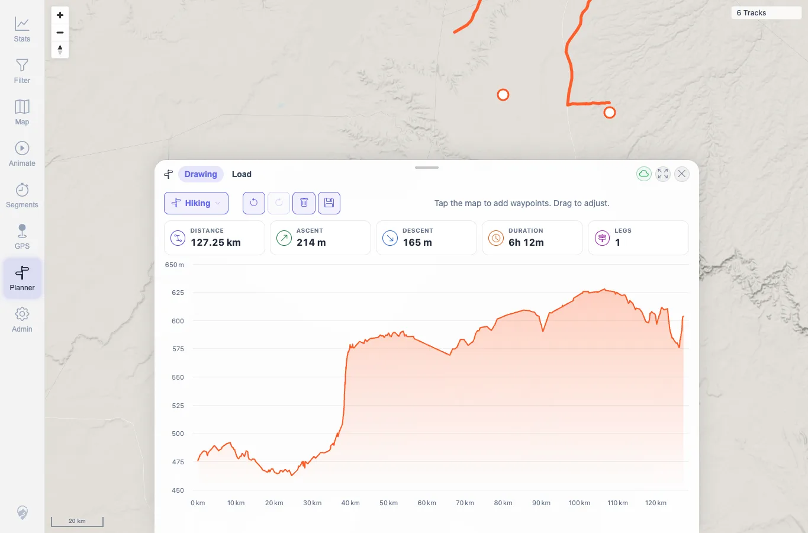
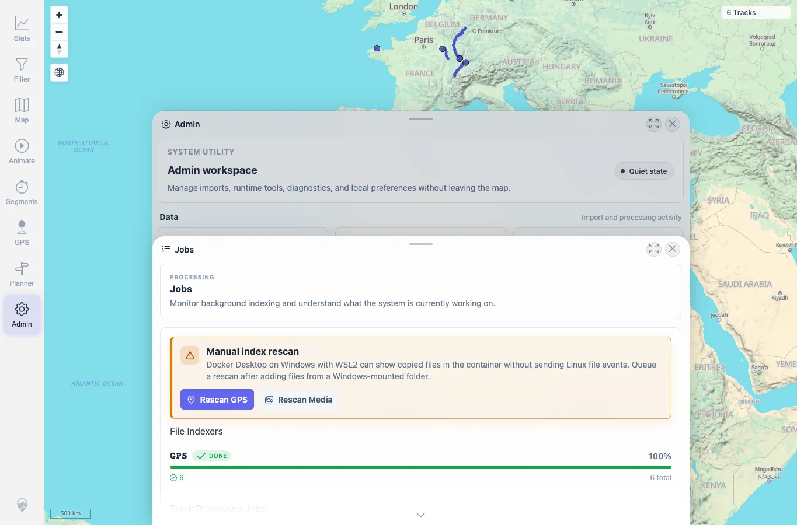
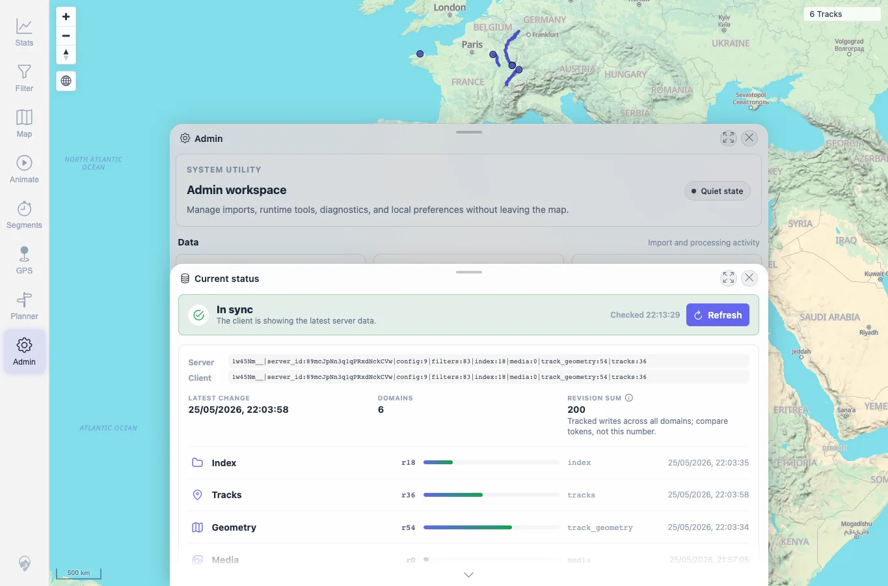
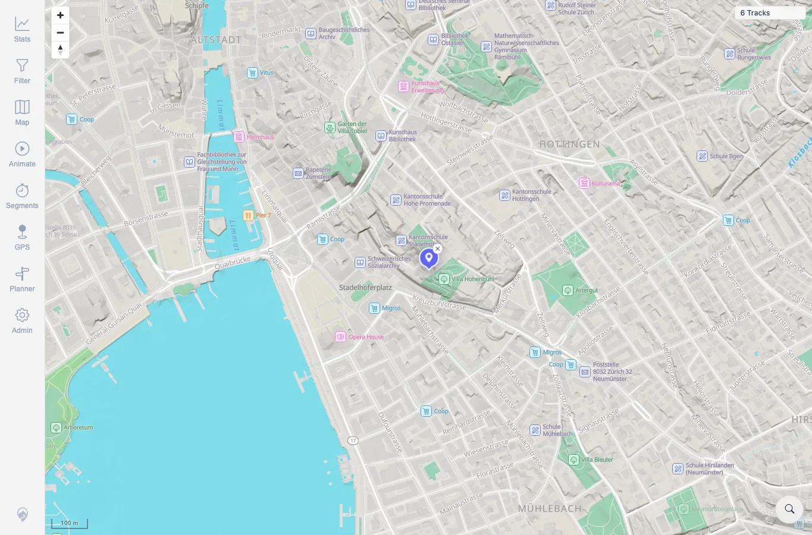
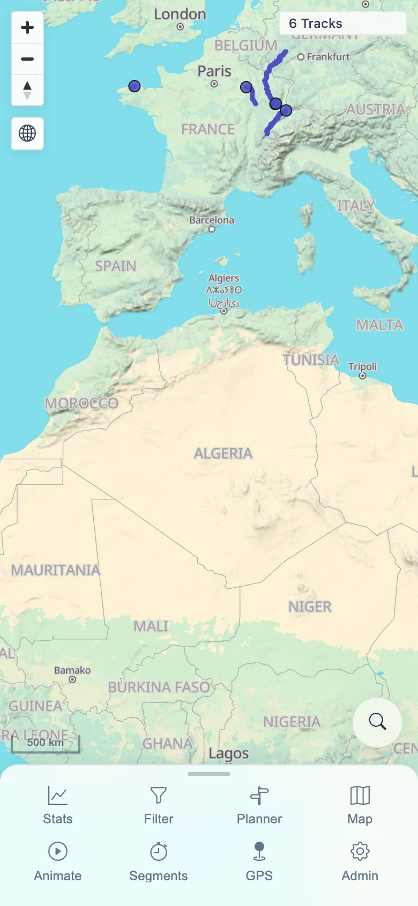
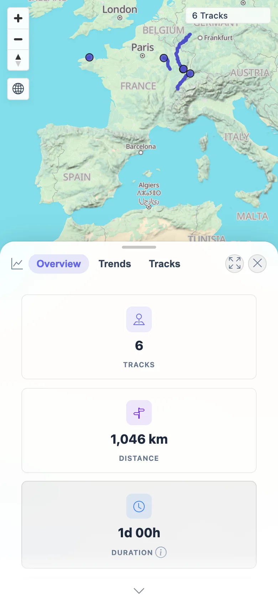

Log and API snippets:

- `assets/baseline-api.txt`
- `assets/post-import-api.txt`
- `assets/post-delete-api.txt`
- `assets/compose-final-status.txt`
- `assets/app-log-tail-cropped.txt`
- `assets/cleanup.txt`

## Cleanup

Cleanup passed.

Actions:

1. Ran `docker compose down` from `/root/mtl-regression-20260525T1956Z/mtl-explorer`.
2. Verified no running MTL Explorer quick-install containers remained.
3. Removed `/root/mtl-regression-20260525T1956Z`.

Evidence: `assets/cleanup.txt`.

## Conclusion

The quick install, GPX/FIT import, FIT conversion/downloads, deletion sync, admin status, cleanup, and accepted-scope browser regression passed. Direct deep links and unauthenticated About are accepted non-requirements, and live GPS on a remote plain-HTTP origin is an expected browser limitation documented in the test plan.
