> **Generated companion report.** This file keeps the original summary from `report.md`, then expands each packet with packet links, actual results, inline screenshots, and text-evidence excerpts.

# MTL Explorer Full Regression Evidence Report

- Source report: [report.md](report.md)
- Run state: [run-state.md](run-state.md)
- Packets: [packets/](packets/)
- Assets: [assets/](assets/)
- Generated from 170 packet files.
- Source report coverage result: 128 PASS, 23 FAIL, 5 BLOCKED, 12 NOT APPLICABLE.
- Expanded packet result rows, including `RUN_SETUP` and `RUN_CLEANUP`: 130 PASS, 23 FAIL, 5 BLOCKED, 12 NOT APPLICABLE.

## Original Report Summary

> **RESULT: FAIL - Quick install and cleanup passed, but 23 coverage IDs failed.**

# MTL Explorer Full Regression Report

## Summary

- Target: `178.105.173.254`, remote URL `http://178.105.173.254:18080/mtl/`.
- Run folder: `documentation/testing/full-regression/test_runs/2026-05-26_0606-remote-178-full-regression/`.
- Source: GitHub `main` quick-install compose file from the README.
- Finalization gate: PASS, `168` coverage IDs terminal.
- Cleanup: PASS; compose stack stopped, no `mtl-explorer-*` containers running, port `18080` closed, disposable directory removed.
- Coverage result: 128 PASS, 23 FAIL, 5 BLOCKED, 12 NOT APPLICABLE.
- Issue count: 26 total (14 P2, 11 P3, 1 coverage constraint).

The run is a regression **FAIL** because required coverage ran to completion and cleanup succeeded, but several user-facing failures remain open, including format imports, visible map/list count mismatch, missing controls, freshness dismiss, locale decimal formatting, and broken media recovery.

## Environment And README Facts

- Docker prerequisites on target: Docker Engine `29.5.2`, Docker Compose `v5.1.4`.
- README quick-start app URL: `http://localhost:18080/mtl/`; browser-accessible target URL: `http://178.105.173.254:18080/mtl/`.
- README login used: `mtl` / `change-me`.
- Import folder used: `/root/mtl-full-regression-2026-05-26_0606/mtl-explorer/data/gpx/`.
- Remote quick-install ran over plain HTTP on a non-localhost host, so secure-context-only live geolocation rows were not applicable.

## Setup And Cleanup

| Step | Result | Evidence |
|---|---|---|
| Quick install | PASS: compose stack started in 13s; readiness in 5s; empty map baseline showed 0 tracks. | `assets/RUN_SETUP-quick-install.txt`, `assets/RUN_SETUP-readiness.txt` |
| Finalization gate | PASS: 168 coverage IDs terminal. | `assets/RUN_CLEANUP-cleanup.txt` |
| Cleanup | PASS: compose down removed app, brouter, db, location-search containers and network; directory removed. | `assets/RUN_CLEANUP-cleanup.txt` |

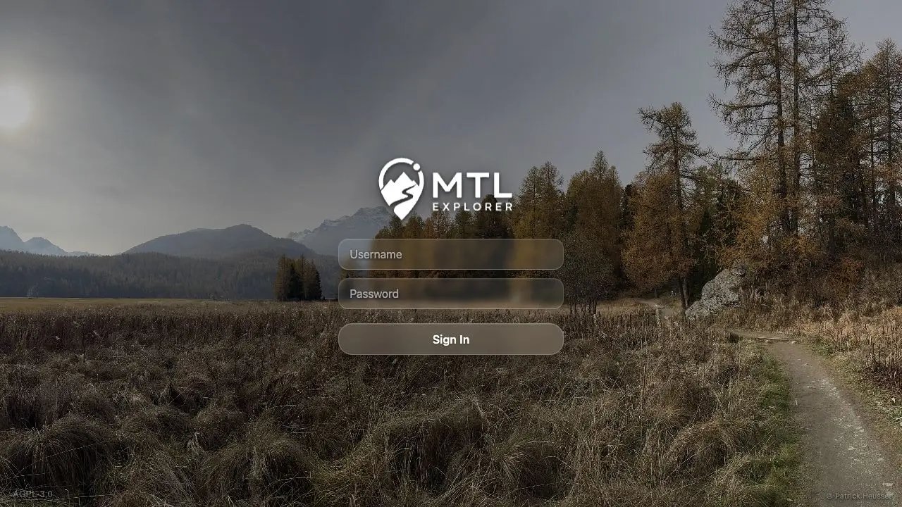

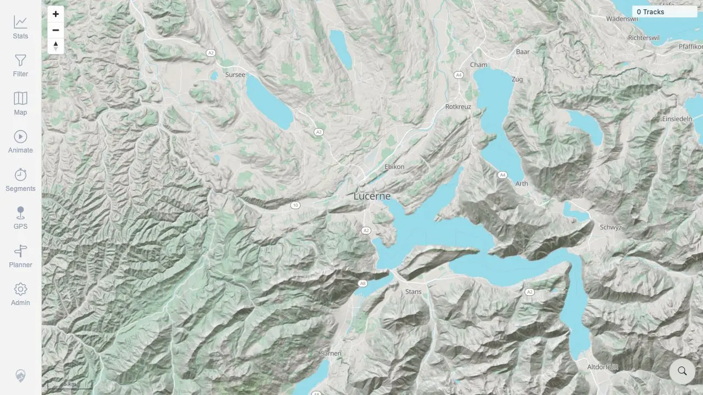

## Timing Highlights

| Area | Timing |
|---|---:|
| Quick install / compose start | 13s |
| App readiness after compose start | 5s |
| Five-GPX watcher detection | 16s |
| Five-GPX import completion | <1m |
| Delete-two source sync | <1m |
| FIT import/conversion | <1m |
| Cleanup shutdown/removal | ~12s |

## Evidence Highlights

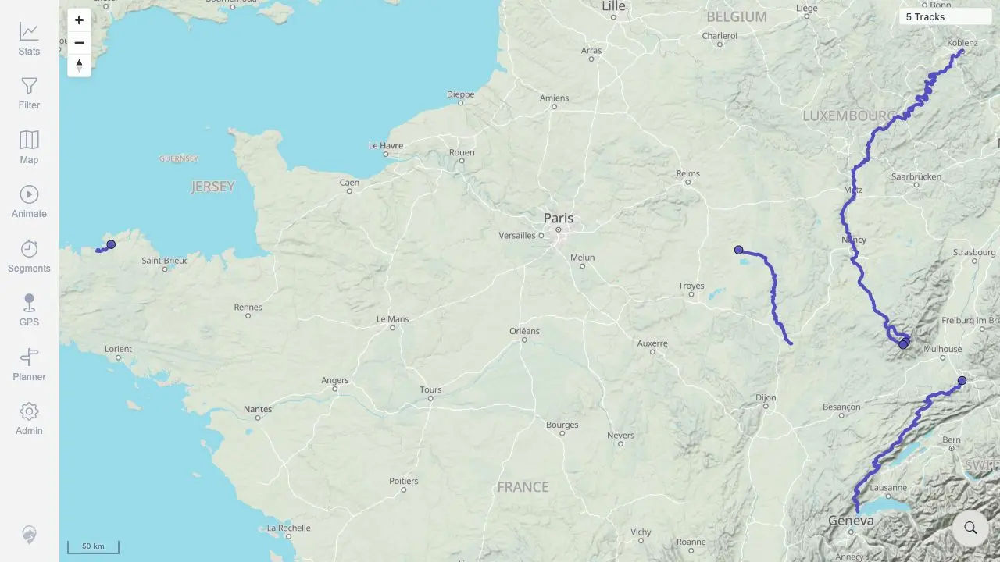

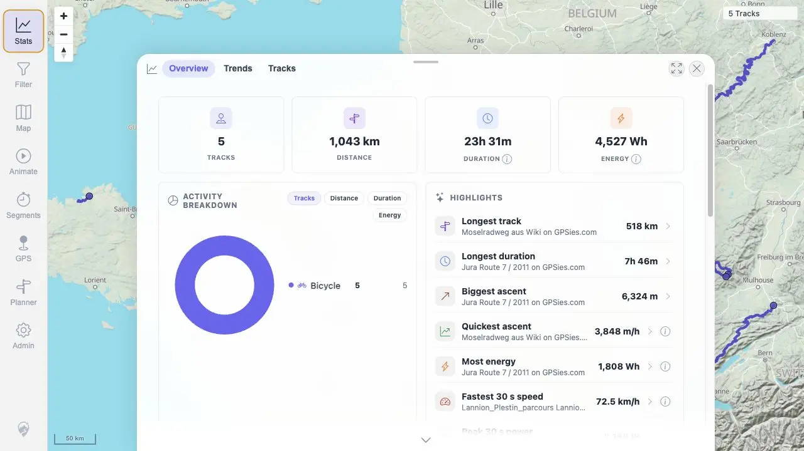

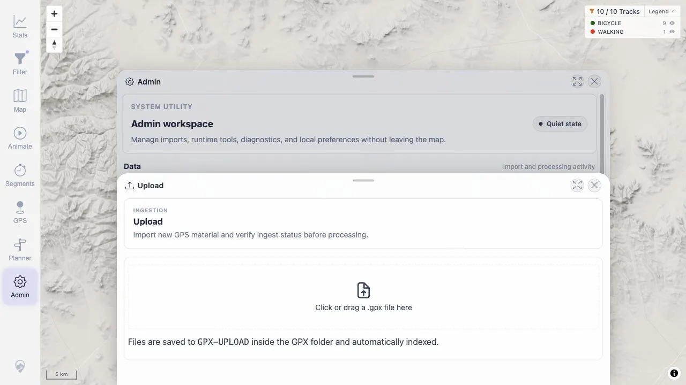

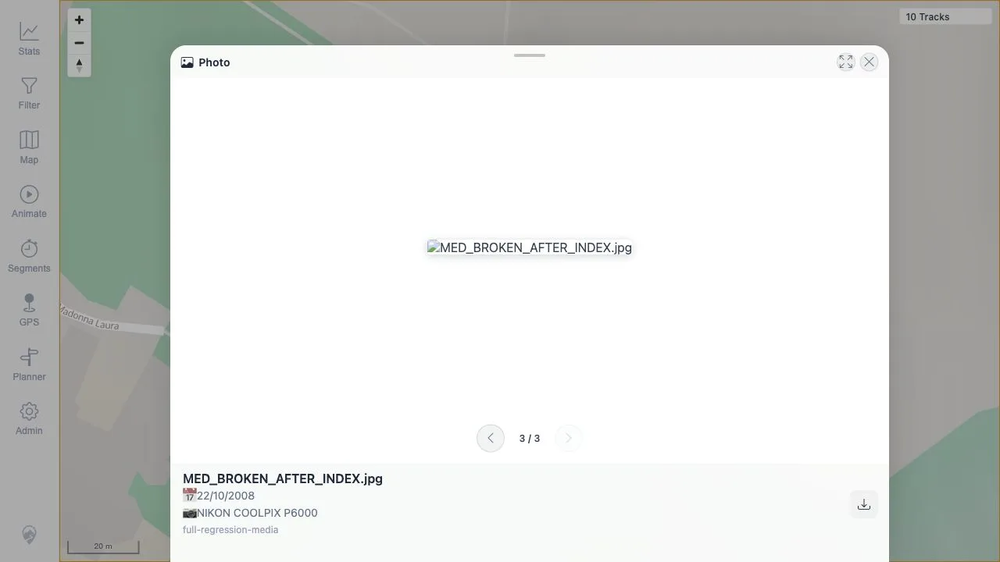

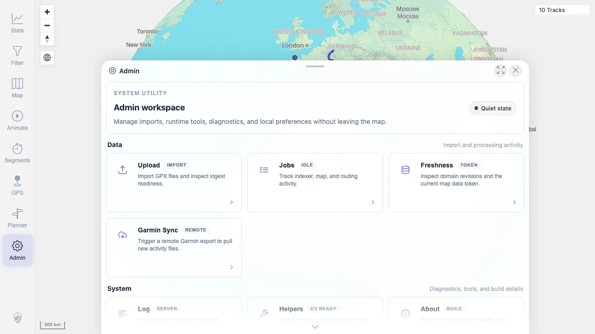

## High-Priority Findings

- `FMT-01` (`FMT_01/FMT_02`): KMZ is listed as supported but GPSBabel conversion fails with `Input type 'kmz' not recognized`.
- `FMT-02` (`FMT_01/FMT_02`): GeoJSON import completes without usable trackpoints and GPX export has 0 `<trkpt>`.
- `FMT-04` (`FMT_02`): KML import creates API track data but is not visible/searchable in the track browser.
- `MAP-01` (`MAP_02`): Valid indexed tracks are omitted from the map/list visible count after format imports.
- `TRD-02` (`TRD_10`): Track details do not expose a visible activity type change control.
- `TRD-04` (`TRD_12`): Track details do not expose a visible statistics exclusion toggle.
- `FLT-02` (`FLT_04`): Geo rectangle filter parameter is lost after reload while text/date parameters persist.
- `PLN-01` (`PLN_03`): Dragging an existing planner route leg did not insert a waypoint; route stayed at one leg.
- `MCT-01` (`MCT_04`): Segment comparison mini-map collapses while charts render, preventing visual segment alignment verification.
- `AVR-01` (`AVR_01`): Animate tool sees zero tracks and disables playback while tracks are visible on the map.
- `MED-01` (`MED_05`): Broken media renders as a blank/broken image instead of a recoverable error.
- `ADM-01` (`ADM_02`): Admin upload UI only allows `.gpx` while backend and regression scope include multiple track formats.
- `SYN-01` (`SYN_05`): Data freshness banner Dismiss does not hide the banner.
- `LOC-01` (`LOC_02`): Locale switch does not update decimal-unit formatting on some Stats values.

## All Issues

| ID | Severity | Coverage | Summary | Status |
|---|---|---|---|---|
| `FMT-01` | P2 | FMT_01/FMT_02 | KMZ is listed as supported but GPSBabel conversion fails with `Input type 'kmz' not recognized`. | Open |
| `FMT-02` | P2 | FMT_01/FMT_02 | GeoJSON import completes without usable trackpoints and GPX export has 0 `<trkpt>`. | Open |
| `FMT-03` | P3 | FMT_01 | SBP positive coverage could not run because no sample was found and installed GPSBabel cannot generate SBP. | Coverage constraint |
| `FMT-04` | P2 | FMT_02 | KML import creates API track data but is not visible/searchable in the track browser. | Open |
| `SGN-01` | P3 | SGN_09 | Browser Back/Forward does not navigate between primary views. | Open |
| `MAP-01` | P2 | MAP_02 | Valid indexed tracks are omitted from the map/list visible count after format imports. | Open |
| `MAP-02` | P3 | MAP_11 | Track point clicks did not expose a point metrics popup in the tested detail map. | Open |
| `TRD-01` | P3 | TRD_06 | Hover sync is one-way and leaves a stale mini-map cursor. | Open |
| `TRD-02` | P2 | TRD_10 | Track details do not expose a visible activity type change control. | Open |
| `TRD-03` | P3 | TRD_11 | Energy what-if recalculation control is not exposed in tested track details. | Open |
| `TRD-04` | P2 | TRD_12 | Track details do not expose a visible statistics exclusion toggle. | Open |
| `FLT-01` | P3 | FLT_03 | Filter parameter workflow lacks explicit Apply/Cancel controls; changes live-apply and reset only by clearing values. | Open |
| `FLT-02` | P2 | FLT_04 | Geo rectangle filter parameter is lost after reload while text/date parameters persist. | Open |
| `FLT-03` | P3 | FLT_05 | Polygon draw toolbar reports 3 points while explicit Undo/Finish controls remain disabled. | Open |
| `TBS-01` | P3 | TBS_04 | Track browser does not expose quick-view/preset subset controls beyond search/sort/pagination. | Open |
| `TBS-02` | P3 | TBS_11 | Excluded-highlight count opens an empty track-browser search instead of a useful excluded-track review/manage view. | Open |
| `PLN-01` | P2 | PLN_03 | Dragging an existing planner route leg did not insert a waypoint; route stayed at one leg. | Open |
| `MCT-01` | P2 | MCT_04 | Segment comparison mini-map collapses while charts render, preventing visual segment alignment verification. | Open |
| `AVR-01` | P2 | AVR_01 | Animate tool sees zero tracks and disables playback while tracks are visible on the map. | Open |
| `AVR-02` | P3 | AVR_02 | Virtual Race moves map markers, but racer cards/ranking do not visibly update during playback. | Open |
| `MED-01` | P2 | MED_05 | Broken media renders as a blank/broken image instead of a recoverable error. | Open |
| `ADM-01` | P2 | ADM_02 | Admin upload UI only allows `.gpx` while backend and regression scope include multiple track formats. | Open |
| `SYN-01` | P2 | SYN_05 | Data freshness banner Dismiss does not hide the banner. | Open |
| `APP-01` | P3 | APP_06 | Grayscale base-map style is missing from Map panel despite regression scope listing it. | Open |
| `LOC-01` | P2 | LOC_02 | Locale switch does not update decimal-unit formatting on some Stats values. | Open |
| `MOB-01` | Coverage constraint | MOB_01/MOB_02/MOB_04/MOB_05 | Touch input and gesture automation are unavailable in the current browser surface. | Coverage constraint |

## Blocked And Not Applicable Areas

- BLOCKED: mobile/touch rows requiring a touch-capable browser context (`MOB_01`, `MOB_02`, `MOB_04`, `MOB_05`) and planner mobile/touch drag (`PLN_11`).
- NOT APPLICABLE: demo mode disabled, FIT converter unavailable state not applicable, no Swiss Mobility layer, plain-HTTP live GPS secure-origin rows, installed-PWA offline row, service-worker update row, and BRouter trouble rows that did not occur.
- No coverage IDs remained `NOT STARTED`, `IN PROGRESS`, `PARTIAL`, or `NOT COVERED` at finalization.

## Evidence Navigation

| Packet | Status | Actual result | Evidence files |
|---|---|---|---:|
| [ADM_02](#packet-adm_02) | FAIL | Upload availability was clear and API success/error messages were clear. However, the UI picker/drop-zone only advertises and accepts .gpx, while the endpoint reports broader accepted formats. Native UI progress could no... | 4 |
| [APP_06](#packet-app_06) | FAIL | The five exposed styles could be selected independently in dark UI, but no grayscale style was exposed despite the coverage scope listing it. | 1 |
| [AVR_01](#packet-avr_01) | FAIL | Animate opened, but it showed Tracks 0 / 0; Play and Stop were disabled while the map header still showed 10 Tracks. Playback, pause, reset, and speed behavior could not be exercised. | 2 |
| [AVR_02](#packet-avr_02) | FAIL | Race opened with 3 racers, a mini-map, rank cards, and A/B segment. Starting playback moved the racer marker/trail on the map and toggled the control to Pause. The ranking/card area stayed static across ready, running, a... | 5 |
| [ERR_01](#packet-err_01) | FAIL | API/map failure showed Retry and expired session redirected to login, but broken media still rendered a blank/broken preview with no actionable recovery message. Planner route-fetch trouble did not occur in this configur... | 5 |
| [FLT_03](#packet-flt_03) | FAIL | Selecting the filter revealed a Keyword parameter. Entering Jura live-applied the filter and reduced the map/live preview to 1/10 tracks; clearing the field reset the preview to 10/10. No explicit Apply or Cancel control... | 3 |
| [FLT_04](#packet-flt_04) | FAIL | The text keyword and date parameter persisted and re-applied after reload. The rectangle geo parameter was visible before reload but disappeared afterward; Base scope showed only 1 active parameter and the Area section r... | 3 |
| [FLT_05](#packet-flt_05) | FAIL | Cancel, circle draw, rectangle draw, polygon double-click finish, and clear worked. The explicit Polygon Undo and Finish buttons were disabled while the tool reported 3 points, and the rectangle geo parameter did not rea... | 7 |
| [FMT_01](#packet-fmt_01) | FAIL | GPX and FIT already passed earlier. Distinct TCX, KML, IGC, GDB, and NMEA samples imported successfully. KMZ failed conversion with Input type 'kmz' not recognized. GeoJSON converted but produced EMPTY_FILE / 0 trackpoin... | 8 |
| [FMT_02](#packet-fmt_02) | FAIL | TCX, IGC, GDB, and NMEA were visible in track browser/stat totals and download endpoints returned matching originals plus GPX exports with 180 trkpt. KML imported and download endpoints worked, but it was not visible/sea... | 7 |
| [LOC_02](#packet-loc_02) | FAIL | Settings preview, dates, and grouped values updated immediately to de-DE style, but decimal unit values such as 94.26 m, 3.60 km, and 72.5 km/h kept period decimal separators instead of de-DE comma separators. | 1 |
| [MAP_02](#packet-map_02) | FAIL | UI showed 10 tracks, but the installed-app API listed 14 tracks with point data after imports, including valid TCX/KML/GDB entries not represented in the visible count/list. | 3 |
| [MAP_11](#packet-map_11) | FAIL | Track details and aggregate metrics were visible, but no point popup appeared after multiple line/point clicks. | 5 |
| [MCT_04](#packet-mct_04) | FAIL | Analyzer found 3/3 tracks (JuraRoute72011.gpx, .igc, .nmea) and Compare opened with racer cards plus speed/altitude charts. The required comparison mini-map did not render as a usable map: the MapLibre canvas existed but... | 3 |
| [MED_05](#packet-med_05) | FAIL | Preview opened, but the main media area was blank except for a broken-image icon/alt text. No retry/actionable error message appeared. The content endpoint returned HTTP 200 with Content-Type: image/jpeg and a 0-byte bod... | 2 |
| [PLN_03](#packet-pln_03) | FAIL | Dragging the leg panned/shifted the map or left the route unchanged; the route stayed at 1 leg with unchanged stats after retry. | 7 |
| [SGN_09](#packet-sgn_09) | FAIL | Stats/Admin did not update browser history; Back and Forward left the user on Admin. Console captured two 401 resource errors during the pass. | 2 |
| [SYN_05](#packet-syn_05) | FAIL | Banner appeared, but Dismiss did not hide it; the banner remained visible after all click paths and waits. | 2 |
| [TBS_04](#packet-tbs_04) | FAIL | The tested Tracks tab exposed search, sort controls, table columns, summary, and pagination, but no quick-view/preset subset buttons were visible. | 2 |
| [TRD_06](#packet-trd_06) | FAIL | Chart hover showed a tooltip/crosshair and red mini-map point. Mini-map hover did not visibly highlight the chart, and the red map cursor remained after moving away. | 4 |
| [TRD_10](#packet-trd_10) | FAIL | No visible activity type edit control was exposed in the tested detail view; clicking the Bicycle badge did not open an editor. | 2 |
| [TRD_11](#packet-trd_11) | FAIL | The Overview showed energy values and mass used, but the About dialog only contained explanatory text; no rider-weight/what-if input was exposed. | 1 |
| [TRD_12](#packet-trd_12) | FAIL | No visible exclusion toggle was exposed in the tested detail UI, so the exclude/re-include workflow could not be performed from the frontend. | 2 |
| [MOB_01](#packet-mob_01) | BLOCKED | Narrow mobile layout loaded, but the browser runtime exposes only viewport resizing, not touch input or gesture emulation. | 1 |
| [MOB_02](#packet-mob_02) | BLOCKED | Filter sheet opened and closed at mobile width. Pointer drag attempts did not change sheet/nav positions, and touch drag/snap cannot be verified because the runtime lacks touch input. | 1 |
| [MOB_04](#packet-mob_04) | BLOCKED | No touch input or mobile gesture capability is available in this browser runtime; planner touch behavior cannot be executed. | 1 |
| [MOB_05](#packet-mob_05) | BLOCKED | Pointer map controls worked at mobile width, but pinch and touch double-tap require a touch/gesture-capable context that this browser runtime does not expose. | 1 |
| [PLN_11](#packet-pln_11) | BLOCKED | BLOCKED: workspace has no Playwright/touch harness installed, and the in-app browser surface for this run does not expose mobile viewport or touch emulation controls. | 1 |
| [FIT_06](#packet-fit_06) | NOT APPLICABLE | GPSBabel/FIT conversion was available and succeeded, so unavailable-converter error handling was not applicable in this run. | 1 |
| [GPS_02](#packet-gps_02) | NOT APPLICABLE | This run is on a remote plain-HTTP origin, confirmed by GPS_01. The plan explicitly marks live GPS permission/marker checks not applicable for this target type. | 2 |
| [GPS_03](#packet-gps_03) | NOT APPLICABLE | This run has no secure-origin geolocation path because it is remote plain HTTP. Without a live locate marker/position stream, follow-me recentering cannot be meaningfully exercised here. | 1 |
| [GPS_04](#packet-gps_04) | NOT APPLICABLE | The configured target is remote plain HTTP, so the browser permission-denied flow for live geolocation is outside this run's applicable scope per GPS_01 and the test plan note. | 2 |
| [GPS_05](#packet-gps_05) | NOT APPLICABLE | This remote plain-HTTP run cannot establish a live browser geolocation marker/stream. There is no applicable live GPS state to disable and verify. | 1 |
| [MAP_07](#packet-map_07) | NOT APPLICABLE | No direction-arrow setting was exposed in config or Settings; the conditional check is not applicable in this run. | 3 |
| [MAP_12](#packet-map_12) | NOT APPLICABLE | No Swiss Mobility route layer/API was exposed in this quick-install configuration; the conditional popup check is not applicable. | 1 |
| [NET_01](#packet-net_01) | NOT APPLICABLE | This run used a normal browser tab; the test plan explicitly says that context is not expected to pass and should be marked not applicable. | 1 |
| [NET_04](#packet-net_04) | NOT APPLICABLE | No new client build or service-worker version was deployed during this fixed-target regression run, so no update prompt event was applicable. | 1 |
| [PLN_09](#packet-pln_09) | NOT APPLICABLE | Not applicable in this configured run: tested planner routes computed successfully and BRouter status showed ready, running yes, 3 segments on disk, queued 0. No missing-data state occurred. | 1 |
| [PLN_10](#packet-pln_10) | NOT APPLICABLE | Not applicable in this configured run: no route-fetch trouble occurred; BRouter status was ready and PLN_07 already verified saved routes list/load/delete under normal routing state. | 2 |
| [SGN_04](#packet-sgn_04) | NOT APPLICABLE | Demo mode is not active ("demoMode": false), so a demo credentials banner is not applicable to this quick-install run. | 2 |
| [ACC_01](#packet-acc_01) | PASS | Initialized run-state with every coverage ID from the plan as a queue row and packet target. | 1 |
| [ACC_02](#packet-acc_02) | PASS | Using one packet per child coverage ID; parent/section summaries will not substitute for child statuses. | 1 |
| [ACC_03](#packet-acc_03) | PASS | Final report will be assembled from packet files only and include one row per coverage ID. | 1 |
| [ACC_04](#packet-acc_04) | PASS | Run evidence policy records WebP screenshots for working user-facing surfaces as well as failures; initial login and empty map screenshots already captured. | 3 |
| [ACC_05](#packet-acc_05) | PASS | Known constraints are recorded in run-state and constrained packets will use BLOCKED or NOT APPLICABLE rather than being collapsed into parent rows. | 1 |
| [ADM_01](#packet-adm_01) | PASS | Admin workspace showed grouped entries for Data, System, and Session. Clicking Open Upload opened the upload panel in-place. | 2 |
| [ADM_03](#packet-adm_03) | PASS | Jobs panel showed MEDIA and GPS file-indexer progress plus job states. API status exposed pending/completed/failed/removed counts. Refresh updated the timestamp from 10:10:09 to 10:11:06. | 3 |
| [ADM_04](#packet-adm_04) | PASS | GPS and MEDIA rescans showed clear queued messages; MEDIA briefly showed SCANNING. The ready indexers completed too quickly to produce ALREADY_RUNNING, and not-ready was not applicable. Map zoom still changed scale from ... | 2 |
| [ADM_05](#packet-adm_05) | PASS | Duplicate Finder and Exploration Score were visible as DONE 100%; API reported pending=0 and done=total for all background jobs. | 2 |
| [ADM_06](#packet-adm_06) | PASS | Healthy-run ready states were shown with detail: hosted map service, GeoNames ready, and BRouter routing segments ready with 3 segments on disk. Disabled/downloading/unavailable states did not occur in this run. | 2 |
| [ADM_07](#packet-adm_07) | PASS | Banner offered Reload and Dismiss; Freshness panel showed Out of sync, checked time, latest change timestamp, server/client tokens, outdated domains, and healthy polling. | 2 |
| [ADM_08](#packet-adm_08) | PASS | Timestamped server log lines loaded; Refresh added/advanced visible API request entries. | 2 |
| [ADM_09](#packet-adm_09) | PASS | Attribution listed expected rendering, basemap, trail overlay, chart, location search, conversion, and routing sources including OpenStreetMap, Protomaps, swisstopo, SchweizMobil, GeoNames, GPSBabel, and BRouter. | 2 |
| [ADM_10](#packet-adm_10) | PASS | Helpers showed 2/2 READY; API reported both exporter environments present. The gcexport install action returned clear output saying the existing venv was already present and active version was updated in DB. | 3 |
| [ADM_11](#packet-adm_11) | PASS | Reopening restored the Admin workspace with the Helpers panel still open and the recent gcexport command output intact. | 2 |
| [APP_01](#packet-app_01) | PASS | data-theme and pressed Settings controls changed immediately for light and dark; visible Admin/Settings colors changed with the selected scheme. | 1 |
| [APP_02](#packet-app_02) | PASS | No white-on-white or black-on-black text was observed; sampled active theme buttons had contrast ratios of 7.07 in light and 6.96 in dark. | 1 |
| [APP_03](#packet-app_03) | PASS | Highcharts text fill changed from rgb(100, 116, 139) in light to rgb(148, 163, 184) in dark; eight chart roots rendered in both states. | 1 |
| [APP_04](#packet-app_04) | PASS | data-theme remained dark after reload, on the login page, and after signing back in. | 1 |
| [APP_05](#packet-app_05) | PASS | The first captured post-DOM-load state already had data-theme=dark; the app applies the stored scheme at useTheme.ts module import before Vue mounts. No light mounted state was observed. | 1 |
| [APP_07](#packet-app_07) | PASS | After reload, the dark UI remained active and OSM Dark still had the active check. | 1 |
| [APP_08](#packet-app_08) | PASS | Base Map opacity changed the tile container to opacity: 0.45 and persisted after reload. GPS Tracks opacity persisted at 50% after reload. Reset restored OSM Topo, Base Map 100%, GPS Tracks 100%, and Heatmap disabled. | 1 |
| [AVR_03](#packet-avr_03) | PASS | Race overlays closed; map returned to normal state with 10 Tracks, zoom changed from 30 km to 20 km scale, pan/drag worked, and location search opened/closed normally. | 3 |
| [DAT_01](#packet-dat_01) | PASS | All five GPX files have real trkpt counts: 1414, 2954, 1688, 1298, and 381. | 1 |
| [DAT_02](#packet-dat_02) | PASS | All five GPX files include timestamp counts matching trackpoint counts plus metadata time tags. | 1 |
| [DAT_03](#packet-dat_03) | PASS | Source metadata is recorded and imported track IDs/names were added from IMP_06. | 2 |
| [DAT_04](#packet-dat_04) | PASS | All five staged GPX files are from the suggested gps-touring/sample-gpx repository. | 1 |
| [DAT_05](#packet-dat_05) | PASS | Activity.fit from Garmin fit-javascript-sdk was staged with SHA-256 recorded. | 1 |
| [DAT_06](#packet-dat_06) | PASS | No waypoint-only GPX was counted; FIT will be counted as positive only after FIT_02/FIT_05 conversion and GPX export evidence. | 1 |
| [DEL_01](#packet-del_01) | PASS | Both files were removed from data/gpx; Jura, Lannion, and Mosel remained. | 1 |
| [DEL_02](#packet-del_02) | PASS | Watcher/indexer removed track IDs 100000 and 100004 automatically; no manual rescan was needed. | 1 |
| [DEL_03](#packet-del_03) | PASS | Map and heatmap dropped from 5 to 3 tracks; track list contained only Jura/Mosel/Lannion; searches for Vitry and Voie returned no matching tracks; filter panel opened against the 3-track state. Related-list deletion will... | 5 |
| [DEL_04](#packet-del_04) | PASS | Jura #100001 opened from the map and rendered its overview/details after deletion. | 1 |
| [DEL_05](#packet-del_05) | PASS | Deletion status is based on user-visible map, heatmap, track browser/search, filter context, and remaining detail evidence. | 2 |
| [ERR_02](#packet-err_02) | PASS | Final state had one active Map sheet, zero stale track-pick/planner/segment/location/media overlays, cursor auto, no bad text, and map Zoom out changed scale from 300 km to 500 km. | 1 |
| [FIT_01](#packet-fit_01) | PASS | Activity.fit copied to data/gpx with expected SHA-256. | 1 |
| [FIT_02](#packet-fit_02) | PASS | Live watcher detected Activity.fit; GPSBabel converted it; import completed as #100005; map showed 4 tracks and track-browser search found Track 100005. | 4 |
| [FIT_03](#packet-fit_03) | PASS | FIT #100005 opened; overview, graphs, quality, related, and events tabs rendered; mini-map was visible; events tab correctly showed no track events. | 5 |
| [FIT_04](#packet-fit_04) | PASS | Downloaded Activity.fit was 94,096 bytes with SHA-256 949a238e...d591387, matching the uploaded file. | 3 |
| [FIT_05](#packet-fit_05) | PASS | Downloaded Activity.gpx was 479,844 bytes and contained 3,601 <trkpt> points. | 2 |
| [FLT_01](#packet-flt_01) | PASS | Reopening Filter kept filtering On, showed the selected Smart Base Filter, and displayed live preview status with 10 matching tracks and 2 categories. | 2 |
| [FLT_02](#packet-flt_02) | PASS | Catalog showed 18 filters grouped as Core, Activity, Date & Time, Performance, and Quality. Searching year narrowed results to Date & Time matches; clearing search and selecting Activity showed its four filters. | 3 |
| [FLT_06](#packet-flt_06) | PASS | The map count and legend changed immediately to 1/10 with one Bicycle category; Stats showed Showing 1 of 10 tracks. Clearing the keyword changed the map/legend to 10/10 with Bicycle and Walking categories, and Stats upd... | 4 |
| [FLT_07](#packet-flt_07) | PASS | Legend showed Bicycle=9 and Walking=1. Hiding Bicycle immediately changed the map count to 1/10 and changed the Bicycle visibility icon. Collapsing hid the group list; expanding/restoring Bicycle returned count to 10/10. | 4 |
| [FLT_08](#packet-flt_08) | PASS | The map returned to 10 Tracks, showed a Showing all tracks alert, removed the active legend, disabled Colors/SQL tabs, and displayed the Filtering is off panel. | 2 |
| [GLB_01](#packet-glb_01) | PASS | At world-scale zoom, the globe toggle became visible and active (mtl-globe-active), with the map still rendered and usable. | 2 |
| [GLB_02](#packet-glb_02) | PASS | At 5 km scale, the globe control was hidden and no longer had mtl-globe-active; the map rendered normally with tracks. | 2 |
| [GLB_03](#packet-glb_03) | PASS | After manual disable, the globe control stayed visible but inactive through low-zoom nudges; it became active again only after clicking the toggle a second time. | 3 |
| [GLB_04](#packet-glb_04) | PASS | Low-zoom panning kept the map rendered, and subsequent Zoom in controls still changed from 2000 km globe to 5 km flat view. | 3 |
| [GPS_01](#packet-gps_01) | PASS | The app was loaded from http://178.105.173.254:18080/mtl/, not localhost or HTTPS. Browser geolocation was not exposed in the page context. Opening GPS produced only a transient app info toast and no usable browser permi... | 2 |
| [HMO_01](#packet-hmo_01) | PASS | Heatmap density rendered around the track while the track line stayed visible above it. Turning Heatmap off removed the density overlay. Re-enabling with lower opacity restored a weaker overlay without hiding the track. | 4 |
| [HMO_02](#packet-hmo_02) | PASS | Worldwide and Swiss overlay controls switched independently. Opacity handles moved for worldwide and Swiss overlays. Waymarked Trails and Swiss overlays rendered without making the visible GPS track layer disappear. | 3 |
| [HMO_03](#packet-hmo_03) | PASS | With empty keyword, Lannion showed 10 / 10 Tracks and the local heatmap. Entering Jura reduced the map to 1 / 10 Tracks and removed the Lannion track/heatmap. Clearing the keyword restored 10 / 10 Tracks and the Lannion ... | 4 |
| [IMP_01](#packet-imp_01) | PASS | Map showed 0 Tracks; stats showed no matching tracks; Admin jobs were done with 0 totals and routing/location-search ready; freshness token was in sync with index:0, media:0, track_geometry:0, tracks:0. | 6 |
| [IMP_02](#packet-imp_02) | PASS | All five files were copied to data/gpx; sizes and SHA-256 values matched the source manifest. | 1 |
| [IMP_03](#packet-imp_03) | PASS | Live watcher detected all five CREATE events and all five files completed status=SUCCESS; manual Rescan GPS was not required. | 1 |
| [IMP_04](#packet-imp_04) | PASS | All five source files reached SUCCESS; Admin Jobs showed quiet/idle processing, no visible GPS failures, and data freshness moved out of sync after import. | 3 |
| [IMP_05](#packet-imp_05) | PASS | Freshness refresh returned the app to the map with 5 Tracks; Stats overview/table showed 5 tracks and totals; Filter panel opened against the 5-track state. | 4 |
| [IMP_06](#packet-imp_06) | PASS | Each of the five files mapped to a visible track ID/name; track-browser searches for Jura, Mosel, Vitry, Voie, and Lannion returned one matching row; map showed 5 tracks; stats highlights/recent activity contained the im... | 5 |
| [IMP_07](#packet-imp_07) | PASS | CUA viewport clicks opened Lannion #100003, Vitry #100000, Jura #100001 directly; overlapping Mosel/VoieVerte click produced a two-track selection list and each row opened #100002/#100004. No stale or duplicate lines wer... | 6 |
| [IMP_08](#packet-imp_08) | PASS | Track count increased from 0 to 5; each GPX source produced exactly one imported track ID (100000-100004). | 3 |
| [IMP_09](#packet-imp_09) | PASS | Stats increased to 5 tracks, 1,043 km, 23h31m, 4,527 Wh with Bicycle breakdown, rankings/highlights, active periods, and track-browser summary; heatmap rendered density over imported tracks. | 3 |
| [LOC_01](#packet-loc_01) | PASS | en-GB preview used 26/05/2026 and 12,345.67; Stats showed grouped values such as 1,262 km, 7,054 Wh, dates like 26/05/2026, 11:20, and compact durations such as 2m 00s. | 1 |
| [LOC_03](#packet-loc_03) | PASS | After reload, Settings still showed de-DE selected and the preview stayed in de-DE format: 26.05.2026 ... 12.345,67. | 1 |
| [LOC_04](#packet-loc_04) | PASS | Zero ascent/descent and no-elevation imports rendered as normal recent activity rows with dates, distances, and durations. Visible body text did not contain NaN, undefined, null, or Infinity. | 3 |
| [MAP_01](#packet-map_01) | PASS | The first ready map rendered map controls, scale, primary navigation, and 10 visible tracks without a blank-map state. | 2 |
| [MAP_03](#packet-map_03) | PASS | Freshness reload after GPX import updated the map from baseline to imported data; later hard reload after format imports showed the expanded 10-track visible dataset. | 3 |
| [MAP_04](#packet-map_04) | PASS | Map/heatmap dropped to 3 GPX tracks at that stage; searches for Vitry and Voie returned no matches; remaining tracks still opened. | 3 |
| [MAP_05](#packet-map_05) | PASS | Zoomed/clicked imported tracks rendered continuous line geometry and opened selections/details without stale duplicate lines. | 3 |
| [MAP_06](#packet-map_06) | PASS | Map remained usable with 10-track overlay and no visible loading/spinner text. Request log showed tile/API aborts from rapid movement but no frozen UI. | 2 |
| [MAP_08](#packet-map_08) | PASS | Lannion, Vitry, and Jura single-track clicks opened their detail/selection state without stale geometry. | 4 |
| [MAP_09](#packet-map_09) | PASS | A two-track selection list appeared; selecting Mosel opened #100002 and selecting VoieVerte opened #100004. | 3 |
| [MAP_10](#packet-map_10) | PASS | An 8-track selection list opened; after Close, the selection text disappeared and the normal 10-track map state remained. | 3 |
| [MCT_01](#packet-mct_01) | PASS | Analyzer showed A/B zones each crossing 1 track; Analyze produced a 1/1 track table with Lannion result, duration 3h 42m, and A-B speed metric -1.03, with metric controls for speed/time/distance. | 5 |
| [MCT_02](#packet-mct_02) | PASS | Track Details opened for #100003 with Lannion overview metrics while Segment Analyzer remained available behind it. | 1 |
| [MCT_03](#packet-mct_03) | PASS | After closing Segment Analyzer, the side button was no longer active, the analyzer sheet was gone, and the map no longer showed A/B zone markers or analyzer result UI. | 2 |
| [MCT_05](#packet-mct_05) | PASS | Returned 89 ordered points on one gpsTrackDataId from index 8 to 96. First/last coordinates matched the requested segment, distance delta was 18,101.42 m, duration delta was 4,017 s, and missing moving-window speed value... | 1 |
| [MED_01](#packet-med_01) | PASS | With the layer disabled no red media marker was visible; after enabling Photos & Media, the red cluster marker 2 appeared over the indexed Arezzo media coordinate. | 2 |
| [MED_02](#packet-med_02) | PASS | Arezzo showed the red cluster 2; after pan/zoom away no media marker was visible; returning to Arezzo showed cluster 2 again. API bounds returned the two Arezzo media IDs for Arezzo bounds and [] for west-Arezzo bounds, ... | 3 |
| [MED_03](#packet-med_03) | PASS | Photo sheet opened with image MED_JPEG_01_DSCN0010.jpg at 2 / 2; Previous moved to MED_JPEG_02_DSCN0010_COPY.jpg at 1 / 2; Next returned to MED_JPEG_01_DSCN0010.jpg at 2 / 2. | 3 |
| [MED_04](#packet-med_04) | PASS | Content endpoint returned HTTP 200 with Content-Type: image/jpeg; ImageMagick identified the response as a 793x1024 JPEG. The UI preview displayed the converted flower image with filename MED_HEIC_01_IMG_5195.HEIC and Ap... | 2 |
| [MOB_03](#packet-mob_03) | PASS | Stats tabs were clickable, Tracks showed mobile list rows and sort controls, document width stayed at 390 px, and Zoom in changed scale from 1000 km to 500 km. | 1 |
| [NET_02](#packet-net_02) | PASS | The app showed Unable to load tracks - no server connection and no cached data available. with a visible Retry button; splash was not frozen and the map shell/nav remained visible. | 2 |
| [NET_03](#packet-net_03) | PASS | The app redirected to /mtl/login?reason=expired and showed the login form. | 2 |
| [PLN_01](#packet-pln_01) | PASS | Planner opened in Drawing mode, showed BRouter status: ready, exposed Hiking/Road Bike/Mountain Hiking/Car profile options, and selected Road Bike. | 2 |
| [PLN_02](#packet-pln_02) | PASS | After zooming to 10 km scale, two map clicks enabled Undo/Clear/Save, produced 1 leg, 1.93 km distance, 5 m descent, and 4m duration. | 4 |
| [PLN_04](#packet-pln_04) | PASS | Dragging the selected waypoint changed distance from 0.33 km to 5.79 km; Delete selected waypoint reduced the route; Undo restored it, Redo deleted it again; Clear set 0.00 km/0 legs; Undo restored route, Redo cleared it... | 8 |
| [PLN_05](#packet-pln_05) | PASS | Stats changed from 0.33 km/0m/0m/0m/1 leg to 5.79 km/1m/6m/15m/1 leg after moving a waypoint, then returned to 0.00 km/0 legs after delete/clear states. | 4 |
| [PLN_06](#packet-pln_06) | PASS | Profile rendered with route elevation values; hovering showed a chart tooltip (5.79 km, 412 m, -0.1%) and an orange hover marker on the visible route point. | 3 |
| [PLN_07](#packet-pln_07) | PASS | Save dialog accepted name/description; Load showed the saved route with 5.8 km metadata; selecting it restored the Drawing view with the route; delete confirmation removed it and the list returned to No saved routes yet. | 6 |
| [PLN_08](#packet-pln_08) | PASS | Download returned HTTP 200 application/gpx+xml; GPX root/name were valid; 5 <trkpt> entries matched the saved-plan detail coordinate count and first/last coordinates; disposable plan delete returned 204. | 4 |
| [RUN_CLEANUP](#packet-run_cleanup) | PASS | Gate passed with 168 terminal IDs. Compose removed the app, brouter, db, location-search containers and network. Verification showed 0 mtl-explorer-* containers, no disposable directory, and no listener on port 18080. | 1 |
| [RUN_SETUP](#packet-run_setup) | PASS | Debian 13 target already had Docker 29.5.2 and Compose v5.1.4; port 18080 was free; compose stack started in 13s; local and remote URLs returned HTTP 200 with title MTL Explorer; signed-in baseline showed 0 Tracks. | 5 |
| [SGN_01](#packet-sgn_01) | PASS | Browser reached http://178.105.173.254:18080/mtl/login and showed the sign-in screen. | 2 |
| [SGN_02](#packet-sgn_02) | PASS | Login succeeded, URL returned to /mtl/, and the map shell showed 10 tracks plus primary navigation. | 2 |
| [SGN_03](#packet-sgn_03) | PASS | The page stayed at /mtl/login and displayed Invalid username or password. | 2 |
| [SGN_05](#packet-sgn_05) | PASS | Logout returned to /mtl/login; signing in again reached /mtl/ with 10 tracks visible. | 6 |
| [SGN_06](#packet-sgn_06) | PASS | LOADING YOUR TRAILS appeared during startup, then disappeared after 2.6s and the ready map showed 10 tracks. | 3 |
| [SGN_07](#packet-sgn_07) | PASS | The app showed Unable to load tracks — no server connection and no cached data available. Retry; no frozen splash remained. | 3 |
| [SGN_08](#packet-sgn_08) | PASS | About dialog heading and copy both used MTL Explorer. | 2 |
| [SRC_01](#packet-src_01) | PASS | Results appeared in the search panel, headed by Bern, Switzerland, followed by additional matching places. | 2 |
| [SRC_02](#packet-src_02) | PASS | Search panel closed back to the map and a visible mtl-location-search-marker appeared with an associated clear-marker button. | 2 |
| [SRC_03](#packet-src_03) | PASS | Marker and clear-button DOM nodes were removed, and the map remained usable with 10 / 10 Tracks. | 2 |
| [SRC_04](#packet-src_04) | PASS | The search panel displayed No matches; no marker was placed and the map remained usable. | 2 |
| [SYN_01](#packet-syn_01) | PASS | Banner appeared with New data available, explanatory text, and Reload/Dismiss actions. | 2 |
| [SYN_02](#packet-syn_02) | PASS | Banner cleared; map changed from 10 / 10 Tracks to 11 / 11 Tracks; Stats Overview showed 11 tracks and included ADM_02 Upload Validation as latest/recent activity. | 1 |
| [SYN_03](#packet-syn_03) | PASS | Earlier packets directly verified import success, freshness reload, map/browser/stats/filter/heatmap/detail updates, automatic delete processing, and removal of deleted tracks from user-visible surfaces. | 5 |
| [SYN_04](#packet-syn_04) | PASS | FIT conversion succeeded, became visible on map/list/stats/detail surfaces, and produced original/GPX downloads. Native freshness/cache reload behavior was also directly verified in SYN_01/SYN_02. | 5 |
| [SYN_06](#packet-syn_06) | PASS | App returned to map with 12 / 12 Tracks; no freshness banner appeared immediately after login or after a 10 second wait. | 1 |
| [SYN_07](#packet-syn_07) | PASS | Jobs tile showed PROCESSING; the media rescan queued/settled; map Zoom in remained responsive and changed scale from 1000 km to 500 km. | 1 |
| [TBS_01](#packet-tbs_01) | PASS | Tracks tab listed 10 tracks with Start, Track, Activity, Distance, Duration, Avg km/h, Energy, Exploration, Imported, summary totals, sort buttons, and pagination. | 1 |
| [TBS_02](#packet-tbs_02) | PASS | Each representative term returned matching visible rows, including FIT source-file/path search returning Track #100005. Search was cleared afterward. | 2 |
| [TBS_03](#packet-tbs_03) | PASS | Each sort control produced a distinct expected first row for the selected sort. Summary stayed at 10 tracks for all-track sorts and changed to 1 of 10 tracks for the Walking subset. | 2 |
| [TBS_05](#packet-tbs_05) | PASS | The detail sheet opened for #100005, showing the FIT-backed overview with Activity.fit, distance, duration, ascent, and download buttons. | 1 |
| [TBS_06](#packet-tbs_06) | PASS | Overview showed 10 tracks, 1,262 km, 1d 03h duration, 7,052 Wh, Bicycle/Walking breakdown, highlight rankings, recent activity, most active day/week/month/weekday, milestones, and overall date range. | 2 |
| [TBS_07](#packet-tbs_07) | PASS | Empty baseline showed no imported tracks; filtered stats showed Showing 1 of 10 tracks with Jura-only totals; all-track overview showed 10 tracks, 1,262 km, 1d 03h, activity breakdown, highlights, and milestones. | 3 |
| [TBS_08](#packet-tbs_08) | PASS | Five-GPX import increased stats to 5 tracks, 1,043 km, 23h31m, with rankings, period summaries, browser summary, and heatmap density. Deleting Vitry and VoieVerte dropped visible map/heatmap/list state to 3 tracks and se... | 5 |
| [TBS_09](#packet-tbs_09) | PASS | Each selected mode updated the active combobox label, kept the 10-track/1,262 km/1d 03h totals, and rendered duration/distance bar charts without blank panels or layout errors. | 3 |
| [TBS_10](#packet-tbs_10) | PASS | The clicked highlight became active and opened a ranked Longest track drilldown list headed by Moselradweg, with matching ranked tracks and per-track action rows. | 2 |
| [TBS_11](#packet-tbs_11) | PASS | The drilldown listed ranked tracks with Moselradweg first; selecting Moselradweg opened Track Details #100002; excluding it showed 1 track excluded; restoring the API state and reloading returned Moselradweg to the highl... | 5 |
| [TRD_01](#packet-trd_01) | PASS | GPX-backed track #100001 (JuraRoute72011.gpx) opened from the map; FIT-backed track #100005 (Activity.fit) opened from track browser/detail flow. | 4 |
| [TRD_02](#packet-trd_02) | PASS | FIT track #100005 rendered overview, graph, quality, related, and events views with mini-map context; GPX track #100001 also rendered overview/mini-map. | 6 |
| [TRD_03](#packet-trd_03) | PASS | Each tab rendered content and remained usable; no blank tab state was captured. | 5 |
| [TRD_04](#packet-trd_04) | PASS | Graphs tab rendered multiple chart panels with track metric axes/values instead of blank space. | 1 |
| [TRD_05](#packet-trd_05) | PASS | Distance became active, Range became inactive, point count increased from 350 to 375, and graph height control moved while charts remained rendered. | 3 |
| [TRD_07](#packet-trd_07) | PASS | Track browser/stat rows displayed line previews; related-track rows and overlap selection list displayed miniature track shapes; filter panel was captured with track geometry visible behind it. | 4 |
| [TRD_08](#packet-trd_08) | PASS | GPX original returned HTTP 200, 199,962 bytes, 1,414 trackpoints, and matching SHA-256; FIT original previously matched uploaded checksum. | 3 |
| [TRD_09](#packet-trd_09) | PASS | GPX #100001 export returned HTTP 200 and 1,414 trkpt; FIT export returned 3,601 trkpt; successful non-GPX exports returned 180 trkpt. GeoJSON remains a known FMT failure with 0 trkpt. | 4 |
| [TRD_13](#packet-trd_13) | PASS | The Related tab showed Next Tracks and Duplicates for #100001. Clicking Track #100005 navigated the detail panel to #100005 and refreshed related context. | 2 |
| [TRD_14](#packet-trd_14) | PASS | Events showed 1 break. Selecting Break 1 set the event button pressed and highlighted the matching location on the mini-map; clicking again removed the map highlight and cleared the pressed state. | 3 |

## Packet Evidence

### Packet ADM_02

- Packet file: [packets/ADM_02.md](packets/ADM_02.md)
- Coverage ID: `ADM_02`
- Status: **FAIL**
- Action: Inspected the Upload UI and exercised the backing upload endpoint with unsupported, empty, and valid files.
- Expected: Drag/pick upload supports GPX/FIT/etc.; availability, accepted formats, progress, success, unsupported-format errors, and empty-file errors are clear.
- Actual: Upload availability was clear and API success/error messages were clear. However, the UI picker/drop-zone only advertises and accepts `.gpx`, while the endpoint reports broader accepted formats. Native UI progress could not be driven because this browser runtime exposes no file-picker/set-input-files method.

**Issues**

| ID | Severity | Summary | Evidence |
|---|---|---|---|
| ADM-01 | P2 | Admin upload UI only allows `.gpx` while backend and regression scope include multiple track formats. | [assets/ADM_02-upload-panel.webp](assets/ADM_02-upload-panel.webp) [assets/ADM_02-upload-results.txt](assets/ADM_02-upload-results.txt) |

**Timings**

| Step | Timing |
|---|---:|
| Upload UI/API checks | <2 min |

**Handoff Notes**
- Completed: ADM_02 terminal `FAIL` due UI accepted-format mismatch; API success and error messages were captured.
- Remaining unfinished coverage: ADM_03 through RUN_CLEANUP.
- Blocked or not applicable: Native file-picker/progress automation is a tooling limitation in this browser runtime.
- State left for the next packet: `ADM_02-upload-valid.gpx` was uploaded to `GPX-UPLOAD` and may index as an additional track/freshness change.

**Evidence**

**Text Evidence**
- [assets/ADM_02-upload-results.txt](assets/ADM_02-upload-results.txt) - UI accepted-format details plus API success/error output. (969 B)

Excerpt: assets/ADM_02-upload-results.txt

<pre><code>Upload UI evidence:
- Drop-zone text: Click or drag a .gpx file here
- Hidden file input accept attribute: .gpx
- UI does not advertise or pick FIT/TCX/KML/KMZ/IGC/SBP/NMEA/GeoJSON/GDB.

API upload evidence:
- GET /api/gpx-upload/status -&gt; {"available":true,"message":"Upload directory is available."}
- POST unsupported ADM_02-upload-unsupported.xyz -&gt; HTTP 400; {"success":false,"message":"Unsupported file format. Accepted: .gpx, .fit, .tcx, .kml, .kmz, .igc, .sbp, .nmea, .geojson, .gdb"}
- POST empty ADM_02-empty.gpx -&gt; HTTP 400; {"success":false,"message":"Uploaded file is empty."}
- POST valid ADM_02-upload-valid.gpx -&gt; HTTP 200; {"success":true,"message":"'ADM_02-upload-valid.gpx' uploaded successfully. Indexing will begin shortly.","fileName":"ADM_02-upload-valid.gpx"}

Coverage note: server-side success and error messages are clear, but the Admin upload UI limits selection to .gpx while the endpoint and coverage scope include multiple track formats.
</code></pre>

**Other Evidence Files**
- [assets/ADM_02-upload-valid.gpx](assets/ADM_02-upload-valid.gpx) - Disposable valid GPX payload uploaded for success coverage. (534 B)
- [assets/ADM_02-upload-unsupported.xyz](assets/ADM_02-upload-unsupported.xyz) - Unsupported-format payload used for error coverage. (40 B)

### Packet APP_06

- Packet file: [packets/APP_06.md](packets/APP_06.md)
- Coverage ID: `APP_06`
- Status: **FAIL**
- Action: In dark UI theme, opened Map panel and selected each exposed base style: OSM Topo, Swiss Color, Swiss Light, OSM Light, and OSM Dark.
- Expected: Map theme is independent; available light, dark, grayscale, light-topo, swisstopo, and swisstopo-color styles can be selected with either UI theme.
- Actual: The five exposed styles could be selected independently in dark UI, but no grayscale style was exposed despite the coverage scope listing it.

**Issues**

| ID | Severity | Summary | Evidence |
|---|---|---|---|
| APP-01 | P3 | Grayscale base-map style is missing from Map panel despite regression scope listing it. | [assets/APP_06-map-styles.txt](assets/APP_06-map-styles.txt) |

**Timings**

| Step | Timing |
|---|---:|
| Inspect and select base styles | <2 min |

**Handoff Notes**
- Completed: APP_06 terminal `FAIL`.
- Remaining unfinished coverage: APP_07 through RUN_CLEANUP.
- Blocked or not applicable: None.
- State left for the next packet: Signed in, dark UI theme, last selected map style OSM Dark.

**Evidence**

**Text Evidence**
- [assets/APP_06-map-styles.txt](assets/APP_06-map-styles.txt) - Exposed map styles and active-selection observations. (825 B)

Excerpt: assets/APP_06-map-styles.txt

<pre><code>APP_06 map style independence evidence

Target: http://178.105.173.254:18080/mtl/
Browser state: signed in, UI theme dark.

Map panel exposed these base styles:
- OSM Topo
- Swiss Color
- Swiss Light
- OSM Light
- OSM Dark

Selection observations in dark UI:
- Initial active/default: star and check on OSM Topo.
- Swiss Color selected: active check moved to Swiss Color.
- Swiss Light selected: active check moved to Swiss Light.
- OSM Light selected: active check moved to OSM Light.
- OSM Dark selected: active check moved to OSM Dark.

Expected from coverage text: light, dark, grayscale, light-topo, swisstopo, swisstopo-color can be selected with either UI theme.

Result: FAIL. The available style list worked independently of dark UI theme for the exposed styles, but no grayscale style was exposed in the Map panel.
</code></pre>

### Packet AVR_01

- Packet file: [packets/AVR_01.md](packets/AVR_01.md)
- Coverage ID: `AVR_01`
- Status: **FAIL**
- Action: Opened the Animate tool from the map with 10 tracks visible.
- Expected: Tracks can play back smoothly; pause, reset/stop, and speed controls work.
- Actual: Animate opened, but it showed `Tracks 0 / 0`; Play and Stop were disabled while the map header still showed `10 Tracks`. Playback, pause, reset, and speed behavior could not be exercised.

**Issues**

| ID | Severity | Summary | Evidence |
|---|---|---|---|
| AVR-01 | P2 | Animate tool sees zero tracks and disables playback while tracks are visible on the map. | [assets/AVR_01-animate-disabled.webp](assets/AVR_01-animate-disabled.webp) |

**Timings**

| Step | Timing |
|---|---:|
| Animate tool check | <4m |

**Handoff Notes**
- Completed: AVR_01 terminal FAIL with issue AVR-01.
- Remaining unfinished coverage: continue with AVR_02.
- Blocked or not applicable: none.
- State left for the next packet: Animate sheet remains open; close it before opening Segment Analyzer race if needed.

**Evidence**

<a href="assets/AVR_01-animate-disabled.webp">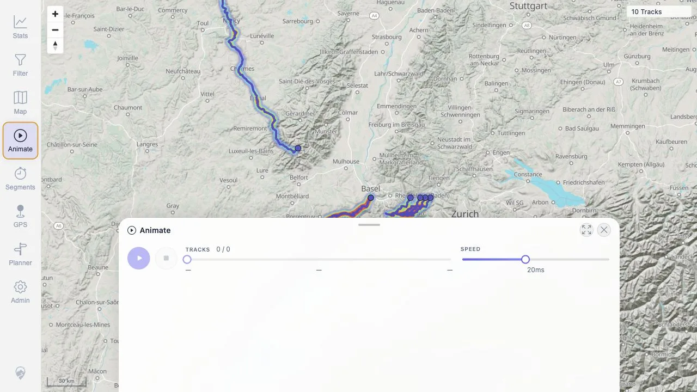</a>

**Text Evidence**
- [assets/AVR_01-animate-disabled.txt](assets/AVR_01-animate-disabled.txt) - DOM snapshot excerpt confirming disabled Play/Stop and 10 map tracks. (1.0 KB)

Excerpt: assets/AVR_01-animate-disabled.txt

<pre><code>- region "Map"
- region "Map"
- button "Zoom in"
- button "Zoom out"
- button "Drag to rotate map, click to reset north"
- text: 
- generic: 30 km
- generic: 10 Tracks
- button " Stats":
  - generic: 
  - generic: Stats
- button " Filter":
  - generic: 
  - generic: Filter
- button " Map":
  - generic: 
  - generic: Map
- button " Animate" [active]:
  - generic: 
  - generic: Animate
- button " Segments":
  - generic: 
  - generic: Segments
- button " GPS":
  - generic: 
  - generic: GPS
- button " Planner":
  - generic: 
  - generic: Planner
- button " Admin":
  - generic: 
  - generic: Admin
- button "About MTL Explorer"
- generic: 
- text: Animate
- button "Fullscreen":
  - generic: 
- button "Close":
  - generic: 
- button "Play animation" [disabled]:
  - generic: 
- button "Stop animation" [disabled]:
  - generic: 
- generic: Speed
- slider
- generic: 20ms
- generic: Tracks
- generic: 0 / 0
- slider
- slider
- generic: —
- generic: —
- generic: —
- text:  </code></pre>

### Packet AVR_02

- Packet file: [packets/AVR_02.md](packets/AVR_02.md)
- Coverage ID: `AVR_02`
- Status: **FAIL**
- Action: Recreated the 3-track Jura A-B segment, opened Segment Analyzer Race, started playback, and observed the race map mid-run and later.
- Expected: Multiple racers move together; ranking and racer cards update in real time.
- Actual: Race opened with `3 racers`, a mini-map, rank cards, and A/B segment. Starting playback moved the racer marker/trail on the map and toggled the control to Pause. The ranking/card area stayed static across ready, running, and later states, with no visible live progress or ranking update.

**Issues**

| ID | Severity | Summary | Evidence |
|---|---|---|---|
| AVR-02 | P3 | Virtual Race moves map markers, but racer cards/ranking do not visibly update during playback. | [assets/AVR_02-race-running.webp](assets/AVR_02-race-running.webp) [assets/AVR_02-race-later.webp](assets/AVR_02-race-later.webp) |

**Timings**

| Step | Timing |
|---|---:|
| Race setup and playback | <12m |

**Handoff Notes**
- Completed: AVR_02 terminal FAIL with issue AVR-02.
- Remaining unfinished coverage: continue with AVR_03.
- Blocked or not applicable: none.
- State left for the next packet: Segment Analyzer Race overlay open after playback, with the map still visible behind it.

**Evidence**

<a href="assets/AVR_02-race-ready.webp">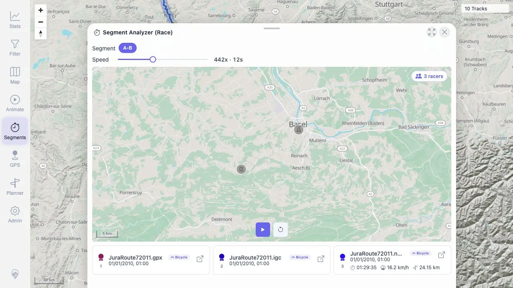</a>
<a href="assets/AVR_02-race-running.webp">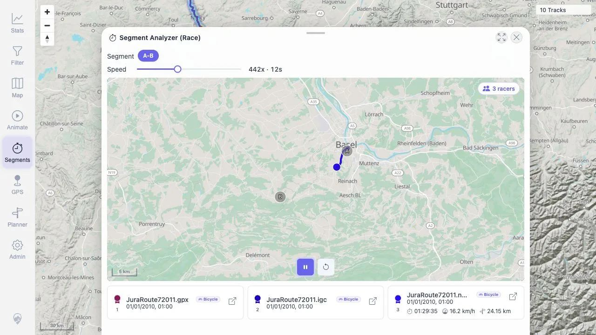</a>
<a href="assets/AVR_02-race-later.webp">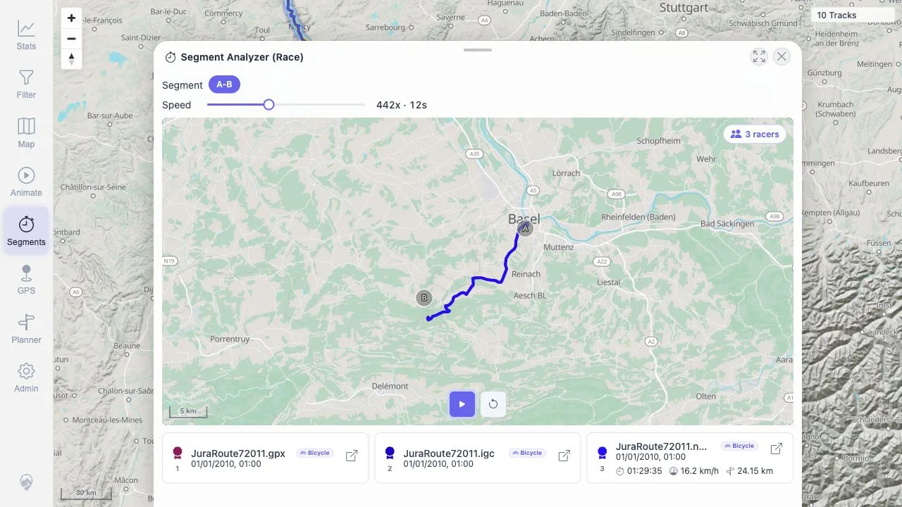</a>

**Text Evidence**
- [assets/AVR_02-race-running.txt](assets/AVR_02-race-running.txt) - DOM excerpt from running state. (3.1 KB)

Excerpt: assets/AVR_02-race-running.txt

<pre><code>- region "Map"
- region "Map"
- button "Zoom in"
- button "Zoom out"
- button "Drag to rotate map, click to reset north"
- text: 
- generic: 30 km
- generic: 10 Tracks
- button " Stats":
  - generic: 
  - generic: Stats
- button " Filter":
  - generic: 
  - generic: Filter
- button " Map":
  - generic: 
  - generic: Map
- button " Animate":
  - generic: 
  - generic: Animate
- button " Segments":
  - generic: 
  - generic: Segments
- button " GPS":
  - generic: 
  - generic: GPS
- button " Planner":
  - generic: 
  - generic: Planner
- button " Admin":
  - generic: 
  - generic: Admin
- button "About MTL Explorer"
- generic: 
- text: Segment Analyzer
- button:
  - generic: 
- button:
  - generic: 
- button:
  - generic: 
  - generic: 3 / 3
  - generic: tracks
- switch [checked]
- generic: Consolidated
- button:
  - generic: 
  - generic: Compare
  - generic: "3"
- button:
  - generic: 
  - generic: Race
  - generic: "3"
- button:
  - generic: 
- button:
  - generic: 
  - text: Table
- button:
  - generic: 
  - text: Trends
- tabpanel:
  - generic: Column metric
  - button: speed
  - button: time
  - button: distance
  - table:
    - rowgroup:
      - row:
        - columnheader:
          - checkbox [checked]
        - columnheader:
          - generic: Name
        - columnheader:
          - generic: Start
        - columnheader:
          - generic: Duration
        - columnheader:
        - columnheader:
          - generic: A - B
... [truncated in this report; open linked file for full evidence]</code></pre>

- [assets/AVR_02-race-later.txt](assets/AVR_02-race-later.txt) - DOM excerpt from later state. (3.1 KB)

Excerpt: assets/AVR_02-race-later.txt

<pre><code>- region "Map"
- region "Map"
- button "Zoom in"
- button "Zoom out"
- button "Drag to rotate map, click to reset north"
- text: 
- generic: 30 km
- generic: 10 Tracks
- button " Stats":
  - generic: 
  - generic: Stats
- button " Filter":
  - generic: 
  - generic: Filter
- button " Map":
  - generic: 
  - generic: Map
- button " Animate":
  - generic: 
  - generic: Animate
- button " Segments":
  - generic: 
  - generic: Segments
- button " GPS":
  - generic: 
  - generic: GPS
- button " Planner":
  - generic: 
  - generic: Planner
- button " Admin":
  - generic: 
  - generic: Admin
- button "About MTL Explorer"
- generic: 
- text: Segment Analyzer
- button:
  - generic: 
- button:
  - generic: 
- button:
  - generic: 
  - generic: 3 / 3
  - generic: tracks
- switch [checked]
- generic: Consolidated
- button:
  - generic: 
  - generic: Compare
  - generic: "3"
- button:
  - generic: 
  - generic: Race
  - generic: "3"
- button:
  - generic: 
- button:
  - generic: 
  - text: Table
- button:
  - generic: 
  - text: Trends
- tabpanel:
  - generic: Column metric
  - button: speed
  - button: time
  - button: distance
  - table:
    - rowgroup:
      - row:
        - columnheader:
          - checkbox [checked]
        - columnheader:
          - generic: Name
        - columnheader:
          - generic: Start
        - columnheader:
          - generic: Duration
        - columnheader:
        - columnheader:
          - generic: A - B
... [truncated in this report; open linked file for full evidence]</code></pre>

### Packet ERR_01

- Packet file: [packets/ERR_01.md](packets/ERR_01.md)
- Coverage ID: `ERR_01`
- Status: **FAIL**
- Action: Reviewed direct error-case evidence for API load failure, expired session, broken media, and planner route trouble applicability.
- Expected: Failed track load, failed map config, failed media, failed planner route, and expired session show actionable messages and can recover.
- Actual: API/map failure showed Retry and expired session redirected to login, but broken media still rendered a blank/broken preview with no actionable recovery message. Planner route-fetch trouble did not occur in this configured run.

**Issues**

| ID | Severity | Summary | Evidence |
|---|---|---|---|
| MED-01 | P2 | Broken media renders as a blank/broken image instead of a recoverable error. | [assets/MED_05-broken-media.txt](assets/MED_05-broken-media.txt) [assets/MED_05-broken-preview.webp](assets/MED_05-broken-preview.webp) |

**Timings**

| Step | Timing |
|---|---:|
| Aggregate error recovery review | <2 min |

**Handoff Notes**
- Completed: ERR_01 terminal `FAIL`.
- Remaining unfinished coverage: ERR_02 through RUN_CLEANUP.
- Blocked or not applicable: Planner route-fetch trouble did not occur and was not forced in this fixed-target run; the row fails because broken media lacks actionable recovery.
- State left for the next packet: Main browser signed in on desktop viewport.

**Evidence**

**Text Evidence**
- [assets/ERR_01-error-recovery.txt](assets/ERR_01-error-recovery.txt) - Aggregate error-case recovery summary. (1.1 KB)

Excerpt: assets/ERR_01-error-recovery.txt

<pre><code>ERR_01 error recovery evidence

Covered error cases:

Failed track/map/API load:
- NET_02 aborted /mtl/api/** requests in an isolated context.
- App showed: Unable to load tracks - no server connection and no cached data available.
- Retry button was visible.
- Frozen splash: false.
- Evidence: assets/NET_02-network-recovery.txt

Expired/invalid session:
- NET_03 replaced mtl.jwt with an invalid token in an isolated context.
- App redirected to /mtl/login?reason=expired.
- Login form was visible.
- Evidence: assets/NET_03-auth-redirect.txt

Broken media:
- MED_05 indexed and then corrupted a disposable JPEG.
- Media preview opened, but the main media area was blank/broken with no retry/actionable error message.
- Server returned 200 image/jpeg with a 0-byte body.
- Evidence: assets/MED_05-broken-media.txt and assets/MED_05-broken-preview.webp

Planner route failure:
- BRouter stayed ready in this configured run and PLN_10 marked forced route-fetch trouble not applicable.
- Evidence: packets/PLN_10.md

Result: FAIL. Track/map/API failure and expired session recovered cleanly, but the broken media error case did not show an actionable recoverable UI.
</code></pre>

- [assets/NET_02-network-recovery.txt](assets/NET_02-network-recovery.txt) - Failed API/map/track load recovery evidence. (1.2 KB)

Excerpt: assets/NET_02-network-recovery.txt

<pre><code>NET_02 flaky/API-failure recovery evidence

Tooling:
- Ran Playwright 1.60.0 from a temporary /tmp install using the system Google Chrome channel.
- Test spec: assets/NET_02-network-recovery.spec.ts

Actions:
1. Logged in with README credentials in a clean browser context.
2. Cleared IndexedDB database mtl_db and browser caches.
3. Aborted all /mtl/api/** requests.
4. Reloaded the app URL.

Failed requests observed:
- GET /mtl/api/filter/get
- GET /mtl/api/filter/info?filterName=SmartBaseFilter&amp;filterDomain=GPS_TRACK
- GET /mtl/api/map/config
- POST /mtl/api/analytics/client-environment
- GET /mtl/api/info/build
- GET /mtl/api/config/get?domain1=CLIENT&amp;domain2=COLOR_PALETTE
- GET /mtl/api/indexer/status
- GET /mtl/api/jobs/status
- GET /mtl/api/map/status
- GET /mtl/api/location-search/status
- GET /mtl/api/data-freshness
- HEAD /mtl/api/info/build

Visible result:
- Unable to load tracks - no server connection and no cached data available.
- Retry button visible: true
- Frozen splash: false
- Map shell remained present with 0 Tracks and nav controls.

Result: PASS. API/network failure produced a recoverable Retry state instead of a blank screen or frozen splash.
</code></pre>

- [assets/NET_03-auth-redirect.txt](assets/NET_03-auth-redirect.txt) - Expired/invalid session redirect evidence. (717 B)

Excerpt: assets/NET_03-auth-redirect.txt

<pre><code>NET_03 401/403 auth redirect evidence

Tooling:
- Ran Playwright 1.60.0 from a temporary /tmp install using the system Google Chrome channel.
- Test spec: assets/NET_03-auth-redirect.spec.ts

Actions:
1. Logged in with README credentials in a clean browser context.
2. Waited for the main app at http://178.105.173.254:18080/mtl/.
3. Replaced localStorage key mtl.jwt with an invalid token.
4. Reloaded the app so API requests used the invalid Authorization header.

Observed:
- Browser redirected to: http://178.105.173.254:18080/mtl/login?reason=expired
- Username field was visible on the login page.
- Visible text included: AGPL-3.0 Sign In.

Result: PASS. Invalid/expired auth caused a clean redirect to login.
</code></pre>

- [assets/MED_05-broken-media.txt](assets/MED_05-broken-media.txt) - Broken media failure evidence. (931 B)

Excerpt: assets/MED_05-broken-media.txt

<pre><code>Broken media setup and evidence for MED_05.

Setup:
- Restored original MED_JPEG_02_DSCN0010_COPY.jpg from backup.
- Created valid duplicate data/media/full-regression-media/MED_BROKEN_AFTER_INDEX.jpg.
- Ran MEDIA rescan.
- New indexed media: {"id":400003,"name":"MED_BROKEN_AFTER_INDEX.jpg","lat":11.88512667,"lng":43.46744833}
- Replaced MED_BROKEN_AFTER_INDEX.jpg with invalid text bytes after indexing.

Endpoint check:
GET /api/media/get/400003/content?maxSize=4096
HTTP/1.1 200
Content-Type: image/jpeg
ETag: "media-400003-44-1779779616369-original-s4096"
Response body size: 0 bytes
file: empty

UI observation:
- Photos &amp; Media layer showed Arezzo cluster "3".
- Clicking the expanded point opened media preview at 3 / 3 for MED_BROKEN_AFTER_INDEX.jpg.
- Preview body showed a blank/broken image area with the filename alt text.
- No actionable error message, retry action, or dismissable recoverable error state appeared.
</code></pre>

### Packet FLT_03

- Packet file: [packets/FLT_03.md](packets/FLT_03.md)
- Coverage ID: `FLT_03`
- Status: **FAIL**
- Action: Selected `Activities by keyword`, entered `Jura`, then cleared the keyword field.
- Expected: Picking a filter reveals parameters; apply, reset, and cancel all behave correctly.
- Actual: Selecting the filter revealed a `Keyword` parameter. Entering `Jura` live-applied the filter and reduced the map/live preview to 1/10 tracks; clearing the field reset the preview to 10/10. No explicit Apply or Cancel controls were exposed in the tested UI.

**Issues**

| ID | Severity | Summary | Evidence |
|---|---|---|---|
| FLT-01 | P3 | Filter parameter workflow lacks explicit Apply/Cancel controls. | [assets/FLT_03-keyword-params.webp](assets/FLT_03-keyword-params.webp) [assets/FLT_03-keyword-applied.webp](assets/FLT_03-keyword-applied.webp) [assets/FLT_03-keyword-reset-attempt.webp](assets/FLT_03-keyword-reset-attempt.webp) |

**Timings**

| Step | Timing |
|---|---:|
| Keyword filter parameter test | <3m |

**Handoff Notes**
- Completed: FLT_03 terminal FAIL due missing explicit Apply/Cancel controls.
- Remaining unfinished coverage: continue with FLT_04.
- Blocked or not applicable: none.
- State left for the next packet: Activities by keyword selected with empty keyword and filtering enabled.

**Evidence**

<a href="assets/FLT_03-keyword-params.webp">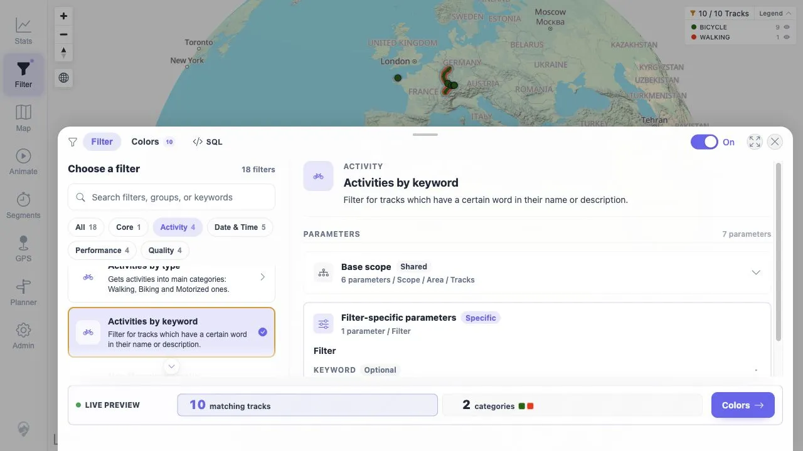</a>

<a href="assets/FLT_03-keyword-reset-attempt.webp">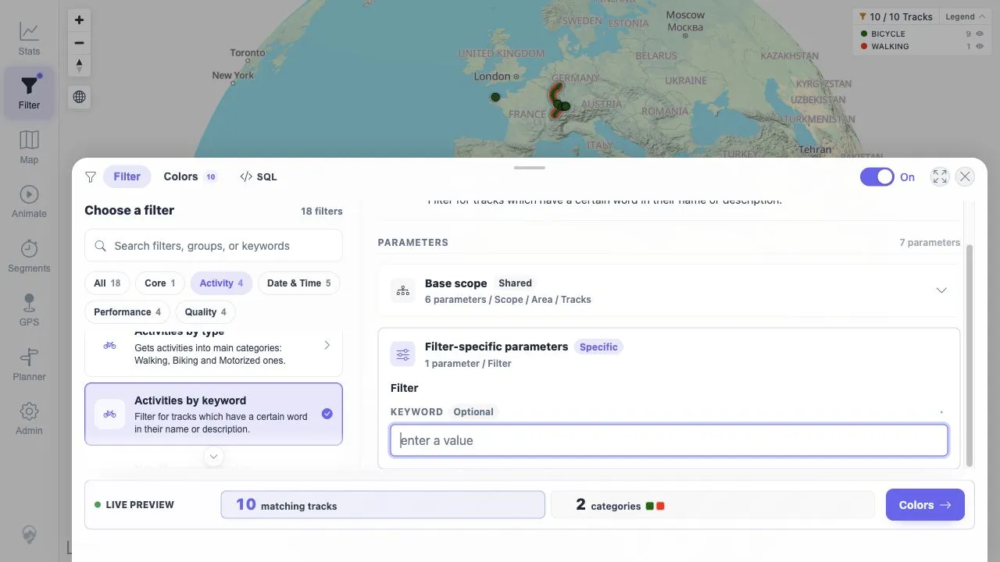</a>

### Packet FLT_04

- Packet file: [packets/FLT_04.md](packets/FLT_04.md)
- Coverage ID: `FLT_04`
- Status: **FAIL**
- Action: Set keyword `Jura`, selected a From date of `01.01.2010 07:32:53`, drew a rectangle geo parameter, then reloaded and reopened Filter/Base scope.
- Expected: Date, text, and geo parameters save and re-apply correctly after reload.
- Actual: The text keyword and date parameter persisted and re-applied after reload. The rectangle geo parameter was visible before reload but disappeared afterward; Base scope showed only 1 active parameter and the Area section returned to empty Draw buttons.

**Issues**

| ID | Severity | Summary | Evidence |
|---|---|---|---|
| FLT-02 | P2 | Geo filter parameter is lost after reload. | [assets/FLT_04-date-text-geo-set.webp](assets/FLT_04-date-text-geo-set.webp) [assets/FLT_04-after-geo-reload-expanded.webp](assets/FLT_04-after-geo-reload-expanded.webp) |

**Timings**

| Step | Timing |
|---|---:|
| Date/text/geo persistence check | <8m |

**Handoff Notes**
- Completed: FLT_04 terminal FAIL due lost geo parameter after reload.
- Remaining unfinished coverage: continue with FLT_05.
- Blocked or not applicable: none.
- State left for the next packet: filter active with keyword `Jura` and From date persisted; geo area is not active.

**Evidence**

<a href="assets/FLT_04-after-geo-reload-map.webp">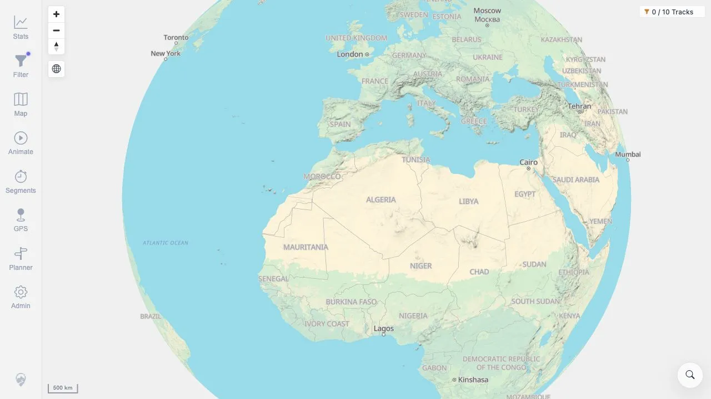</a>
<a href="assets/FLT_04-after-geo-reload-expanded.webp">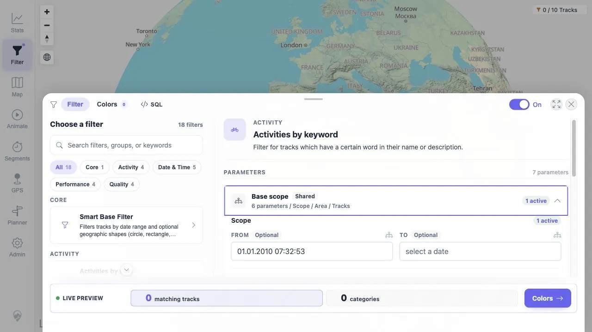</a>

### Packet FLT_05

- Packet file: [packets/FLT_05.md](packets/FLT_05.md)
- Coverage ID: `FLT_05`
- Status: **FAIL**
- Action: Started circle drawing and cancelled; drew and cleared a circle; drew a rectangle; started polygon drawing, observed undo/finish controls, double-clicked to finish, then cleared rectangle and polygon. Also checked shape persistence after reload in FLT_04.
- Expected: Circle, rectangle, and polygon drawing work; undo, cancel, finish, and clear all work; saved shapes reappear next time.
- Actual: Cancel, circle draw, rectangle draw, polygon double-click finish, and clear worked. The explicit Polygon Undo and Finish buttons were disabled while the tool reported `3 points`, and the rectangle geo parameter did not reappear after reload.

**Issues**

| ID | Severity | Summary | Evidence |
|---|---|---|---|
| FLT-02 | P2 | Geo filter parameter is lost after reload. | [assets/FLT_04-after-geo-reload-expanded.webp](assets/FLT_04-after-geo-reload-expanded.webp) |
| FLT-03 | P3 | Polygon tool disables explicit Undo/Finish controls while points are present. | [assets/FLT_05-polygon-before-undo.webp](assets/FLT_05-polygon-before-undo.webp) [assets/FLT_05-polygon-finish-attempt.webp](assets/FLT_05-polygon-finish-attempt.webp) |

**Timings**

| Step | Timing |
|---|---:|
| Geo drawing controls | <8m |

**Handoff Notes**
- Completed: FLT_05 terminal FAIL due disabled explicit polygon controls and geo persistence failure.
- Remaining unfinished coverage: continue with FLT_06.
- Blocked or not applicable: none.
- State left for the next packet: filter still active with keyword `Jura` and From date; geo shapes cleared.

**Evidence**

<a href="assets/FLT_05-circle-start.webp">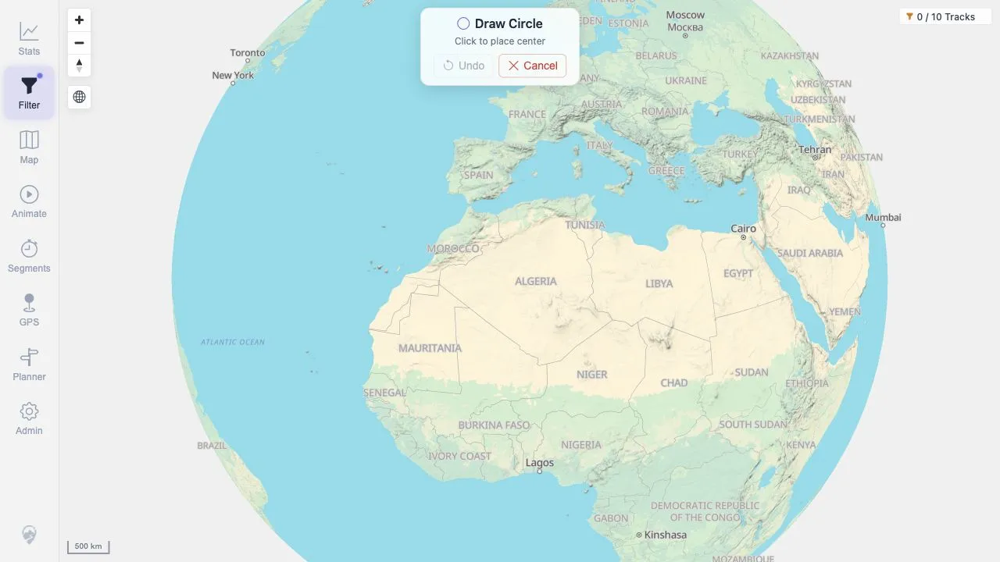</a>
<a href="assets/FLT_05-circle-drawn.webp">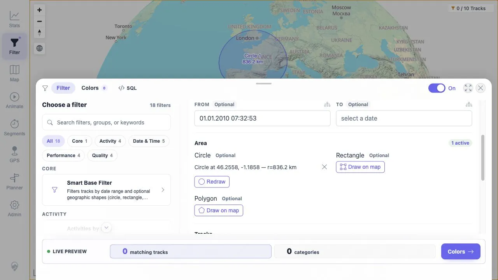</a>
<a href="assets/FLT_05-polygon-before-undo.webp">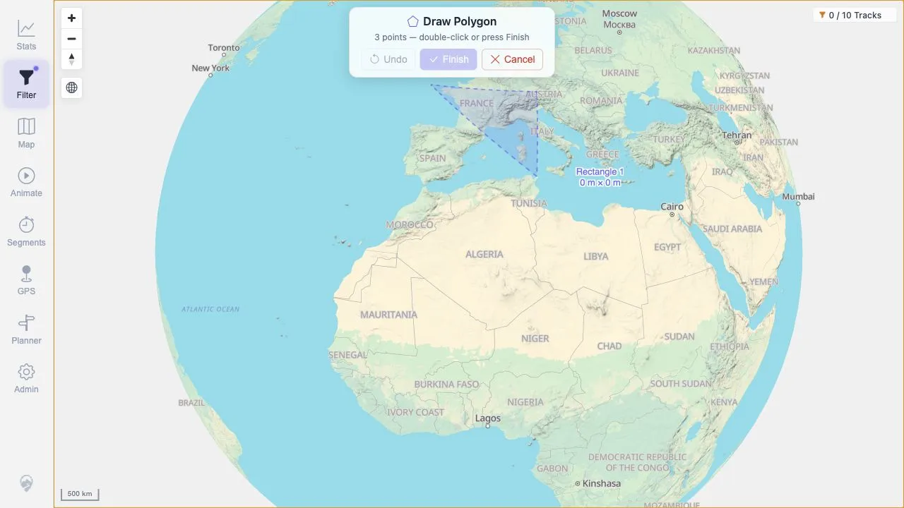</a>
<a href="assets/FLT_05-polygon-finish-attempt.webp">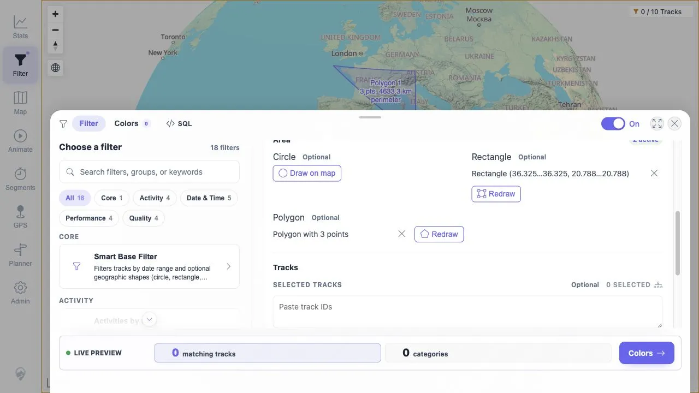</a>
<a href="assets/FLT_05-shapes-cleared.webp">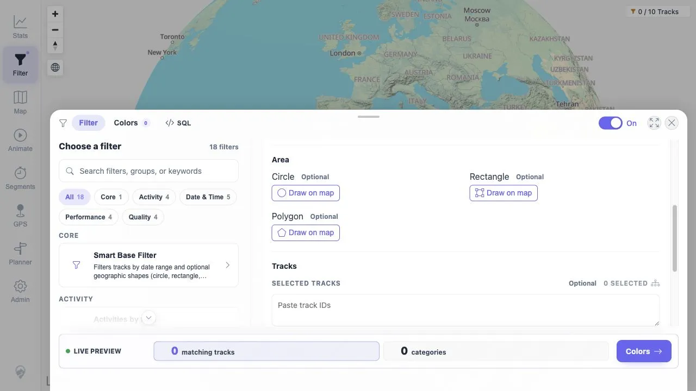</a>

<a href="assets/FLT_05-rectangle-drawn.webp">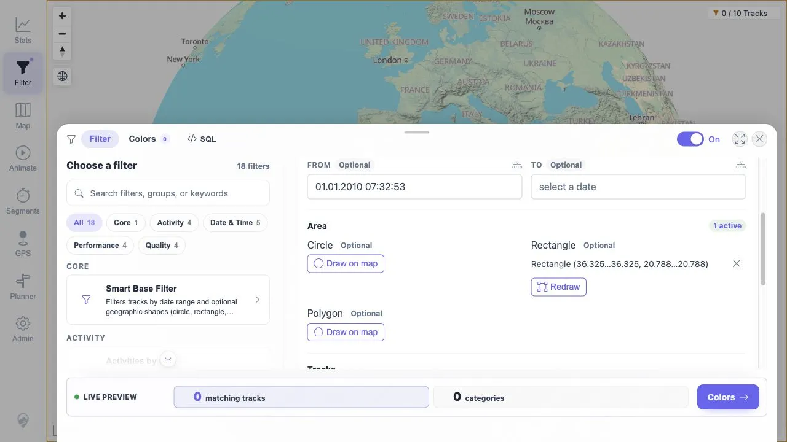</a>

### Packet FMT_01

- Packet file: [packets/FMT_01.md](packets/FMT_01.md)
- Coverage ID: `FMT_01`
- Status: **FAIL**
- Action: Tested supported-format import using `.gpx`, `.fit`, `.tcx`, `.kml`, `.kmz`, `.igc`, `.nmea`, `.geojson`, and `.gdb`; searched for an SBP sample/generator.
- Expected: Server accepts all listed formats with GPS-bearing samples, or a format is explicitly terminal with a concrete constraint.
- Actual: GPX and FIT already passed earlier. Distinct TCX, KML, IGC, GDB, and NMEA samples imported successfully. KMZ failed conversion with `Input type 'kmz' not recognized`. GeoJSON converted but produced `EMPTY_FILE` / 0 trackpoints. SBP remained blocked because no sample was found and installed GPSBabel lists SBP as read-only.

**Issues**

| ID | Severity | Summary | Evidence |
|---|---|---|---|
| FMT-01 | P2 | KMZ is listed as supported but GPSBabel conversion fails. | [assets/FMT_01-unique-format-status.txt](assets/FMT_01-unique-format-status.txt) |
| FMT-02 | P2 | GeoJSON import produces an empty track. | [assets/FMT_01-unique-format-status.txt](assets/FMT_01-unique-format-status.txt) [assets/FMT_01-unique-track-api-summary.txt](assets/FMT_01-unique-track-api-summary.txt) |
| FMT-03 | P3 | SBP positive coverage could not be completed in this run. | [assets/FMT_01-sbp-source-search.txt](assets/FMT_01-sbp-source-search.txt) [assets/FMT_01-gpsbabel-formats-head.txt](assets/FMT_01-gpsbabel-formats-head.txt) |

**Timings**

| Step | Timing |
|---|---:|
| Unique format generation/import | <5m |
| Browser/API verification | <5m |

**Handoff Notes**
- Completed: FMT_01 terminal FAIL with direct evidence for successful and failed formats.
- Remaining unfinished coverage: none for FMT_01.
- Blocked or not applicable: SBP positive sample blocked by unavailable sample/generator.
- State left for the next packet: dataset now includes prior GPX/FIT tracks plus visible TCX/IGC/GDB/NMEA format tracks; KMZ failed and GeoJSON is empty.

**Evidence**

<a href="assets/FMT_01-track-browser-unique.webp">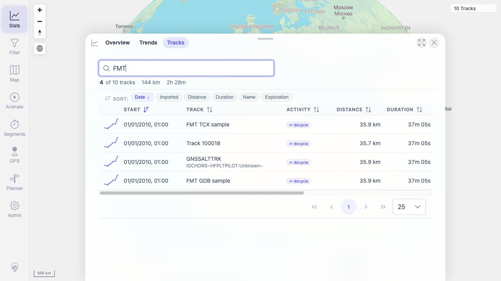</a>
<a href="assets/FMT_01-all-track-browser-after-unique.webp">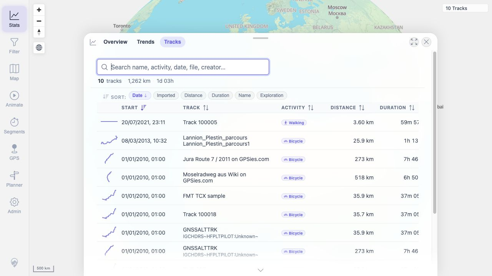</a>

**Text Evidence**
- [assets/FMT_01-unique-format-status.txt](assets/FMT_01-unique-format-status.txt) - Watcher/import status for unique format samples. (4.6 KB)

Excerpt: assets/FMT_01-unique-format-status.txt

<pre><code>app-1  | 2026-05-26T04:44:00.930Z  INFO 1 --- [watch-GPS] FileIndexerImpl              : Live watcher detected CREATE for: FMT_TCX_unique.tcx
app-1  | 2026-05-26T04:44:00.932Z  INFO 1 --- [watch-GPS] FileIndexerImpl              : Live watcher detected CREATE for: FMT_KML_unique.kml
app-1  | 2026-05-26T04:44:00.934Z  INFO 1 --- [watch-GPS] FileIndexerImpl              : Live watcher detected CREATE for: FMT_KMZ_unique.kmz
app-1  | 2026-05-26T04:44:00.935Z  INFO 1 --- [watch-GPS] FileIndexerImpl              : Live watcher detected CREATE for: FMT_IGC_unique.igc
app-1  | 2026-05-26T04:44:00.936Z  INFO 1 --- [watch-GPS] FileIndexerImpl              : Live watcher detected CREATE for: FMT_GEOJSON_unique.geojson
app-1  | 2026-05-26T04:44:00.938Z  INFO 1 --- [watch-GPS] FileIndexerImpl              : Live watcher detected CREATE for: FMT_GDB_unique.gdb
app-1  | 2026-05-26T04:44:00.940Z  INFO 1 --- [watch-GPS] FileIndexerImpl              : Live watcher detected CREATE for: FMT_NMEA_unique.nmea
app-1  | 2026-05-26T04:44:11.085Z  INFO 1 --- [idx-4] GPXStoreService              : GPS ingest timing trackId=100013 file=/FMT_TCX_unique.tcx status=SUCCESS Timing total 139ms; slowest simplified shapes 69ms, raw points 28ms, cleaned points 11ms, gpsbabel 9ms, denoise 7ms, parse XML 5ms, track row 2ms, motion/stops/events 2ms.
app-1  | 2026-05-26T04:44:11.086Z  INFO 1 --- [idx-4] GPXStoreService              : Reading of track id=100013 and path= file=FMT_TCX_unique.tcx did complete with status=SUCCESS and took processingTime=141ms
app-1  | 2026-05-26T04:44:11.201Z  INFO 1 --- [idx-4] GPXStoreService              : GPS ingest timing trackId=100014 file=/FMT_KML_unique.kml status=SUCCESS Timing total 109ms; slowest simplified shapes 44ms, parse XML 15ms, gpsbabel 11ms, raw points 10ms, cleaned points 10ms, denoise 6ms, outlier filter 4ms, delete old tracks 1ms.
app-1  | 2026-05-26T04:44:11.203Z  INFO 1 --- [idx-4] GPXStoreService              : Reading of track id=100014 and path= file=FMT_KML_unique.kml did complete with status=SUCCESS and took processingTime=112ms
app-1  | 2026-05-26T04:44:11.220Z ERROR 1 --- [idx-4] TrackFileConverterService    : GPSBabel failed (exit 1) for /app/gpx/FMT_KMZ_unique.kmz: Input type 'kmz' not recognized
app-1  | Caused by: java.io.IOException: GPSBabel conversion failed (exit 1) for /app/gpx/FMT_KMZ_unique.kmz: Input type 'kmz' not recognized
app-1  | 2026-05-26T04:44:11.409Z  INFO 1 --- [idx-4] GPXStoreService              : GPS ingest timing trackId=100015 file=/FMT_IGC_unique.igc status=SUCCESS Timing total 183ms; slowest simplified shapes 111ms, cleaned points 24ms, raw points 15ms, gpsbabel 8ms, denoise 6ms, parse XML 5ms, motion/stops/events 4ms, delete old tracks 1ms.
app-1  | 2026-05-26T04:44:11.412Z  INFO 1 --- [idx-4] GPXStoreService              : Reading of track id=100015 and path= file=FMT_IGC_unique.igc did complete with status=SUCCESS and took processingTime=186ms
app-1  | 2026-05-26T04:44:12.974Z  INFO 1 --- [idx-1] GPXReader                    : No waypoints for file=IndexedFile{id=300017, index='GPS', name='FMT_GEOJSON_unique.geojson', path=''}
app-1  | 2026-05-26T04:44:12.977Z  INFO 1 --- [idx-1] GPXStoreService              : GPS ingest timing trackId=100016 file=/FMT_GEOJSON_unique.geojson status=EMPTY_FILE Timing total 25ms; slowest gpsbabel 12ms, parse XML 4ms, delete old tracks 1ms, track row 1ms.
app-1  | 2026-05-26T04:44:12.980Z  INFO 1 --- [idx-1] GPXStoreService              : Reading of track id=100016 and path= file=FMT_GEOJSON_unique.geojson did complete with status=EMPTY_FILE and took processingTime=28ms
app-1  | 2026-05-26T04:44:13.100Z  INFO 1 --- [idx-3] GPXStoreService              : GPS ingest timing trackId=100017 file=/FMT_GDB_unique.gdb status=SUCCESS Timing total 148ms; slowest simplified shapes 57ms, raw points 32ms, gpsbabel 16ms, denoise 15ms, cleaned points 9ms, outlier filter 5ms, parse XML 3ms, delete old tracks 2ms.
app-1  | 2026-05-26T04:44:13.102Z  INFO 1 --- [idx-3] GPXStoreService              : Reading of track id=100017 and path= file=FMT_GDB_unique.gdb did complete with status=SUCCESS and took processingTime=150ms
app-1  | 2026-05-26T04:44:13.126Z  INFO 1 --- [idx-4] GPXStoreService              : GPS ingest timing trackId=100018 file=/FMT_NMEA_unique.nmea status=SUCCESS Timing total 175ms; slowest simplified shapes 58ms, gpsbabel 48ms, raw points 21ms, cleaned points 13ms, track row 11ms, motion/stops/events 8ms, denoise 4ms, delete old tracks 2ms.
app-1  | 2026-05-26T04:44:13.128Z  INFO 1 --- [idx-4] GPXStoreService              : Reading of track id=100018 and path= file=FMT_NMEA_unique.nmea did complete with status=SUCCESS and took processingTime=177ms
</code></pre>

- [assets/FMT_01-unique-track-api-summary.txt](assets/FMT_01-unique-track-api-summary.txt) - Track IDs, source filenames, point counts, and distances for FMT imports. (562 B)

Excerpt: assets/FMT_01-unique-track-api-summary.txt

<pre><code>100014	FMT_KML_unique.kml	COMPLETED_WITH_SUCCESS	Completed successfully	Path	180	31.88941
100013	FMT_TCX_unique.tcx	COMPLETED_WITH_SUCCESS	Completed successfully	FMT TCX sample	180	35.93504
100016	FMT_GEOJSON_unique.geojson	COMPLETED_WITH_SUCCESS	Completed successfully		0	null
100018	FMT_NMEA_unique.nmea	COMPLETED_WITH_SUCCESS	Completed successfully		180	35.73389
100017	FMT_GDB_unique.gdb	COMPLETED_WITH_SUCCESS	Completed successfully	FMT GDB sample	180	35.93508
100015	FMT_IGC_unique.igc	COMPLETED_WITH_SUCCESS	Completed successfully	GNSSALTTRK	180	35.93364
</code></pre>

- [assets/FMT_01-sbp-source-search.txt](assets/FMT_01-sbp-source-search.txt) - SBP sample/capability constraint summary. (443 B)

Excerpt: assets/FMT_01-sbp-source-search.txt

<pre><code>SBP sample search summary:
- No .sbp sample found in the repository or target run directories.
- Installed GPSBabel format list shows: file --r--- sbp sbp NaviGPS GT-31/BGT-31 datalogger (.sbp), so GPSBabel can read but not generate SBP.
- Focused web search found GPSBabel documentation for SBP but no directly downloadable GPS-bearing sample suitable for this regression.
Reference: https://www.gpsbabel.org/htmldoc-development/fmt_sbp.html
</code></pre>

- [assets/FMT_01-gpsbabel-formats-head.txt](assets/FMT_01-gpsbabel-formats-head.txt) - Cropped GPSBabel format capability list. (479 B)

Excerpt: assets/FMT_01-gpsbabel-formats-head.txt

<pre><code>Relevant installed GPSBabel formats:
file	--rwrw	igc		FAI/IGC Flight Recorder Data Format
file	rwrwrw	gdb	gdb	Garmin MapSource - gdb
file	r-rw--	gtrnctr	tcx/crs/hst/xml	Garmin Training Center (.tcx/.crs/.hst/.xml)
file	rwrwrw	geojson	json	GeoJson
file	rwrwrw	kml	kml	Google Earth (Keyhole) Markup Language
file	--r---	sbp	sbp	NaviGPS GT-31/BGT-31 datalogger (.sbp)
file	rwrw--	nmea		NMEA 0183 sentences

Full format listing was intentionally cropped to keep evidence under 5 KB.
</code></pre>

- [assets/FMT_01-unique-format-sources.txt](assets/FMT_01-unique-format-sources.txt) - Distinct per-format sample generation checksums. (4.8 KB)

Excerpt: assets/FMT_01-unique-format-sources.txt

<pre><code>Warning: Permanently added '178.105.173.254' (ED25519) to the list of known hosts.
 mtl-explorer-app-1 Copying /root/mtl-full-regression-2026-05-26_0606/format-source-data-unique/FMT_TCX.gpx to mtl-explorer-app-1:/tmp/FMT_TCX.gpx
 mtl-explorer-app-1 Copied /root/mtl-full-regression-2026-05-26_0606/format-source-data-unique/FMT_TCX.gpx to mtl-explorer-app-1:/tmp/FMT_TCX.gpx
 mtl-explorer-app-1 Copying /root/mtl-full-regression-2026-05-26_0606/format-source-data-unique/FMT_KML.gpx to mtl-explorer-app-1:/tmp/FMT_KML.gpx
 mtl-explorer-app-1 Copied /root/mtl-full-regression-2026-05-26_0606/format-source-data-unique/FMT_KML.gpx to mtl-explorer-app-1:/tmp/FMT_KML.gpx
 mtl-explorer-app-1 Copying /root/mtl-full-regression-2026-05-26_0606/format-source-data-unique/FMT_KMZ.gpx to mtl-explorer-app-1:/tmp/FMT_KMZ.gpx
 mtl-explorer-app-1 Copied /root/mtl-full-regression-2026-05-26_0606/format-source-data-unique/FMT_KMZ.gpx to mtl-explorer-app-1:/tmp/FMT_KMZ.gpx
 mtl-explorer-app-1 Copying /root/mtl-full-regression-2026-05-26_0606/format-source-data-unique/FMT_IGC.gpx to mtl-explorer-app-1:/tmp/FMT_IGC.gpx
 mtl-explorer-app-1 Copied /root/mtl-full-regression-2026-05-26_0606/format-source-data-unique/FMT_IGC.gpx to mtl-explorer-app-1:/tmp/FMT_IGC.gpx
 mtl-explorer-app-1 Copying /root/mtl-full-regression-2026-05-26_0606/format-source-data-unique/FMT_GEOJSON.gpx to mtl-explorer-app-1:/tmp/FMT_GEOJSON.gpx
 mtl-explorer-app-1 Copied /root/mtl-full-regression-2026-05-26_0606/format-source-data-unique/FMT_GEOJSON.gpx to mtl-explorer-app-1:/tmp/FMT_GEOJSON.gpx
 mtl-explorer-app-1 Copying /root/mtl-full-regression-2026-05-26_0606/format-source-data-unique/FMT_GDB.gpx to mtl-explorer-app-1:/tmp/FMT_GDB.gpx
 mtl-explorer-app-1 Copied /root/mtl-full-regression-2026-05-26_0606/format-source-data-unique/FMT_GDB.gpx to mtl-explorer-app-1:/tmp/FMT_GDB.gpx
 mtl-explorer-app-1 Copying mtl-explorer-app-1:/tmp/FMT_TCX.tcx to /root/mtl-full-regression-2026-05-26_0606/format-source-data-unique/FMT_TCX.tcx
 mtl-explorer-app-1 Copied mtl-explorer-app-1:/tmp/FMT_TCX.tcx to /root/mtl-full-regression-2026-05-26_0606/format-source-data-unique/FMT_TCX.tcx
FMT_TCX.tcx  86643 bytes
 mtl-explorer-app-1 Copying mtl-explorer-app-1:/tmp/FMT_KML.kml to /root/mtl-full-regression-2026-05-26_0606/format-source-data-unique/FMT_KML.kml
 mtl-explorer-app-1 Copied mtl-explorer-app-1:/tmp/FMT_KML.kml to /root/mtl-full-regression-2026-05-26_0606/format-source-data-unique/FMT_KML.kml
FMT_KML.kml  156122 bytes
 mtl-explorer-app-1 Copying mtl-explorer-app-1:/tmp/FMT_KMZ.kmz to /root/mtl-full-regression-2026-05-26_0606/format-source-data-unique/FMT_KMZ.kmz
 mtl-explorer-app-1 Copied mtl-explorer-app-1:/tmp/FMT_KMZ.kmz to /root/mtl-full-regression-2026-05-26_0606/format-source-data-unique/FMT_KMZ.kmz
FMT_KMZ.kmz  12237 bytes
 mtl-explorer-app-1 Copying mtl-explorer-app-1:/tmp/FMT_IGC.igc to /root/mtl-full-regression-2026-05-26_0606/format-source-data-unique/FMT_IGC.igc
 mtl-explorer-app-1 Copied mtl-explorer-app-1:/tmp/FMT_IGC.igc to /root/mtl-full-regression-2026-05-26_0606/format-source-data-unique/FMT_IGC.igc
FMT_IGC.igc  6802 bytes
 mtl-explorer-app-1 Copying mtl-explorer-app-1:/tmp/FMT_GEOJSON.geojson to /root/mtl-full-regression-2026-05-26_0606/format-source-data-unique/FMT_GEOJSON.geojson
 mtl-explorer-app-1 Copied mtl-explorer-app-1:/tmp/FMT_GEOJSON.geojson to /root/mtl-full-regression-2026-05-26_0606/format-source-data-unique/FMT_GEOJSON.geojson
FMT_GEOJSON.geojson  26276 bytes
 mtl-explorer-app-1 Copying mtl-explorer-app-1:/tmp/FMT_GDB.gdb to /root/mtl-full-regression-2026-05-26_0606/format-source-data-unique/FMT_GDB.gdb
 mtl-explorer-app-1 Copied mtl-explorer-app-1:/tmp/FMT_GDB.gdb to /root/mtl-full-regression-2026-05-26_0606/format-source-data-unique/FMT_GDB.gdb
FMT_GDB.gdb  4423 bytes
FMT_NMEA.nmea  24840 bytes
sha256:
309f4dbe2abf4a9cd4e2df995e26697caa0cc6e83fb755892ffe44d7a2f6bf77  /root/mtl-full-regression-2026-05-26_0606/format-source-data-unique/FMT_TCX.tcx
88c75aa2196c27369adb054ee3cc9530be64643b39bd9505f34c8bca3a4965a8  /root/mtl-full-regression-2026-05-26_0606/format-source-data-unique/FMT_KML.kml
478cac6dca4671ef91b342cfe2a56634a82aaaa9b1b378d145a38fe329415dfb  /root/mtl-full-regression-2026-05-26_0606/format-source-data-unique/FMT_KMZ.kmz
0ead3cf4890132a129d5d488fccfce5a47c9bbd86a8f0e084fda213b13da8c6f  /root/mtl-full-regression-2026-05-26_0606/format-source-data-unique/FMT_IGC.igc
a310ca17203b8c7015eedd40498542444f058b8c0fb5ff0a56090f8067084321  /root/mtl-full-regression-2026-05-26_0606/format-source-data-unique/FMT_GEOJSON.geojson
5d1c41ca8743aebc27e2df211dc47714db1b7e0598ff8680948096e20aa04bcf  /root/mtl-full-regression-2026-05-26_0606/format-source-data-unique/FMT_GDB.gdb
9972ef64b0fba2a8ccb8a2376e191ed814d15ce6d857bc8d515938be6a34145f  /root/mtl-full-regression-2026-05-26_0606/format-source-data-unique/FMT_NMEA.nmea
SSH_RC=0
</code></pre>

- [assets/FMT_01-unique-format-import.txt](assets/FMT_01-unique-format-import.txt) - Watched-folder copy of unique format samples. (2.2 KB)

Excerpt: assets/FMT_01-unique-format-import.txt

<pre><code>Warning: Permanently added '178.105.173.254' (ED25519) to the list of known hosts.
copied unique files at 2026-05-26T04:44:00Z
/root/mtl-full-regression-2026-05-26_0606/mtl-explorer/data/gpx/FMT_GDB_unique.gdb 4423 bytes
/root/mtl-full-regression-2026-05-26_0606/mtl-explorer/data/gpx/FMT_GEOJSON_unique.geojson 26276 bytes
/root/mtl-full-regression-2026-05-26_0606/mtl-explorer/data/gpx/FMT_IGC_unique.igc 6802 bytes
/root/mtl-full-regression-2026-05-26_0606/mtl-explorer/data/gpx/FMT_KML_unique.kml 156122 bytes
/root/mtl-full-regression-2026-05-26_0606/mtl-explorer/data/gpx/FMT_KMZ_unique.kmz 12237 bytes
/root/mtl-full-regression-2026-05-26_0606/mtl-explorer/data/gpx/FMT_NMEA_unique.nmea 24840 bytes
/root/mtl-full-regression-2026-05-26_0606/mtl-explorer/data/gpx/FMT_TCX_unique.tcx 86643 bytes
relevant app log lines:
app-1  | 2026-05-26T04:44:00.930Z  INFO 1 --- [watch-GPS] FileIndexerImpl              : Live watcher detected CREATE for: FMT_TCX_unique.tcx
app-1  | 2026-05-26T04:44:00.932Z  INFO 1 --- [watch-GPS] FileIndexerImpl              : Live watcher detected CREATE for: FMT_KML_unique.kml
app-1  | 2026-05-26T04:44:00.934Z  INFO 1 --- [watch-GPS] FileIndexerImpl              : Live watcher detected CREATE for: FMT_KMZ_unique.kmz
app-1  | 2026-05-26T04:44:00.935Z  INFO 1 --- [watch-GPS] FileIndexerImpl              : Live watcher detected CREATE for: FMT_IGC_unique.igc
app-1  | 2026-05-26T04:44:00.936Z  INFO 1 --- [watch-GPS] FileIndexerImpl              : Live watcher detected CREATE for: FMT_GEOJSON_unique.geojson
app-1  | 2026-05-26T04:44:00.938Z  INFO 1 --- [watch-GPS] FileIndexerImpl              : Live watcher detected CREATE for: FMT_GDB_unique.gdb
app-1  | 2026-05-26T04:44:00.940Z  INFO 1 --- [watch-GPS] FileIndexerImpl              : Live watcher detected CREATE for: FMT_NMEA_unique.nmea
app-1  | 2026-05-26T04:44:04.086Z  INFO 1 --- [http-nio-8080-exec-9] LoggingFilter                : Request for url=/mtl/api/map/status completed in dT=0 for user=mtl user_session_id=Kdx3zc9VUj status=200 method=GET
app-1  | 2026-05-26T04:44:04.356Z  INFO 1 --- [http-nio-8080-exec-1] LoggingFilter                : Request for url=/mtl/api/data-freshness completed in dT=1 for user=mtl user_session_id=Kdx3zc9VUj status=200 method=GET
</code></pre>

### Packet FMT_02

- Packet file: [packets/FMT_02.md](packets/FMT_02.md)
- Coverage ID: `FMT_02`
- Status: **FAIL**
- Action: Verified non-GPX imports across UI/API, attempted user-facing detail navigation, and downloaded original plus GPX exports for imported non-GPX tracks.
- Expected: Each tested non-GPX format is accepted, converted, visible on map/list/stats/details/charts, and supports original plus GPX download.
- Actual: TCX, IGC, GDB, and NMEA were visible in track browser/stat totals and download endpoints returned matching originals plus GPX exports with 180 `trkpt`. KML imported and download endpoints worked, but it was not visible/searchable in the track browser. GeoJSON exported GPX with 0 `trkpt`. KMZ had no imported track because conversion failed. Per-format details/charts could not be completed for every format.

**Issues**

| ID | Severity | Summary | Evidence |
|---|---|---|---|
| FMT-01 | P2 | KMZ has no per-format workflow because import fails. | [assets/FMT_01-unique-format-status.txt](assets/FMT_01-unique-format-status.txt) |
| FMT-02 | P2 | GeoJSON exports no trackpoints after import. | [assets/FMT_02-unique-download-verification.txt](assets/FMT_02-unique-download-verification.txt) [assets/FMT_01-unique-track-api-summary.txt](assets/FMT_01-unique-track-api-summary.txt) |
| FMT-04 | P2 | KML import is not user-visible in the track browser. | [assets/FMT_01-kml-search-probes.txt](assets/FMT_01-kml-search-probes.txt) [assets/FMT_01-all-track-browser-after-unique.txt](assets/FMT_01-all-track-browser-after-unique.txt) [assets/FMT_01-unique-track-api-summary.txt](assets/FMT_01-unique-track-api-summary.txt) |

**Timings**

| Step | Timing |
|---|---:|
| Format UI/API verification | <10m |

**Handoff Notes**
- Completed: FMT_02 terminal FAIL.
- Remaining unfinished coverage: none for FMT_02.
- Blocked or not applicable: browser download events unsupported; download files verified through authenticated installed-app endpoints.
- State left for the next packet: app remains running, signed-in desktop browser available, current dataset includes added format-test tracks.

**Evidence**

<a href="assets/FMT_02-tcx-detail-overview.webp">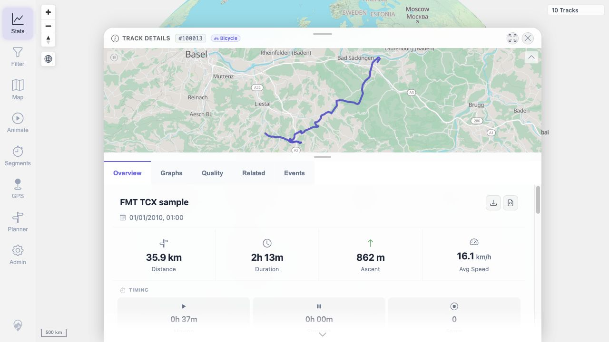</a>

**Text Evidence**
- [assets/FMT_02-unique-download-verification.txt](assets/FMT_02-unique-download-verification.txt) - Original/download-as-GPX HTTP, checksum, and trkpt checks for non-GPX imports. (312 B)

Excerpt: assets/FMT_02-unique-download-verification.txt

<pre><code>format	id	orig_http	orig_bytes	orig_sha_match	gpx_http	gpx_bytes	gpx_trkpt
tcx	100013	200	86643	yes	200	24823	180
kml	100014	200	156122	yes	200	196159	180
igc	100015	200	6802	yes	200	24740	180
gdb	100017	200	4423	yes	200	24699	180
nmea	100018	200	24840	yes	200	44688	180
geojson	100016	200	26276	yes	200	20356	0
</code></pre>

- [assets/FMT_01-all-track-browser-after-unique.txt](assets/FMT_01-all-track-browser-after-unique.txt) - Track browser row summary after unique imports. (1.7 KB)

Excerpt: assets/FMT_01-all-track-browser-after-unique.txt

<pre><code>  - strong: "10"
  - text: tracks
      - row "Start Track Activity Distance Duration Avg km/h Energy About energy Exploration Imported":
      - row "20/07/2021, 23:11 Track 100005  Walking 3.60 km 59m 57s 3.6 347 Wh 100.0% 26/05/2026, 06:25":
          - generic: Track 100005
      - row "08/03/2013, 10:32 Lannion_Plestin_parcours Lannion_Plestin_parcours1  Bicycle 25.9 km 1h 13m 21.1 198 Wh 100.0% 26/05/2026, 06:15":
          - generic: Lannion_Plestin_parcours Lannion_Plestin_parcours1
      - row "01/01/2010, 01:00 Jura Route 7 / 2011 on GPSies.com  Bicycle 273 km 7h 46m 35.1 1808 Wh 100.0% 26/05/2026, 06:15":
          - generic: Jura Route 7 / 2011 on GPSies.com
      - row "01/01/2010, 01:00 Moselradweg aus Wiki on GPSies.com  Bicycle 518 km 6h 50m 75.7 1616 Wh 100.0% 26/05/2026, 06:15":
          - generic: Moselradweg aus Wiki on GPSies.com
      - row "01/01/2010, 01:00 FMT TCX sample  Bicycle 35.9 km 37m 05s 58.1 243 Wh  26/05/2026, 06:44":
          - generic: FMT TCX sample
      - row "01/01/2010, 01:00 Track 100018  Bicycle 35.7 km 37m 05s 57.8 307 Wh  26/05/2026, 06:44":
          - generic: Track 100018
      - row "01/01/2010, 01:00 GNSSALTTRK IGCHDRS~HFPLTPILOT:Unknown~  Bicycle 35.9 km 37m 05s 58.1 243 Wh  26/05/2026, 06:44":
          - generic: GNSSALTTRK
      - row "01/01/2010, 01:00 GNSSALTTRK IGCHDRS~HFPLTPILOT:Unknown~  Bicycle 273 km 7h 46m 35.1 1808 Wh 100.0% 26/05/2026, 06:31":
          - generic: GNSSALTTRK
      - row "01/01/2010, 01:00 FMT GDB sample  Bicycle 35.9 km 37m 05s 58.1 243 Wh  26/05/2026, 06:44":
          - generic: FMT GDB sample
      - row "01/01/2010, 01:00 Track 100012  Bicycle 24.2 km 16m 15s 89.4 240 Wh 100.0% 26/05/2026, 06:33":
          - generic: Track 100012
</code></pre>

- [assets/FMT_01-kml-search-probes.txt](assets/FMT_01-kml-search-probes.txt) - KML search probes showing no visible track result. (581 B)

Excerpt: assets/FMT_01-kml-search-probes.txt

<pre><code>TERM 100014
  - strong: "0"
      - row "No tracks match “100014”":
        - cell "No tracks match “100014”"
TERM KML
  - strong: "0"
      - row "No tracks match “KML”":
        - cell "No tracks match “KML”"
TERM FMT_KML
  - strong: "0"
      - row "No tracks match “FMT_KML”":
        - cell "No tracks match “FMT_KML”"
TERM FMT KML
  - strong: "0"
      - row "No tracks match “FMT KML”":
        - cell "No tracks match “FMT KML”"
TERM Path
  - strong: "0"
      - row "No tracks match “Path”":
        - cell "No tracks match “Path”"
</code></pre>

- [assets/FMT_02-tcx-detail-overview.txt](assets/FMT_02-tcx-detail-overview.txt) - Detail-navigation attempt note for format row. (402 B)

Excerpt: assets/FMT_02-tcx-detail-overview.txt

<pre><code>Attempted user-facing detail navigation from the `FMT TCX sample` row in the Tracks tab.
Result: the click left the Tracks table visible; no detail panel opened from this row interaction in the captured browser state.
This is recorded as part of the FMT_02 failure because per-format details/charts could not be verified for every non-GPX format.
See screenshot: assets/FMT_02-tcx-detail-overview.webp
</code></pre>

- [assets/FMT_01-unique-format-status.txt](assets/FMT_01-unique-format-status.txt) (4.6 KB)

Excerpt: assets/FMT_01-unique-format-status.txt

<pre><code>app-1  | 2026-05-26T04:44:00.930Z  INFO 1 --- [watch-GPS] FileIndexerImpl              : Live watcher detected CREATE for: FMT_TCX_unique.tcx
app-1  | 2026-05-26T04:44:00.932Z  INFO 1 --- [watch-GPS] FileIndexerImpl              : Live watcher detected CREATE for: FMT_KML_unique.kml
app-1  | 2026-05-26T04:44:00.934Z  INFO 1 --- [watch-GPS] FileIndexerImpl              : Live watcher detected CREATE for: FMT_KMZ_unique.kmz
app-1  | 2026-05-26T04:44:00.935Z  INFO 1 --- [watch-GPS] FileIndexerImpl              : Live watcher detected CREATE for: FMT_IGC_unique.igc
app-1  | 2026-05-26T04:44:00.936Z  INFO 1 --- [watch-GPS] FileIndexerImpl              : Live watcher detected CREATE for: FMT_GEOJSON_unique.geojson
app-1  | 2026-05-26T04:44:00.938Z  INFO 1 --- [watch-GPS] FileIndexerImpl              : Live watcher detected CREATE for: FMT_GDB_unique.gdb
app-1  | 2026-05-26T04:44:00.940Z  INFO 1 --- [watch-GPS] FileIndexerImpl              : Live watcher detected CREATE for: FMT_NMEA_unique.nmea
app-1  | 2026-05-26T04:44:11.085Z  INFO 1 --- [idx-4] GPXStoreService              : GPS ingest timing trackId=100013 file=/FMT_TCX_unique.tcx status=SUCCESS Timing total 139ms; slowest simplified shapes 69ms, raw points 28ms, cleaned points 11ms, gpsbabel 9ms, denoise 7ms, parse XML 5ms, track row 2ms, motion/stops/events 2ms.
app-1  | 2026-05-26T04:44:11.086Z  INFO 1 --- [idx-4] GPXStoreService              : Reading of track id=100013 and path= file=FMT_TCX_unique.tcx did complete with status=SUCCESS and took processingTime=141ms
app-1  | 2026-05-26T04:44:11.201Z  INFO 1 --- [idx-4] GPXStoreService              : GPS ingest timing trackId=100014 file=/FMT_KML_unique.kml status=SUCCESS Timing total 109ms; slowest simplified shapes 44ms, parse XML 15ms, gpsbabel 11ms, raw points 10ms, cleaned points 10ms, denoise 6ms, outlier filter 4ms, delete old tracks 1ms.
app-1  | 2026-05-26T04:44:11.203Z  INFO 1 --- [idx-4] GPXStoreService              : Reading of track id=100014 and path= file=FMT_KML_unique.kml did complete with status=SUCCESS and took processingTime=112ms
app-1  | 2026-05-26T04:44:11.220Z ERROR 1 --- [idx-4] TrackFileConverterService    : GPSBabel failed (exit 1) for /app/gpx/FMT_KMZ_unique.kmz: Input type 'kmz' not recognized
app-1  | Caused by: java.io.IOException: GPSBabel conversion failed (exit 1) for /app/gpx/FMT_KMZ_unique.kmz: Input type 'kmz' not recognized
app-1  | 2026-05-26T04:44:11.409Z  INFO 1 --- [idx-4] GPXStoreService              : GPS ingest timing trackId=100015 file=/FMT_IGC_unique.igc status=SUCCESS Timing total 183ms; slowest simplified shapes 111ms, cleaned points 24ms, raw points 15ms, gpsbabel 8ms, denoise 6ms, parse XML 5ms, motion/stops/events 4ms, delete old tracks 1ms.
app-1  | 2026-05-26T04:44:11.412Z  INFO 1 --- [idx-4] GPXStoreService              : Reading of track id=100015 and path= file=FMT_IGC_unique.igc did complete with status=SUCCESS and took processingTime=186ms
app-1  | 2026-05-26T04:44:12.974Z  INFO 1 --- [idx-1] GPXReader                    : No waypoints for file=IndexedFile{id=300017, index='GPS', name='FMT_GEOJSON_unique.geojson', path=''}
app-1  | 2026-05-26T04:44:12.977Z  INFO 1 --- [idx-1] GPXStoreService              : GPS ingest timing trackId=100016 file=/FMT_GEOJSON_unique.geojson status=EMPTY_FILE Timing total 25ms; slowest gpsbabel 12ms, parse XML 4ms, delete old tracks 1ms, track row 1ms.
app-1  | 2026-05-26T04:44:12.980Z  INFO 1 --- [idx-1] GPXStoreService              : Reading of track id=100016 and path= file=FMT_GEOJSON_unique.geojson did complete with status=EMPTY_FILE and took processingTime=28ms
app-1  | 2026-05-26T04:44:13.100Z  INFO 1 --- [idx-3] GPXStoreService              : GPS ingest timing trackId=100017 file=/FMT_GDB_unique.gdb status=SUCCESS Timing total 148ms; slowest simplified shapes 57ms, raw points 32ms, gpsbabel 16ms, denoise 15ms, cleaned points 9ms, outlier filter 5ms, parse XML 3ms, delete old tracks 2ms.
app-1  | 2026-05-26T04:44:13.102Z  INFO 1 --- [idx-3] GPXStoreService              : Reading of track id=100017 and path= file=FMT_GDB_unique.gdb did complete with status=SUCCESS and took processingTime=150ms
app-1  | 2026-05-26T04:44:13.126Z  INFO 1 --- [idx-4] GPXStoreService              : GPS ingest timing trackId=100018 file=/FMT_NMEA_unique.nmea status=SUCCESS Timing total 175ms; slowest simplified shapes 58ms, gpsbabel 48ms, raw points 21ms, cleaned points 13ms, track row 11ms, motion/stops/events 8ms, denoise 4ms, delete old tracks 2ms.
app-1  | 2026-05-26T04:44:13.128Z  INFO 1 --- [idx-4] GPXStoreService              : Reading of track id=100018 and path= file=FMT_NMEA_unique.nmea did complete with status=SUCCESS and took processingTime=177ms
</code></pre>

- [assets/FMT_01-unique-track-api-summary.txt](assets/FMT_01-unique-track-api-summary.txt) (562 B)

Excerpt: assets/FMT_01-unique-track-api-summary.txt

<pre><code>100014	FMT_KML_unique.kml	COMPLETED_WITH_SUCCESS	Completed successfully	Path	180	31.88941
100013	FMT_TCX_unique.tcx	COMPLETED_WITH_SUCCESS	Completed successfully	FMT TCX sample	180	35.93504
100016	FMT_GEOJSON_unique.geojson	COMPLETED_WITH_SUCCESS	Completed successfully		0	null
100018	FMT_NMEA_unique.nmea	COMPLETED_WITH_SUCCESS	Completed successfully		180	35.73389
100017	FMT_GDB_unique.gdb	COMPLETED_WITH_SUCCESS	Completed successfully	FMT GDB sample	180	35.93508
100015	FMT_IGC_unique.igc	COMPLETED_WITH_SUCCESS	Completed successfully	GNSSALTTRK	180	35.93364
</code></pre>

**Referenced But Not Found**
- assets/FMT_02-unique-*-original.*
- assets/FMT_02-unique-*-export.gpx

### Packet LOC_02

- Packet file: [packets/LOC_02.md](packets/LOC_02.md)
- Coverage ID: `LOC_02`
- Status: **FAIL**
- Action: Changed format locale from en-GB to de-DE, then inspected Settings preview and Stats overview/recent activity.
- Expected: Changing locale updates formatting across the app without reload artifacts.
- Actual: Settings preview, dates, and grouped values updated immediately to de-DE style, but decimal unit values such as `94.26 m`, `3.60 km`, and `72.5 km/h` kept period decimal separators instead of de-DE comma separators.

**Issues**

| ID | Severity | Summary | Evidence |
|---|---|---|---|
| LOC-01 | P2 | Locale switch does not update decimal-unit formatting on some Stats values. | [assets/LOC_02-locale-switch.txt](assets/LOC_02-locale-switch.txt) |

**Timings**

| Step | Timing |
|---|---:|
| Locale switch and Stats inspection | <3 min |

**Handoff Notes**
- Completed: LOC_02 terminal `FAIL`.
- Remaining unfinished coverage: LOC_03 through RUN_CLEANUP.
- Blocked or not applicable: None.
- State left for the next packet: de-DE locale selected for persistence check.

**Evidence**

**Text Evidence**
- [assets/LOC_02-locale-switch.txt](assets/LOC_02-locale-switch.txt) - Locale switch observations and formatting mismatch. (1.1 KB)

Excerpt: assets/LOC_02-locale-switch.txt

<pre><code>LOC_02 locale switch evidence

Initial locale:
- en-GB (31/12/2025, 1,234.56)
- Preview before switch: 26/05/2026 ... 12,345.67

Changed locale:
- Selected de-DE (31.12.2025, 1.234,56) from Admin -&gt; Settings -&gt; Format locale.
- Settings preview updated immediately to: 26.05.2026 11:05:55 - 12.345,67
- Settings still reported browser auto-detected locale as en-GB.

Stats surface after switch:
- Summary distance updated to de-DE grouping: 1.262 km
- Summary energy updated to de-DE grouping: 7.054 Wh
- Dates updated to de-DE date order/separators: 26.05.2026, 11:20 and 20.07.2021, 23:11
- Milestone range updated to: 01.01.2010 - 26.05.2026

Formatting gap observed after switch:
- Decimal distances still used period separators: 94.26 m, 15.69 m, 191.13 m, 3.60 km, 25.9 km
- Decimal speed still used a period separator: 72.5 km/h
- Under de-DE these values should use comma decimal separators.

Result: FAIL. Changing locale updates Settings, dates, and grouped integer-like values without a reload, but decimal unit values on Stats/Recent Activity remain in en-style formatting.
</code></pre>

### Packet MAP_02

- Packet file: [packets/MAP_02.md](packets/MAP_02.md)
- Coverage ID: `MAP_02`
- Status: **FAIL**
- Action: Compared map-visible track count against indexed tracks with point data after imports.
- Expected: All tracks appear on the map and the visible/total count is correct.
- Actual: UI showed 10 tracks, but the installed-app API listed 14 tracks with point data after imports, including valid TCX/KML/GDB entries not represented in the visible count/list.

**Issues**

| ID | Severity | Summary | Evidence |
|---|---|---|---|
| MAP-01 | P2 | Valid indexed tracks are omitted from the map/list visible count. | [assets/MAP_02-api-valid-track-count.txt](assets/MAP_02-api-valid-track-count.txt) [assets/SGN_02-valid-login-map.webp](assets/SGN_02-valid-login-map.webp) |

**Timings**

| Step | Timing |
|---|---:|
| Count comparison | <1m |

**Handoff Notes**
- Completed: MAP_02 terminal FAIL.
- Remaining unfinished coverage: continue with MAP_03.
- Blocked or not applicable: none.
- State left for the next packet: no data changed.

**Evidence**

**Text Evidence**
- [assets/MAP_02-api-valid-track-count.txt](assets/MAP_02-api-valid-track-count.txt) - API count of point-bearing indexed tracks. (701 B)

Excerpt: assets/MAP_02-api-valid-track-count.txt

<pre><code>valid_point_tracks=14
100012	JuraRoute72011.nmea		120
100002	MoselradwegAusWiki.gpx	Moselradweg aus Wiki on GPSies.com	2949
100014	FMT_KML_unique.kml	Path	180
100013	FMT_TCX_unique.tcx	FMT TCX sample	180
100018	FMT_NMEA_unique.nmea		180
100008	JuraRoute72011.igc	GNSSALTTRK	1409
100017	FMT_GDB_unique.gdb	FMT GDB sample	180
100003	Lannion_Plestin_parcours24.4RE.gpx	Lannion_Plestin_parcours Lannion_Plestin_parcours1	381
100015	FMT_IGC_unique.igc	GNSSALTTRK	180
100005	Activity.fit		3600
100001	JuraRoute72011.gpx	Jura Route 7 / 2011 on GPSies.com	1409
100007	JuraRoute72011.kml	Path	1414
100006	JuraRoute72011.tcx	Jura Route 7 / 	1409
100010	JuraRoute72011.gdb	Jura Route 7 / 2011 on GPSies.com	1409
</code></pre>

- [assets/FMT_01-all-track-browser-after-unique.txt](assets/FMT_01-all-track-browser-after-unique.txt) - Track browser rows showing 10 visible rows. (1.7 KB)

Excerpt: assets/FMT_01-all-track-browser-after-unique.txt

<pre><code>  - strong: "10"
  - text: tracks
      - row "Start Track Activity Distance Duration Avg km/h Energy About energy Exploration Imported":
      - row "20/07/2021, 23:11 Track 100005  Walking 3.60 km 59m 57s 3.6 347 Wh 100.0% 26/05/2026, 06:25":
          - generic: Track 100005
      - row "08/03/2013, 10:32 Lannion_Plestin_parcours Lannion_Plestin_parcours1  Bicycle 25.9 km 1h 13m 21.1 198 Wh 100.0% 26/05/2026, 06:15":
          - generic: Lannion_Plestin_parcours Lannion_Plestin_parcours1
      - row "01/01/2010, 01:00 Jura Route 7 / 2011 on GPSies.com  Bicycle 273 km 7h 46m 35.1 1808 Wh 100.0% 26/05/2026, 06:15":
          - generic: Jura Route 7 / 2011 on GPSies.com
      - row "01/01/2010, 01:00 Moselradweg aus Wiki on GPSies.com  Bicycle 518 km 6h 50m 75.7 1616 Wh 100.0% 26/05/2026, 06:15":
          - generic: Moselradweg aus Wiki on GPSies.com
      - row "01/01/2010, 01:00 FMT TCX sample  Bicycle 35.9 km 37m 05s 58.1 243 Wh  26/05/2026, 06:44":
          - generic: FMT TCX sample
      - row "01/01/2010, 01:00 Track 100018  Bicycle 35.7 km 37m 05s 57.8 307 Wh  26/05/2026, 06:44":
          - generic: Track 100018
      - row "01/01/2010, 01:00 GNSSALTTRK IGCHDRS~HFPLTPILOT:Unknown~  Bicycle 35.9 km 37m 05s 58.1 243 Wh  26/05/2026, 06:44":
          - generic: GNSSALTTRK
      - row "01/01/2010, 01:00 GNSSALTTRK IGCHDRS~HFPLTPILOT:Unknown~  Bicycle 273 km 7h 46m 35.1 1808 Wh 100.0% 26/05/2026, 06:31":
          - generic: GNSSALTTRK
      - row "01/01/2010, 01:00 FMT GDB sample  Bicycle 35.9 km 37m 05s 58.1 243 Wh  26/05/2026, 06:44":
          - generic: FMT GDB sample
      - row "01/01/2010, 01:00 Track 100012  Bicycle 24.2 km 16m 15s 89.4 240 Wh 100.0% 26/05/2026, 06:33":
          - generic: Track 100012
</code></pre>

### Packet MAP_11

- Packet file: [packets/MAP_11.md](packets/MAP_11.md)
- Coverage ID: `MAP_11`
- Status: **FAIL**
- Action: Opened track #100001 from the map and clicked multiple visible line/point locations in the detail map.
- Expected: Clicking a point on a track shows a popup with metrics such as time, speed, and elevation.
- Actual: Track details and aggregate metrics were visible, but no point popup appeared after multiple line/point clicks.

**Issues**

| ID | Severity | Summary | Evidence |
|---|---|---|---|
| MAP-02 | P3 | Track point clicks do not expose a point metrics popup in the tested detail map. | [assets/MAP_11-point-popup-retry.webp](assets/MAP_11-point-popup-retry.webp) [assets/MAP_11-point-popup-retry.txt](assets/MAP_11-point-popup-retry.txt) |

**Timings**

| Step | Timing |
|---|---:|
| Point popup attempts | <2m |

**Handoff Notes**
- Completed: MAP_11 terminal FAIL.
- Remaining unfinished coverage: continue with MAP_12.
- Blocked or not applicable: none.
- State left for the next packet: track detail remained open in the in-app browser; no data changed.

**Evidence**

<a href="assets/MAP_11-selected-track-detail.webp">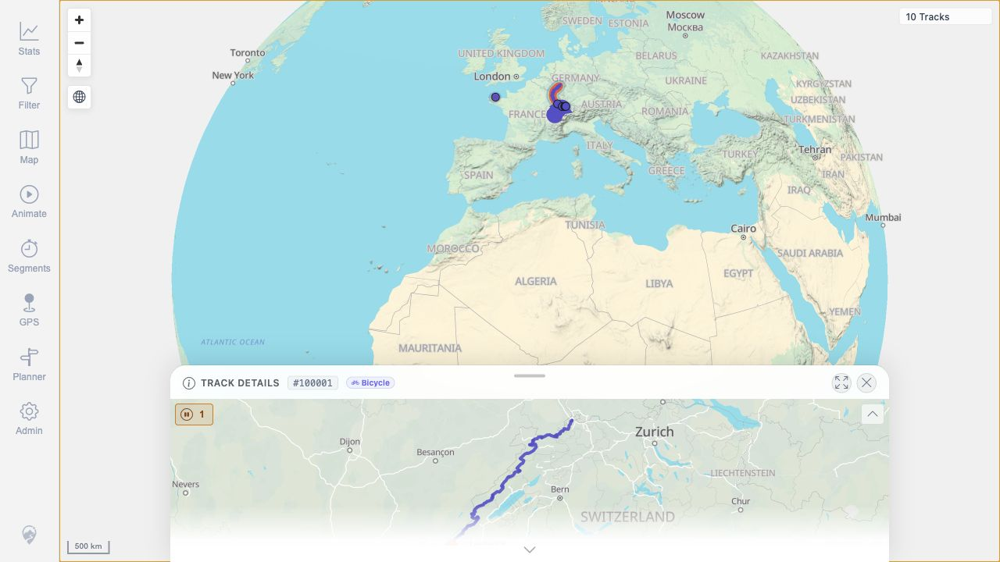</a>
<a href="assets/MAP_11-point-popup.webp">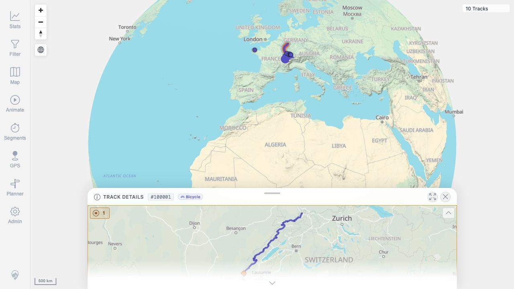</a>

<a href="assets/MAP_11-selection-before-point.webp">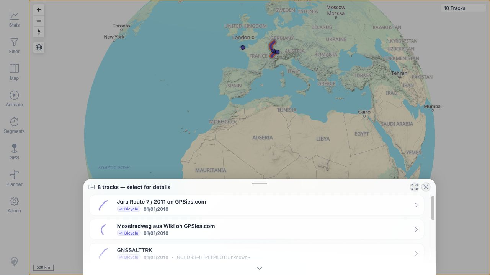</a>

**Text Evidence**
- [assets/MAP_11-point-popup-retry.txt](assets/MAP_11-point-popup-retry.txt) - Popup detection summary. (4.0 KB)

Excerpt: assets/MAP_11-point-popup-retry.txt

<pre><code>contains_popup_metrics=true
excerpt=- region "Map"
- region "Map"
- button "Zoom in"
- button "Zoom out"
- button "Drag to rotate map, click to reset north"
- button "Toggle globe mode":
  - generic: 
- generic: 500 km
- generic: 10 Tracks
- button " Stats":
  - generic: 
  - generic: Stats
- button " Filter":
  - generic: 
  - generic: Filter
- button " Map":
  - generic: 
  - generic: Map
- button " Animate":
  - generic: 
  - generic: Animate
- button " Segments":
  - generic: 
  - generic: Segments
- button " GPS":
  - generic: 
  - generic: GPS
- button " Planner":
  - generic: 
  - generic: Planner
- button " Admin":
  - generic: 
  - generic: Admin
- button "About MTL Explorer"
- generic: 
- generic: Track Details
- generic: "#100001"
- generic: 
- generic: Bicycle
- button "Fullscreen":
  - generic: 
- button "Close":
  - generic: 
- region "Map" [active]
- button "Collapse map":
  - generic: 
- button "Toggle track events":
  - generic: 
  - generic: "1"
- generic "Drag to resize"
- tablist:
  - tab "Overview" [selected]
  - tab "Graphs"
  - tab "Quality"
  - tab "Related"
  - tab "Events"
- tabpanel "Overview":
  - generic: Jura Route 7 / 2011 on GPSies.com
  - button "Download original":
    - generic: 
  - generic: 
  - text: 01/01/2010, 01:00
  - generic: 
  - generic: 273 km
  - generic: Distance
  - generic: 
  - generic: 16h 55m
  - generic: Duration
  - generic: 
  - generic: 6324 m
  - generic: Ascent
  - generic: 
  - generic: 16.2 km/h
  - generic: Avg Speed
  - generic: 
  - text: Timing
  - generic: 
  - generic: 7h 46m
  - generic: Moving
... [truncated in this report; open linked file for full evidence]</code></pre>

### Packet MCT_04

- Packet file: [packets/MCT_04.md](packets/MCT_04.md)
- Coverage ID: `MCT_04`
- Status: **FAIL**
- Action: Opened Segment Analyzer over the Jura route, placed A/B zones, increased radius to 13,000 m to include the shared Jura segment, analyzed 3 shared tracks, selected all results, and opened Compare.
- Expected: Segment comparison for several tracks shows comparison charts and a map aligned to the selected segment, including tracks with missing data.
- Actual: Analyzer found 3/3 tracks (`JuraRoute72011.gpx`, `.igc`, `.nmea`) and Compare opened with racer cards plus speed/altitude charts. The required comparison mini-map did not render as a usable map: the MapLibre canvas existed but its `.sc-minimap`/wrapper height was `0`/collapsed, leaving no visible segment map to verify alignment.

**Issues**

| ID | Severity | Summary | Evidence |
|---|---|---|---|
| MCT-01 | P2 | Segment comparison mini-map collapses while charts render. | [assets/MCT_04-compare-top.webp](assets/MCT_04-compare-top.webp) [assets/MCT_04-canvas-bounds.txt](assets/MCT_04-canvas-bounds.txt) |

**Timings**

| Step | Timing |
|---|---:|
| Segment comparison setup and verification | <15m |

**Handoff Notes**
- Completed: MCT_04 terminal FAIL with issue MCT-01.
- Remaining unfinished coverage: continue with MCT_05.
- Blocked or not applicable: none.
- State left for the next packet: Segment Analyzer Compare overlay open for the A-B Jura segment with 3 selected tracks.

**Evidence**

<a href="assets/MCT_04-compare-top.webp">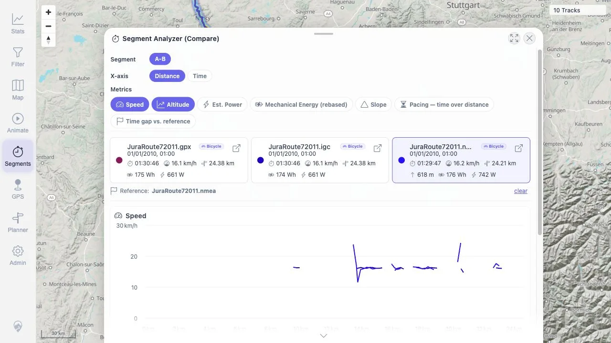</a>
<a href="assets/MCT_04-compare-charts.webp">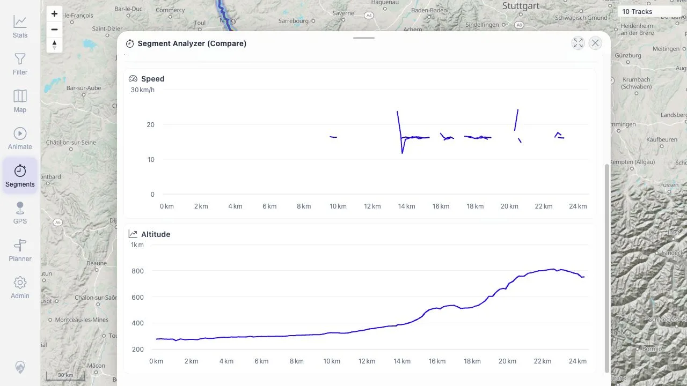</a>

**Text Evidence**
- [assets/MCT_04-canvas-bounds.txt](assets/MCT_04-canvas-bounds.txt) - Canvas/wrapper bounds showing collapsed comparison mini-map. (967 B)

Excerpt: assets/MCT_04-canvas-bounds.txt

<pre><code>[
  {
    "canvas": {
      "h": 720,
      "w": 1204,
      "x": 76,
      "y": 0
    },
    "i": 0,
    "wrapper": {
      "h": 720,
      "w": 1204,
      "x": 76,
      "y": 0
    },
    "wrapperClass": "map-base maplibregl-map"
  },
  {
    "canvas": {
      "h": 720,
      "w": 1204,
      "x": 76,
      "y": 0
    },
    "i": 1,
    "wrapper": {
      "h": 720,
      "w": 1204,
      "x": 76,
      "y": 0
    },
    "wrapperClass": "map-overlay maplibregl-map"
  },
  {
    "canvas": {
      "h": 300,
      "w": 879,
      "x": 231,
      "y": 421.4375
    },
    "i": 2,
    "wrapper": {
      "h": 0,
      "w": 879,
      "x": 231,
      "y": 421.4375
    },
    "wrapperClass": "container sc-minimap"
  },
  {
    "canvas": {
      "h": 260,
      "w": 881,
      "x": 230,
      "y": 820.875
    },
    "i": 3,
    "wrapper": {
      "h": 260,
      "w": 881,
      "x": 230,
      "y": 820.875
    },
    "wrapperClass": "container vr-minimap"
  }
]</code></pre>

### Packet MED_05

- Packet file: [packets/MED_05.md](packets/MED_05.md)
- Coverage ID: `MED_05`
- Status: **FAIL**
- Action: Indexed a fresh duplicate JPEG as `MED_BROKEN_AFTER_INDEX.jpg`, corrupted it after indexing, refreshed map data, and opened it from the media layer preview.
- Expected: A missing/broken photo shows a recoverable error state instead of a blank sheet.
- Actual: Preview opened, but the main media area was blank except for a broken-image icon/alt text. No retry/actionable error message appeared. The content endpoint returned `HTTP 200` with `Content-Type: image/jpeg` and a 0-byte body.

**Issues**

| ID | Severity | Summary | Evidence |
|---|---|---|---|
| MED-01 | P2 | Broken media renders as a blank/broken image instead of a recoverable error. | [assets/MED_05-broken-preview.webp](assets/MED_05-broken-preview.webp) [assets/MED_05-broken-media.txt](assets/MED_05-broken-media.txt) |

**Timings**

| Step | Timing |
|---|---:|
| Create/index/corrupt media and verify UI | ~8 min |

**Handoff Notes**
- Completed: MED_05 with FAIL.
- Remaining unfinished coverage: HMO_01 onward.
- Blocked or not applicable: None.
- State left for the next packet: Disposable media `MED_BROKEN_AFTER_INDEX.jpg` remains corrupted and indexed as media ID 400003; media preview is open on the broken item.

**Evidence**

**Text Evidence**
- [assets/MED_05-broken-media.txt](assets/MED_05-broken-media.txt) - Setup, endpoint response, and UI observation for the broken media test. (931 B)

Excerpt: assets/MED_05-broken-media.txt

<pre><code>Broken media setup and evidence for MED_05.

Setup:
- Restored original MED_JPEG_02_DSCN0010_COPY.jpg from backup.
- Created valid duplicate data/media/full-regression-media/MED_BROKEN_AFTER_INDEX.jpg.
- Ran MEDIA rescan.
- New indexed media: {"id":400003,"name":"MED_BROKEN_AFTER_INDEX.jpg","lat":11.88512667,"lng":43.46744833}
- Replaced MED_BROKEN_AFTER_INDEX.jpg with invalid text bytes after indexing.

Endpoint check:
GET /api/media/get/400003/content?maxSize=4096
HTTP/1.1 200
Content-Type: image/jpeg
ETag: "media-400003-44-1779779616369-original-s4096"
Response body size: 0 bytes
file: empty

UI observation:
- Photos &amp; Media layer showed Arezzo cluster "3".
- Clicking the expanded point opened media preview at 3 / 3 for MED_BROKEN_AFTER_INDEX.jpg.
- Preview body showed a blank/broken image area with the filename alt text.
- No actionable error message, retry action, or dismissable recoverable error state appeared.
</code></pre>

### Packet PLN_03

- Packet file: [packets/PLN_03.md](packets/PLN_03.md)
- Coverage ID: `PLN_03`
- Status: **FAIL**
- Action: Tried dragging the existing route leg to a new point; then cleared/rebuilt a visible one-leg route and retried dragging the visible route line.
- Expected: Dragging an existing route leg inserts a waypoint and recomputes route with multiple legs.
- Actual: Dragging the leg panned/shifted the map or left the route unchanged; the route stayed at 1 leg with unchanged stats after retry.

**Issues**

| ID | Severity | Summary | Evidence |
|---|---|---|---|
| PLN-01 | P2 | Dragging an existing planner route leg did not insert a waypoint. | [assets/PLN_03-route-drag-retry.webp](assets/PLN_03-route-drag-retry.webp) |

**Timings**

| Step | Timing |
|---|---:|
| Route insertion attempts | <10m |

**Handoff Notes**
- Completed: PLN_03 terminal FAIL; issue PLN-01 recorded.
- Remaining unfinished coverage: continue with PLN_04.
- Blocked or not applicable: none.
- State left for the next packet: unsaved one-leg planner route remains active.

**Evidence**

<a href="assets/PLN_03-route-rebuilt.webp">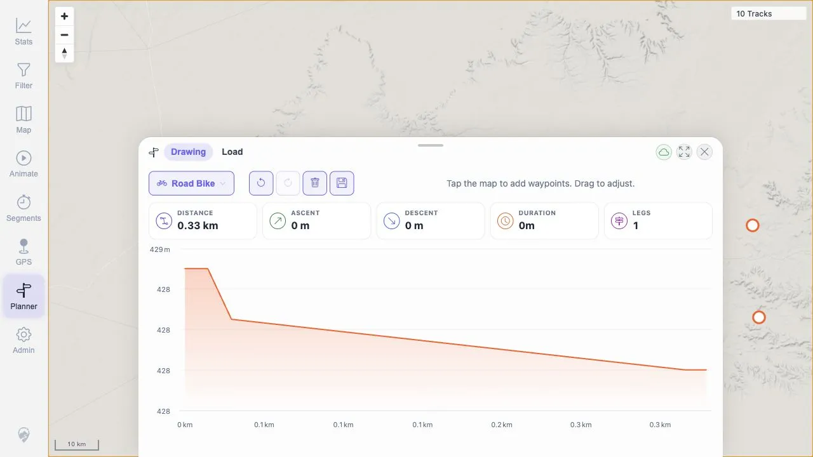</a>
<a href="assets/PLN_03-route-drag-retry.webp">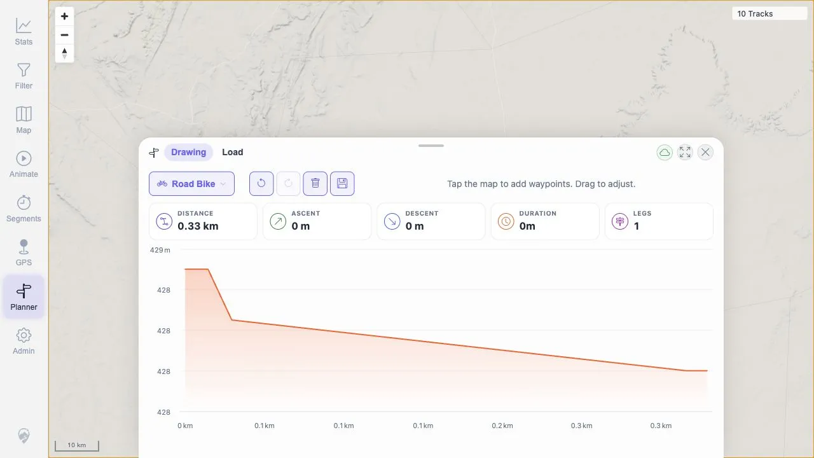</a>
<a href="assets/PLN_03-sheet-drag-attempt.webp">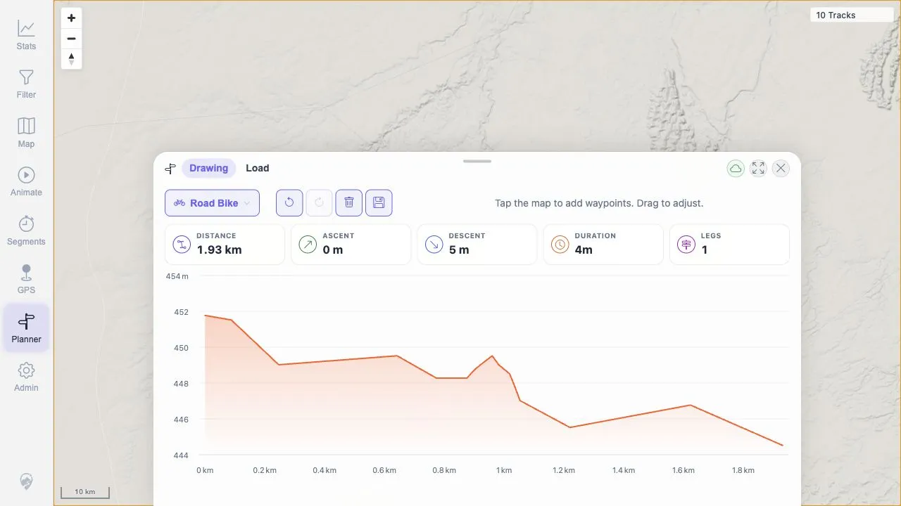</a>
<a href="assets/PLN_03-sheet-closed.webp">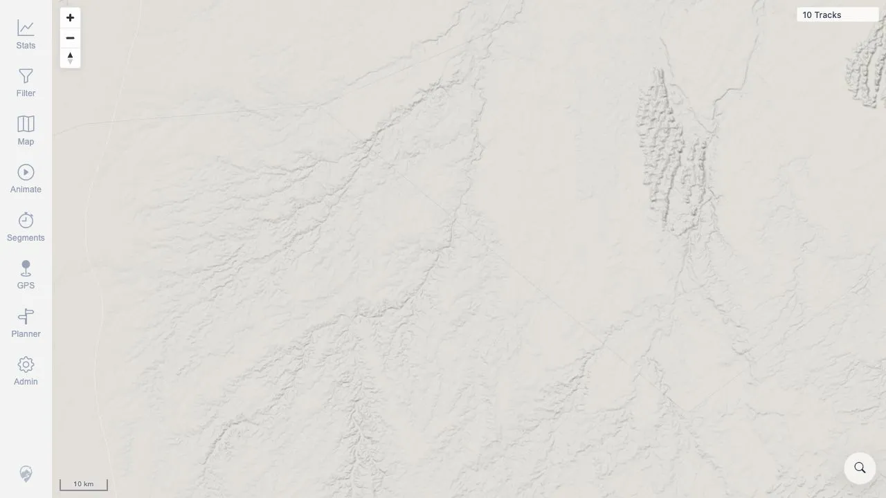</a>
<a href="assets/PLN_03-planner-reopened.webp">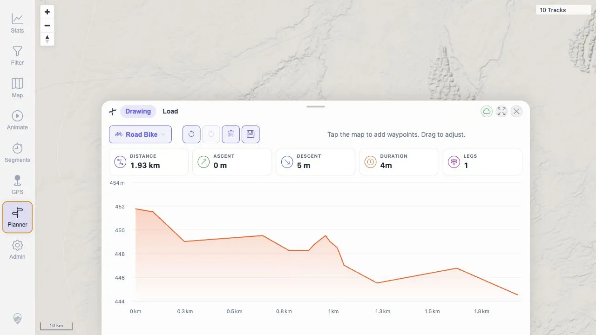</a>
<a href="assets/PLN_03-pan-reveal-route.webp">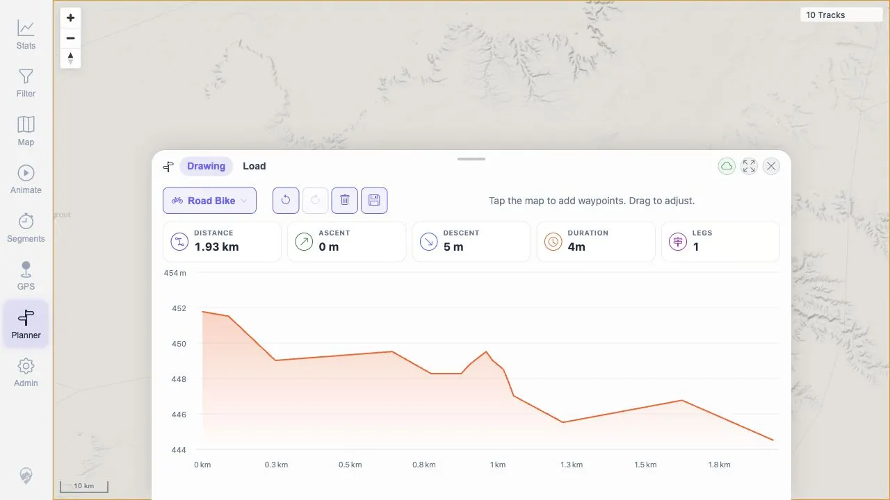</a>

### Packet SGN_09

- Packet file: [packets/SGN_09.md](packets/SGN_09.md)
- Coverage ID: `SGN_09`
- Status: **FAIL**
- Action: Opened Stats, opened Admin, then used browser Back and Forward.
- Expected: Back/forward navigation between views works without errors.
- Actual: Stats/Admin did not update browser history; Back and Forward left the user on Admin. Console captured two 401 resource errors during the pass.

**Issues**

| ID | Severity | Summary | Evidence |
|---|---|---|---|
| SGN-01 | P3 | Browser Back/Forward does not navigate between primary views. | [assets/SGN_09-back-forward.txt](assets/SGN_09-back-forward.txt) |

**Timings**

| Step | Timing |
|---|---:|
| Back/forward check | <1m |

**Handoff Notes**
- Completed: SGN_09 terminal FAIL.
- Remaining unfinished coverage: continue with MAP_01.
- Blocked or not applicable: none.
- State left for the next packet: no server data changed.

**Evidence**

**Text Evidence**
- [assets/SGN_09-back-forward.txt](assets/SGN_09-back-forward.txt) - View states, console errors, and failed request summary. (1.8 KB)

Excerpt: assets/SGN_09-back-forward.txt

<pre><code>states:
map-ready: url=http://178.105.173.254:18080/mtl/ text=500 km 10 Tracks Stats Filter Map Animate Segments GPS Planner Admin
after-stats: url=http://178.105.173.254:18080/mtl/ text=500 km 10 Tracks Stats Filter Map Animate Segments GPS Planner Admin Overview Trends Tracks 10 TRACKS 1,262 km DISTANCE 1d 03h DURATION 7,052 Wh ENERGY ACTIVITY BREAKDOWN Tracks Distance Duration Energy Bicycle 9 9 Walki
after-admin: url=http://178.105.173.254:18080/mtl/ text=500 km 10 Tracks Stats Filter Map Animate Segments GPS Planner Admin Admin SYSTEM UTILITY Admin workspace Manage imports, runtime tools, diagnostics, and local preferences without leaving the map. Quiet state Data Import
after-back: url=http://178.105.173.254:18080/mtl/ text=500 km 10 Tracks Stats Filter Map Animate Segments GPS Planner Admin Admin SYSTEM UTILITY Admin workspace Manage imports, runtime tools, diagnostics, and local preferences without leaving the map. Quiet state Data Import
after-forward: url=http://178.105.173.254:18080/mtl/ text=500 km 10 Tracks Stats Filter Map Animate Segments GPS Planner Admin Admin SYSTEM UTILITY Admin workspace Manage imports, runtime tools, diagnostics, and local preferences without leaving the map. Quiet state Data Import
console_errors=2
Failed to load resource: the server responded with a status of 401 ()
Failed to load resource: the server responded with a status of 401 ()
failed_requests=5
HEAD http://178.105.173.254:18080/mtl/api/info/build net::ERR_ABORTED
HEAD https://protomaps.github.io/basemaps-assets/fonts/Noto%20Sans%20Regular/0-255.pbf net::ERR_ABORTED
HEAD https://tiles.mapterhorn.com/0/0/0.webp net::ERR_ABORTED
HEAD https://tile.openstreetmap.org/0/0/0.png net::ERR_ABORTED
HEAD https://protomaps.github.io/basemaps-assets/sprites/v4/light.json net::ERR_ABORTED</code></pre>

### Packet SYN_05

- Packet file: [packets/SYN_05.md](packets/SYN_05.md)
- Coverage ID: `SYN_05`
- Status: **FAIL**
- Action: Uploaded `SYN_05-dismiss-upload.gpx`, waited for the freshness banner, then clicked Dismiss via role, DOM, and coordinate paths.
- Expected: Dismissing the banner does not loop or re-show immediately.
- Actual: Banner appeared, but Dismiss did not hide it; the banner remained visible after all click paths and waits.

**Issues**

| ID | Severity | Summary | Evidence |
|---|---|---|---|
| SYN-01 | P2 | Data freshness banner Dismiss does not hide the banner. | [assets/SYN_05-dismiss-results.txt](assets/SYN_05-dismiss-results.txt) |

**Timings**

| Step | Timing |
|---|---:|
| Upload, wait for banner, dismiss attempts | <3 min |

**Handoff Notes**
- Completed: SYN_05 terminal `FAIL`.
- Remaining unfinished coverage: SYN_06 through RUN_CLEANUP.
- Blocked or not applicable: None.
- State left for the next packet: Freshness banner remains visible; client cache still shows 11 tracks while the server has the SYN_05 upload available.

**Evidence**

**Text Evidence**
- [assets/SYN_05-dismiss-results.txt](assets/SYN_05-dismiss-results.txt) - Setup, click attempts, and observed failure. (786 B)

Excerpt: assets/SYN_05-dismiss-results.txt

<pre><code>Setup:
- Uploaded `SYN_05-dismiss-upload.gpx`.
- Upload API returned HTTP 200 with message: `'SYN_05-dismiss-upload.gpx' uploaded successfully. Indexing will begin shortly.`
- Freshness banner appeared while Stats was open.

Visible banner before dismiss:
- New data available
- Tracks, media, or settings changed since this view loaded.
- Actions: Reload, Dismiss
- Map/stat cache still showed 11 / 11 tracks before applying the new upload.

Dismiss attempts:
- Clicked Dismiss using the Playwright role locator.
- Clicked Dismiss using the visible DOM node.
- Clicked the button center coordinates at approximately x=976, y=681.

Result:
- Banner remained visible after all dismiss attempts and after waits of 3-7 seconds.
- No immediate successful dismissed state could be verified.
</code></pre>

**Other Evidence Files**
- [assets/SYN_05-dismiss-upload.gpx](assets/SYN_05-dismiss-upload.gpx) - Disposable GPX used to create the freshness banner. (535 B)

### Packet TBS_04

- Packet file: [packets/TBS_04.md](packets/TBS_04.md)
- Coverage ID: `TBS_04`
- Status: **FAIL**
- Action: Scanned the Tracks tab controls after search/sort testing.
- Expected: Quick-view/preset buttons switch the browser subset correctly and preserve usable sorting/search behavior.
- Actual: The tested Tracks tab exposed search, sort controls, table columns, summary, and pagination, but no quick-view/preset subset buttons were visible.

**Issues**

| ID | Severity | Summary | Evidence |
|---|---|---|---|
| TBS-01 | P3 | Track browser does not expose quick-view/preset subset buttons. | [assets/TBS_01-track-browser-list.webp](assets/TBS_01-track-browser-list.webp) |

**Timings**

| Step | Timing |
|---|---:|
| Quick-view control scan | <1m |

**Handoff Notes**
- Completed: TBS_04 terminal FAIL due missing visible quick-view/preset subset controls.
- Remaining unfinished coverage: continue with TBS_05.
- Blocked or not applicable: none.
- State left for the next packet: Tracks tab open, search cleared.

**Evidence**

<a href="assets/TBS_01-track-browser-list.webp">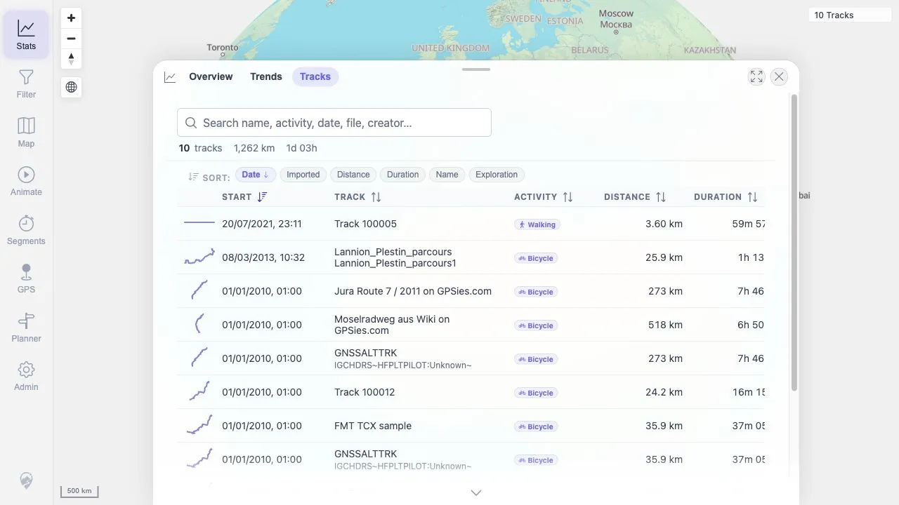</a>
<a href="assets/TBS_03-walking-summary.webp">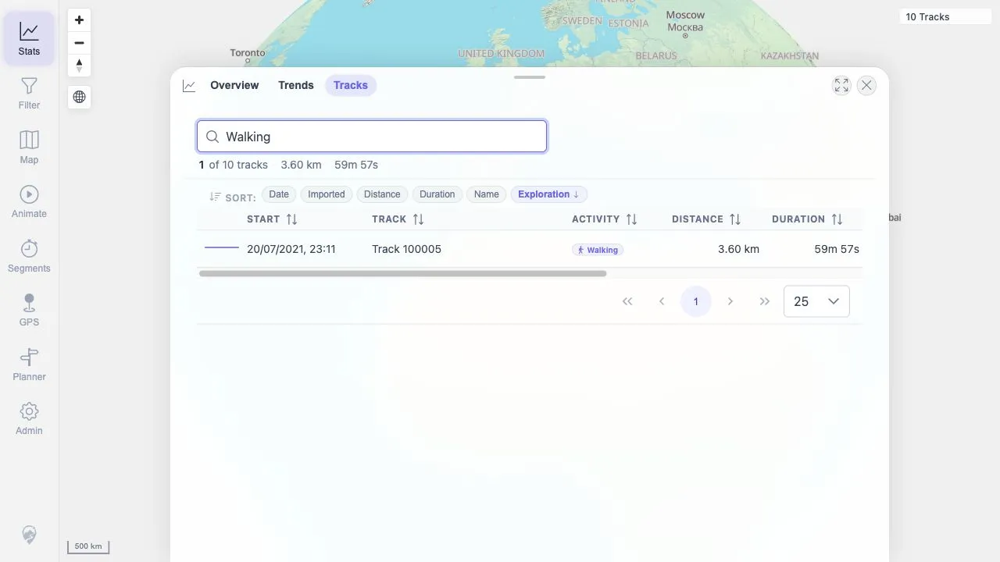</a>

### Packet TRD_06

- Packet file: [packets/TRD_06.md](packets/TRD_06.md)
- Coverage ID: `TRD_06`
- Status: **FAIL**
- Action: Hovered the speed chart, then hovered the mini-map/track line, then moved away.
- Expected: Chart hover highlights matching mini-map point; mini-map hover highlights chart; no stale cursors remain.
- Actual: Chart hover showed a tooltip/crosshair and red mini-map point. Mini-map hover did not visibly highlight the chart, and the red map cursor remained after moving away.

**Issues**

| ID | Severity | Summary | Evidence |
|---|---|---|---|
| TRD-01 | P3 | Hover sync is one-way and leaves a stale mini-map cursor. | [assets/TRD_06-chart-hover-retry.webp](assets/TRD_06-chart-hover-retry.webp) [assets/TRD_06-hover-cleared-retry.webp](assets/TRD_06-hover-cleared-retry.webp) |

**Timings**

| Step | Timing |
|---|---:|
| Hover sync check | <2m |

**Handoff Notes**
- Completed: TRD_06 terminal FAIL.
- Remaining unfinished coverage: continue with TRD_07.
- Blocked or not applicable: none.
- State left for the next packet: no data changed.

**Evidence**

<a href="assets/TRD_06-chart-hover-retry.webp">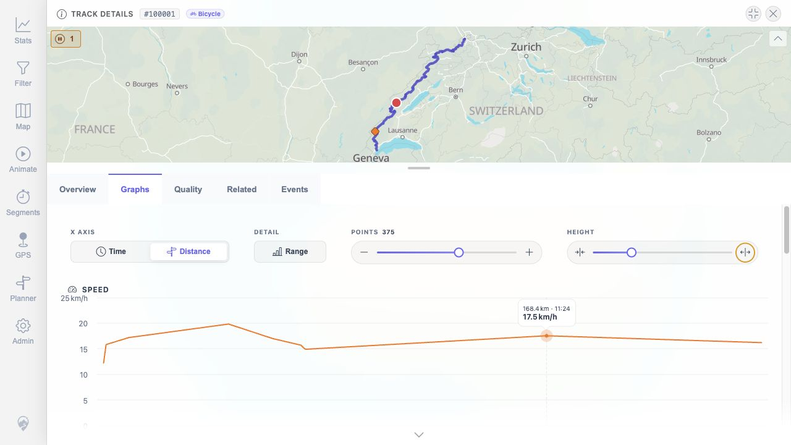</a>

**Text Evidence**
- [assets/TRD_06-hover-sync.txt](assets/TRD_06-hover-sync.txt) - Hover state summary. (1.9 KB)

Excerpt: assets/TRD_06-hover-sync.txt

<pre><code>chart_hover_excerpt=- tabpanel "Graphs":
  - generic: X Axis
  - button " Time":
    - generic: 
    - text: Time
  - button " Distance":
    - generic: 
    - text: Distance
  - generic: Detail
  - button " Range":
    - generic: 
    - text: Range
  - text: Points
  - generic: "375"
  - button "Load fewer chart points":
    - generic: 
  - slider "Adjust chart point count"
  - button "Load more chart points":
    - generic: 
  - generic: Height
  - button "Make graphs smaller":
    - generic: 
  - slider "Adjust graph height"
  - button "Make graphs bigger" [active]:
    - generic: 
  - generic: 
  - text: Speed
  - generic: 
  - text: Elevation
  - generic: 
  - text: Elevation Gain Rate
  - generic: 
  - text: Cumulative Mechanical Energy
  - generic: 
  - text: Estimated Power
- text:                
- generic: 
map_hover_excerpt=- tabpanel "Graphs":
  - generic: X Axis
  - button " Time":
    - generic: 
    - text: Time
  - button " Distance":
    - generic: 
    - text: Distance
  - generic: Detail
  - button " Range":
    - generic: 
    - text: Range
  - text: Points
  - generic: "375"
  - button "Load fewer chart points":
    - generic: 
  - slider "Adjust chart point count"
  - button "Load more chart points":
    - generic: 
  - generic: Height
  - button "Make graphs smaller":
    - generic: 
  - slider "Adjust graph height"
  - button "Make graphs bigger" [active]:
    - generic: 
  - generic: 
  - text: Speed
  - generic: 
  - text: Elevation
  - generic: 
  - text: Elevation Gain Rate
  - generic: 
  - text: Cumulative Mechanical Energy
  - generic: 
  - text: Estimated Power
- text:                
- generic: 
visual_evidence=chart hover, map hover, and cleared screenshots captured
</code></pre>

### Packet TRD_10

- Packet file: [packets/TRD_10.md](packets/TRD_10.md)
- Coverage ID: `TRD_10`
- Status: **FAIL**
- Action: Scanned track detail controls and clicked the activity badge/header area.
- Expected: Change activity type saves successfully and energy values update automatically.
- Actual: No visible activity type edit control was exposed in the tested detail view; clicking the `Bicycle` badge did not open an editor.

**Issues**

| ID | Severity | Summary | Evidence |
|---|---|---|---|
| TRD-02 | P2 | Track details do not expose a visible activity type change control. | [assets/TRD_10-activity-badge-click.webp](assets/TRD_10-activity-badge-click.webp) |

**Timings**

| Step | Timing |
|---|---:|
| Activity control scan | <2m |

**Handoff Notes**
- Completed: TRD_10 terminal FAIL.
- Remaining unfinished coverage: continue with TRD_11.
- Blocked or not applicable: none.
- State left for the next packet: no data changed.

**Evidence**

<a href="assets/TRD_10-activity-control-scan.webp">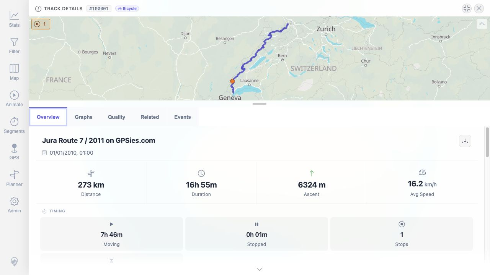</a>

### Packet TRD_11

- Packet file: [packets/TRD_11.md](packets/TRD_11.md)
- Coverage ID: `TRD_11`
- Status: **FAIL**
- Action: Opened the energy section and `About energy` dialog, then scanned for weight/mass what-if controls.
- Expected: Custom rider weight or equivalent what-if control updates displayed energy without permanently saving.
- Actual: The Overview showed energy values and mass used, but the About dialog only contained explanatory text; no rider-weight/what-if input was exposed.

**Issues**

| ID | Severity | Summary | Evidence |
|---|---|---|---|
| TRD-03 | P3 | Energy what-if recalculation control is not exposed in tested track details. | [assets/TRD_11-energy-about-open.webp](assets/TRD_11-energy-about-open.webp) |

**Timings**

| Step | Timing |
|---|---:|
| Energy control scan | <1m |

**Handoff Notes**
- Completed: TRD_11 terminal FAIL.
- Remaining unfinished coverage: continue with TRD_12.
- Blocked or not applicable: none.
- State left for the next packet: no data changed.

**Evidence**

<a href="assets/TRD_11-energy-about-open.webp">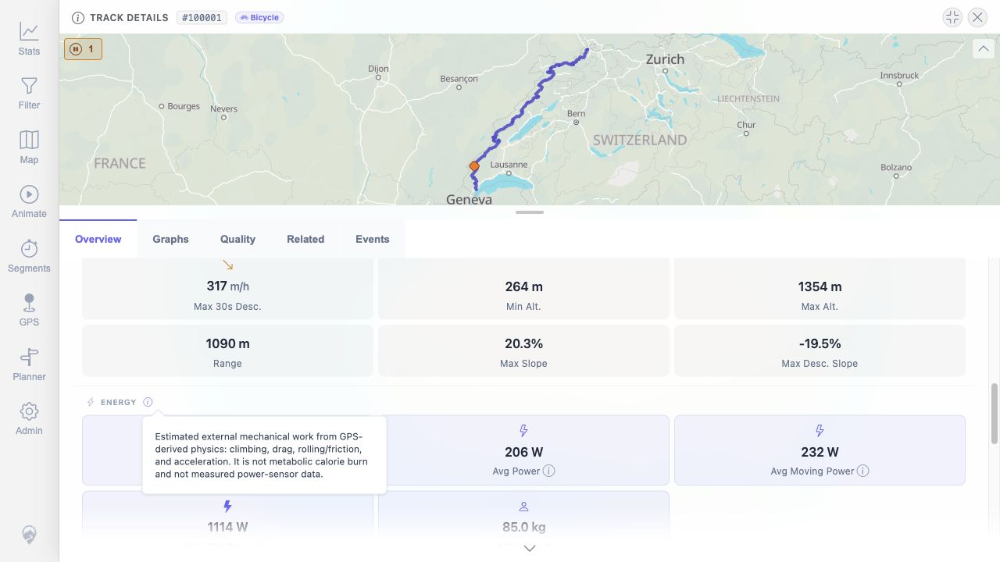</a>

### Packet TRD_12

- Packet file: [packets/TRD_12.md](packets/TRD_12.md)
- Coverage ID: `TRD_12`
- Status: **FAIL**
- Action: Scanned Overview and Quality detail tabs for an exclude/include statistics toggle.
- Expected: Exclude from statistics stops the track counting; re-include restores it.
- Actual: No visible exclusion toggle was exposed in the tested detail UI, so the exclude/re-include workflow could not be performed from the frontend.

**Issues**

| ID | Severity | Summary | Evidence |
|---|---|---|---|
| TRD-04 | P2 | Track details do not expose a visible statistics exclusion toggle. | [assets/TRD_12-exclusion-control-scan.webp](assets/TRD_12-exclusion-control-scan.webp) [assets/TRD_12-quality-exclusion-scan.webp](assets/TRD_12-quality-exclusion-scan.webp) |

**Timings**

| Step | Timing |
|---|---:|
| Exclusion control scan | <2m |

**Handoff Notes**
- Completed: TRD_12 terminal FAIL.
- Remaining unfinished coverage: continue with TRD_13.
- Blocked or not applicable: none.
- State left for the next packet: no data changed.

**Evidence**

### Packet MOB_01

- Packet file: [packets/MOB_01.md](packets/MOB_01.md)
- Coverage ID: `MOB_01`
- Status: **BLOCKED**
- Action: Set viewport to 390 x 844 and inspected runtime input capabilities.
- Expected: Test at a narrow mobile width and with touch input enabled.
- Actual: Narrow mobile layout loaded, but the browser runtime exposes only viewport resizing, not touch input or gesture emulation.

**Issues**

| ID | Severity | Summary | Evidence |
|---|---|---|---|
| MOB-01 | Coverage constraint | Touch input and gesture automation unavailable in current browser surface. | [assets/MOB_01-mobile-context.txt](assets/MOB_01-mobile-context.txt) |

**Timings**

| Step | Timing |
|---|---:|
| Set viewport and inspect capabilities | <1 min |

**Handoff Notes**
- Completed: MOB_01 terminal `BLOCKED`.
- Remaining unfinished coverage: MOB_02 through RUN_CLEANUP.
- Blocked or not applicable: Touch input is not exposed by current browser tooling.
- State left for the next packet: Mobile viewport active for remaining responsive checks.

**Evidence**

**Text Evidence**
- [assets/MOB_01-mobile-context.txt](assets/MOB_01-mobile-context.txt) - Viewport and capability evidence. (709 B)

Excerpt: assets/MOB_01-mobile-context.txt

<pre><code>MOB_01 mobile context evidence

Viewport action:
- Applied browser viewport override: 390 x 844.
- Observed page viewport: innerWidth 390, innerHeight 844.
- Document width: clientWidth 390, scrollWidth 390.
- Mobile navigation layout appeared with bottom nav order: Stats, Filter, Planner, Map, Animate, Segments, GPS, Admin.

Touch capability check:
- Browser capabilities exposed: visibility, viewport.
- Tab capabilities exposed: pageAssets.
- No touch, device emulation, or pinch/gesture capability was exposed by the browser runtime.

Result: BLOCKED. Narrow mobile-width layout was exercised, but the "touch input enabled" half of this coverage ID cannot be satisfied in the available browser context.
</code></pre>

### Packet MOB_02

- Packet file: [packets/MOB_02.md](packets/MOB_02.md)
- Coverage ID: `MOB_02`
- Status: **BLOCKED**
- Action: Opened Filter sheet, measured it, attempted drag down/up gestures, closed it, and attempted navigation-sheet drags.
- Expected: Bottom sheets and navigation sheet drag, snap, and close correctly.
- Actual: Filter sheet opened and closed at mobile width. Pointer drag attempts did not change sheet/nav positions, and touch drag/snap cannot be verified because the runtime lacks touch input.

**Timings**

| Step | Timing |
|---|---:|
| Open, close, and drag attempts | <3 min |

**Handoff Notes**
- Completed: MOB_02 terminal `BLOCKED`.
- Remaining unfinished coverage: MOB_03 through RUN_CLEANUP.
- Blocked or not applicable: Touch drag/snap verification is blocked by tooling.
- State left for the next packet: Mobile viewport active; Filter sheet closed.

**Evidence**

**Text Evidence**
- [assets/MOB_02-mobile-sheets.txt](assets/MOB_02-mobile-sheets.txt) - Mobile sheet measurements, close behavior, and touch constraint. (948 B)

Excerpt: assets/MOB_02-mobile-sheets.txt

<pre><code>MOB_02 mobile sheet evidence

Viewport:
- 390 x 844.

Filter bottom sheet:
- Opened Filter from the mobile nav.
- Active sheet rect before drag: x=0, y=236, width=390, height=608.
- Sheet text included Filter, Colors, SQL, On, Filters, Settings, Activities by keyword, Live preview.
- Close button was visible and closed the active filter sheet.

Drag/snap attempts:
- Pointer drag down on the active filter sheet handle/header did not change the sheet rect: it stayed y=236, height=608.
- Pointer drag up/down on the navigation sheet did not change the nav sheet rect: it stayed y=712, height=132.

Constraint:
- The browser runtime exposes viewport resizing but no touch input or gesture emulation. The failed pointer drag is not enough to conclude the touch drag/snap behavior on a real mobile device.

Result: BLOCKED. Mobile sheets open and close in narrow viewport, but touch drag/snap behavior cannot be verified with the available tooling.
</code></pre>

### Packet MOB_04

- Packet file: [packets/MOB_04.md](packets/MOB_04.md)
- Coverage ID: `MOB_04`
- Status: **BLOCKED**
- Action: Inspected available browser capabilities and compared against required touch planner input.
- Expected: Planner waypoints can be tapped, dragged, and inserted with touch.
- Actual: No touch input or mobile gesture capability is available in this browser runtime; planner touch behavior cannot be executed.

**Timings**

| Step | Timing |
|---|---:|
| Capability check | <1 min |

**Handoff Notes**
- Completed: MOB_04 terminal `BLOCKED`.
- Remaining unfinished coverage: MOB_05 through RUN_CLEANUP.
- Blocked or not applicable: Touch planner interaction requires tooling not available in this run.
- State left for the next packet: Desktop viewport restored.

**Evidence**

**Text Evidence**
- [assets/MOB_04-touch-planner-blocked.txt](assets/MOB_04-touch-planner-blocked.txt) - Touch planner tooling constraint. (742 B)

Excerpt: assets/MOB_04-touch-planner-blocked.txt

<pre><code>MOB_04 touch planner constraint

Coverage requirement:
- Planner waypoints can be tapped, dragged, and inserted with touch.

Available browser capabilities:
- Browser: visibility, viewport.
- Tab: pageAssets.
- No touch input, touch event injection, pinch, or mobile device emulation capability is exposed.

Related completed desktop coverage:
- PLN_02 through PLN_08 exercised planner route creation, waypoint move/delete, stats updates, elevation hover, save/load/delete, and GPX export with desktop pointer automation.
- PLN_11 was already marked BLOCKED for mobile/touch planner dragging in this same tooling context.

Result: BLOCKED. This row requires touch-specific planner input and cannot be verified in the current browser runtime.
</code></pre>

### Packet MOB_05

- Packet file: [packets/MOB_05.md](packets/MOB_05.md)
- Coverage ID: `MOB_05`
- Status: **BLOCKED**
- Action: Checked available gesture support after mobile viewport testing.
- Expected: Map gestures (pinch, double-tap, drag) work after using each tool.
- Actual: Pointer map controls worked at mobile width, but pinch and touch double-tap require a touch/gesture-capable context that this browser runtime does not expose.

**Timings**

| Step | Timing |
|---|---:|
| Capability check and mobile map-control evidence review | <1 min |

**Handoff Notes**
- Completed: MOB_05 terminal `BLOCKED`.
- Remaining unfinished coverage: NET_01 through RUN_CLEANUP.
- Blocked or not applicable: Touch map gestures require tooling not available in this run.
- State left for the next packet: Desktop viewport restored to 1280 x 720; signed in on Stats Tracks view with 14 tracks.

**Evidence**

**Text Evidence**
- [assets/MOB_05-touch-gestures-blocked.txt](assets/MOB_05-touch-gestures-blocked.txt) - Touch gesture tooling constraint. (696 B)

Excerpt: assets/MOB_05-touch-gestures-blocked.txt

<pre><code>MOB_05 touch gesture constraint

Coverage requirement:
- Map gestures including pinch, double-tap, and drag work after using each tool.

Available evidence:
- At 390 x 844, normal map controls and desktop-style pointer interactions remained usable.
- Zoom in changed the map scale from 1000 km to 500 km.
- Tool surfaces opened in the mobile layout.

Blocking constraint:
- Pinch and touch double-tap require touch input or mobile gesture emulation.
- Browser capabilities expose viewport resizing only; no touch/pinch gesture capability is available.

Result: BLOCKED. Pointer map controls were checked at mobile width, but touch gesture coverage cannot be completed with the available tooling.
</code></pre>

### Packet PLN_11

- Packet file: [packets/PLN_11.md](packets/PLN_11.md)
- Coverage ID: `PLN_11`
- Status: **BLOCKED**
- Action: Checked whether the current tooling can provide mobile viewport and touch input for planner dragging.
- Expected: Touch dragging on mobile works for placing and moving waypoints.
- Actual: BLOCKED: workspace has no Playwright/touch harness installed, and the in-app browser surface for this run does not expose mobile viewport or touch emulation controls.

**Timings**

| Step | Timing |
|---|---:|
| Tooling check | <2m |

**Handoff Notes**
- Completed: PLN_11 terminal BLOCKED.
- Remaining unfinished coverage: continue with MCT_01.
- Blocked or not applicable: mobile/touch planner dragging requires a touch-capable test context.
- State left for the next packet: planner remains open; desktop planner workflow validated through PLN_10.

**Evidence**

**Text Evidence**
- [assets/PLN_11-touch-blocked.txt](assets/PLN_11-touch-blocked.txt) - Tooling constraint details. (587 B)

Excerpt: assets/PLN_11-touch-blocked.txt

<pre><code>PLN_11 requires mobile viewport plus touch input for planner waypoint placement/movement.

Checked workspace tooling:
- `node -e "require.resolve('playwright')"` exited nonzero.
- `node -e "require.resolve('@playwright/test')"` exited nonzero.
- `mtl-client/package.json` has Vitest/jsdom but no Playwright or browser/device test dependency.

The in-app browser surface used for this run supports desktop pointer automation but does not expose a mobile viewport/touch emulation control. Desktop planner waypoint dragging was covered in PLN_04; it is not valid touch evidence for PLN_11.
</code></pre>

### Packet FIT_06

- Packet file: [packets/FIT_06.md](packets/FIT_06.md)
- Coverage ID: `FIT_06`
- Status: **NOT APPLICABLE**
- Action: Checked converter availability through the FIT import result.
- Expected: If GPSBabel/FIT conversion is unavailable, UI shows a clear conversion/indexing error and failure is blocking.
- Actual: GPSBabel/FIT conversion was available and succeeded, so unavailable-converter error handling was not applicable in this run.

**Timings**

| Step | Timing |
|---|---:|
| FIT step | <1m |

**Handoff Notes**
- Completed: FIT_06 terminal NOT APPLICABLE.
- Remaining unfinished coverage: continue queue.
- Blocked or not applicable: none unless stated.
- State left for the next packet: dataset contains three remaining GPX tracks plus FIT track #100005.

**Evidence**

**Text Evidence**
- [assets/FIT_02-index-monitor.txt](assets/FIT_02-index-monitor.txt) - GPSBabel conversion success evidence. (1.8 KB)

Excerpt: assets/FIT_02-index-monitor.txt

<pre><code>POLL=1 waiting
app-1  | 2026-05-26T04:25:47.146Z  INFO 1 --- [watch-GPS] FileIndexerImpl              : Live watcher detected CREATE for: Activity.fit
POLL=2 FIT_STATUS=SUCCESS
app-1  | 2026-05-26T04:25:47.146Z  INFO 1 --- [watch-GPS] FileIndexerImpl              : Live watcher detected CREATE for: Activity.fit
app-1  | 2026-05-26T04:25:57.158Z  INFO 1 --- [idx-1] TrackFileConverterService    : Converting Activity.fit (FIT) to GPX: gpsbabel -i garmin_fit -f /app/gpx/Activity.fit -o gpx,gpxver=1.1 -F -
app-1  | 2026-05-26T04:25:57.183Z  INFO 1 --- [idx-1] TrackFileConverterService    : GPSBabel converted Activity.fit → 479844 chars of GPX XML
app-1  | 2026-05-26T04:25:57.464Z  INFO 1 --- [idx-1] GPXReader                    : Track Data Summary:   - Outlier Corrector: GPXReader distance/probation filter   - Outliers Found: false   - Outliers Cleared By Corrector: 0 point(s)   - Distances (m):       • Max:    1.0       • Median: 1.0       • Avg:    1.0 file=Activity.fit
app-1  | 2026-05-26T04:25:58.280Z  INFO 1 --- [idx-1] GPXStoreService              : GPS simplified timing trackId=100005 file=/Activity.fit total=60ms details=1m 15ms (2 pts), 5m 10ms (2 pts), 10m 8ms (2 pts), 50m 7ms (2 pts), 100m 6ms (2 pts), 500m 7ms (2 pts), 1000m 7ms (2 pts)
app-1  | 2026-05-26T04:25:58.281Z  INFO 1 --- [idx-1] GPXStoreService              : GPS ingest timing trackId=100005 file=/Activity.fit status=SUCCESS Timing total 1.12s; slowest raw points 261ms, cleaned points 250ms, denoise 219ms, parse XML 133ms, break-stop filter 123ms, simplified shapes 60ms, gpsbabel 27ms, outlier filter 15ms.
app-1  | 2026-05-26T04:25:58.283Z  INFO 1 --- [idx-1] GPXStoreService              : Reading of track id=100005 and path= file=Activity.fit did complete with status=SUCCESS and took processingTime=1.13s
FIT_MONITOR_SECONDS=2
</code></pre>

### Packet GPS_02

- Packet file: [packets/GPS_02.md](packets/GPS_02.md)
- Coverage ID: `GPS_02`
- Status: **NOT APPLICABLE**
- Action: Assessed whether enabling GPS can produce a browser permission prompt and locate marker on the configured target.
- Expected: On a secure origin, enabling GPS should show a permission prompt and, after acceptance, display a locate marker.
- Actual: This run is on a remote plain-HTTP origin, confirmed by GPS_01. The plan explicitly marks live GPS permission/marker checks not applicable for this target type.

**Timings**

| Step | Timing |
|---|---:|
| Applicability review | <1 min |

**Handoff Notes**
- Completed: GPS_02 is terminal `NOT APPLICABLE` for this run.
- Remaining unfinished coverage: GPS_03 through RUN_CLEANUP.
- Blocked or not applicable: Live GPS prompt/marker behavior should be tested on localhost or HTTPS.
- State left for the next packet: No app state mutation.

**Evidence**

<a href="assets/GPS_01-gps-panel-http.webp">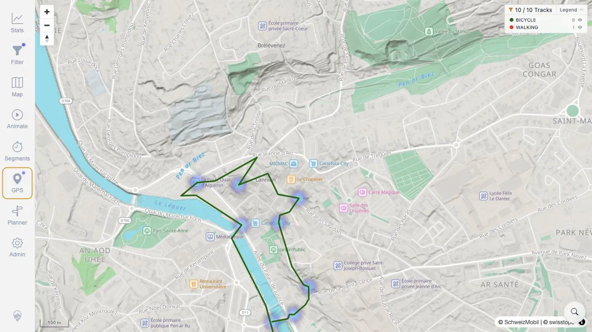</a>

**Text Evidence**
- [assets/GPS_01-secure-context.txt](assets/GPS_01-secure-context.txt) - Shared evidence that the configured run is remote plain HTTP and not suitable for live geolocation. (639 B)

Excerpt: assets/GPS_01-secure-context.txt

<pre><code>Target URL: http://178.105.173.254:18080/mtl/
Origin: http://178.105.173.254:18080
Protocol: http:
Host: 178.105.173.254:18080
Localhost-equivalent: false
Browser geolocation exposed in page context: false
Visible app state after opening GPS: map remained usable with 10 / 10 tracks; a transient "GPS started" info toast appeared, but no browser permission prompt or live-location marker could be verified on the remote plain-HTTP origin.

Coverage conclusion: GPS_01 confirms this quick-install run is on a remote plain-HTTP host, so live GPS permission and marker checks must be terminal NOT APPLICABLE per the frontend regression plan.
</code></pre>

### Packet GPS_03

- Packet file: [packets/GPS_03.md](packets/GPS_03.md)
- Coverage ID: `GPS_03`
- Status: **NOT APPLICABLE**
- Action: Assessed whether follow-me mode can be verified in this configured run.
- Expected: With a live geolocation stream on a secure origin, follow-me should keep the map centered until manual panning creates a drifted state.
- Actual: This run has no secure-origin geolocation path because it is remote plain HTTP. Without a live locate marker/position stream, follow-me recentering cannot be meaningfully exercised here.

**Timings**

| Step | Timing |
|---|---:|
| Applicability review | <1 min |

**Handoff Notes**
- Completed: GPS_03 is terminal `NOT APPLICABLE` for this run.
- Remaining unfinished coverage: GPS_04 through RUN_CLEANUP.
- Blocked or not applicable: Test follow-me behavior on localhost or HTTPS.
- State left for the next packet: No app state mutation.

**Evidence**

**Text Evidence**
- [assets/GPS_01-secure-context.txt](assets/GPS_01-secure-context.txt) - Shared evidence for the remote plain-HTTP geolocation limitation. (639 B)

Excerpt: assets/GPS_01-secure-context.txt

<pre><code>Target URL: http://178.105.173.254:18080/mtl/
Origin: http://178.105.173.254:18080
Protocol: http:
Host: 178.105.173.254:18080
Localhost-equivalent: false
Browser geolocation exposed in page context: false
Visible app state after opening GPS: map remained usable with 10 / 10 tracks; a transient "GPS started" info toast appeared, but no browser permission prompt or live-location marker could be verified on the remote plain-HTTP origin.

Coverage conclusion: GPS_01 confirms this quick-install run is on a remote plain-HTTP host, so live GPS permission and marker checks must be terminal NOT APPLICABLE per the frontend regression plan.
</code></pre>

### Packet GPS_04

- Packet file: [packets/GPS_04.md](packets/GPS_04.md)
- Coverage ID: `GPS_04`
- Status: **NOT APPLICABLE**
- Action: Assessed whether permission-denied/disabled GPS messaging can be tested on the configured target.
- Expected: On a secure origin, denying or disabling GPS permission should show a clear message.
- Actual: The configured target is remote plain HTTP, so the browser permission-denied flow for live geolocation is outside this run's applicable scope per GPS_01 and the test plan note.

**Timings**

| Step | Timing |
|---|---:|
| Applicability review | <1 min |

**Handoff Notes**
- Completed: GPS_04 is terminal `NOT APPLICABLE` for this run.
- Remaining unfinished coverage: GPS_05 through RUN_CLEANUP.
- Blocked or not applicable: Test permission denial on localhost or HTTPS.
- State left for the next packet: No app state mutation.

**Evidence**

**Text Evidence**
- [assets/GPS_01-secure-context.txt](assets/GPS_01-secure-context.txt) - Shared evidence for the remote plain-HTTP geolocation limitation. (639 B)

Excerpt: assets/GPS_01-secure-context.txt

<pre><code>Target URL: http://178.105.173.254:18080/mtl/
Origin: http://178.105.173.254:18080
Protocol: http:
Host: 178.105.173.254:18080
Localhost-equivalent: false
Browser geolocation exposed in page context: false
Visible app state after opening GPS: map remained usable with 10 / 10 tracks; a transient "GPS started" info toast appeared, but no browser permission prompt or live-location marker could be verified on the remote plain-HTTP origin.

Coverage conclusion: GPS_01 confirms this quick-install run is on a remote plain-HTTP host, so live GPS permission and marker checks must be terminal NOT APPLICABLE per the frontend regression plan.
</code></pre>

### Packet GPS_05

- Packet file: [packets/GPS_05.md](packets/GPS_05.md)
- Coverage ID: `GPS_05`
- Status: **NOT APPLICABLE**
- Action: Assessed whether disabling live GPS can be verified in this configured run.
- Expected: With live GPS active, disabling GPS should remove the locate marker and stop position updates.
- Actual: This remote plain-HTTP run cannot establish a live browser geolocation marker/stream. There is no applicable live GPS state to disable and verify.

**Timings**

| Step | Timing |
|---|---:|
| Applicability review | <1 min |

**Handoff Notes**
- Completed: GPS_05 is terminal `NOT APPLICABLE` for this run.
- Remaining unfinished coverage: SRC_01 through RUN_CLEANUP.
- Blocked or not applicable: Test GPS disable/stop-updates behavior on localhost or HTTPS.
- State left for the next packet: No app state mutation.

**Evidence**

**Text Evidence**
- [assets/GPS_01-secure-context.txt](assets/GPS_01-secure-context.txt) - Shared evidence for the remote plain-HTTP geolocation limitation. (639 B)

Excerpt: assets/GPS_01-secure-context.txt

<pre><code>Target URL: http://178.105.173.254:18080/mtl/
Origin: http://178.105.173.254:18080
Protocol: http:
Host: 178.105.173.254:18080
Localhost-equivalent: false
Browser geolocation exposed in page context: false
Visible app state after opening GPS: map remained usable with 10 / 10 tracks; a transient "GPS started" info toast appeared, but no browser permission prompt or live-location marker could be verified on the remote plain-HTTP origin.

Coverage conclusion: GPS_01 confirms this quick-install run is on a remote plain-HTTP host, so live GPS permission and marker checks must be terminal NOT APPLICABLE per the frontend regression plan.
</code></pre>

### Packet MAP_07

- Packet file: [packets/MAP_07.md](packets/MAP_07.md)
- Coverage ID: `MAP_07`
- Status: **NOT APPLICABLE**
- Action: Checked config and Settings UI for a direction-arrow setting.
- Expected: Direction arrows appear at high zoom if enabled in settings.
- Actual: No direction-arrow setting was exposed in config or Settings; the conditional check is not applicable in this run.

**Timings**

| Step | Timing |
|---|---:|
| Settings/config scan | <1m |

**Handoff Notes**
- Completed: MAP_07 terminal NOT APPLICABLE.
- Remaining unfinished coverage: continue with MAP_08.
- Blocked or not applicable: direction arrows are conditional and no enabled/exposed setting exists in this run.
- State left for the next packet: no data changed.

**Evidence**

<a href="assets/MAP_07-settings-scan.webp">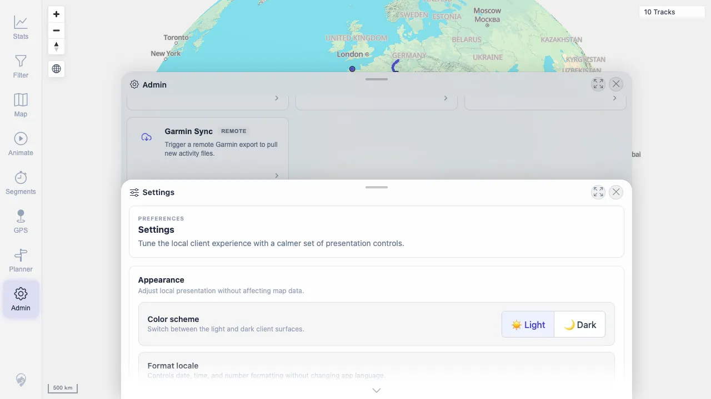</a>

**Text Evidence**
- [assets/MAP_07-direction-arrow-config.txt](assets/MAP_07-direction-arrow-config.txt) - Config probe showing no direction-arrow setting. (164 B)

Excerpt: assets/MAP_07-direction-arrow-config.txt

<pre><code>Config/search probes for direction arrow setting:
[]
OpenAPI config paths:
/api/config/get
/api/filter/resolve/{filterConfigId}
/api/map/config
/api/planner/config
</code></pre>

- [assets/MAP_07-settings-scan.txt](assets/MAP_07-settings-scan.txt) - Settings text scan. (124 B)

Excerpt: assets/MAP_07-settings-scan.txt

<pre><code>matches=3
10 Tracks
---
Track indexer, map, and routing activity.
---
Reload tracks, manage helper tools, and run installs.
</code></pre>

### Packet MAP_12

- Packet file: [packets/MAP_12.md](packets/MAP_12.md)
- Coverage ID: `MAP_12`
- Status: **NOT APPLICABLE**
- Action: Probed map config and API docs for Swiss Mobility route support.
- Expected: Where applicable, Swiss Mobility routes popup shows nearby official routes and closes cleanly.
- Actual: No Swiss Mobility route layer/API was exposed in this quick-install configuration; the conditional popup check is not applicable.

**Timings**

| Step | Timing |
|---|---:|
| Applicability probe | <1m |

**Handoff Notes**
- Completed: MAP_12 terminal NOT APPLICABLE.
- Remaining unfinished coverage: continue with TRD_01.
- Blocked or not applicable: Swiss Mobility popup support was not exposed in this run.
- State left for the next packet: no data changed.

**Evidence**

**Text Evidence**
- [assets/MAP_12-swiss-config-probe.txt](assets/MAP_12-swiss-config-probe.txt) - Map config/API probe for Swiss Mobility support. (71 B)

Excerpt: assets/MAP_12-swiss-config-probe.txt

<pre><code>map config Swiss probe:
api docs Swiss/route paths:
/api/planner/route
</code></pre>

### Packet NET_01

- Packet file: [packets/NET_01.md](packets/NET_01.md)
- Coverage ID: `NET_01`
- Status: **NOT APPLICABLE**
- Action: Compared the coverage row's installed-PWA condition with the current normal browser-tab run context.
- Expected: Installed PWA/web-app mode offline reload is tested only when the app is installed as a web app.
- Actual: This run used a normal browser tab; the test plan explicitly says that context is not expected to pass and should be marked not applicable.

**Timings**

| Step | Timing |
|---|---:|
| Applicability check | <1 min |

**Handoff Notes**
- Completed: NET_01 terminal `NOT APPLICABLE`.
- Remaining unfinished coverage: NET_02 through RUN_CLEANUP.
- Blocked or not applicable: Installed PWA mode was not part of this normal browser-tab run.
- State left for the next packet: Main browser remains signed in.

**Evidence**

**Text Evidence**
- [assets/NET_01-pwa-mode.txt](assets/NET_01-pwa-mode.txt) - Installed-PWA applicability decision. (723 B)

Excerpt: assets/NET_01-pwa-mode.txt

<pre><code>NET_01 installed-PWA scope evidence

Coverage text:
- Installed PWA / installed web-app mode only: after installing MTL Explorer in the browser and loading once online, reload while offline.
- Normal browser tab is not expected to pass this offline reload check.

Run context:
- This full regression used a normal browser tab against the remote quick-install target.
- No installed web-app/PWA shell was created as part of this run.
- Browser automation capabilities exposed viewport and visibility only; no installed-app or offline browser mode capability was available in the in-app browser.

Result: NOT APPLICABLE. The row explicitly applies to installed PWA/web-app mode, not the normal browser tab used for this run.
</code></pre>

### Packet NET_04

- Packet file: [packets/NET_04.md](packets/NET_04.md)
- Coverage ID: `NET_04`
- Status: **NOT APPLICABLE**
- Action: Checked whether the run included a service-worker/client update event.
- Expected: A new-version prompt appears after an update and accepting it reloads cleanly.
- Actual: No new client build or service-worker version was deployed during this fixed-target regression run, so no update prompt event was applicable.

**Timings**

| Step | Timing |
|---|---:|
| Applicability check | <1 min |

**Handoff Notes**
- Completed: NET_04 terminal `NOT APPLICABLE`.
- Remaining unfinished coverage: ERR_01 through RUN_CLEANUP.
- Blocked or not applicable: No service-worker update event occurred in this fixed-target run.
- State left for the next packet: Main browser remains signed in on desktop viewport.

**Evidence**

**Text Evidence**
- [assets/NET_04-service-worker-update.txt](assets/NET_04-service-worker-update.txt) - Service-worker update applicability decision. (575 B)

Excerpt: assets/NET_04-service-worker-update.txt

<pre><code>NET_04 service worker update scope evidence

Coverage requirement:
- Service worker update: a "new version available" prompt appears after an update; accepting it reloads cleanly.

Run context:
- Target was a fixed remote quick-install instance during this regression.
- No new client build or service-worker version was deployed during the run.
- Testing this row would require intentionally changing and redeploying the app bundle/service worker, which is outside this retest target.

Result: NOT APPLICABLE. No service-worker update event occurred in this configured run.
</code></pre>

### Packet PLN_09

- Packet file: [packets/PLN_09.md](packets/PLN_09.md)
- Coverage ID: `PLN_09`
- Status: **NOT APPLICABLE**
- Action: Checked planner BRouter status after successful route computation.
- Expected: If BRouter is missing data for an area, UI shows a clear segment downloading/unavailable state instead of an unhandled error.
- Actual: Not applicable in this configured run: tested planner routes computed successfully and BRouter status showed ready, running `yes`, 3 segments on disk, queued `0`. No missing-data state occurred.

**Timings**

| Step | Timing |
|---|---:|
| BRouter status check | <2m |

**Handoff Notes**
- Completed: PLN_09 terminal NOT APPLICABLE.
- Remaining unfinished coverage: continue with PLN_10.
- Blocked or not applicable: missing routing-data state was not present in this run.
- State left for the next packet: planner open with BRouter status expanded.

**Evidence**

<a href="assets/PLN_09-brouter-ready.webp">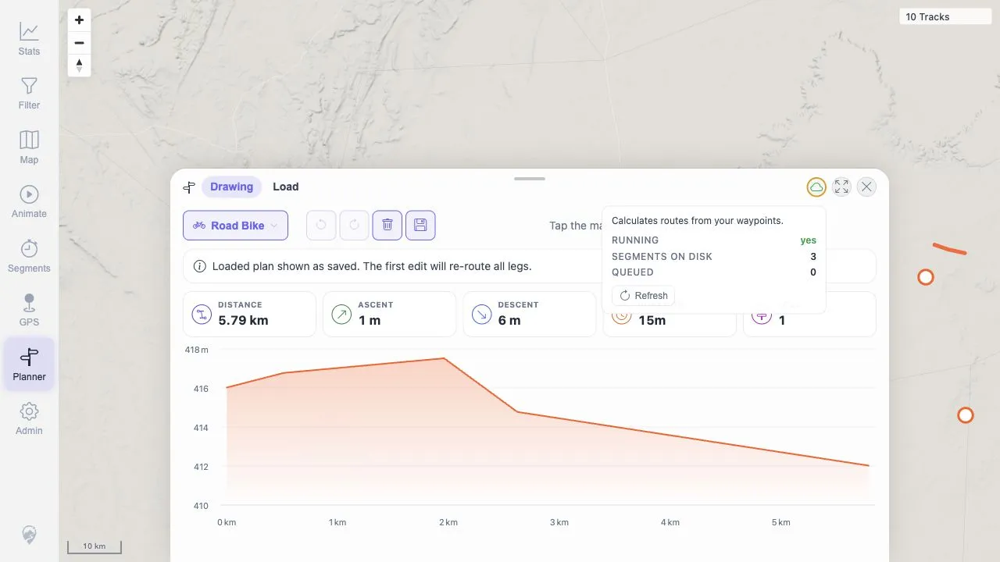</a>

### Packet PLN_10

- Packet file: [packets/PLN_10.md](packets/PLN_10.md)
- Coverage ID: `PLN_10`
- Status: **NOT APPLICABLE**
- Action: Reviewed saved-route workflow result and current BRouter status.
- Expected: Existing planned routes still display even when the planner has trouble fetching new data.
- Actual: Not applicable in this configured run: no route-fetch trouble occurred; BRouter status was ready and PLN_07 already verified saved routes list/load/delete under normal routing state.

**Timings**

| Step | Timing |
|---|---:|
| Applicability review | <1m |

**Handoff Notes**
- Completed: PLN_10 terminal NOT APPLICABLE.
- Remaining unfinished coverage: continue with PLN_11.
- Blocked or not applicable: no planner route-fetch trouble occurred in this run.
- State left for the next packet: planner open on desktop; mobile/touch validation still pending.

**Evidence**

<a href="assets/PLN_07-load-list.webp">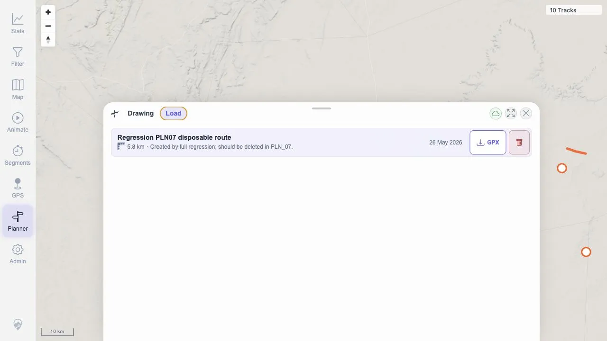</a>

### Packet SGN_04

- Packet file: [packets/SGN_04.md](packets/SGN_04.md)
- Coverage ID: `SGN_04`
- Status: **NOT APPLICABLE**
- Action: Checked `/api/auth/demo-status` and the login screen.
- Expected: If demo mode is active, the login screen shows demo credentials.
- Actual: Demo mode is not active (`"demoMode": false`), so a demo credentials banner is not applicable to this quick-install run.

**Timings**

| Step | Timing |
|---|---:|
| Demo status check | <1s |

**Handoff Notes**
- Completed: SGN_04 terminal NOT APPLICABLE.
- Remaining unfinished coverage: continue with SGN_05.
- Blocked or not applicable: demo mode is disabled in this run.
- State left for the next packet: no server data changed.

**Evidence**

<a href="assets/SGN_04-login-no-demo-banner.webp">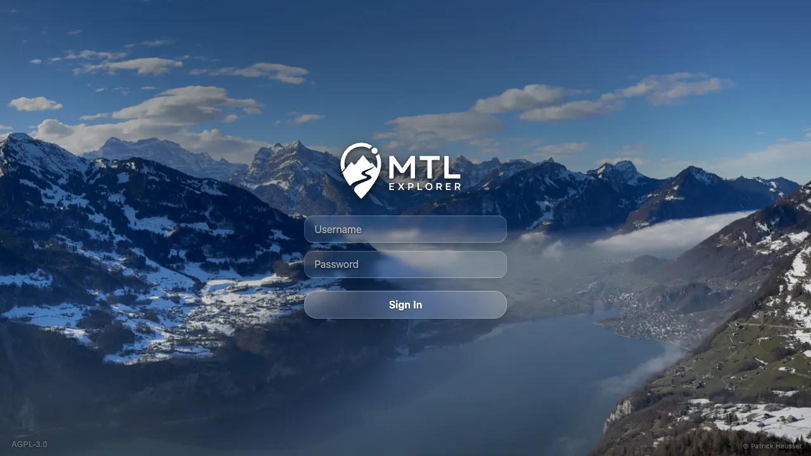</a>

**Text Evidence**
- [assets/SGN_04-demo-status.txt](assets/SGN_04-demo-status.txt) - Demo mode API response. (76 B)

Excerpt: assets/SGN_04-demo-status.txt

<pre><code>GET /mtl/api/auth/demo-status
{"demoMode":false,"username":"","password":""}</code></pre>

### Packet ACC_01

- Packet file: [packets/ACC_01.md](packets/ACC_01.md)
- Coverage ID: `ACC_01`
- Status: **PASS**
- Action: Reviewed queue/accounting requirement and current run-state/report workflow.
- Expected: Coverage is tracked per stable ID with explicit evidence and terminal status rules.
- Actual: Initialized run-state with every coverage ID from the plan as a queue row and packet target.

**Timings**

| Step | Timing |
|---|---:|
| Accounting verification | <1m |

**Handoff Notes**
- Completed: ACC_01 terminal PASS.
- Remaining unfinished coverage: continue queue.
- Blocked or not applicable: none.
- State left for the next packet: no app state changed.

**Evidence**

**Text Evidence**
- [run-state.md](run-state.md) - Coordinator queue and status source. (26.5 KB)

Excerpt: run-state.md

<pre><code># Full Regression Run State

## Run

| Field | Value |
|---|---|
| Run id | 2026-05-26_0606-remote-178-full-regression |
| Target server | 178.105.173.254 |
| Source | GitHub main |
| App URL | `http://178.105.173.254:18080/mtl/` |
| Started | 2026-05-26 06:06:34 CEST |
| Coordinator | Codex |

## Shared Facts

- README facts: Docker Engine and Docker Compose plugin required; quick start downloads `docker-compose.yml` from GitHub `main` and runs `docker compose up -d`; local app URL `http://localhost:18080/mtl/`; login `mtl` / `change-me`; import folder `./data/gpx/`.
- Login credentials source: root `README.md` quick start.
- Import folder: `./data/gpx/` relative to `/root/mtl-full-regression-2026-05-26_0606/mtl-explorer`.
- Browser contexts: desktop browser signed in; clean context, narrow mobile/touch, and PWA/offline applicability still planned where useful.
- Known constraints: remote quick install is plain HTTP, so live geolocation is expected to be unavailable except on localhost/HTTPS unless a secure context is introduced.

## Queue

- Source queue: `documentation/testing/frontend-regression-test-plan.md`
- Current coverage ID: COMPLETE
- Next coverage ID: none

Track active, blocked, failed, and recently completed IDs here. Completed packet files are the durable record.

| Coverage ID | Status | Owner | Packet file | Notes |
|---|---|---|---|---|
| RUN_SETUP | PASS | Codex | packets/RUN_SETUP.md | Quick install passed; app running at remote URL; empty dataset baseline captured. |
| ACC_01 | PASS | Codex | packets/ACC_01.md | Full queue represented one stable coverage ID per row and packet target. |
| ACC_02 | PASS | Codex | packets/ACC_02.md | Parent/area results will not substitute for child packet statuses. |
| ACC_03 | PASS | Codex | packets/ACC_03.md | Final report to be assembled from packets with one row per coverage ID. |
| ACC_04 | PASS | Codex | packets/ACC_04.md | Representative working screenshots captured and screenshot policy established. |
| ACC_05 | PASS | Codex | packets/ACC_05.md | Constraints will be terminal BLOCKED/NOT APPLICABLE with explicit reasons. |
| DAT_01 | PASS | Codex | packets/DAT_01.md | Five public GPX files with real trkpt sequences were downloaded and validated. |
| DAT_02 | PASS | Codex | packets/DAT_02.md | All five GPX files contain timestamp tags suitable for duration/statistics checks. |
| DAT_03 | PASS | Codex | packets/DAT_03.md | Source metadata plus imported IDs/names recorded. |
| DAT_04 | PASS | Codex | packets/DAT_04.md | Used the five suggested gps-touring/sample-gpx raw files. |
| DAT_05 | PASS | Codex | packets/DAT_05.md | Downloaded Garmin public Activity.fit sample. |
| DAT_06 | PASS | Codex | packets/DAT_06.md | No waypoint-only GPX/non-GPS FIT counted as positive evidence. |
| IMP_01 | PASS | Codex | packets/IMP_01.md | Captured empty map, stats, admin/jobs/freshness baseline before import. |
| IMP_02 | PASS | Codex | packets/IMP_02.md | Copied five GPX files into README watched folder ./data/gpx. |
| IMP_03 | PASS | Codex | packets/IMP_03.md | Live watcher detected all five files and no manual rescan was required. |
| IMP_04 | PASS | Codex | packets/IMP_04.md | All five GPX files completed SUCCESS and jobs/freshness reflected import. |
| IMP_05 | PASS | Codex | packets/IMP_05.md | Freshness refresh showed imported data on map, stats, track browser, and filter surface. |
| IMP_06 | PASS | Codex | packets/IMP_06.md | All five imported names appeared in track list/search/stats/map/filter context and mapping was recorded. |
| IMP_07 | PASS | Codex | packets/IMP_07.md | Map clicks opened all five imported GPX tracks, including overlap selection for Mosel/VoieVerte. |
| IMP_08 | PASS | Codex | packets/IMP_08.md | Track count increased from 0 to 5 and each GPX produced one track. |
| IMP_09 | PASS | Codex | packets/IMP_09.md | Stats/browser totals increased and heatmap density rendered over imported tracks. |
| DEL_01 | PASS | Codex | packets/DEL_01.md | Deleted Vitry and VoieVerte GPX source files from watched folder. |
| DEL_02 | PASS | Codex | packets/DEL_02.md | Automatic delete processing removed tracks 100000 and 100004; no manual rescan required. |
| DEL_03 | PASS | Codex | packets/DEL_03.md | Deleted tracks disappeared from map/heatmap/list/search/filter context and stats dropped to 3 tracks. |
| DEL_04 | PASS | Codex | packets/DEL_04.md | Remaining Jura track displayed and opened after deletion. |
| DEL_05 | PASS | Codex | packets/DEL_05.md | Deletion verdict based on user-visible surfaces, not stale URL/API probes. |
| FIT_01 | PASS | Codex | packets/FIT_01.md | Copied Activity.fit into watched import folder. |
| FIT_02 | PASS | Codex | packets/FIT_02.md | FIT converted via GPSBabel, indexed as #100005, displayed on map/list/stats. |
| FIT_03 | PASS | Codex | packets/FIT_03.md | FIT-backed detail overview, graphs, quality, related, events, and mini-map rendered. |
| FIT_04 | PASS | Codex | packets/FIT_04.md | Download original returned Activity.fit matching uploaded checksum. |
| FIT_05 | PASS | Codex | packets/FIT_05.md | Download GPX returned valid GPX with 3,601 trkpt points. |
| FIT_06 | NOT APPLICABLE | Codex | packets/FIT_06.md | GPSBabel/FIT conversion was available and succeeded, so unavailable-converter state was not applicable. |
| FMT_01 | FAIL | Codex | packets/FMT_01.md | TCX/KML/IGC/GDB/NMEA imported; KMZ failed conversion; GeoJSON imported empty; SBP sample unavailable. |
| FMT_02 | FAIL | Codex | packets/FMT_02.md | Downloads worked for successful non-GPX imports, but KMZ/GeoJSON failed usable track workflow and KML was not user-visible. |
| SGN_01 | PASS | Codex | packets/SGN_01.md | Fresh unsigned context redirected to `/mtl/login`. |
| SGN_02 | PASS | Codex | packets/SGN_02.md | README credentials reached map with 10 tracks. |
| SGN_03 | PASS | Codex | packets/SGN_03.md | Wrong password showed clear error and stayed on `/mtl/login`. |
| SGN_04 | NOT APPLICABLE | Codex | packets/SGN_04.md | Demo mode API returned `demoMode:false`. |
| SGN_05 | PASS | Codex | packets/SGN_05.md | Admin Session `Logout` returned to login; re-login reached map. |
| SGN_06 | PASS | Codex | packets/SGN_06.md | Startup splash appeared and cleared to map with 10 tracks. |
| SGN_07 | PASS | Codex | packets/SGN_07.md | Simulated API startup failure showed retry and no frozen splash. |
| SGN_08 | PASS | Codex | packets/SGN_08.md | About dialog uses `MTL Explorer` branding. |
| SGN_09 | FAIL | Codex | packets/SGN_09.md | Back/forward did not move between Stats/Admin views. |
| MAP_01 | PASS | Codex | packets/MAP_01.md | Fresh login showed ready map with controls and 10 tracks. |
| MAP_02 | FAIL | Codex | packets/MAP_02.md | UI showed 10 tracks while API had 14 point-bearing indexed tracks after imports. |
| MAP_03 | PASS | Codex | packets/MAP_03.md | Freshness reload showed imported tracks without browser restart. |
| MAP_04 | PASS | Codex | packets/MAP_04.md | Deleted tracks disappeared from map/search/user-visible surfaces. |
| MAP_05 | PASS | Codex | packets/MAP_05.md | Zoomed/clicked tracks rendered continuous geometry without stale duplicates. |
| MAP_06 | PASS | Codex | packets/MAP_06.md | Fast pan/zoom settled without visible stuck loading or blank map. |
... [truncated in this report; open linked file for full evidence]</code></pre>

### Packet ACC_02

- Packet file: [packets/ACC_02.md](packets/ACC_02.md)
- Coverage ID: `ACC_02`
- Status: **PASS**
- Action: Reviewed queue/accounting requirement and current run-state/report workflow.
- Expected: Coverage is tracked per stable ID with explicit evidence and terminal status rules.
- Actual: Using one packet per child coverage ID; parent/section summaries will not substitute for child statuses.

**Timings**

| Step | Timing |
|---|---:|
| Accounting verification | <1m |

**Handoff Notes**
- Completed: ACC_02 terminal PASS.
- Remaining unfinished coverage: continue queue.
- Blocked or not applicable: none.
- State left for the next packet: no app state changed.

**Evidence**

**Text Evidence**
- [run-state.md](run-state.md) - Coordinator queue and status source. (26.5 KB)

Excerpt: run-state.md

<pre><code># Full Regression Run State

## Run

| Field | Value |
|---|---|
| Run id | 2026-05-26_0606-remote-178-full-regression |
| Target server | 178.105.173.254 |
| Source | GitHub main |
| App URL | `http://178.105.173.254:18080/mtl/` |
| Started | 2026-05-26 06:06:34 CEST |
| Coordinator | Codex |

## Shared Facts

- README facts: Docker Engine and Docker Compose plugin required; quick start downloads `docker-compose.yml` from GitHub `main` and runs `docker compose up -d`; local app URL `http://localhost:18080/mtl/`; login `mtl` / `change-me`; import folder `./data/gpx/`.
- Login credentials source: root `README.md` quick start.
- Import folder: `./data/gpx/` relative to `/root/mtl-full-regression-2026-05-26_0606/mtl-explorer`.
- Browser contexts: desktop browser signed in; clean context, narrow mobile/touch, and PWA/offline applicability still planned where useful.
- Known constraints: remote quick install is plain HTTP, so live geolocation is expected to be unavailable except on localhost/HTTPS unless a secure context is introduced.

## Queue

- Source queue: `documentation/testing/frontend-regression-test-plan.md`
- Current coverage ID: COMPLETE
- Next coverage ID: none

Track active, blocked, failed, and recently completed IDs here. Completed packet files are the durable record.

| Coverage ID | Status | Owner | Packet file | Notes |
|---|---|---|---|---|
| RUN_SETUP | PASS | Codex | packets/RUN_SETUP.md | Quick install passed; app running at remote URL; empty dataset baseline captured. |
| ACC_01 | PASS | Codex | packets/ACC_01.md | Full queue represented one stable coverage ID per row and packet target. |
| ACC_02 | PASS | Codex | packets/ACC_02.md | Parent/area results will not substitute for child packet statuses. |
| ACC_03 | PASS | Codex | packets/ACC_03.md | Final report to be assembled from packets with one row per coverage ID. |
| ACC_04 | PASS | Codex | packets/ACC_04.md | Representative working screenshots captured and screenshot policy established. |
| ACC_05 | PASS | Codex | packets/ACC_05.md | Constraints will be terminal BLOCKED/NOT APPLICABLE with explicit reasons. |
| DAT_01 | PASS | Codex | packets/DAT_01.md | Five public GPX files with real trkpt sequences were downloaded and validated. |
| DAT_02 | PASS | Codex | packets/DAT_02.md | All five GPX files contain timestamp tags suitable for duration/statistics checks. |
| DAT_03 | PASS | Codex | packets/DAT_03.md | Source metadata plus imported IDs/names recorded. |
| DAT_04 | PASS | Codex | packets/DAT_04.md | Used the five suggested gps-touring/sample-gpx raw files. |
| DAT_05 | PASS | Codex | packets/DAT_05.md | Downloaded Garmin public Activity.fit sample. |
| DAT_06 | PASS | Codex | packets/DAT_06.md | No waypoint-only GPX/non-GPS FIT counted as positive evidence. |
| IMP_01 | PASS | Codex | packets/IMP_01.md | Captured empty map, stats, admin/jobs/freshness baseline before import. |
| IMP_02 | PASS | Codex | packets/IMP_02.md | Copied five GPX files into README watched folder ./data/gpx. |
| IMP_03 | PASS | Codex | packets/IMP_03.md | Live watcher detected all five files and no manual rescan was required. |
| IMP_04 | PASS | Codex | packets/IMP_04.md | All five GPX files completed SUCCESS and jobs/freshness reflected import. |
| IMP_05 | PASS | Codex | packets/IMP_05.md | Freshness refresh showed imported data on map, stats, track browser, and filter surface. |
| IMP_06 | PASS | Codex | packets/IMP_06.md | All five imported names appeared in track list/search/stats/map/filter context and mapping was recorded. |
| IMP_07 | PASS | Codex | packets/IMP_07.md | Map clicks opened all five imported GPX tracks, including overlap selection for Mosel/VoieVerte. |
| IMP_08 | PASS | Codex | packets/IMP_08.md | Track count increased from 0 to 5 and each GPX produced one track. |
| IMP_09 | PASS | Codex | packets/IMP_09.md | Stats/browser totals increased and heatmap density rendered over imported tracks. |
| DEL_01 | PASS | Codex | packets/DEL_01.md | Deleted Vitry and VoieVerte GPX source files from watched folder. |
| DEL_02 | PASS | Codex | packets/DEL_02.md | Automatic delete processing removed tracks 100000 and 100004; no manual rescan required. |
| DEL_03 | PASS | Codex | packets/DEL_03.md | Deleted tracks disappeared from map/heatmap/list/search/filter context and stats dropped to 3 tracks. |
| DEL_04 | PASS | Codex | packets/DEL_04.md | Remaining Jura track displayed and opened after deletion. |
| DEL_05 | PASS | Codex | packets/DEL_05.md | Deletion verdict based on user-visible surfaces, not stale URL/API probes. |
| FIT_01 | PASS | Codex | packets/FIT_01.md | Copied Activity.fit into watched import folder. |
| FIT_02 | PASS | Codex | packets/FIT_02.md | FIT converted via GPSBabel, indexed as #100005, displayed on map/list/stats. |
| FIT_03 | PASS | Codex | packets/FIT_03.md | FIT-backed detail overview, graphs, quality, related, events, and mini-map rendered. |
| FIT_04 | PASS | Codex | packets/FIT_04.md | Download original returned Activity.fit matching uploaded checksum. |
| FIT_05 | PASS | Codex | packets/FIT_05.md | Download GPX returned valid GPX with 3,601 trkpt points. |
| FIT_06 | NOT APPLICABLE | Codex | packets/FIT_06.md | GPSBabel/FIT conversion was available and succeeded, so unavailable-converter state was not applicable. |
| FMT_01 | FAIL | Codex | packets/FMT_01.md | TCX/KML/IGC/GDB/NMEA imported; KMZ failed conversion; GeoJSON imported empty; SBP sample unavailable. |
| FMT_02 | FAIL | Codex | packets/FMT_02.md | Downloads worked for successful non-GPX imports, but KMZ/GeoJSON failed usable track workflow and KML was not user-visible. |
| SGN_01 | PASS | Codex | packets/SGN_01.md | Fresh unsigned context redirected to `/mtl/login`. |
| SGN_02 | PASS | Codex | packets/SGN_02.md | README credentials reached map with 10 tracks. |
| SGN_03 | PASS | Codex | packets/SGN_03.md | Wrong password showed clear error and stayed on `/mtl/login`. |
| SGN_04 | NOT APPLICABLE | Codex | packets/SGN_04.md | Demo mode API returned `demoMode:false`. |
| SGN_05 | PASS | Codex | packets/SGN_05.md | Admin Session `Logout` returned to login; re-login reached map. |
| SGN_06 | PASS | Codex | packets/SGN_06.md | Startup splash appeared and cleared to map with 10 tracks. |
| SGN_07 | PASS | Codex | packets/SGN_07.md | Simulated API startup failure showed retry and no frozen splash. |
| SGN_08 | PASS | Codex | packets/SGN_08.md | About dialog uses `MTL Explorer` branding. |
| SGN_09 | FAIL | Codex | packets/SGN_09.md | Back/forward did not move between Stats/Admin views. |
| MAP_01 | PASS | Codex | packets/MAP_01.md | Fresh login showed ready map with controls and 10 tracks. |
| MAP_02 | FAIL | Codex | packets/MAP_02.md | UI showed 10 tracks while API had 14 point-bearing indexed tracks after imports. |
| MAP_03 | PASS | Codex | packets/MAP_03.md | Freshness reload showed imported tracks without browser restart. |
| MAP_04 | PASS | Codex | packets/MAP_04.md | Deleted tracks disappeared from map/search/user-visible surfaces. |
| MAP_05 | PASS | Codex | packets/MAP_05.md | Zoomed/clicked tracks rendered continuous geometry without stale duplicates. |
| MAP_06 | PASS | Codex | packets/MAP_06.md | Fast pan/zoom settled without visible stuck loading or blank map. |
... [truncated in this report; open linked file for full evidence]</code></pre>

### Packet ACC_03

- Packet file: [packets/ACC_03.md](packets/ACC_03.md)
- Coverage ID: `ACC_03`
- Status: **PASS**
- Action: Reviewed queue/accounting requirement and current run-state/report workflow.
- Expected: Coverage is tracked per stable ID with explicit evidence and terminal status rules.
- Actual: Final report will be assembled from packet files only and include one row per coverage ID.

**Timings**

| Step | Timing |
|---|---:|
| Accounting verification | <1m |

**Handoff Notes**
- Completed: ACC_03 terminal PASS.
- Remaining unfinished coverage: continue queue.
- Blocked or not applicable: none.
- State left for the next packet: no app state changed.

**Evidence**

**Text Evidence**
- [run-state.md](run-state.md) - Coordinator queue and status source. (26.5 KB)

Excerpt: run-state.md

<pre><code># Full Regression Run State

## Run

| Field | Value |
|---|---|
| Run id | 2026-05-26_0606-remote-178-full-regression |
| Target server | 178.105.173.254 |
| Source | GitHub main |
| App URL | `http://178.105.173.254:18080/mtl/` |
| Started | 2026-05-26 06:06:34 CEST |
| Coordinator | Codex |

## Shared Facts

- README facts: Docker Engine and Docker Compose plugin required; quick start downloads `docker-compose.yml` from GitHub `main` and runs `docker compose up -d`; local app URL `http://localhost:18080/mtl/`; login `mtl` / `change-me`; import folder `./data/gpx/`.
- Login credentials source: root `README.md` quick start.
- Import folder: `./data/gpx/` relative to `/root/mtl-full-regression-2026-05-26_0606/mtl-explorer`.
- Browser contexts: desktop browser signed in; clean context, narrow mobile/touch, and PWA/offline applicability still planned where useful.
- Known constraints: remote quick install is plain HTTP, so live geolocation is expected to be unavailable except on localhost/HTTPS unless a secure context is introduced.

## Queue

- Source queue: `documentation/testing/frontend-regression-test-plan.md`
- Current coverage ID: COMPLETE
- Next coverage ID: none

Track active, blocked, failed, and recently completed IDs here. Completed packet files are the durable record.

| Coverage ID | Status | Owner | Packet file | Notes |
|---|---|---|---|---|
| RUN_SETUP | PASS | Codex | packets/RUN_SETUP.md | Quick install passed; app running at remote URL; empty dataset baseline captured. |
| ACC_01 | PASS | Codex | packets/ACC_01.md | Full queue represented one stable coverage ID per row and packet target. |
| ACC_02 | PASS | Codex | packets/ACC_02.md | Parent/area results will not substitute for child packet statuses. |
| ACC_03 | PASS | Codex | packets/ACC_03.md | Final report to be assembled from packets with one row per coverage ID. |
| ACC_04 | PASS | Codex | packets/ACC_04.md | Representative working screenshots captured and screenshot policy established. |
| ACC_05 | PASS | Codex | packets/ACC_05.md | Constraints will be terminal BLOCKED/NOT APPLICABLE with explicit reasons. |
| DAT_01 | PASS | Codex | packets/DAT_01.md | Five public GPX files with real trkpt sequences were downloaded and validated. |
| DAT_02 | PASS | Codex | packets/DAT_02.md | All five GPX files contain timestamp tags suitable for duration/statistics checks. |
| DAT_03 | PASS | Codex | packets/DAT_03.md | Source metadata plus imported IDs/names recorded. |
| DAT_04 | PASS | Codex | packets/DAT_04.md | Used the five suggested gps-touring/sample-gpx raw files. |
| DAT_05 | PASS | Codex | packets/DAT_05.md | Downloaded Garmin public Activity.fit sample. |
| DAT_06 | PASS | Codex | packets/DAT_06.md | No waypoint-only GPX/non-GPS FIT counted as positive evidence. |
| IMP_01 | PASS | Codex | packets/IMP_01.md | Captured empty map, stats, admin/jobs/freshness baseline before import. |
| IMP_02 | PASS | Codex | packets/IMP_02.md | Copied five GPX files into README watched folder ./data/gpx. |
| IMP_03 | PASS | Codex | packets/IMP_03.md | Live watcher detected all five files and no manual rescan was required. |
| IMP_04 | PASS | Codex | packets/IMP_04.md | All five GPX files completed SUCCESS and jobs/freshness reflected import. |
| IMP_05 | PASS | Codex | packets/IMP_05.md | Freshness refresh showed imported data on map, stats, track browser, and filter surface. |
| IMP_06 | PASS | Codex | packets/IMP_06.md | All five imported names appeared in track list/search/stats/map/filter context and mapping was recorded. |
| IMP_07 | PASS | Codex | packets/IMP_07.md | Map clicks opened all five imported GPX tracks, including overlap selection for Mosel/VoieVerte. |
| IMP_08 | PASS | Codex | packets/IMP_08.md | Track count increased from 0 to 5 and each GPX produced one track. |
| IMP_09 | PASS | Codex | packets/IMP_09.md | Stats/browser totals increased and heatmap density rendered over imported tracks. |
| DEL_01 | PASS | Codex | packets/DEL_01.md | Deleted Vitry and VoieVerte GPX source files from watched folder. |
| DEL_02 | PASS | Codex | packets/DEL_02.md | Automatic delete processing removed tracks 100000 and 100004; no manual rescan required. |
| DEL_03 | PASS | Codex | packets/DEL_03.md | Deleted tracks disappeared from map/heatmap/list/search/filter context and stats dropped to 3 tracks. |
| DEL_04 | PASS | Codex | packets/DEL_04.md | Remaining Jura track displayed and opened after deletion. |
| DEL_05 | PASS | Codex | packets/DEL_05.md | Deletion verdict based on user-visible surfaces, not stale URL/API probes. |
| FIT_01 | PASS | Codex | packets/FIT_01.md | Copied Activity.fit into watched import folder. |
| FIT_02 | PASS | Codex | packets/FIT_02.md | FIT converted via GPSBabel, indexed as #100005, displayed on map/list/stats. |
| FIT_03 | PASS | Codex | packets/FIT_03.md | FIT-backed detail overview, graphs, quality, related, events, and mini-map rendered. |
| FIT_04 | PASS | Codex | packets/FIT_04.md | Download original returned Activity.fit matching uploaded checksum. |
| FIT_05 | PASS | Codex | packets/FIT_05.md | Download GPX returned valid GPX with 3,601 trkpt points. |
| FIT_06 | NOT APPLICABLE | Codex | packets/FIT_06.md | GPSBabel/FIT conversion was available and succeeded, so unavailable-converter state was not applicable. |
| FMT_01 | FAIL | Codex | packets/FMT_01.md | TCX/KML/IGC/GDB/NMEA imported; KMZ failed conversion; GeoJSON imported empty; SBP sample unavailable. |
| FMT_02 | FAIL | Codex | packets/FMT_02.md | Downloads worked for successful non-GPX imports, but KMZ/GeoJSON failed usable track workflow and KML was not user-visible. |
| SGN_01 | PASS | Codex | packets/SGN_01.md | Fresh unsigned context redirected to `/mtl/login`. |
| SGN_02 | PASS | Codex | packets/SGN_02.md | README credentials reached map with 10 tracks. |
| SGN_03 | PASS | Codex | packets/SGN_03.md | Wrong password showed clear error and stayed on `/mtl/login`. |
| SGN_04 | NOT APPLICABLE | Codex | packets/SGN_04.md | Demo mode API returned `demoMode:false`. |
| SGN_05 | PASS | Codex | packets/SGN_05.md | Admin Session `Logout` returned to login; re-login reached map. |
| SGN_06 | PASS | Codex | packets/SGN_06.md | Startup splash appeared and cleared to map with 10 tracks. |
| SGN_07 | PASS | Codex | packets/SGN_07.md | Simulated API startup failure showed retry and no frozen splash. |
| SGN_08 | PASS | Codex | packets/SGN_08.md | About dialog uses `MTL Explorer` branding. |
| SGN_09 | FAIL | Codex | packets/SGN_09.md | Back/forward did not move between Stats/Admin views. |
| MAP_01 | PASS | Codex | packets/MAP_01.md | Fresh login showed ready map with controls and 10 tracks. |
| MAP_02 | FAIL | Codex | packets/MAP_02.md | UI showed 10 tracks while API had 14 point-bearing indexed tracks after imports. |
| MAP_03 | PASS | Codex | packets/MAP_03.md | Freshness reload showed imported tracks without browser restart. |
| MAP_04 | PASS | Codex | packets/MAP_04.md | Deleted tracks disappeared from map/search/user-visible surfaces. |
| MAP_05 | PASS | Codex | packets/MAP_05.md | Zoomed/clicked tracks rendered continuous geometry without stale duplicates. |
| MAP_06 | PASS | Codex | packets/MAP_06.md | Fast pan/zoom settled without visible stuck loading or blank map. |
... [truncated in this report; open linked file for full evidence]</code></pre>

### Packet ACC_04

- Packet file: [packets/ACC_04.md](packets/ACC_04.md)
- Coverage ID: `ACC_04`
- Status: **PASS**
- Action: Reviewed queue/accounting requirement and current run-state/report workflow.
- Expected: Coverage is tracked per stable ID with explicit evidence and terminal status rules.
- Actual: Run evidence policy records WebP screenshots for working user-facing surfaces as well as failures; initial login and empty map screenshots already captured.

**Timings**

| Step | Timing |
|---|---:|
| Accounting verification | <1m |

**Handoff Notes**
- Completed: ACC_04 terminal PASS.
- Remaining unfinished coverage: continue queue.
- Blocked or not applicable: none.
- State left for the next packet: no app state changed.

**Evidence**

**Text Evidence**
- [run-state.md](run-state.md) - Coordinator queue and status source. (26.5 KB)

Excerpt: run-state.md

<pre><code># Full Regression Run State

## Run

| Field | Value |
|---|---|
| Run id | 2026-05-26_0606-remote-178-full-regression |
| Target server | 178.105.173.254 |
| Source | GitHub main |
| App URL | `http://178.105.173.254:18080/mtl/` |
| Started | 2026-05-26 06:06:34 CEST |
| Coordinator | Codex |

## Shared Facts

- README facts: Docker Engine and Docker Compose plugin required; quick start downloads `docker-compose.yml` from GitHub `main` and runs `docker compose up -d`; local app URL `http://localhost:18080/mtl/`; login `mtl` / `change-me`; import folder `./data/gpx/`.
- Login credentials source: root `README.md` quick start.
- Import folder: `./data/gpx/` relative to `/root/mtl-full-regression-2026-05-26_0606/mtl-explorer`.
- Browser contexts: desktop browser signed in; clean context, narrow mobile/touch, and PWA/offline applicability still planned where useful.
- Known constraints: remote quick install is plain HTTP, so live geolocation is expected to be unavailable except on localhost/HTTPS unless a secure context is introduced.

## Queue

- Source queue: `documentation/testing/frontend-regression-test-plan.md`
- Current coverage ID: COMPLETE
- Next coverage ID: none

Track active, blocked, failed, and recently completed IDs here. Completed packet files are the durable record.

| Coverage ID | Status | Owner | Packet file | Notes |
|---|---|---|---|---|
| RUN_SETUP | PASS | Codex | packets/RUN_SETUP.md | Quick install passed; app running at remote URL; empty dataset baseline captured. |
| ACC_01 | PASS | Codex | packets/ACC_01.md | Full queue represented one stable coverage ID per row and packet target. |
| ACC_02 | PASS | Codex | packets/ACC_02.md | Parent/area results will not substitute for child packet statuses. |
| ACC_03 | PASS | Codex | packets/ACC_03.md | Final report to be assembled from packets with one row per coverage ID. |
| ACC_04 | PASS | Codex | packets/ACC_04.md | Representative working screenshots captured and screenshot policy established. |
| ACC_05 | PASS | Codex | packets/ACC_05.md | Constraints will be terminal BLOCKED/NOT APPLICABLE with explicit reasons. |
| DAT_01 | PASS | Codex | packets/DAT_01.md | Five public GPX files with real trkpt sequences were downloaded and validated. |
| DAT_02 | PASS | Codex | packets/DAT_02.md | All five GPX files contain timestamp tags suitable for duration/statistics checks. |
| DAT_03 | PASS | Codex | packets/DAT_03.md | Source metadata plus imported IDs/names recorded. |
| DAT_04 | PASS | Codex | packets/DAT_04.md | Used the five suggested gps-touring/sample-gpx raw files. |
| DAT_05 | PASS | Codex | packets/DAT_05.md | Downloaded Garmin public Activity.fit sample. |
| DAT_06 | PASS | Codex | packets/DAT_06.md | No waypoint-only GPX/non-GPS FIT counted as positive evidence. |
| IMP_01 | PASS | Codex | packets/IMP_01.md | Captured empty map, stats, admin/jobs/freshness baseline before import. |
| IMP_02 | PASS | Codex | packets/IMP_02.md | Copied five GPX files into README watched folder ./data/gpx. |
| IMP_03 | PASS | Codex | packets/IMP_03.md | Live watcher detected all five files and no manual rescan was required. |
| IMP_04 | PASS | Codex | packets/IMP_04.md | All five GPX files completed SUCCESS and jobs/freshness reflected import. |
| IMP_05 | PASS | Codex | packets/IMP_05.md | Freshness refresh showed imported data on map, stats, track browser, and filter surface. |
| IMP_06 | PASS | Codex | packets/IMP_06.md | All five imported names appeared in track list/search/stats/map/filter context and mapping was recorded. |
| IMP_07 | PASS | Codex | packets/IMP_07.md | Map clicks opened all five imported GPX tracks, including overlap selection for Mosel/VoieVerte. |
| IMP_08 | PASS | Codex | packets/IMP_08.md | Track count increased from 0 to 5 and each GPX produced one track. |
| IMP_09 | PASS | Codex | packets/IMP_09.md | Stats/browser totals increased and heatmap density rendered over imported tracks. |
| DEL_01 | PASS | Codex | packets/DEL_01.md | Deleted Vitry and VoieVerte GPX source files from watched folder. |
| DEL_02 | PASS | Codex | packets/DEL_02.md | Automatic delete processing removed tracks 100000 and 100004; no manual rescan required. |
| DEL_03 | PASS | Codex | packets/DEL_03.md | Deleted tracks disappeared from map/heatmap/list/search/filter context and stats dropped to 3 tracks. |
| DEL_04 | PASS | Codex | packets/DEL_04.md | Remaining Jura track displayed and opened after deletion. |
| DEL_05 | PASS | Codex | packets/DEL_05.md | Deletion verdict based on user-visible surfaces, not stale URL/API probes. |
| FIT_01 | PASS | Codex | packets/FIT_01.md | Copied Activity.fit into watched import folder. |
| FIT_02 | PASS | Codex | packets/FIT_02.md | FIT converted via GPSBabel, indexed as #100005, displayed on map/list/stats. |
| FIT_03 | PASS | Codex | packets/FIT_03.md | FIT-backed detail overview, graphs, quality, related, events, and mini-map rendered. |
| FIT_04 | PASS | Codex | packets/FIT_04.md | Download original returned Activity.fit matching uploaded checksum. |
| FIT_05 | PASS | Codex | packets/FIT_05.md | Download GPX returned valid GPX with 3,601 trkpt points. |
| FIT_06 | NOT APPLICABLE | Codex | packets/FIT_06.md | GPSBabel/FIT conversion was available and succeeded, so unavailable-converter state was not applicable. |
| FMT_01 | FAIL | Codex | packets/FMT_01.md | TCX/KML/IGC/GDB/NMEA imported; KMZ failed conversion; GeoJSON imported empty; SBP sample unavailable. |
| FMT_02 | FAIL | Codex | packets/FMT_02.md | Downloads worked for successful non-GPX imports, but KMZ/GeoJSON failed usable track workflow and KML was not user-visible. |
| SGN_01 | PASS | Codex | packets/SGN_01.md | Fresh unsigned context redirected to `/mtl/login`. |
| SGN_02 | PASS | Codex | packets/SGN_02.md | README credentials reached map with 10 tracks. |
| SGN_03 | PASS | Codex | packets/SGN_03.md | Wrong password showed clear error and stayed on `/mtl/login`. |
| SGN_04 | NOT APPLICABLE | Codex | packets/SGN_04.md | Demo mode API returned `demoMode:false`. |
| SGN_05 | PASS | Codex | packets/SGN_05.md | Admin Session `Logout` returned to login; re-login reached map. |
| SGN_06 | PASS | Codex | packets/SGN_06.md | Startup splash appeared and cleared to map with 10 tracks. |
| SGN_07 | PASS | Codex | packets/SGN_07.md | Simulated API startup failure showed retry and no frozen splash. |
| SGN_08 | PASS | Codex | packets/SGN_08.md | About dialog uses `MTL Explorer` branding. |
| SGN_09 | FAIL | Codex | packets/SGN_09.md | Back/forward did not move between Stats/Admin views. |
| MAP_01 | PASS | Codex | packets/MAP_01.md | Fresh login showed ready map with controls and 10 tracks. |
| MAP_02 | FAIL | Codex | packets/MAP_02.md | UI showed 10 tracks while API had 14 point-bearing indexed tracks after imports. |
| MAP_03 | PASS | Codex | packets/MAP_03.md | Freshness reload showed imported tracks without browser restart. |
| MAP_04 | PASS | Codex | packets/MAP_04.md | Deleted tracks disappeared from map/search/user-visible surfaces. |
| MAP_05 | PASS | Codex | packets/MAP_05.md | Zoomed/clicked tracks rendered continuous geometry without stale duplicates. |
| MAP_06 | PASS | Codex | packets/MAP_06.md | Fast pan/zoom settled without visible stuck loading or blank map. |
... [truncated in this report; open linked file for full evidence]</code></pre>

### Packet ACC_05

- Packet file: [packets/ACC_05.md](packets/ACC_05.md)
- Coverage ID: `ACC_05`
- Status: **PASS**
- Action: Reviewed queue/accounting requirement and current run-state/report workflow.
- Expected: Coverage is tracked per stable ID with explicit evidence and terminal status rules.
- Actual: Known constraints are recorded in run-state and constrained packets will use BLOCKED or NOT APPLICABLE rather than being collapsed into parent rows.

**Timings**

| Step | Timing |
|---|---:|
| Accounting verification | <1m |

**Handoff Notes**
- Completed: ACC_05 terminal PASS.
- Remaining unfinished coverage: continue queue.
- Blocked or not applicable: none.
- State left for the next packet: no app state changed.

**Evidence**

**Text Evidence**
- [run-state.md](run-state.md) - Coordinator queue and status source. (26.5 KB)

Excerpt: run-state.md

<pre><code># Full Regression Run State

## Run

| Field | Value |
|---|---|
| Run id | 2026-05-26_0606-remote-178-full-regression |
| Target server | 178.105.173.254 |
| Source | GitHub main |
| App URL | `http://178.105.173.254:18080/mtl/` |
| Started | 2026-05-26 06:06:34 CEST |
| Coordinator | Codex |

## Shared Facts

- README facts: Docker Engine and Docker Compose plugin required; quick start downloads `docker-compose.yml` from GitHub `main` and runs `docker compose up -d`; local app URL `http://localhost:18080/mtl/`; login `mtl` / `change-me`; import folder `./data/gpx/`.
- Login credentials source: root `README.md` quick start.
- Import folder: `./data/gpx/` relative to `/root/mtl-full-regression-2026-05-26_0606/mtl-explorer`.
- Browser contexts: desktop browser signed in; clean context, narrow mobile/touch, and PWA/offline applicability still planned where useful.
- Known constraints: remote quick install is plain HTTP, so live geolocation is expected to be unavailable except on localhost/HTTPS unless a secure context is introduced.

## Queue

- Source queue: `documentation/testing/frontend-regression-test-plan.md`
- Current coverage ID: COMPLETE
- Next coverage ID: none

Track active, blocked, failed, and recently completed IDs here. Completed packet files are the durable record.

| Coverage ID | Status | Owner | Packet file | Notes |
|---|---|---|---|---|
| RUN_SETUP | PASS | Codex | packets/RUN_SETUP.md | Quick install passed; app running at remote URL; empty dataset baseline captured. |
| ACC_01 | PASS | Codex | packets/ACC_01.md | Full queue represented one stable coverage ID per row and packet target. |
| ACC_02 | PASS | Codex | packets/ACC_02.md | Parent/area results will not substitute for child packet statuses. |
| ACC_03 | PASS | Codex | packets/ACC_03.md | Final report to be assembled from packets with one row per coverage ID. |
| ACC_04 | PASS | Codex | packets/ACC_04.md | Representative working screenshots captured and screenshot policy established. |
| ACC_05 | PASS | Codex | packets/ACC_05.md | Constraints will be terminal BLOCKED/NOT APPLICABLE with explicit reasons. |
| DAT_01 | PASS | Codex | packets/DAT_01.md | Five public GPX files with real trkpt sequences were downloaded and validated. |
| DAT_02 | PASS | Codex | packets/DAT_02.md | All five GPX files contain timestamp tags suitable for duration/statistics checks. |
| DAT_03 | PASS | Codex | packets/DAT_03.md | Source metadata plus imported IDs/names recorded. |
| DAT_04 | PASS | Codex | packets/DAT_04.md | Used the five suggested gps-touring/sample-gpx raw files. |
| DAT_05 | PASS | Codex | packets/DAT_05.md | Downloaded Garmin public Activity.fit sample. |
| DAT_06 | PASS | Codex | packets/DAT_06.md | No waypoint-only GPX/non-GPS FIT counted as positive evidence. |
| IMP_01 | PASS | Codex | packets/IMP_01.md | Captured empty map, stats, admin/jobs/freshness baseline before import. |
| IMP_02 | PASS | Codex | packets/IMP_02.md | Copied five GPX files into README watched folder ./data/gpx. |
| IMP_03 | PASS | Codex | packets/IMP_03.md | Live watcher detected all five files and no manual rescan was required. |
| IMP_04 | PASS | Codex | packets/IMP_04.md | All five GPX files completed SUCCESS and jobs/freshness reflected import. |
| IMP_05 | PASS | Codex | packets/IMP_05.md | Freshness refresh showed imported data on map, stats, track browser, and filter surface. |
| IMP_06 | PASS | Codex | packets/IMP_06.md | All five imported names appeared in track list/search/stats/map/filter context and mapping was recorded. |
| IMP_07 | PASS | Codex | packets/IMP_07.md | Map clicks opened all five imported GPX tracks, including overlap selection for Mosel/VoieVerte. |
| IMP_08 | PASS | Codex | packets/IMP_08.md | Track count increased from 0 to 5 and each GPX produced one track. |
| IMP_09 | PASS | Codex | packets/IMP_09.md | Stats/browser totals increased and heatmap density rendered over imported tracks. |
| DEL_01 | PASS | Codex | packets/DEL_01.md | Deleted Vitry and VoieVerte GPX source files from watched folder. |
| DEL_02 | PASS | Codex | packets/DEL_02.md | Automatic delete processing removed tracks 100000 and 100004; no manual rescan required. |
| DEL_03 | PASS | Codex | packets/DEL_03.md | Deleted tracks disappeared from map/heatmap/list/search/filter context and stats dropped to 3 tracks. |
| DEL_04 | PASS | Codex | packets/DEL_04.md | Remaining Jura track displayed and opened after deletion. |
| DEL_05 | PASS | Codex | packets/DEL_05.md | Deletion verdict based on user-visible surfaces, not stale URL/API probes. |
| FIT_01 | PASS | Codex | packets/FIT_01.md | Copied Activity.fit into watched import folder. |
| FIT_02 | PASS | Codex | packets/FIT_02.md | FIT converted via GPSBabel, indexed as #100005, displayed on map/list/stats. |
| FIT_03 | PASS | Codex | packets/FIT_03.md | FIT-backed detail overview, graphs, quality, related, events, and mini-map rendered. |
| FIT_04 | PASS | Codex | packets/FIT_04.md | Download original returned Activity.fit matching uploaded checksum. |
| FIT_05 | PASS | Codex | packets/FIT_05.md | Download GPX returned valid GPX with 3,601 trkpt points. |
| FIT_06 | NOT APPLICABLE | Codex | packets/FIT_06.md | GPSBabel/FIT conversion was available and succeeded, so unavailable-converter state was not applicable. |
| FMT_01 | FAIL | Codex | packets/FMT_01.md | TCX/KML/IGC/GDB/NMEA imported; KMZ failed conversion; GeoJSON imported empty; SBP sample unavailable. |
| FMT_02 | FAIL | Codex | packets/FMT_02.md | Downloads worked for successful non-GPX imports, but KMZ/GeoJSON failed usable track workflow and KML was not user-visible. |
| SGN_01 | PASS | Codex | packets/SGN_01.md | Fresh unsigned context redirected to `/mtl/login`. |
| SGN_02 | PASS | Codex | packets/SGN_02.md | README credentials reached map with 10 tracks. |
| SGN_03 | PASS | Codex | packets/SGN_03.md | Wrong password showed clear error and stayed on `/mtl/login`. |
| SGN_04 | NOT APPLICABLE | Codex | packets/SGN_04.md | Demo mode API returned `demoMode:false`. |
| SGN_05 | PASS | Codex | packets/SGN_05.md | Admin Session `Logout` returned to login; re-login reached map. |
| SGN_06 | PASS | Codex | packets/SGN_06.md | Startup splash appeared and cleared to map with 10 tracks. |
| SGN_07 | PASS | Codex | packets/SGN_07.md | Simulated API startup failure showed retry and no frozen splash. |
| SGN_08 | PASS | Codex | packets/SGN_08.md | About dialog uses `MTL Explorer` branding. |
| SGN_09 | FAIL | Codex | packets/SGN_09.md | Back/forward did not move between Stats/Admin views. |
| MAP_01 | PASS | Codex | packets/MAP_01.md | Fresh login showed ready map with controls and 10 tracks. |
| MAP_02 | FAIL | Codex | packets/MAP_02.md | UI showed 10 tracks while API had 14 point-bearing indexed tracks after imports. |
| MAP_03 | PASS | Codex | packets/MAP_03.md | Freshness reload showed imported tracks without browser restart. |
| MAP_04 | PASS | Codex | packets/MAP_04.md | Deleted tracks disappeared from map/search/user-visible surfaces. |
| MAP_05 | PASS | Codex | packets/MAP_05.md | Zoomed/clicked tracks rendered continuous geometry without stale duplicates. |
| MAP_06 | PASS | Codex | packets/MAP_06.md | Fast pan/zoom settled without visible stuck loading or blank map. |
... [truncated in this report; open linked file for full evidence]</code></pre>

### Packet ADM_01

- Packet file: [packets/ADM_01.md](packets/ADM_01.md)
- Coverage ID: `ADM_01`
- Status: **PASS**
- Action: Opened Admin and clicked `Open Upload`.
- Expected: Admin dialog opens; tab list is reachable and usable.
- Actual: Admin workspace showed grouped entries for Data, System, and Session. Clicking `Open Upload` opened the upload panel in-place.

**Timings**

| Step | Timing |
|---|---:|
| Open Admin and switch to Upload | <1 min |

**Handoff Notes**
- Completed: ADM_01 passed.
- Remaining unfinished coverage: ADM_02 through RUN_CLEANUP.
- Blocked or not applicable: None.
- State left for the next packet: Admin dialog is open on Upload.

**Evidence**

**Text Evidence**
- [assets/ADM_01-admin-tabs.txt](assets/ADM_01-admin-tabs.txt) - Text evidence for reachable admin sections and opened Upload panel. (448 B)

Excerpt: assets/ADM_01-admin-tabs.txt

<pre><code>Admin dialog state:
- Admin workspace opened from the main navigation.
- Tab/action groups visible: Data, System, Session.
- Reachable entries included Upload, Jobs, Freshness, Garmin Sync, Log, Helpers, About, Settings, Session, Attribution.
- Clicked `Open Upload`; Upload section opened in-place.
- Upload panel text included: `Click or drag a .gpx file here` and `Files are saved to GPX-UPLOAD inside the GPX folder and automatically indexed.`
</code></pre>

### Packet ADM_03

- Packet file: [packets/ADM_03.md](packets/ADM_03.md)
- Coverage ID: `ADM_03`
- Status: **PASS**
- Action: Opened Admin -> Jobs, inspected file indexer and job statuses, then clicked Refresh.
- Expected: GPS and media indexer states show pending/running/completed/failed/removed status; refresh updates over time.
- Actual: Jobs panel showed MEDIA and GPS file-indexer progress plus job states. API status exposed pending/completed/failed/removed counts. Refresh updated the timestamp from 10:10:09 to 10:11:06.

**Timings**

| Step | Timing |
|---|---:|
| Open Jobs, refresh, API status check | <2 min |

**Handoff Notes**
- Completed: ADM_03 passed.
- Remaining unfinished coverage: ADM_04 through RUN_CLEANUP.
- Blocked or not applicable: None.
- State left for the next packet: Admin Jobs panel open; freshness banner remains visible.

**Evidence**

<a href="assets/ADM_03-jobs-panel.webp">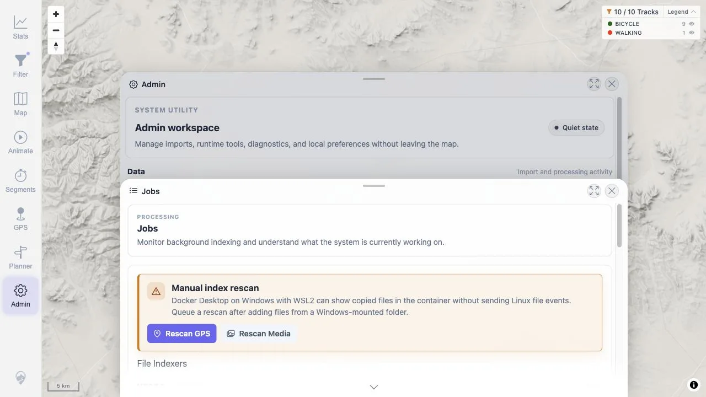</a>
<a href="assets/ADM_03-jobs-refreshed.webp">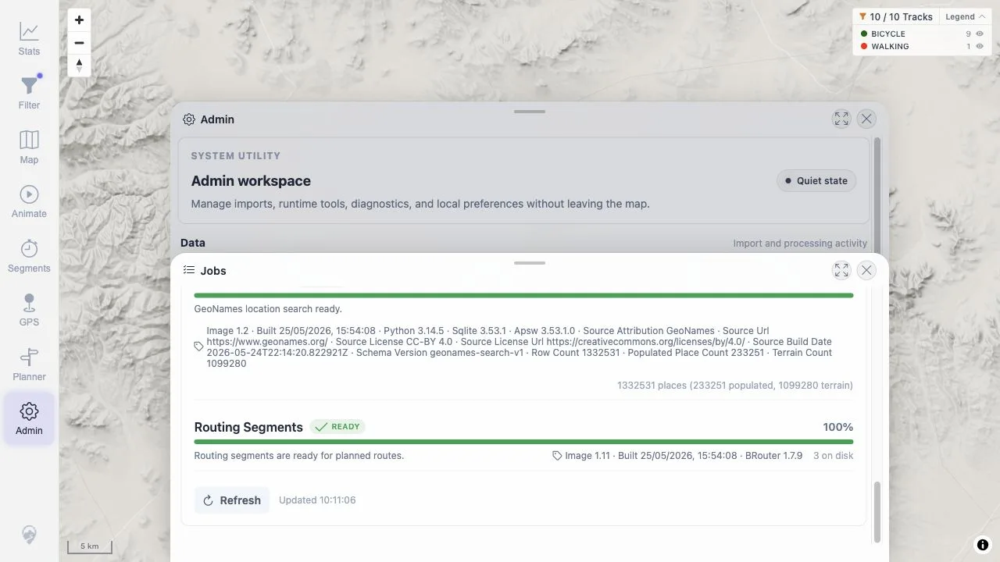</a>

**Text Evidence**
- [assets/ADM_03-indexer-status.txt](assets/ADM_03-indexer-status.txt) - Compact UI/API status details for indexers and background jobs. (893 B)

Excerpt: assets/ADM_03-indexer-status.txt

<pre><code>Jobs panel evidence:
- Opened Admin -&gt; Jobs after ADM_02 upload triggered a freshness banner.
- File Indexers:
  - MEDIA DONE 100%, 5 / 5 total.
  - GPS DONE 80%, displayed counts 17 / 2 / 21 total.
- Track Processing Jobs:
  - Duplicate Finder DONE 100%, 17 / 17 total.
  - Activity Classifier DONE 100%, 15 / 15 total.
  - Exploration Score DONE 100%, 13 / 13 total.
- Refresh button updated the panel timestamp from 10:10:09 to 10:11:06.

API status evidence:
- /api/indexer/status:
  - MEDIA total=5 pending=0 completed=5 failed=0 removed=0 excluded=0 progressPercent=100
  - GPS total=21 pending=0 completed=17 failed=2 removed=2 excluded=0 progressPercent=80
- /api/jobs/status:
  - Duplicate Finder total=17 pending=0 done=17 progressPercent=100
  - Activity Classifier total=15 pending=0 done=15 progressPercent=100
  - Exploration Score total=13 pending=0 done=13 progressPercent=100
</code></pre>

### Packet ADM_04

- Packet file: [packets/ADM_04.md](packets/ADM_04.md)
- Coverage ID: `ADM_04`
- Status: **PASS**
- Action: Clicked `Rescan GPS` and `Rescan Media`, observed messages/status, and used map zoom after rescans.
- Expected: Rescan actions show queued/already-running/not-ready states without breaking map interaction.
- Actual: GPS and MEDIA rescans showed clear queued messages; MEDIA briefly showed `SCANNING`. The ready indexers completed too quickly to produce `ALREADY_RUNNING`, and not-ready was not applicable. Map zoom still changed scale from 5 km to 10 km.

**Timings**

| Step | Timing |
|---|---:|
| Rescan controls and map zoom check | <2 min |

**Handoff Notes**
- Completed: ADM_04 passed.
- Remaining unfinished coverage: ADM_05 through RUN_CLEANUP.
- Blocked or not applicable: Not-ready state did not apply because indexers were ready.
- State left for the next packet: Jobs panel remains open; freshness banner remains visible; map scale is 10 km.

**Evidence**

<a href="assets/ADM_04-rescan-controls.webp">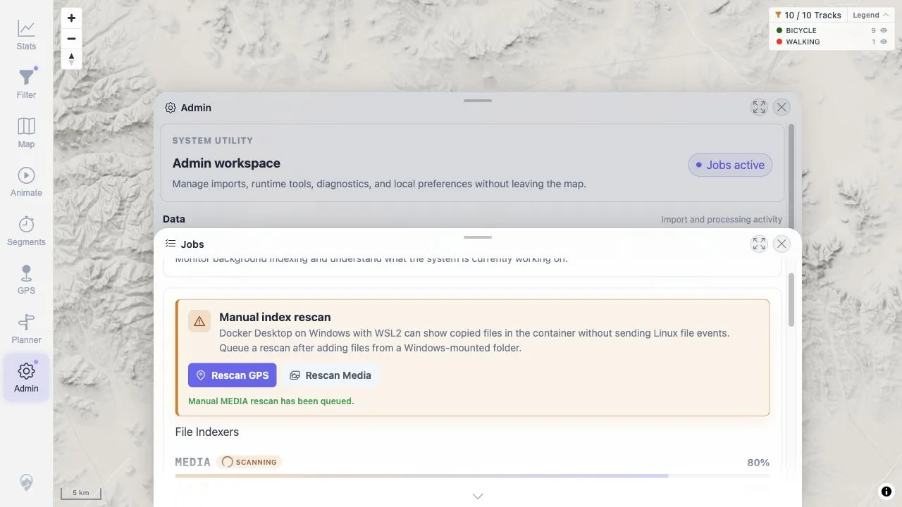</a>

**Text Evidence**
- [assets/ADM_04-rescan-results.txt](assets/ADM_04-rescan-results.txt) - UI/API rescan messages and map-interaction check. (821 B)

Excerpt: assets/ADM_04-rescan-results.txt

<pre><code>Manual rescan UI evidence:
- Clicked Rescan GPS -&gt; UI message: Manual GPS rescan has been queued.
- Clicked Rescan Media -&gt; UI message: Manual MEDIA rescan has been queued.
- Media indexer briefly displayed SCANNING 80% with 4 completed / 1 pending / 5 total.
- Map interaction after rescans: Zoom out changed the map scale from 5 km to 10 km.

Manual rescan API evidence:
- POST /api/indexer/GPS/rescan -&gt; {"index":"GPS","status":"STARTED","message":"Manual GPS rescan has been queued."}
- POST /api/indexer/MEDIA/rescan -&gt; {"index":"MEDIA","status":"STARTED","message":"Manual MEDIA rescan has been queued."}
- Immediate repeated MEDIA requests returned STARTED rather than ALREADY_RUNNING because the scan completed quickly.

Not-ready state: not applicable in this run because both GPS and MEDIA indexers were ready.
</code></pre>

### Packet ADM_05

- Packet file: [packets/ADM_05.md](packets/ADM_05.md)
- Coverage ID: `ADM_05`
- Status: **PASS**
- Action: Refreshed Jobs and checked Duplicate Finder and Exploration Score rows.
- Expected: Background job progress is visible and settles after imports.
- Actual: Duplicate Finder and Exploration Score were visible as `DONE 100%`; API reported pending=0 and done=total for all background jobs.

**Timings**

| Step | Timing |
|---|---:|
| Refresh and inspect background jobs | <1 min |

**Handoff Notes**
- Completed: ADM_05 passed.
- Remaining unfinished coverage: ADM_06 through RUN_CLEANUP.
- Blocked or not applicable: None.
- State left for the next packet: Jobs panel remains open; freshness banner remains visible.

**Evidence**

<a href="assets/ADM_05-background-jobs.webp">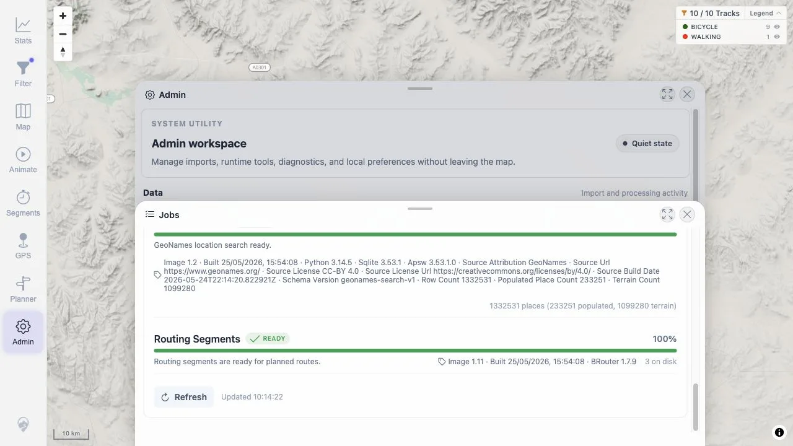</a>

**Text Evidence**
- [assets/ADM_05-background-jobs.txt](assets/ADM_05-background-jobs.txt) - Compact UI/API job status evidence. (513 B)

Excerpt: assets/ADM_05-background-jobs.txt

<pre><code>Jobs panel evidence after ADM_02 upload and ADM_04 rescans:
- Duplicate Finder: DONE, 100%, 17 / 17 total.
- Activity Classifier: DONE, 100%, 15 / 15 total.
- Exploration Score: DONE, 100%, 13 / 13 total.
- Refresh timestamp: Updated 10:14:22.

API /api/jobs/status:
- duplicate / Duplicate Finder: total=17 pending=0 done=17 progressPercent=100
- activityType / Activity Classifier: total=15 pending=0 done=15 progressPercent=100
- exploration / Exploration Score: total=13 pending=0 done=13 progressPercent=100
</code></pre>

### Packet ADM_06

- Packet file: [packets/ADM_06.md](packets/ADM_06.md)
- Coverage ID: `ADM_06`
- Status: **PASS**
- Action: Inspected Map & Routing rows and checked map, location-search, and planner status endpoints.
- Expected: Vector map tiles, location search, and routing segment status show ready/downloading/unavailable/disabled states with useful detail.
- Actual: Healthy-run ready states were shown with detail: hosted map service, GeoNames ready, and BRouter routing segments ready with 3 segments on disk. Disabled/downloading/unavailable states did not occur in this run.

**Timings**

| Step | Timing |
|---|---:|
| Inspect UI and endpoints | <1 min |

**Handoff Notes**
- Completed: ADM_06 passed.
- Remaining unfinished coverage: ADM_07 through RUN_CLEANUP.
- Blocked or not applicable: Sidecar outage/downloading/disabled states were not applicable to this healthy quick-install run.
- State left for the next packet: Jobs panel remains open; freshness banner remains visible.

**Evidence**

<a href="assets/ADM_06-operational-tasks.webp">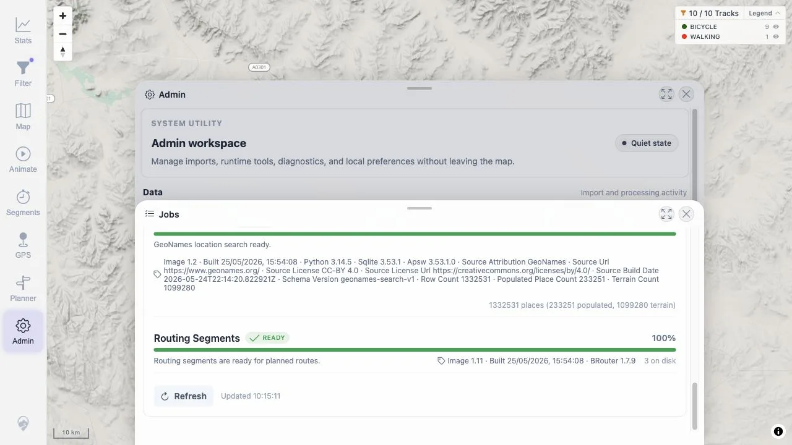</a>

**Text Evidence**
- [assets/ADM_06-operational-tasks.txt](assets/ADM_06-operational-tasks.txt) - UI and endpoint status details. (1006 B)

Excerpt: assets/ADM_06-operational-tasks.txt

<pre><code>Operational task UI evidence:
- Vector Map Tiles: DONE 100%; detail `Using hosted map service`; metric `Protomaps archive public-default`; state `Hosted map service`.
- Location Search: DONE 100%; detail `GeoNames location search ready`; metric `1332531 places (233251 populated, 1099280 terrain)`.
- Routing Segments: READY 100%; detail `Routing segments are ready for planned routes`; metric `3 on disk`; BRouter 1.7.9.

Endpoint evidence:
- /api/map/config -&gt; tileMode=local, tileSource=public, archiveId=public-default, plannerEnabled=true.
- /api/map/status -&gt; phase=public-fallback, ready=true, download_pct=100, message=Using hosted map service.
- /api/location-search/status -&gt; phase=ready, ready=true, message=GeoNames location search ready.
- /api/planner/status -&gt; available=true, brouterRunning=true, segmentsOnDisk=3, segmentsQueued=0, segmentsInProgress=[].

Unavailable/downloading/disabled states did not occur in this healthy quick-install run; ready/hosted states included useful detail.
</code></pre>

### Packet ADM_07

- Packet file: [packets/ADM_07.md](packets/ADM_07.md)
- Coverage ID: `ADM_07`
- Status: **PASS**
- Action: Opened Admin -> Freshness and inspected the existing data freshness banner.
- Expected: Shows last-update timestamp and offers reload.
- Actual: Banner offered `Reload` and `Dismiss`; Freshness panel showed `Out of sync`, checked time, latest change timestamp, server/client tokens, outdated domains, and healthy polling.

**Timings**

| Step | Timing |
|---|---:|
| Inspect Freshness panel | <1 min |

**Handoff Notes**
- Completed: ADM_07 passed.
- Remaining unfinished coverage: ADM_08 through RUN_CLEANUP.
- Blocked or not applicable: None.
- State left for the next packet: Freshness panel is open; data reload banner remains unclicked for SYN coverage.

**Evidence**

<a href="assets/ADM_07-freshness-panel.webp">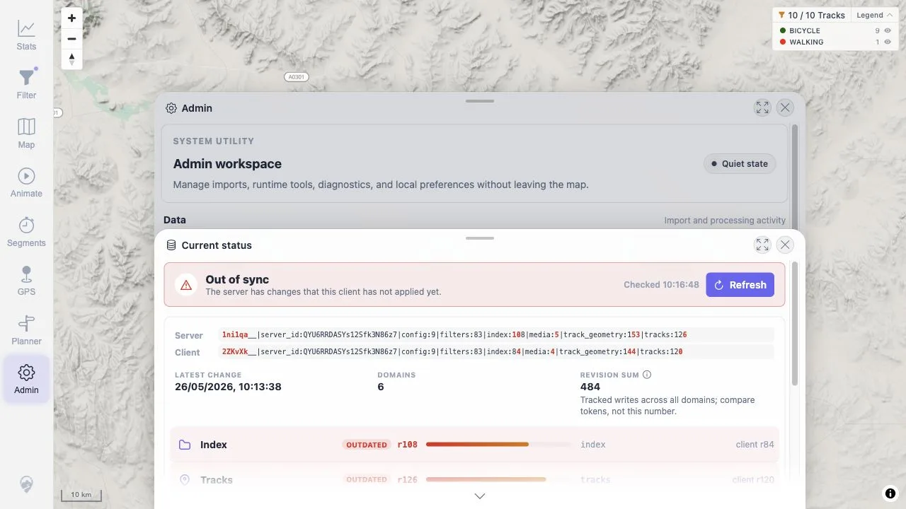</a>

**Text Evidence**
- [assets/ADM_07-freshness.txt](assets/ADM_07-freshness.txt) - Compact freshness tokens/timestamps and banner actions. (592 B)

Excerpt: assets/ADM_07-freshness.txt

<pre><code>Freshness banner:
- Message: New data available
- Detail: Tracks, media, or settings changed since this view loaded.
- Actions visible: Reload, Dismiss

Admin Freshness panel:
- Current status: Out of sync
- Detail: The server has changes that this client has not applied yet.
- Checked: 10:16:48
- Server token: index=108, media=5, track_geometry=153, tracks=126
- Client token: index=84, media=4, track_geometry=144, tracks=120
- Latest change: 26/05/2026, 10:13:38
- Domains: 6
- Revision sum: 484
- Outdated domains shown: Index, Tracks, Geometry, Media
- Polling status: Polling healthy
</code></pre>

### Packet ADM_08

- Packet file: [packets/ADM_08.md](packets/ADM_08.md)
- Coverage ID: `ADM_08`
- Status: **PASS**
- Action: Opened Admin -> Log and clicked Refresh.
- Expected: Server log lines load and refresh.
- Actual: Timestamped server log lines loaded; Refresh added/advanced visible API request entries.

**Timings**

| Step | Timing |
|---|---:|
| Open log and refresh | <1 min |

**Handoff Notes**
- Completed: ADM_08 passed.
- Remaining unfinished coverage: ADM_09 through RUN_CLEANUP.
- Blocked or not applicable: None.
- State left for the next packet: Log panel is open; freshness banner remains visible.

**Evidence**

<a href="assets/ADM_08-server-log.webp">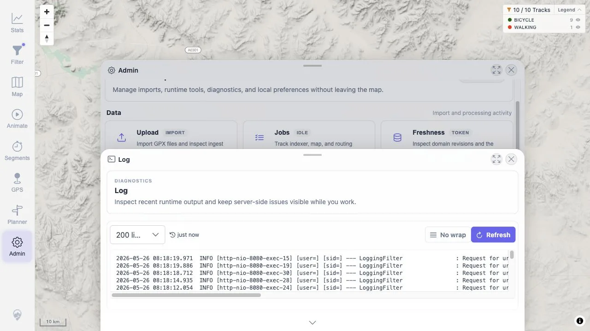</a>

**Text Evidence**
- [assets/ADM_08-server-log.txt](assets/ADM_08-server-log.txt) - Compact summary of representative loaded/refreshed log lines. (490 B)

Excerpt: assets/ADM_08-server-log.txt

<pre><code>Server Log panel evidence:
- Opened Admin -&gt; Log.
- Log lines loaded with timestamped Spring/LoggingFilter entries.
- Representative entries included:
  - 2026-05-26 08:17:48.671 / Request for url=/mtl/api/data-freshness / status=200 / method=GET
  - 2026-05-26 08:17:54.774 / Request for url=/mtl/api/map/status / status=200 / method=GET
  - 2026-05-26 08:18:04.854 / Request for url=/mtl/api/map/status / status=200 / method=GET
- Clicked Refresh; newer log lines were visible afterward.
</code></pre>

### Packet ADM_09

- Packet file: [packets/ADM_09.md](packets/ADM_09.md)
- Coverage ID: `ADM_09`
- Status: **PASS**
- Action: Opened Admin -> Attribution and reviewed listed sources.
- Expected: Shows expected map/data sources.
- Actual: Attribution listed expected rendering, basemap, trail overlay, chart, location search, conversion, and routing sources including OpenStreetMap, Protomaps, swisstopo, SchweizMobil, GeoNames, GPSBabel, and BRouter.

**Timings**

| Step | Timing |
|---|---:|
| Open and inspect Attribution | <1 min |

**Handoff Notes**
- Completed: ADM_09 passed.
- Remaining unfinished coverage: ADM_10 through RUN_CLEANUP.
- Blocked or not applicable: None.
- State left for the next packet: Attribution panel is open; freshness banner remains visible.

**Evidence**

<a href="assets/ADM_09-attribution.webp">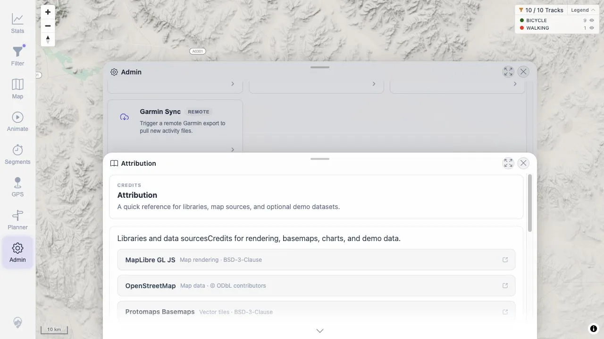</a>

**Text Evidence**
- [assets/ADM_09-attribution.txt](assets/ADM_09-attribution.txt) - Compact list of attribution entries. (594 B)

Excerpt: assets/ADM_09-attribution.txt

<pre><code>Admin Attribution panel listed:
- MapLibre GL JS / Map rendering / BSD-3-Clause
- OpenStreetMap / Map data / ODbL contributors
- Protomaps Basemaps / Vector tiles / BSD-3-Clause
- PMTiles / Tile archive format / BSD-3-Clause
- Terrarium DEM / Elevation tiles / USGS, NGA, NASA
- swisstopo / Swiss national maps
- SchweizMobil / Trail overlays
- Waymarked Trails / Worldwide route overlays / OSM data / CC BY-SA
- Highcharts / Charts / Non-commercial use
- GeoNames / Location search gazetteer / CC BY 4.0
- GPSBabel / GPS file format conversion / GPL-2.0
- BRouter / Offline bike routing / MIT
</code></pre>

### Packet ADM_10

- Packet file: [packets/ADM_10.md](packets/ADM_10.md)
- Coverage ID: `ADM_10`
- Status: **PASS**
- Action: Opened Helpers, checked tool status, then clicked the `gcexport` Install action.
- Expected: Garmin export tools, if present, show installed exporter status; install/update actions report success or error.
- Actual: Helpers showed `2/2 READY`; API reported both exporter environments present. The `gcexport` install action returned clear output saying the existing venv was already present and active version was updated in DB.

**Timings**

| Step | Timing |
|---|---:|
| Tool status and one install action | <2 min |

**Handoff Notes**
- Completed: ADM_10 passed.
- Remaining unfinished coverage: ADM_11 through RUN_CLEANUP.
- Blocked or not applicable: External Garmin account sync was out of scope; tool status/install reporting was covered.
- State left for the next packet: Helpers panel open; freshness banner remains visible.

**Evidence**

<a href="assets/ADM_10-helpers.webp">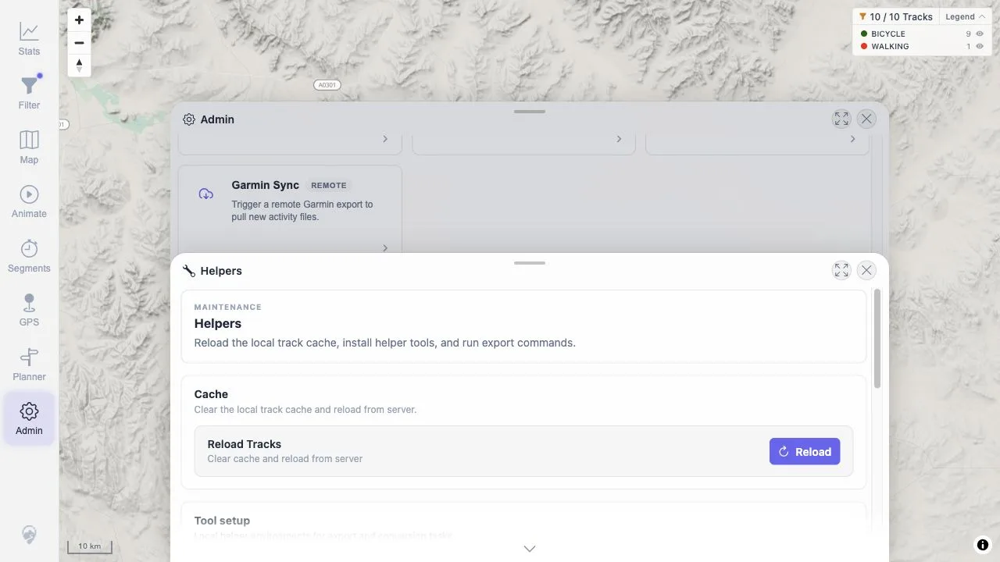</a>
<a href="assets/ADM_10-helper-install-output.webp">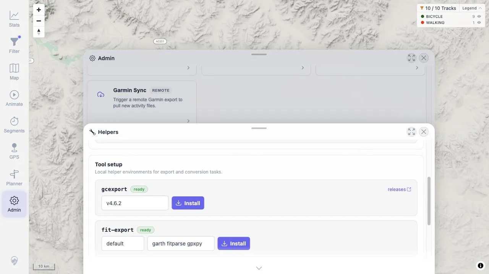</a>

**Text Evidence**
- [assets/ADM_10-garmin-tools.txt](assets/ADM_10-garmin-tools.txt) - Tool status endpoint and install output summary. (617 B)

Excerpt: assets/ADM_10-garmin-tools.txt

<pre><code>Helpers/Garmin export tool status:
- Helpers tile showed 2/2 READY.
- Tool setup rows:
  - gcexport: ready, releases
  - fit-export: ready
- /api/garmin-export/tool-status:
  - gcexportConfiguredVersion=v4.6.2
  - gcexportVenvPresent=true
  - fitExportConfiguredProfile=default
  - fitExportConfiguredPackages=garth fitparse gpxpy
  - fitExportVenvPresent=true

Install action evidence:
- Clicked the gcexport Install action.
- Command output reported:
  - Admin install: gcexport version=v4.6.2
  - SKIP: venv_gcexport_v4.6.2 already present - no install needed.
  - gcexport active version updated to v4.6.2 in DB.
</code></pre>

### Packet ADM_11

- Packet file: [packets/ADM_11.md](packets/ADM_11.md)
- Coverage ID: `ADM_11`
- Status: **PASS**
- Action: Closed Admin via the navigation tool, then reopened it.
- Expected: Closing/reopening the dialog does not lose state mid-action.
- Actual: Reopening restored the Admin workspace with the Helpers panel still open and the recent gcexport command output intact.

**Timings**

| Step | Timing |
|---|---:|
| Close/reopen Admin | <1 min |

**Handoff Notes**
- Completed: ADM_11 passed.
- Remaining unfinished coverage: SYN_01 through RUN_CLEANUP.
- Blocked or not applicable: None.
- State left for the next packet: Admin/Helpers panel open; freshness banner remains visible and unclicked.

**Evidence**

**Text Evidence**
- [assets/ADM_11-close-reopen.txt](assets/ADM_11-close-reopen.txt) - Recorded state before close, after close, and after reopen. (603 B)

Excerpt: assets/ADM_11-close-reopen.txt

<pre><code>Close/reopen sequence:
1. Started with Helpers panel open after the ADM_10 gcexport install action output.
2. Clicked the Admin navigation tool to close the Admin workspace.
   - Main `Admin workspace` text disappeared.
   - The active Helpers child panel/output remained visible.
3. Clicked Admin again to reopen.
   - `Admin workspace` returned.
   - Helpers panel remained open.
   - Command output still included `[TOOL-INSTALL] ... gcexport active version updated to v4.6.2 in DB.`

Conclusion: closing and reopening Admin did not lose the in-progress/recent Helpers panel state or command output.
</code></pre>

### Packet APP_01

- Packet file: [packets/APP_01.md](packets/APP_01.md)
- Coverage ID: `APP_01`
- Status: **PASS**
- Action: Opened Admin -> Settings and switched Light -> Dark -> Light -> Dark.
- Expected: Whole UI re-themes immediately.
- Actual: `data-theme` and pressed Settings controls changed immediately for light and dark; visible Admin/Settings colors changed with the selected scheme.

**Timings**

| Step | Timing |
|---|---:|
| Theme toggle checks | <2 min |

**Handoff Notes**
- Completed: APP_01 passed.
- Remaining unfinished coverage: APP_02 through RUN_CLEANUP.
- Blocked or not applicable: None.
- State left for the next packet: Dark mode selected.

**Evidence**

**Text Evidence**
- [assets/APP_01_02-theme-switch.txt](assets/APP_01_02-theme-switch.txt) - Theme switch state and color evidence. (727 B)

Excerpt: assets/APP_01_02-theme-switch.txt

<pre><code>Theme switch sequence:
- Started in Settings with Light selected.
- Clicked Dark.
  - document data-theme: dark
  - pressed button: Dark
  - button sample text/background contrast: 6.96
  - panel text color changed to rgb(226, 232, 240)
- Clicked Light.
  - document data-theme: light
  - pressed button: Light
  - button sample text/background contrast: 7.07
  - panel text color changed to rgb(51, 65, 85)
- Clicked Dark again for persistence testing.
  - document data-theme: dark
  - pressed button: Dark

Accessibility/readability note:
- No white-on-white or black-on-black text was observed in the Settings and Admin controls during the switch.
- The sampled active theme buttons exceeded 4.5:1 contrast in both themes.
</code></pre>

### Packet APP_02

- Packet file: [packets/APP_02.md](packets/APP_02.md)
- Coverage ID: `APP_02`
- Status: **PASS**
- Action: Sampled Settings/Admin text and button colors in both themes during APP_01.
- Expected: No text is unreadable in either theme.
- Actual: No white-on-white or black-on-black text was observed; sampled active theme buttons had contrast ratios of 7.07 in light and 6.96 in dark.

**Timings**

| Step | Timing |
|---|---:|
| Readability sampling | <1 min |

**Handoff Notes**
- Completed: APP_02 passed.
- Remaining unfinished coverage: APP_03 through RUN_CLEANUP.
- Blocked or not applicable: None.
- State left for the next packet: Dark mode selected.

**Evidence**

**Text Evidence**
- [assets/APP_01_02-theme-switch.txt](assets/APP_01_02-theme-switch.txt) - Contrast/readability notes from both themes. (727 B)

Excerpt: assets/APP_01_02-theme-switch.txt

<pre><code>Theme switch sequence:
- Started in Settings with Light selected.
- Clicked Dark.
  - document data-theme: dark
  - pressed button: Dark
  - button sample text/background contrast: 6.96
  - panel text color changed to rgb(226, 232, 240)
- Clicked Light.
  - document data-theme: light
  - pressed button: Light
  - button sample text/background contrast: 7.07
  - panel text color changed to rgb(51, 65, 85)
- Clicked Dark again for persistence testing.
  - document data-theme: dark
  - pressed button: Dark

Accessibility/readability note:
- No white-on-white or black-on-black text was observed in the Settings and Admin controls during the switch.
- The sampled active theme buttons exceeded 4.5:1 contrast in both themes.
</code></pre>

### Packet APP_03

- Packet file: [packets/APP_03.md](packets/APP_03.md)
- Coverage ID: `APP_03`
- Status: **PASS**
- Action: Rendered Stats Trends in light, switched to dark through Settings without page reload, and rendered Trends again.
- Expected: Charts re-color on theme switch without needing a reload.
- Actual: Highcharts text fill changed from `rgb(100, 116, 139)` in light to `rgb(148, 163, 184)` in dark; eight chart roots rendered in both states.

**Timings**

| Step | Timing |
|---|---:|
| Chart theme switch check | <3 min |

**Handoff Notes**
- Completed: APP_03 passed.
- Remaining unfinished coverage: APP_04 through RUN_CLEANUP.
- Blocked or not applicable: None.
- State left for the next packet: Dark mode selected.

**Evidence**

**Text Evidence**
- [assets/APP_03-chart-theme.txt](assets/APP_03-chart-theme.txt) - Highcharts color evidence before/after theme switch. (502 B)

Excerpt: assets/APP_03-chart-theme.txt

<pre><code>Stats Trends chart color evidence without page reload:
- Light theme:
  - data-theme: light
  - Highcharts root count: 8
  - chart text fill: rgb(100, 116, 139)
  - chart background fill: transparent
- Switched to dark through Admin -&gt; Settings without reloading the page.
- Dark theme:
  - data-theme: dark
  - Highcharts root count: 8
  - chart text fill: rgb(148, 163, 184)
  - chart background fill: transparent

Conclusion: chart text colors changed with the selected theme without a page reload.
</code></pre>

### Packet APP_04

- Packet file: [packets/APP_04.md](packets/APP_04.md)
- Coverage ID: `APP_04`
- Status: **PASS**
- Action: Reloaded in dark mode, logged out safely, and signed back in.
- Expected: Selected theme persists across reload and login.
- Actual: `data-theme` remained `dark` after reload, on the login page, and after signing back in.

**Timings**

| Step | Timing |
|---|---:|
| Reload, logout, login | <3 min |

**Handoff Notes**
- Completed: APP_04 passed.
- Remaining unfinished coverage: APP_05 through RUN_CLEANUP.
- Blocked or not applicable: None.
- State left for the next packet: Signed in, dark mode selected.

**Evidence**

**Text Evidence**
- [assets/APP_04_05-theme-persistence.txt](assets/APP_04_05-theme-persistence.txt) - Reload/login theme persistence observations. (656 B)

Excerpt: assets/APP_04_05-theme-persistence.txt

<pre><code>Theme persistence sequence:
- Dark mode was selected in Settings.
- Hard page reload returned to /mtl/.
  - document data-theme after reload: dark
  - map loaded with 12 / 12 Tracks.
- Safe logout reached /mtl/login.
  - login page document data-theme: dark
- Signed back in with README credentials.
  - document data-theme after login: dark
  - map loaded with 12 / 12 Tracks.

Hard-refresh flash check:
- The first captured post-DOM-load state after hard reload already had data-theme=dark.
- The app's `useTheme.ts` applies the stored scheme at module import before Vue mounts, which supports avoiding a light mounted state before dark mode is applied.
</code></pre>

### Packet APP_05

- Packet file: [packets/APP_05.md](packets/APP_05.md)
- Coverage ID: `APP_05`
- Status: **PASS**
- Action: Hard reloaded while dark mode was selected and inspected the first captured post-load theme state plus startup theme code.
- Expected: Hard refresh in dark mode does not flash light theme first.
- Actual: The first captured post-DOM-load state already had `data-theme=dark`; the app applies the stored scheme at `useTheme.ts` module import before Vue mounts. No light mounted state was observed.

**Timings**

| Step | Timing |
|---|---:|
| Hard reload dark-mode check | <1 min |

**Handoff Notes**
- Completed: APP_05 passed.
- Remaining unfinished coverage: APP_06 through RUN_CLEANUP.
- Blocked or not applicable: Frame-by-frame first-paint capture was not available; DOM post-load state and startup code were verified.
- State left for the next packet: Signed in, dark mode selected.

**Evidence**

**Text Evidence**
- [assets/APP_04_05-theme-persistence.txt](assets/APP_04_05-theme-persistence.txt) - Hard-reload dark-mode state evidence. (656 B)

Excerpt: assets/APP_04_05-theme-persistence.txt

<pre><code>Theme persistence sequence:
- Dark mode was selected in Settings.
- Hard page reload returned to /mtl/.
  - document data-theme after reload: dark
  - map loaded with 12 / 12 Tracks.
- Safe logout reached /mtl/login.
  - login page document data-theme: dark
- Signed back in with README credentials.
  - document data-theme after login: dark
  - map loaded with 12 / 12 Tracks.

Hard-refresh flash check:
- The first captured post-DOM-load state after hard reload already had data-theme=dark.
- The app's `useTheme.ts` applies the stored scheme at module import before Vue mounts, which supports avoiding a light mounted state before dark mode is applied.
</code></pre>

**Referenced But Not Found**
- mtl-client/src/composables/useTheme.ts

### Packet APP_07

- Packet file: [packets/APP_07.md](packets/APP_07.md)
- Coverage ID: `APP_07`
- Status: **PASS**
- Action: Selected OSM Dark, hard reloaded, reopened Map panel, and inspected active style.
- Expected: Selected map style persists across reload.
- Actual: After reload, the dark UI remained active and OSM Dark still had the active check.

**Timings**

| Step | Timing |
|---|---:|
| Select style and reload | <1 min |

**Handoff Notes**
- Completed: APP_07 passed.
- Remaining unfinished coverage: APP_08 through RUN_CLEANUP.
- Blocked or not applicable: None.
- State left for the next packet: Signed in, dark UI theme, OSM Dark selected.

**Evidence**

**Text Evidence**
- [assets/APP_07-map-style-persistence.txt](assets/APP_07-map-style-persistence.txt) - Map style persistence observations before and after reload. (509 B)

Excerpt: assets/APP_07-map-style-persistence.txt

<pre><code>APP_07 selected map style persistence evidence

Target: http://178.105.173.254:18080/mtl/
Browser state before test: signed in, UI theme dark.

Actions:
1. Opened Map panel.
2. Selected OSM Dark as the active base style.
3. Hard reloaded the page.
4. Reopened Map panel and inspected active base style.

Observed after reload:
- UI theme remained dark.
- Active base style retained the check on OSM Dark.
- Map returned to usable state after reload.

Result: PASS. Selected map style persisted across reload.
</code></pre>

### Packet APP_08

- Packet file: [packets/APP_08.md](packets/APP_08.md)
- Coverage ID: `APP_08`
- Status: **PASS**
- Action: Changed Base Map opacity to 45%, reloaded, reset defaults, changed GPS Tracks opacity to 50%, reloaded again, then reset defaults.
- Expected: Layer opacity sliders, basemap dimming, and reset-to-defaults all behave and persist.
- Actual: Base Map opacity changed the tile container to `opacity: 0.45` and persisted after reload. GPS Tracks opacity persisted at 50% after reload. Reset restored OSM Topo, Base Map 100%, GPS Tracks 100%, and Heatmap disabled.

**Timings**

| Step | Timing |
|---|---:|
| Opacity, reload, and reset checks | <4 min |

**Handoff Notes**
- Completed: APP_08 passed.
- Remaining unfinished coverage: LOC_01 through RUN_CLEANUP.
- Blocked or not applicable: None.
- State left for the next packet: Signed in, dark UI theme, OSM Topo selected, Base Map and GPS Tracks at 100%, Photos & Media and Heatmap disabled.

**Evidence**

**Text Evidence**
- [assets/APP_08-opacity-reset.txt](assets/APP_08-opacity-reset.txt) - Layer opacity, persistence, and reset observations. (1.1 KB)

Excerpt: assets/APP_08-opacity-reset.txt

<pre><code>APP_08 layer opacity and reset evidence

Target: http://178.105.173.254:18080/mtl/
Browser state before test: signed in, UI theme dark.

Initial state with OSM Dark selected:
- Base Map enabled, slider handle 100%.
- GPS Tracks enabled, slider handle 100%.
- Photos &amp; Media disabled.
- Track Points &amp; Direction enabled, slider handle 100%.
- Heatmap enabled, slider handle 100.

Base map opacity:
- Changed Base Map slider to 45%.
- Leaflet base container style became: filter: grayscale(0.55) brightness(1.22); opacity: 0.45;
- Hard reload preserved active OSM Dark style and Base Map handle 45%.
- Base container style after reload still included opacity: 0.45.

Reset after base map opacity change:
- Reset restored active/default OSM Topo.
- Base Map returned to 100%.
- GPS Tracks returned to 100%.
- Heatmap returned to disabled.

GPS track opacity:
- Changed GPS Tracks slider to 50% after reset.
- Hard reload preserved GPS Tracks at 50%.
- Final reset restored GPS Tracks to 100%, Base Map to 100%, and active/default OSM Topo.

Result: PASS. Layer opacity sliders, basemap dimming, persistence, and reset-to-defaults behaved as expected for the tested layers.
</code></pre>

### Packet AVR_03

- Packet file: [packets/AVR_03.md](packets/AVR_03.md)
- Coverage ID: `AVR_03`
- Status: **PASS**
- Action: After virtual race playback, closed Race and Segment Analyzer overlays, zoomed the map, dragged/panned it, opened and closed location search.
- Expected: Stopping or finishing animation/race leaves map gestures and tools usable with no stuck markers/listeners/cursors.
- Actual: Race overlays closed; map returned to normal state with `10 Tracks`, zoom changed from 30 km to 20 km scale, pan/drag worked, and location search opened/closed normally.

**Timings**

| Step | Timing |
|---|---:|
| Post-race cleanup usability check | <5m |

**Handoff Notes**
- Completed: AVR_03 terminal PASS.
- Remaining unfinished coverage: continue with MED_01.
- Blocked or not applicable: none.
- State left for the next packet: normal map view, no Segment Analyzer or Race overlay open.

**Evidence**

<a href="assets/AVR_03-after-race-close.webp">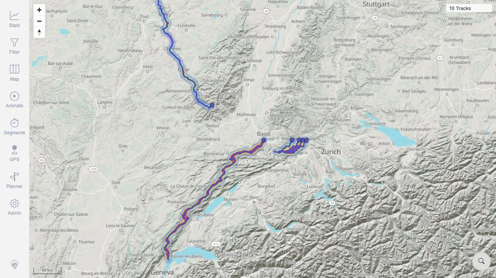</a>
<a href="assets/AVR_03-map-usable.webp">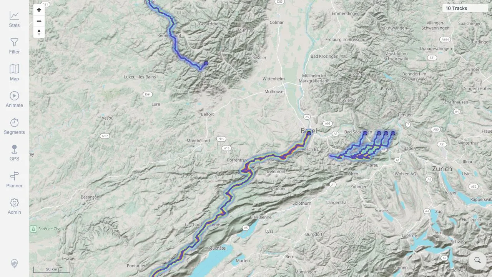</a>

**Text Evidence**
- [assets/AVR_03-map-usable.txt](assets/AVR_03-map-usable.txt) - DOM excerpt confirming normal map controls and 10-track state. (717 B)

Excerpt: assets/AVR_03-map-usable.txt

<pre><code>- region "Map"
- region "Map"
- button "Zoom in"
- button "Zoom out"
- button "Drag to rotate map, click to reset north"
- text: 
- generic: 20 km
- button "Search location":
  - generic: 
- generic: 10 Tracks
- button " Stats":
  - generic: 
  - generic: Stats
- button " Filter":
  - generic: 
  - generic: Filter
- button " Map":
  - generic: 
  - generic: Map
- button " Animate":
  - generic: 
  - generic: Animate
- button " Segments":
  - generic: 
  - generic: Segments
- button " GPS":
  - generic: 
  - generic: GPS
- button " Planner":
  - generic: 
  - generic: Planner
- button " Admin":
  - generic: 
  - generic: Admin
- button "About MTL Explorer"</code></pre>

### Packet DAT_01

- Packet file: [packets/DAT_01.md](packets/DAT_01.md)
- Coverage ID: `DAT_01`
- Status: **PASS**
- Action: Downloaded and counted trackpoints for five public GPX files from the suggested GitHub raw URLs.
- Expected: At least five public GPX files contain real `trk`/`trkseg`/`trkpt` sequences.
- Actual: All five GPX files have real `trkpt` counts: 1414, 2954, 1688, 1298, and 381.

**Timings**

| Step | Timing |
|---|---:|
| Public data download and validation | <1m |

**Handoff Notes**
- Completed: DAT_01 status `PASS`.
- Remaining unfinished coverage: continue queue.
- Blocked or not applicable: none unless stated in the row.
- State left for the next packet: source files staged outside watched import folder.

**Evidence**

**Text Evidence**
- [assets/DAT_03-source-manifest.txt](assets/DAT_03-source-manifest.txt) - Source URLs/notes, destination filenames, checksums, byte sizes, GPX trkpt counts, and timestamp counts. (980 B)

Excerpt: assets/DAT_03-source-manifest.txt

<pre><code>Source page/license notes:
GPX: https://github.com/gps-touring/sample-gpx (public GitHub sample GPX repository; license file not identified in quick data source check)
FIT: https://github.com/garmin/fit-javascript-sdk test/data/Activity.fit (Garmin public SDK sample repository)

Manifest:
filename	bytes	sha256	trkpt_count	time_count
JuraRoute72011.gpx	199962	fcff577bd3c1a6dc2bb9e53abba8051d510d282f4fb0049d38be5300f92e354e	1414	1415
Lannion_Plestin_parcours24.4RE.gpx	60917	e76c692cbb5580f20013ce19995a9383361a8a0babec2db3e36f7064f316e85f	381	382
MoselradwegAusWiki.gpx	415326	0f5263dee95a345a42585bde148ec741af4ed4eeb7451702f59c9c7f9bf761c3	2954	2955
Vitry-le-Francois_Langres.gpx	238349	401218e3c1d1f366ee27ea8bc138d8422eff3bf6348a77183be83fef3e8d7d67	1688	1689
VoieVerteHauteVosges.gpx	183733	0f417d6e76cfa581d3ada969e728694933fbffd062f61a8352ccc87637135f78	1298	1299
Activity.fit	94096	949a238e1bb75c3684479785f76fa9a16888bb394518844248f488171d591387	FIT_BINARY	FIT_BINARY
</code></pre>

### Packet DAT_02

- Packet file: [packets/DAT_02.md](packets/DAT_02.md)
- Coverage ID: `DAT_02`
- Status: **PASS**
- Action: Counted timestamp tags in the five GPX files.
- Expected: Prefer timestamped trackpoints for duration/speed/statistics verification.
- Actual: All five GPX files include timestamp counts matching trackpoint counts plus metadata time tags.

**Timings**

| Step | Timing |
|---|---:|
| Public data download and validation | <1m |

**Handoff Notes**
- Completed: DAT_02 status `PASS`.
- Remaining unfinished coverage: continue queue.
- Blocked or not applicable: none unless stated in the row.
- State left for the next packet: source files staged outside watched import folder.

**Evidence**

**Text Evidence**
- [assets/DAT_03-source-manifest.txt](assets/DAT_03-source-manifest.txt) - Source URLs/notes, destination filenames, checksums, byte sizes, GPX trkpt counts, and timestamp counts. (980 B)

Excerpt: assets/DAT_03-source-manifest.txt

<pre><code>Source page/license notes:
GPX: https://github.com/gps-touring/sample-gpx (public GitHub sample GPX repository; license file not identified in quick data source check)
FIT: https://github.com/garmin/fit-javascript-sdk test/data/Activity.fit (Garmin public SDK sample repository)

Manifest:
filename	bytes	sha256	trkpt_count	time_count
JuraRoute72011.gpx	199962	fcff577bd3c1a6dc2bb9e53abba8051d510d282f4fb0049d38be5300f92e354e	1414	1415
Lannion_Plestin_parcours24.4RE.gpx	60917	e76c692cbb5580f20013ce19995a9383361a8a0babec2db3e36f7064f316e85f	381	382
MoselradwegAusWiki.gpx	415326	0f5263dee95a345a42585bde148ec741af4ed4eeb7451702f59c9c7f9bf761c3	2954	2955
Vitry-le-Francois_Langres.gpx	238349	401218e3c1d1f366ee27ea8bc138d8422eff3bf6348a77183be83fef3e8d7d67	1688	1689
VoieVerteHauteVosges.gpx	183733	0f417d6e76cfa581d3ada969e728694933fbffd062f61a8352ccc87637135f78	1298	1299
Activity.fit	94096	949a238e1bb75c3684479785f76fa9a16888bb394518844248f488171d591387	FIT_BINARY	FIT_BINARY
</code></pre>

### Packet DAT_03

- Packet file: [packets/DAT_03.md](packets/DAT_03.md)
- Coverage ID: `DAT_03`
- Status: **PASS**
- Action: Recorded source URL/license notes, destination filenames, checksums, byte sizes, and GPX counts; imported IDs/names are pending until import completes.
- Expected: Every source file record includes source URL/note, destination filename, checksum, byte size, counts, imported IDs, and imported names.
- Actual: Source metadata is recorded and imported track IDs/names were added from `IMP_06`.

**Timings**

| Step | Timing |
|---|---:|
| Public data download and validation | <1m |

**Handoff Notes**
- Completed: DAT_03 status `PASS`.
- Remaining unfinished coverage: none.
- Blocked or not applicable: none unless stated in the row.
- State left for the next packet: source files staged outside watched import folder.

**Evidence**

**Text Evidence**
- [assets/DAT_03-source-manifest.txt](assets/DAT_03-source-manifest.txt) - Source URLs/notes, destination filenames, checksums, byte sizes, GPX trkpt counts, and timestamp counts. (980 B)

Excerpt: assets/DAT_03-source-manifest.txt

<pre><code>Source page/license notes:
GPX: https://github.com/gps-touring/sample-gpx (public GitHub sample GPX repository; license file not identified in quick data source check)
FIT: https://github.com/garmin/fit-javascript-sdk test/data/Activity.fit (Garmin public SDK sample repository)

Manifest:
filename	bytes	sha256	trkpt_count	time_count
JuraRoute72011.gpx	199962	fcff577bd3c1a6dc2bb9e53abba8051d510d282f4fb0049d38be5300f92e354e	1414	1415
Lannion_Plestin_parcours24.4RE.gpx	60917	e76c692cbb5580f20013ce19995a9383361a8a0babec2db3e36f7064f316e85f	381	382
MoselradwegAusWiki.gpx	415326	0f5263dee95a345a42585bde148ec741af4ed4eeb7451702f59c9c7f9bf761c3	2954	2955
Vitry-le-Francois_Langres.gpx	238349	401218e3c1d1f366ee27ea8bc138d8422eff3bf6348a77183be83fef3e8d7d67	1688	1689
VoieVerteHauteVosges.gpx	183733	0f417d6e76cfa581d3ada969e728694933fbffd062f61a8352ccc87637135f78	1298	1299
Activity.fit	94096	949a238e1bb75c3684479785f76fa9a16888bb394518844248f488171d591387	FIT_BINARY	FIT_BINARY
</code></pre>

- [assets/IMP_06-imported-track-mapping.txt](assets/IMP_06-imported-track-mapping.txt) - Imported track IDs and visible track names. (919 B)

Excerpt: assets/IMP_06-imported-track-mapping.txt

<pre><code>Imported GPX mapping after five-file import.

| Source file | Imported track id | Visible track name | UI evidence |
|---|---:|---|---|
| Vitry-le-Francois_Langres.gpx | 100000 | Vitry le françois - langres on GPSies.com | Track browser row and stats highlights |
| JuraRoute72011.gpx | 100001 | Jura Route 7 / 2011 on GPSies.com | Track browser row and stats highlights |
| MoselradwegAusWiki.gpx | 100002 | Moselradweg aus Wiki on GPSies.com | Track browser row and stats highlights |
| Lannion_Plestin_parcours24.4RE.gpx | 100003 | Lannion_Plestin_parcours Lannion_Plestin_parcours1 | Track browser row and recent activity |
| VoieVerteHauteVosges.gpx | 100004 | voie verte haute vosges on GPSies.com | Track browser row and recent activity |

Track ids came from app ingest log SUCCESS lines in `IMP_03-index-monitor.txt`.
Visible names came from the Stats &gt; Tracks table in `IMP_06-track-list-after-import.webp`.
</code></pre>

### Packet DAT_04

- Packet file: [packets/DAT_04.md](packets/DAT_04.md)
- Coverage ID: `DAT_04`
- Status: **PASS**
- Action: Used the five suggested `gps-touring/sample-gpx` raw GPX files.
- Expected: Suggested verified GPX source is used or an equivalent public source is recorded.
- Actual: All five staged GPX files are from the suggested `gps-touring/sample-gpx` repository.

**Timings**

| Step | Timing |
|---|---:|
| Public data download and validation | <1m |

**Handoff Notes**
- Completed: DAT_04 status `PASS`.
- Remaining unfinished coverage: continue queue.
- Blocked or not applicable: none unless stated in the row.
- State left for the next packet: source files staged outside watched import folder.

**Evidence**

**Text Evidence**
- [assets/DAT_03-source-manifest.txt](assets/DAT_03-source-manifest.txt) - Source URLs/notes, destination filenames, checksums, byte sizes, GPX trkpt counts, and timestamp counts. (980 B)

Excerpt: assets/DAT_03-source-manifest.txt

<pre><code>Source page/license notes:
GPX: https://github.com/gps-touring/sample-gpx (public GitHub sample GPX repository; license file not identified in quick data source check)
FIT: https://github.com/garmin/fit-javascript-sdk test/data/Activity.fit (Garmin public SDK sample repository)

Manifest:
filename	bytes	sha256	trkpt_count	time_count
JuraRoute72011.gpx	199962	fcff577bd3c1a6dc2bb9e53abba8051d510d282f4fb0049d38be5300f92e354e	1414	1415
Lannion_Plestin_parcours24.4RE.gpx	60917	e76c692cbb5580f20013ce19995a9383361a8a0babec2db3e36f7064f316e85f	381	382
MoselradwegAusWiki.gpx	415326	0f5263dee95a345a42585bde148ec741af4ed4eeb7451702f59c9c7f9bf761c3	2954	2955
Vitry-le-Francois_Langres.gpx	238349	401218e3c1d1f366ee27ea8bc138d8422eff3bf6348a77183be83fef3e8d7d67	1688	1689
VoieVerteHauteVosges.gpx	183733	0f417d6e76cfa581d3ada969e728694933fbffd062f61a8352ccc87637135f78	1298	1299
Activity.fit	94096	949a238e1bb75c3684479785f76fa9a16888bb394518844248f488171d591387	FIT_BINARY	FIT_BINARY
</code></pre>

### Packet DAT_05

- Packet file: [packets/DAT_05.md](packets/DAT_05.md)
- Coverage ID: `DAT_05`
- Status: **PASS**
- Action: Downloaded Garmin public `Activity.fit` sample.
- Expected: At least one public GPS-bearing FIT activity file is staged.
- Actual: `Activity.fit` from Garmin `fit-javascript-sdk` was staged with SHA-256 recorded.

**Timings**

| Step | Timing |
|---|---:|
| Public data download and validation | <1m |

**Handoff Notes**
- Completed: DAT_05 status `PASS`.
- Remaining unfinished coverage: continue queue.
- Blocked or not applicable: none unless stated in the row.
- State left for the next packet: source files staged outside watched import folder.

**Evidence**

**Text Evidence**
- [assets/DAT_03-source-manifest.txt](assets/DAT_03-source-manifest.txt) - Source URLs/notes, destination filenames, checksums, byte sizes, GPX trkpt counts, and timestamp counts. (980 B)

Excerpt: assets/DAT_03-source-manifest.txt

<pre><code>Source page/license notes:
GPX: https://github.com/gps-touring/sample-gpx (public GitHub sample GPX repository; license file not identified in quick data source check)
FIT: https://github.com/garmin/fit-javascript-sdk test/data/Activity.fit (Garmin public SDK sample repository)

Manifest:
filename	bytes	sha256	trkpt_count	time_count
JuraRoute72011.gpx	199962	fcff577bd3c1a6dc2bb9e53abba8051d510d282f4fb0049d38be5300f92e354e	1414	1415
Lannion_Plestin_parcours24.4RE.gpx	60917	e76c692cbb5580f20013ce19995a9383361a8a0babec2db3e36f7064f316e85f	381	382
MoselradwegAusWiki.gpx	415326	0f5263dee95a345a42585bde148ec741af4ed4eeb7451702f59c9c7f9bf761c3	2954	2955
Vitry-le-Francois_Langres.gpx	238349	401218e3c1d1f366ee27ea8bc138d8422eff3bf6348a77183be83fef3e8d7d67	1688	1689
VoieVerteHauteVosges.gpx	183733	0f417d6e76cfa581d3ada969e728694933fbffd062f61a8352ccc87637135f78	1298	1299
Activity.fit	94096	949a238e1bb75c3684479785f76fa9a16888bb394518844248f488171d591387	FIT_BINARY	FIT_BINARY
</code></pre>

### Packet DAT_06

- Packet file: [packets/DAT_06.md](packets/DAT_06.md)
- Coverage ID: `DAT_06`
- Status: **PASS**
- Action: Validated that positive GPX evidence has trackpoint sequences and deferred FIT positive evidence until conversion/display/export packets.
- Expected: Do not count non-GPS FIT files or waypoint-only GPX as positive evidence.
- Actual: No waypoint-only GPX was counted; FIT will be counted as positive only after `FIT_02`/`FIT_05` conversion and GPX export evidence.

**Timings**

| Step | Timing |
|---|---:|
| Public data download and validation | <1m |

**Handoff Notes**
- Completed: DAT_06 status `PASS`.
- Remaining unfinished coverage: continue queue.
- Blocked or not applicable: none unless stated in the row.
- State left for the next packet: source files staged outside watched import folder.

**Evidence**

**Text Evidence**
- [assets/DAT_03-source-manifest.txt](assets/DAT_03-source-manifest.txt) - Source URLs/notes, destination filenames, checksums, byte sizes, GPX trkpt counts, and timestamp counts. (980 B)

Excerpt: assets/DAT_03-source-manifest.txt

<pre><code>Source page/license notes:
GPX: https://github.com/gps-touring/sample-gpx (public GitHub sample GPX repository; license file not identified in quick data source check)
FIT: https://github.com/garmin/fit-javascript-sdk test/data/Activity.fit (Garmin public SDK sample repository)

Manifest:
filename	bytes	sha256	trkpt_count	time_count
JuraRoute72011.gpx	199962	fcff577bd3c1a6dc2bb9e53abba8051d510d282f4fb0049d38be5300f92e354e	1414	1415
Lannion_Plestin_parcours24.4RE.gpx	60917	e76c692cbb5580f20013ce19995a9383361a8a0babec2db3e36f7064f316e85f	381	382
MoselradwegAusWiki.gpx	415326	0f5263dee95a345a42585bde148ec741af4ed4eeb7451702f59c9c7f9bf761c3	2954	2955
Vitry-le-Francois_Langres.gpx	238349	401218e3c1d1f366ee27ea8bc138d8422eff3bf6348a77183be83fef3e8d7d67	1688	1689
VoieVerteHauteVosges.gpx	183733	0f417d6e76cfa581d3ada969e728694933fbffd062f61a8352ccc87637135f78	1298	1299
Activity.fit	94096	949a238e1bb75c3684479785f76fa9a16888bb394518844248f488171d591387	FIT_BINARY	FIT_BINARY
</code></pre>

### Packet DEL_01

- Packet file: [packets/DEL_01.md](packets/DEL_01.md)
- Coverage ID: `DEL_01`
- Status: **PASS**
- Action: Deleted `Vitry-le-Francois_Langres.gpx` and `VoieVerteHauteVosges.gpx` from the watched folder.
- Expected: Two imported source files are removed from the documented import folder.
- Actual: Both files were removed from `data/gpx`; Jura, Lannion, and Mosel remained.

**Timings**

| Step | Timing |
|---|---:|
| Delete flow step | <1m |

**Handoff Notes**
- Completed: DEL_01 terminal PASS.
- Remaining unfinished coverage: continue queue.
- Blocked or not applicable: none.
- State left for the next packet: three GPX tracks remain (Jura, Mosel, Lannion); FIT not imported yet.

**Evidence**

**Text Evidence**
- [assets/DEL_01-delete-files.txt](assets/DEL_01-delete-files.txt) - Delete command and remaining source files. (245 B)

Excerpt: assets/DEL_01-delete-files.txt

<pre><code>DELETE_START=2026-05-26T04:23:37+00:00
DELETED=data/gpx/Vitry-le-Francois_Langres.gpx data/gpx/VoieVerteHauteVosges.gpx
Remaining GPX files:
data/gpx/JuraRoute72011.gpx
data/gpx/Lannion_Plestin_parcours24.4RE.gpx
data/gpx/MoselradwegAusWiki.gpx
</code></pre>

### Packet DEL_02

- Packet file: [packets/DEL_02.md](packets/DEL_02.md)
- Coverage ID: `DEL_02`
- Status: **PASS**
- Action: Monitored deletion processing after source-file removal.
- Expected: Automatic delete processing runs or Rescan GPS is triggered and recorded.
- Actual: Watcher/indexer removed track IDs 100000 and 100004 automatically; no manual rescan was needed.

**Timings**

| Step | Timing |
|---|---:|
| Delete flow step | <1m |

**Handoff Notes**
- Completed: DEL_02 terminal PASS.
- Remaining unfinished coverage: continue queue.
- Blocked or not applicable: none.
- State left for the next packet: three GPX tracks remain (Jura, Mosel, Lannion); FIT not imported yet.

**Evidence**

**Text Evidence**
- [assets/DEL_02-delete-monitor.txt](assets/DEL_02-delete-monitor.txt) - Cropped delete monitor log. (404 B)

Excerpt: assets/DEL_02-delete-monitor.txt

<pre><code>POLL=1 DELETE_HINTS=2
app-1  | 2026-05-26T04:23:45.388Z  INFO 1 --- [idx-4] GPXStoreService              : Did delete gpsTrack and it's track data for given id=100004 file=/VoieVerteHauteVosges.gpx
app-1  | 2026-05-26T04:23:45.436Z  INFO 1 --- [idx-2] GPXStoreService              : Did delete gpsTrack and it's track data for given id=100000 file=/Vitry-le-Francois_Langres.gpx
DELETE_MONITOR_SECONDS=0
</code></pre>

### Packet DEL_03

- Packet file: [packets/DEL_03.md](packets/DEL_03.md)
- Coverage ID: `DEL_03`
- Status: **PASS**
- Action: Refreshed UI and checked map, browser/search, filter context, heatmap, and stats/list totals after deletion.
- Expected: Deleted tracks disappear from map, browser, filter results, heatmap, selection/detail surfaces, related lists, and stats totals.
- Actual: Map and heatmap dropped from 5 to 3 tracks; track list contained only Jura/Mosel/Lannion; searches for Vitry and Voie returned no matching tracks; filter panel opened against the 3-track state. Related-list deletion will also be rechecked in later TRD related coverage.

**Timings**

| Step | Timing |
|---|---:|
| Delete flow step | <1m |

**Handoff Notes**
- Completed: DEL_03 terminal PASS.
- Remaining unfinished coverage: continue queue.
- Blocked or not applicable: none.
- State left for the next packet: three GPX tracks remain (Jura, Mosel, Lannion); FIT not imported yet.

**Evidence**

<a href="assets/DEL_03-map-after-delete.webp">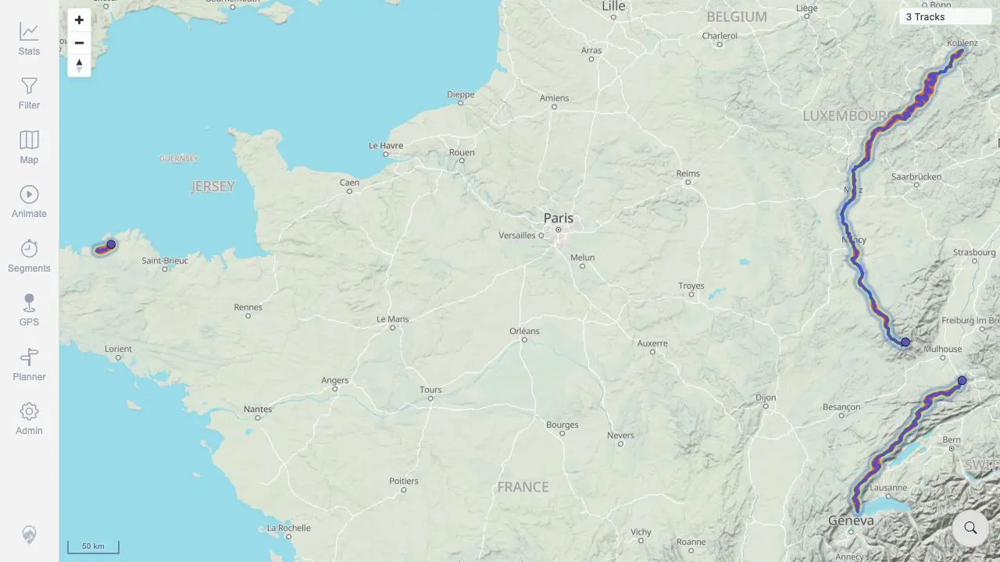</a>
<a href="assets/DEL_03-track-list-after-delete.webp">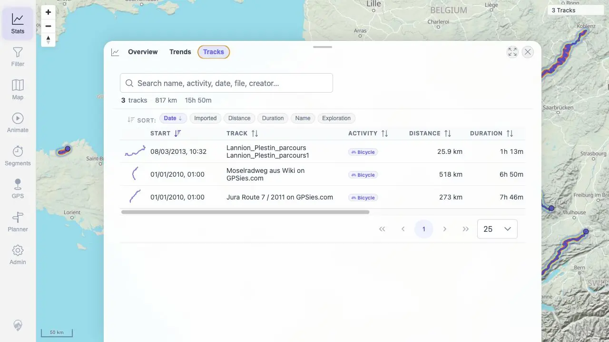</a>
<a href="assets/DEL_03-filter-after-delete.webp">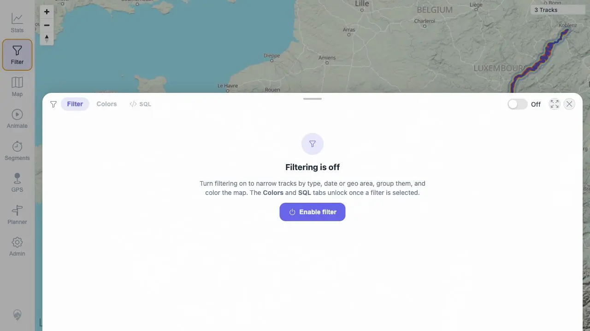</a>

**Text Evidence**
- [assets/DEL_03-track-list-after-delete.txt](assets/DEL_03-track-list-after-delete.txt) - Remaining track rows after deletion. (353 B)

Excerpt: assets/DEL_03-track-list-after-delete.txt

<pre><code>08/03/2013, 10:32 Lannion_Plestin_parcours Lannion_Plestin_parcours1 Bicycle 25.9 km 1h 13m 21.1 198 Wh 100.0% 26/05/2026, 06:15
01/01/2010, 01:00 Moselradweg aus Wiki on GPSies.com Bicycle 518 km 6h 50m 75.7 1616 Wh 100.0% 26/05/2026, 06:15
01/01/2010, 01:00 Jura Route 7 / 2011 on GPSies.com Bicycle 273 km 7h 46m 35.1 1808 Wh 100.0% 26/05/2026, 06:15</code></pre>

- [assets/DEL_03-search-after-delete.txt](assets/DEL_03-search-after-delete.txt) - Search absence for deleted names and presence of remaining names. (533 B)

Excerpt: assets/DEL_03-search-after-delete.txt

<pre><code>QUERY=Vitry
ROW_COUNT=1
No tracks match “Vitry”

QUERY=Voie
ROW_COUNT=1
No tracks match “Voie”

QUERY=Jura
ROW_COUNT=1
01/01/2010, 01:00 Jura Route 7 / 2011 on GPSies.com Bicycle 273 km 7h 46m 35.1 1808 Wh 100.0% 26/05/2026, 06:15

QUERY=Mosel
ROW_COUNT=1
01/01/2010, 01:00 Moselradweg aus Wiki on GPSies.com Bicycle 518 km 6h 50m 75.7 1616 Wh 100.0% 26/05/2026, 06:15

QUERY=Lannion
ROW_COUNT=1
08/03/2013, 10:32 Lannion_Plestin_parcours Lannion_Plestin_parcours1 Bicycle 25.9 km 1h 13m 21.1 198 Wh 100.0% 26/05/2026, 06:15
</code></pre>

### Packet DEL_04

- Packet file: [packets/DEL_04.md](packets/DEL_04.md)
- Coverage ID: `DEL_04`
- Status: **PASS**
- Action: Opened a remaining Jura track from the map after deletion.
- Expected: Remaining imported tracks still display and open correctly.
- Actual: Jura #100001 opened from the map and rendered its overview/details after deletion.

**Timings**

| Step | Timing |
|---|---:|
| Delete flow step | <1m |

**Handoff Notes**
- Completed: DEL_04 terminal PASS.
- Remaining unfinished coverage: continue queue.
- Blocked or not applicable: none.
- State left for the next packet: three GPX tracks remain (Jura, Mosel, Lannion); FIT not imported yet.

**Evidence**

<a href="assets/DEL_04-remaining-jura-opens.webp">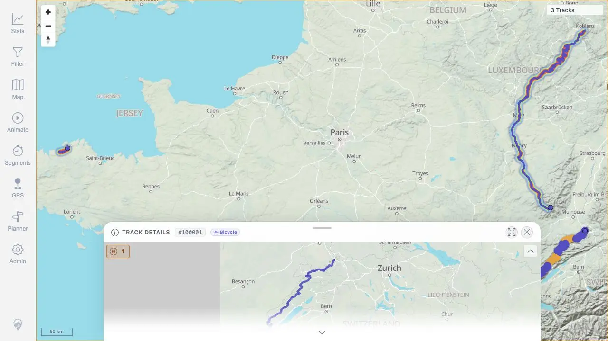</a>

### Packet DEL_05

- Packet file: [packets/DEL_05.md](packets/DEL_05.md)
- Coverage ID: `DEL_05`
- Status: **PASS**
- Action: Scoped deletion verdict to user-visible surfaces rather than stale API/URL probes.
- Expected: Deleted-track stale URLs/API probes are not pass/fail criteria for the deletion flow.
- Actual: Deletion status is based on user-visible map, heatmap, track browser/search, filter context, and remaining detail evidence.

**Timings**

| Step | Timing |
|---|---:|
| Delete flow step | <1m |

**Handoff Notes**
- Completed: DEL_05 terminal PASS.
- Remaining unfinished coverage: continue queue.
- Blocked or not applicable: none.
- State left for the next packet: three GPX tracks remain (Jura, Mosel, Lannion); FIT not imported yet.

**Evidence**

**Text Evidence**
- [assets/DEL_03-search-after-delete.txt](assets/DEL_03-search-after-delete.txt) - User-visible browser search state. (533 B)

Excerpt: assets/DEL_03-search-after-delete.txt

<pre><code>QUERY=Vitry
ROW_COUNT=1
No tracks match “Vitry”

QUERY=Voie
ROW_COUNT=1
No tracks match “Voie”

QUERY=Jura
ROW_COUNT=1
01/01/2010, 01:00 Jura Route 7 / 2011 on GPSies.com Bicycle 273 km 7h 46m 35.1 1808 Wh 100.0% 26/05/2026, 06:15

QUERY=Mosel
ROW_COUNT=1
01/01/2010, 01:00 Moselradweg aus Wiki on GPSies.com Bicycle 518 km 6h 50m 75.7 1616 Wh 100.0% 26/05/2026, 06:15

QUERY=Lannion
ROW_COUNT=1
08/03/2013, 10:32 Lannion_Plestin_parcours Lannion_Plestin_parcours1 Bicycle 25.9 km 1h 13m 21.1 198 Wh 100.0% 26/05/2026, 06:15
</code></pre>

### Packet ERR_02

- Packet file: [packets/ERR_02.md](packets/ERR_02.md)
- Coverage ID: `ERR_02`
- Status: **PASS**
- Action: Rapidly clicked Map, Stats, Filter, Planner, Segments, GPS, Animate, Admin, Map, Stats, Map, then checked active sheets, stale overlays, cursor, and map zoom.
- Expected: Rapid switching between tools does not leave stale markers, listeners, or cursors.
- Actual: Final state had one active Map sheet, zero stale track-pick/planner/segment/location/media overlays, cursor `auto`, no bad text, and map Zoom out changed scale from 300 km to 500 km.

**Timings**

| Step | Timing |
|---|---:|
| Rapid switching and map usability check | <2 min |

**Handoff Notes**
- Completed: ERR_02 passed.
- Remaining unfinished coverage: RUN_CLEANUP after finalization gate.
- Blocked or not applicable: None.
- State left for the next packet: Main browser signed in, Map sheet open, desktop viewport 1280 x 720.

**Evidence**

**Text Evidence**
- [assets/ERR_02-rapid-tool-switching.txt](assets/ERR_02-rapid-tool-switching.txt) - Rapid switching and stale-state checks. (984 B)

Excerpt: assets/ERR_02-rapid-tool-switching.txt

<pre><code>ERR_02 rapid tool switching evidence

Viewport:
- Desktop viewport restored to 1280 x 720.

Action sequence:
- Clicked Map, Stats, Filter, Planner, Segments, GPS, Animate, Admin, Map, Stats, Map with short waits between transitions.
- Every requested tool button resolved to exactly one visible locator.

Final UI state:
- Active tool: Map.
- Open sheet count: 1.
- Open sheet: Map settings, showing Maps and data, Reset, OSM Topo, Swiss Color, Swiss Light, OSM Light, OSM Dark, and layer controls.

Stale-state scan:
- Track pick overlays: 0.
- Planner markers: 0.
- Segment/measure zones: 0.
- Location search markers: 0.
- Media preview open: false.
- Map canvas cursor: auto.
- Bad text scan: no NaN, undefined, or Infinity.

Map interaction after switching:
- Zoom out button resolved to one locator.
- Scale changed from 300 km to 500 km after clicking Zoom out.

Result: PASS. Rapid tool switching left a single coherent active tool/sheet and map controls remained responsive.
</code></pre>

### Packet FIT_01

- Packet file: [packets/FIT_01.md](packets/FIT_01.md)
- Coverage ID: `FIT_01`
- Status: **PASS**
- Action: Copied Garmin `Activity.fit` into the watched import folder.
- Expected: FIT activity file with GPS positions is imported.
- Actual: `Activity.fit` copied to `data/gpx` with expected SHA-256.

**Timings**

| Step | Timing |
|---|---:|
| FIT step | <1m |

**Handoff Notes**
- Completed: FIT_01 terminal PASS.
- Remaining unfinished coverage: continue queue.
- Blocked or not applicable: none unless stated.
- State left for the next packet: dataset contains three remaining GPX tracks plus FIT track #100005.

**Evidence**

**Text Evidence**
- [assets/FIT_01-copy-fit.txt](assets/FIT_01-copy-fit.txt) - FIT copy and checksum evidence. (216 B)

Excerpt: assets/FIT_01-copy-fit.txt

<pre><code>COPY_START=2026-05-26T04:25:47+00:00
DEST=data/gpx/Activity.fit
-rw-r--r-- 1 root root 94096 May 26 04:25 data/gpx/Activity.fit
949a238e1bb75c3684479785f76fa9a16888bb394518844248f488171d591387  data/gpx/Activity.fit
</code></pre>

### Packet FIT_02

- Packet file: [packets/FIT_02.md](packets/FIT_02.md)
- Coverage ID: `FIT_02`
- Status: **PASS**
- Action: Monitored FIT conversion/import and verified map/list/stat inclusion.
- Expected: FIT is accepted, indexed successfully, displayed on map, searchable in browser, and included in statistics.
- Actual: Live watcher detected `Activity.fit`; GPSBabel converted it; import completed as #100005; map showed 4 tracks and track-browser search found `Track 100005`.

**Timings**

| Step | Timing |
|---|---:|
| FIT step | <1m |

**Handoff Notes**
- Completed: FIT_02 terminal PASS.
- Remaining unfinished coverage: continue queue.
- Blocked or not applicable: none unless stated.
- State left for the next packet: dataset contains three remaining GPX tracks plus FIT track #100005.

**Evidence**

<a href="assets/FIT_02-track-list-after-fit.webp">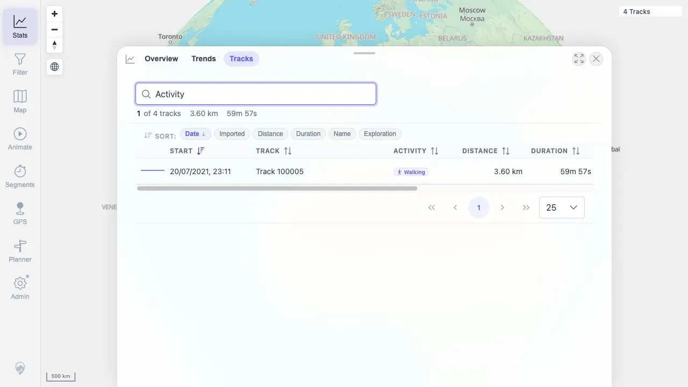</a>

**Text Evidence**
- [assets/FIT_02-index-monitor.txt](assets/FIT_02-index-monitor.txt) - FIT watcher/GPSBabel/SUCCESS lines. (1.8 KB)

Excerpt: assets/FIT_02-index-monitor.txt

<pre><code>POLL=1 waiting
app-1  | 2026-05-26T04:25:47.146Z  INFO 1 --- [watch-GPS] FileIndexerImpl              : Live watcher detected CREATE for: Activity.fit
POLL=2 FIT_STATUS=SUCCESS
app-1  | 2026-05-26T04:25:47.146Z  INFO 1 --- [watch-GPS] FileIndexerImpl              : Live watcher detected CREATE for: Activity.fit
app-1  | 2026-05-26T04:25:57.158Z  INFO 1 --- [idx-1] TrackFileConverterService    : Converting Activity.fit (FIT) to GPX: gpsbabel -i garmin_fit -f /app/gpx/Activity.fit -o gpx,gpxver=1.1 -F -
app-1  | 2026-05-26T04:25:57.183Z  INFO 1 --- [idx-1] TrackFileConverterService    : GPSBabel converted Activity.fit → 479844 chars of GPX XML
app-1  | 2026-05-26T04:25:57.464Z  INFO 1 --- [idx-1] GPXReader                    : Track Data Summary:   - Outlier Corrector: GPXReader distance/probation filter   - Outliers Found: false   - Outliers Cleared By Corrector: 0 point(s)   - Distances (m):       • Max:    1.0       • Median: 1.0       • Avg:    1.0 file=Activity.fit
app-1  | 2026-05-26T04:25:58.280Z  INFO 1 --- [idx-1] GPXStoreService              : GPS simplified timing trackId=100005 file=/Activity.fit total=60ms details=1m 15ms (2 pts), 5m 10ms (2 pts), 10m 8ms (2 pts), 50m 7ms (2 pts), 100m 6ms (2 pts), 500m 7ms (2 pts), 1000m 7ms (2 pts)
app-1  | 2026-05-26T04:25:58.281Z  INFO 1 --- [idx-1] GPXStoreService              : GPS ingest timing trackId=100005 file=/Activity.fit status=SUCCESS Timing total 1.12s; slowest raw points 261ms, cleaned points 250ms, denoise 219ms, parse XML 133ms, break-stop filter 123ms, simplified shapes 60ms, gpsbabel 27ms, outlier filter 15ms.
app-1  | 2026-05-26T04:25:58.283Z  INFO 1 --- [idx-1] GPXStoreService              : Reading of track id=100005 and path= file=Activity.fit did complete with status=SUCCESS and took processingTime=1.13s
FIT_MONITOR_SECONDS=2
</code></pre>

- [assets/FIT_02-track-list-search-fit.txt](assets/FIT_02-track-list-search-fit.txt) - FIT search row text. (83 B)

Excerpt: assets/FIT_02-track-list-search-fit.txt

<pre><code>20/07/2021, 23:11 Track 100005 Walking 3.60 km 59m 57s 3.6 347 Wh 26/05/2026, 06:25</code></pre>

### Packet FIT_03

- Packet file: [packets/FIT_03.md](packets/FIT_03.md)
- Coverage ID: `FIT_03`
- Status: **PASS**
- Action: Opened FIT-backed track details and switched Overview, Graphs, Quality, Related, and Events.
- Expected: FIT detail overview, graphs, quality, events, related tracks, mini-map, and point surfaces render like GPX-backed tracks.
- Actual: FIT #100005 opened; overview, graphs, quality, related, and events tabs rendered; mini-map was visible; events tab correctly showed no track events.

**Timings**

| Step | Timing |
|---|---:|
| FIT step | <1m |

**Handoff Notes**
- Completed: FIT_03 terminal PASS.
- Remaining unfinished coverage: continue queue.
- Blocked or not applicable: none unless stated.
- State left for the next packet: dataset contains three remaining GPX tracks plus FIT track #100005.

**Evidence**

<a href="assets/FIT_03-fit-detail-overview.webp">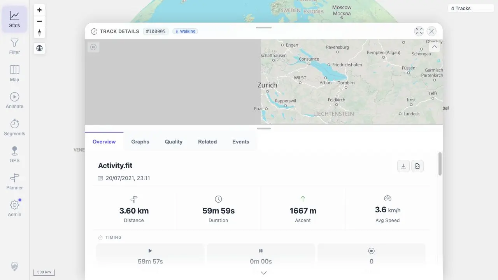</a>
<a href="assets/FIT_03-fit-graphs.webp">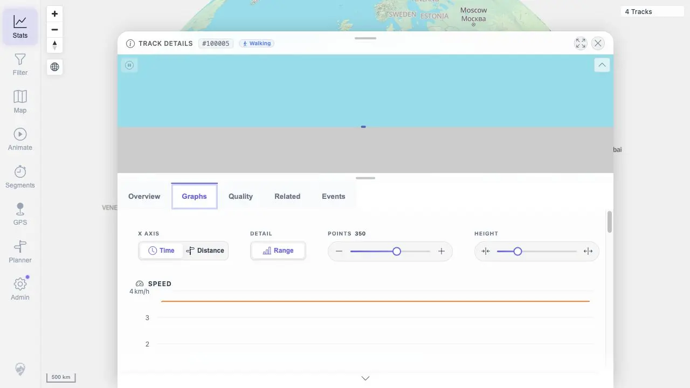</a>
<a href="assets/FIT_03-fit-quality.webp">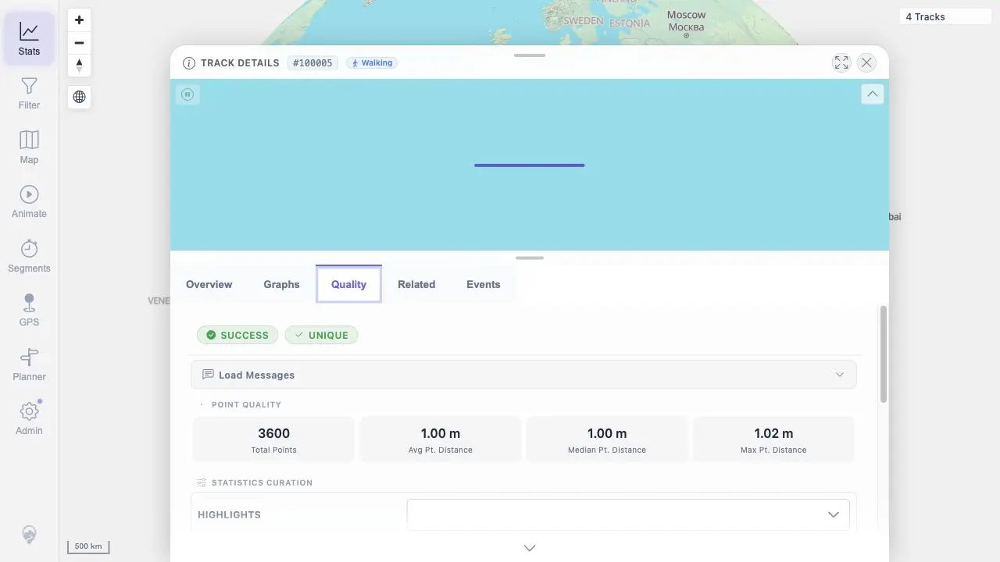</a>
<a href="assets/FIT_03-fit-related.webp">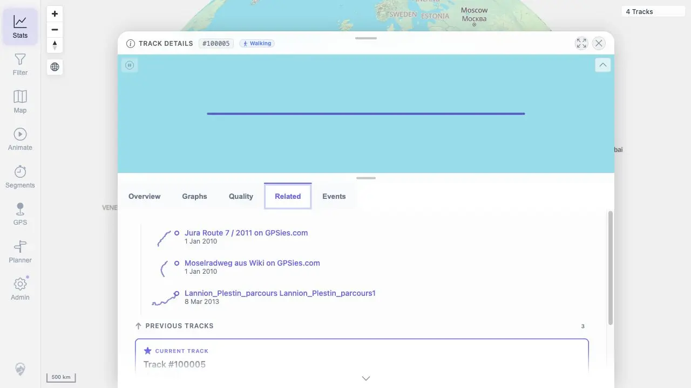</a>
<a href="assets/FIT_03-fit-events.webp">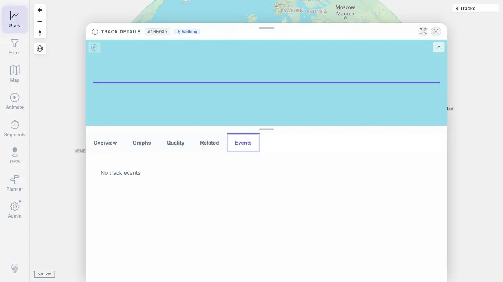</a>

### Packet FIT_04

- Packet file: [packets/FIT_04.md](packets/FIT_04.md)
- Coverage ID: `FIT_04`
- Status: **PASS**
- Action: Used visible Download original control evidence, then downloaded original source via the authenticated installed-app endpoint because in-app browser file downloads are unsupported.
- Expected: Downloaded original source remains FIT and matches uploaded checksum.
- Actual: Downloaded `Activity.fit` was 94,096 bytes with SHA-256 `949a238e...d591387`, matching the uploaded file.

**Timings**

| Step | Timing |
|---|---:|
| FIT step | <1m |

**Handoff Notes**
- Completed: FIT_04 terminal PASS.
- Remaining unfinished coverage: continue queue.
- Blocked or not applicable: none unless stated.
- State left for the next packet: dataset contains three remaining GPX tracks plus FIT track #100005.

**Evidence**

<a href="assets/FIT_04_05-download-controls.webp">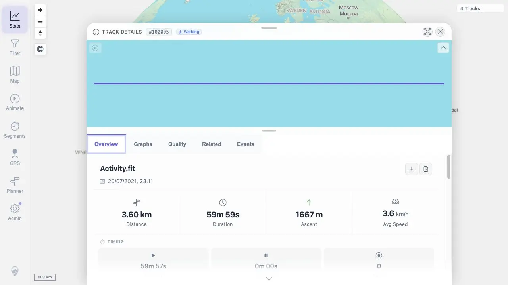</a>

**Text Evidence**
- [assets/FIT_04_05-download-verification.txt](assets/FIT_04_05-download-verification.txt) - Checksum and endpoint verification. (698 B)

Excerpt: assets/FIT_04_05-download-verification.txt

<pre><code>{
  "url": "http://178.105.173.254:18080/mtl/",
  "trackId": 100005,
  "sourceEndpoint": "/mtl/api/tracks/100005/source-file",
  "gpxEndpoint": "/mtl/api/tracks/100005/gpx",
  "visibleControlsEvidence": "assets/FIT_04_05-download-controls.webp",
  "originalBytes": 94096,
  "originalSha256": "949a238e1bb75c3684479785f76fa9a16888bb394518844248f488171d591387",
  "originalMatchesUploaded": true,
  "gpxBytes": 479844,
  "gpxSha256": "8eaa4af6d85e92d4d471eb673d242748b32353f9055addddaefa525325fbc88d",
  "gpxTrkptCount": 3601,
  "gpxStartsWith": "&lt;?xml version=\"1.0\" encoding=\"UTF-8\"?&gt; &lt;gpx version=\"1.1\" creator=\"GPSBabel - https://www.gpsbabel.org\" xmlns=\"http://www.topografix.com/GPX"
}
</code></pre>

**Other Evidence Files**
- [assets/FIT_04-download-original.fit](assets/FIT_04-download-original.fit) - Downloaded original FIT file. (91.9 KB)

### Packet FIT_05

- Packet file: [packets/FIT_05.md](packets/FIT_05.md)
- Coverage ID: `FIT_05`
- Status: **PASS**
- Action: Used visible Download GPX control evidence, then downloaded GPX export via the authenticated installed-app endpoint because in-app browser file downloads are unsupported.
- Expected: Downloaded GPX is valid and contains real `trkpt` trackpoints.
- Actual: Downloaded `Activity.gpx` was 479,844 bytes and contained 3,601 `<trkpt>` points.

**Timings**

| Step | Timing |
|---|---:|
| FIT step | <1m |

**Handoff Notes**
- Completed: FIT_05 terminal PASS.
- Remaining unfinished coverage: continue queue.
- Blocked or not applicable: none unless stated.
- State left for the next packet: dataset contains three remaining GPX tracks plus FIT track #100005.

**Evidence**

**Text Evidence**
- [assets/FIT_04_05-download-verification.txt](assets/FIT_04_05-download-verification.txt) - GPX export size/checksum/trkpt count. (698 B)

Excerpt: assets/FIT_04_05-download-verification.txt

<pre><code>{
  "url": "http://178.105.173.254:18080/mtl/",
  "trackId": 100005,
  "sourceEndpoint": "/mtl/api/tracks/100005/source-file",
  "gpxEndpoint": "/mtl/api/tracks/100005/gpx",
  "visibleControlsEvidence": "assets/FIT_04_05-download-controls.webp",
  "originalBytes": 94096,
  "originalSha256": "949a238e1bb75c3684479785f76fa9a16888bb394518844248f488171d591387",
  "originalMatchesUploaded": true,
  "gpxBytes": 479844,
  "gpxSha256": "8eaa4af6d85e92d4d471eb673d242748b32353f9055addddaefa525325fbc88d",
  "gpxTrkptCount": 3601,
  "gpxStartsWith": "&lt;?xml version=\"1.0\" encoding=\"UTF-8\"?&gt; &lt;gpx version=\"1.1\" creator=\"GPSBabel - https://www.gpsbabel.org\" xmlns=\"http://www.topografix.com/GPX"
}
</code></pre>

**Other Evidence Files**
- [assets/FIT_05-download-as-gpx.gpx](assets/FIT_05-download-as-gpx.gpx) - Downloaded FIT-to-GPX export. (468.6 KB)

### Packet FLT_01

- Packet file: [packets/FLT_01.md](packets/FLT_01.md)
- Coverage ID: `FLT_01`
- Status: **PASS**
- Action: Opened the filter panel, enabled filtering to create an active filter state, closed it, then reopened Filter.
- Expected: Previously active filter is still active and visible as the current filter/chip.
- Actual: Reopening Filter kept filtering On, showed the selected Smart Base Filter, and displayed live preview status with 10 matching tracks and 2 categories.

**Timings**

| Step | Timing |
|---|---:|
| Filter reopen check | <2m |

**Handoff Notes**
- Completed: FLT_01 terminal PASS.
- Remaining unfinished coverage: continue with FLT_02.
- Blocked or not applicable: none.
- State left for the next packet: Filter panel open with filtering enabled and Smart Base Filter selected.

**Evidence**

<a href="assets/FLT_01-filter-open-initial.webp">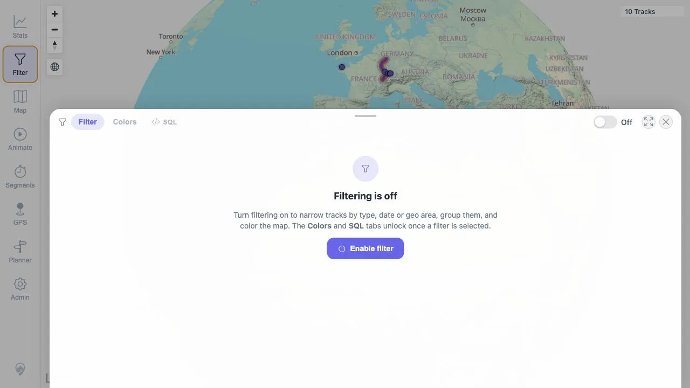</a>
<a href="assets/FLT_01-filter-reopened-active.webp">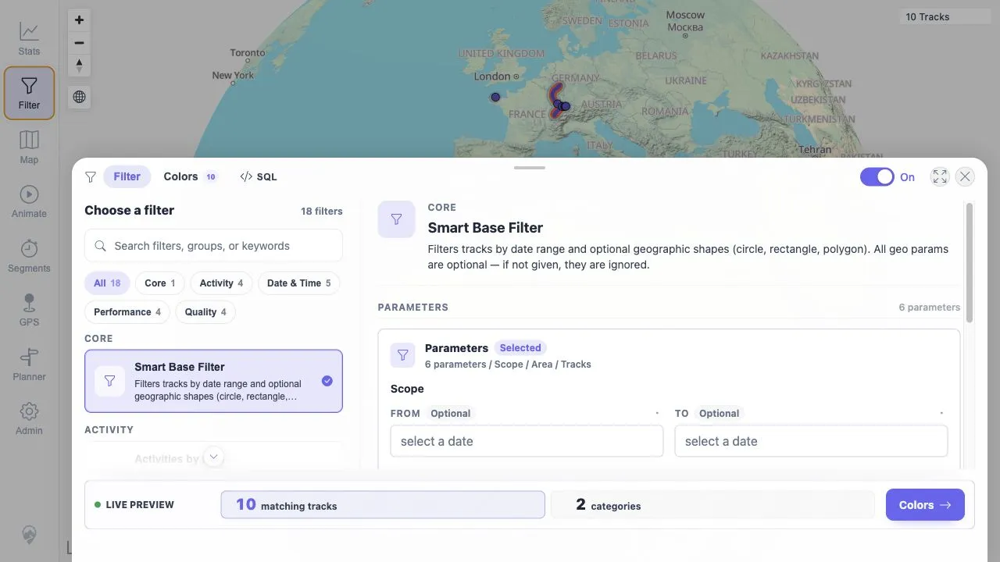</a>

### Packet FLT_02

- Packet file: [packets/FLT_02.md](packets/FLT_02.md)
- Coverage ID: `FLT_02`
- Status: **PASS**
- Action: Viewed the catalog, searched for `year`, cleared search, and selected the Activity group.
- Expected: Filter catalog browsing, search, and grouping work.
- Actual: Catalog showed 18 filters grouped as Core, Activity, Date & Time, Performance, and Quality. Searching `year` narrowed results to Date & Time matches; clearing search and selecting Activity showed its four filters.

**Timings**

| Step | Timing |
|---|---:|
| Catalog/search/group browse | <3m |

**Handoff Notes**
- Completed: FLT_02 terminal PASS.
- Remaining unfinished coverage: continue with FLT_03.
- Blocked or not applicable: none.
- State left for the next packet: Filter panel open, Activity group selected, Smart Base Filter currently active.

**Evidence**

<a href="assets/FLT_02-filter-search-year.webp">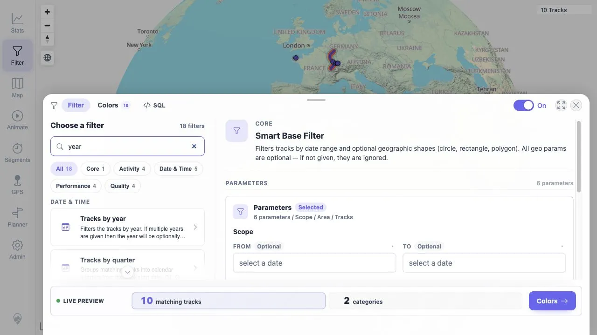</a>
<a href="assets/FLT_02-filter-group-activity-cleared.webp">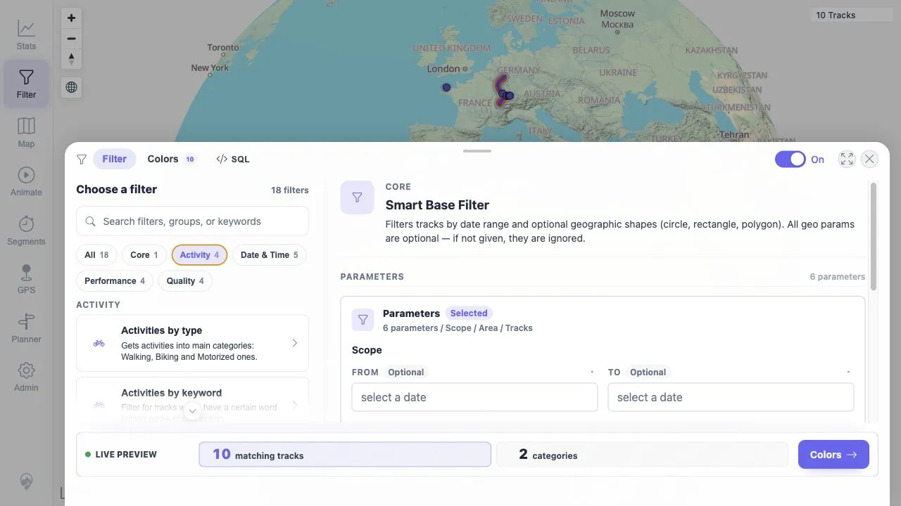</a>

### Packet FLT_06

- Packet file: [packets/FLT_06.md](packets/FLT_06.md)
- Coverage ID: `FLT_06`
- Status: **PASS**
- Action: Cleared the date lower bound to change the active keyword filter from 0/10 to 1/10, opened Stats, then cleared the keyword to restore 10/10 and reopened Stats.
- Expected: Applied filter updates visible count, map colors, legend, and stats without full page reload.
- Actual: The map count and legend changed immediately to 1/10 with one Bicycle category; Stats showed `Showing 1 of 10 tracks`. Clearing the keyword changed the map/legend to 10/10 with Bicycle and Walking categories, and Stats updated to 10 tracks and all-track totals without reload.

**Timings**

| Step | Timing |
|---|---:|
| Live filter update check | <4m |

**Handoff Notes**
- Completed: FLT_06 terminal PASS.
- Remaining unfinished coverage: continue with FLT_07.
- Blocked or not applicable: none.
- State left for the next packet: filtering enabled with `Activities by keyword` selected but no active keyword/date/geo parameters.

**Evidence**

<a href="assets/FLT_06-date-cleared-map.webp">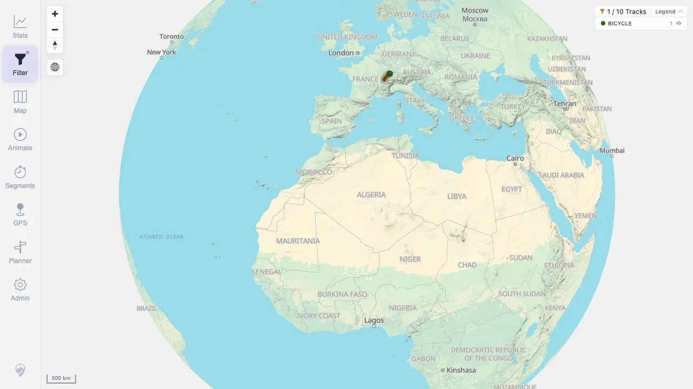</a>
<a href="assets/FLT_06-stats-filtered.webp">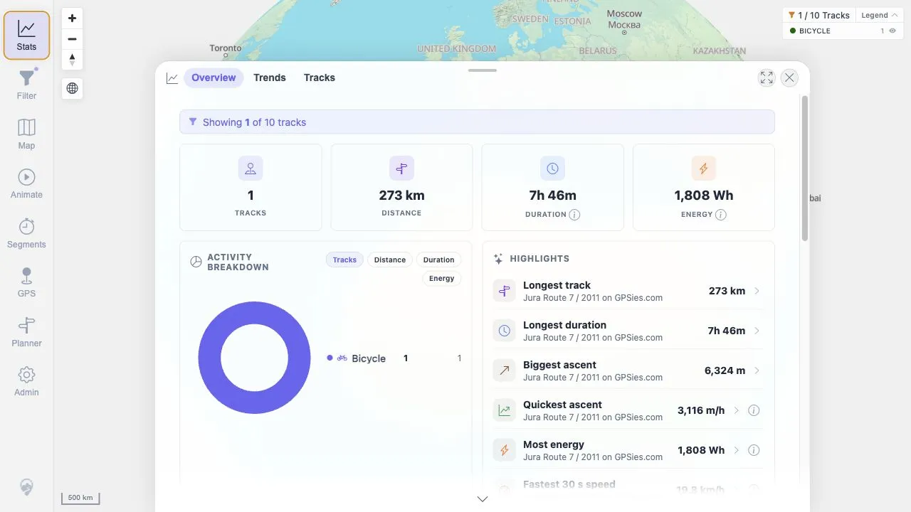</a>

<a href="assets/FLT_06-stats-all-after-clear-retry.webp">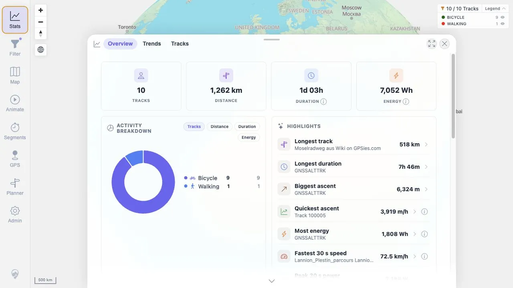</a>

### Packet FLT_07

- Packet file: [packets/FLT_07.md](packets/FLT_07.md)
- Coverage ID: `FLT_07`
- Status: **PASS**
- Action: Observed the active legend, clicked the Bicycle visibility toggle, collapsed the legend, then expanded/restored Bicycle.
- Expected: Legend reflects the active filter; collapsing/hiding groups updates the map immediately.
- Actual: Legend showed Bicycle=9 and Walking=1. Hiding Bicycle immediately changed the map count to 1/10 and changed the Bicycle visibility icon. Collapsing hid the group list; expanding/restoring Bicycle returned count to 10/10.

**Timings**

| Step | Timing |
|---|---:|
| Legend toggle/collapse check | <3m |

**Handoff Notes**
- Completed: FLT_07 terminal PASS.
- Remaining unfinished coverage: continue with FLT_08.
- Blocked or not applicable: none.
- State left for the next packet: filter enabled and all legend groups visible.

**Evidence**

<a href="assets/FLT_07-legend-collapsed.webp">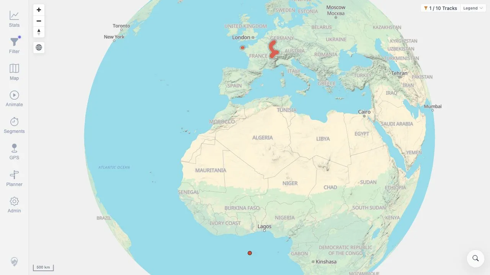</a>

### Packet FLT_08

- Packet file: [packets/FLT_08.md](packets/FLT_08.md)
- Coverage ID: `FLT_08`
- Status: **PASS**
- Action: Opened Filter and turned the filter switch Off.
- Expected: Clearing the filter restores all tracks.
- Actual: The map returned to `10 Tracks`, showed a `Showing all tracks` alert, removed the active legend, disabled Colors/SQL tabs, and displayed the `Filtering is off` panel.

**Timings**

| Step | Timing |
|---|---:|
| Filter clear/disable | <2m |

**Handoff Notes**
- Completed: FLT_08 terminal PASS.
- Remaining unfinished coverage: continue with TBS_01.
- Blocked or not applicable: none.
- State left for the next packet: filtering off; map restored to all 10 visible tracks.

**Evidence**

<a href="assets/FLT_08-filter-before-disable.webp">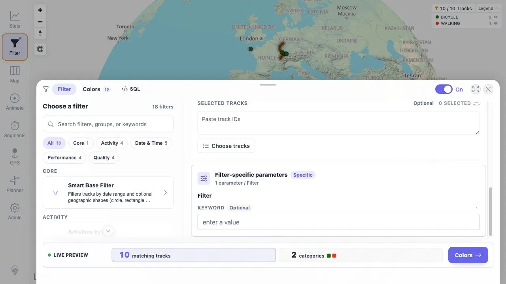</a>
<a href="assets/FLT_08-filter-disabled-map.webp">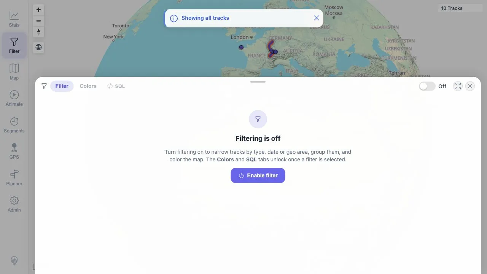</a>

### Packet GLB_01

- Packet file: [packets/GLB_01.md](packets/GLB_01.md)
- Coverage ID: `GLB_01`
- Status: **PASS**
- Action: Clicked Zoom out repeatedly from the main map.
- Expected: Globe view engages automatically at low zoom.
- Actual: At world-scale zoom, the globe toggle became visible and active (`mtl-globe-active`), with the map still rendered and usable.

**Timings**

| Step | Timing |
|---|---:|
| Zoom out and verify active globe state | <1 min |

**Handoff Notes**
- Completed: GLB_01 passed.
- Remaining unfinished coverage: GLB_02 through RUN_CLEANUP.
- Blocked or not applicable: None.
- State left for the next packet: Map is at low zoom with globe mode active.

**Evidence**

<a href="assets/GLB_01-globe-active-retry.webp">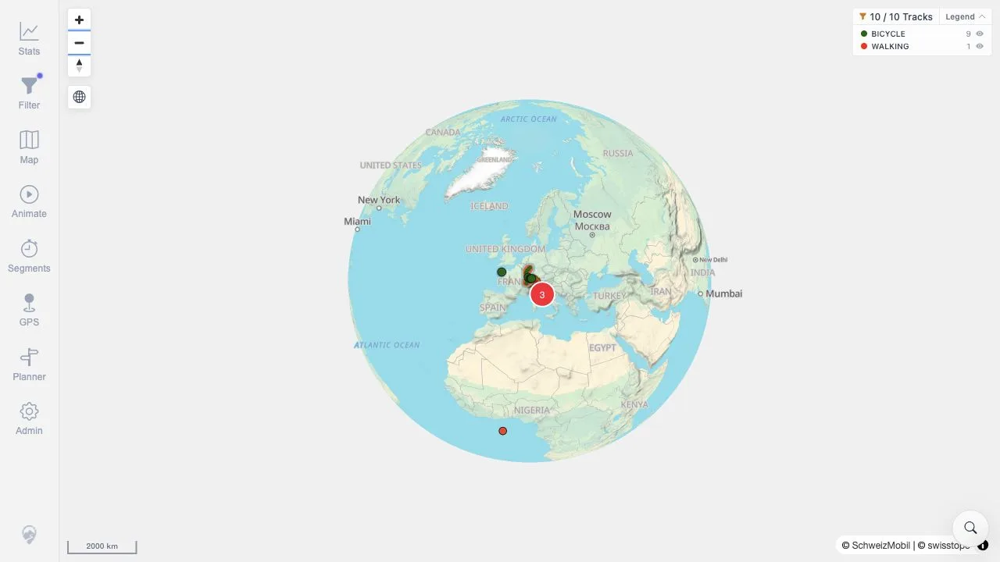</a>

**Text Evidence**
- [assets/GLB_01-globe-state.txt](assets/GLB_01-globe-state.txt) - DOM/class evidence for active globe state. (438 B)

Excerpt: assets/GLB_01-globe-state.txt

<pre><code>Action: clicked Zoom out repeatedly from the map until globe mode engaged.
Intermediate low zoom: globe toggle became visible but inactive at approximately 500 km scale.
Final low zoom: globe toggle was visible and active at approximately 2000 km scale.
DOM evidence:
- `.mtl-globe-ctrl` display: visible
- `.mtl-globe-btn` class: `mtl-globe-btn mtl-globe-active`
Visible map state: world-scale map remained rendered with 10 / 10 tracks.
</code></pre>

### Packet GLB_02

- Packet file: [packets/GLB_02.md](packets/GLB_02.md)
- Coverage ID: `GLB_02`
- Status: **PASS**
- Action: Clicked Zoom in repeatedly from active globe mode.
- Expected: Map returns to flat view.
- Actual: At 5 km scale, the globe control was hidden and no longer had `mtl-globe-active`; the map rendered normally with tracks.

**Timings**

| Step | Timing |
|---|---:|
| Zoom in and verify flat state | <1 min |

**Handoff Notes**
- Completed: GLB_02 passed.
- Remaining unfinished coverage: GLB_03 through RUN_CLEANUP.
- Blocked or not applicable: None.
- State left for the next packet: Map is zoomed in with globe mode inactive.

**Evidence**

<a href="assets/GLB_02-flat-after-zoom-in.webp">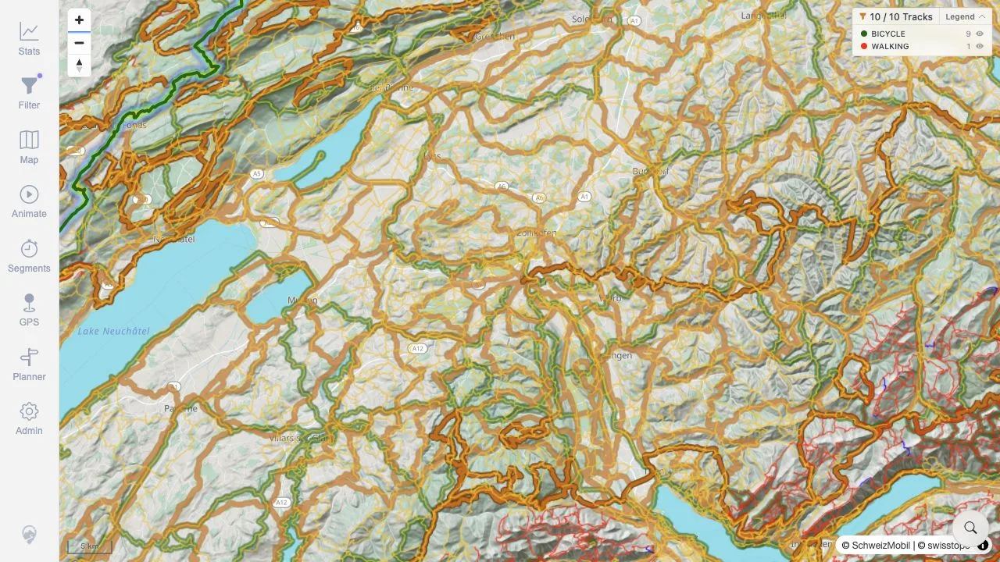</a>

**Text Evidence**
- [assets/GLB_02-flat-state.txt](assets/GLB_02-flat-state.txt) - DOM/class evidence for inactive globe state. (307 B)

Excerpt: assets/GLB_02-flat-state.txt

<pre><code>Action: clicked Zoom in repeatedly after GLB_01 active globe state.
Final scale indicator: 5 km
DOM evidence after zoom-in:
- `.mtl-globe-ctrl` display: none
- `.mtl-globe-btn` class: `mtl-globe-btn`
- active class present: false
Visible map state: flat zoomed-in map remained rendered with 10 / 10 tracks.
</code></pre>

### Packet GLB_03

- Packet file: [packets/GLB_03.md](packets/GLB_03.md)
- Coverage ID: `GLB_03`
- Status: **PASS**
- Action: Activated globe at low zoom, manually toggled it off, nudged low zoom, then toggled it back on.
- Expected: Manual disable is respected and globe does not auto-re-enable until the user re-enables it.
- Actual: After manual disable, the globe control stayed visible but inactive through low-zoom nudges; it became active again only after clicking the toggle a second time.

**Timings**

| Step | Timing |
|---|---:|
| Manual disable/nudge/re-enable | <1 min |

**Handoff Notes**
- Completed: GLB_03 passed.
- Remaining unfinished coverage: GLB_04 through RUN_CLEANUP.
- Blocked or not applicable: None.
- State left for the next packet: Map is at low zoom with globe mode active.

**Evidence**

<a href="assets/GLB_03-manual-disabled.webp">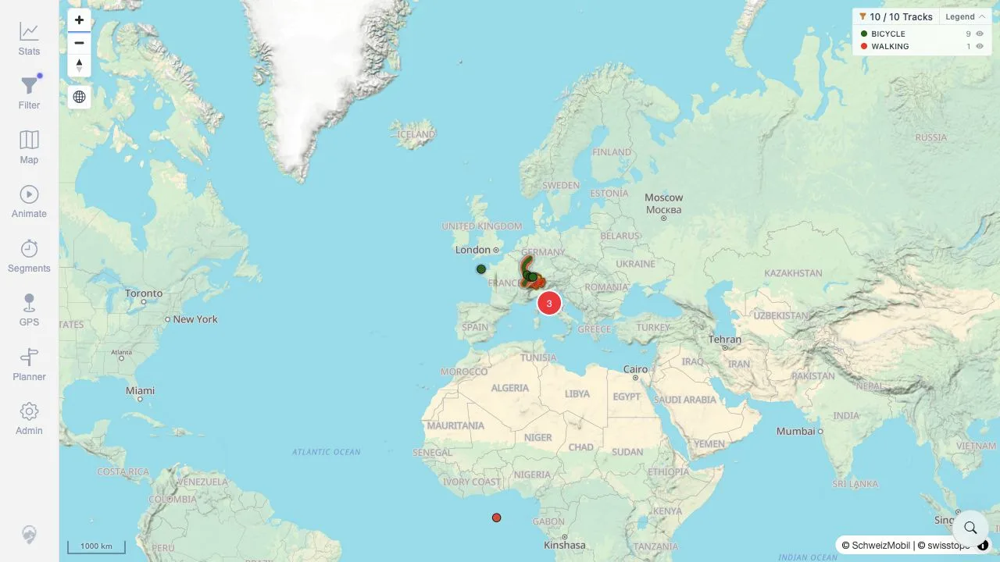</a>
<a href="assets/GLB_03-reenabled.webp">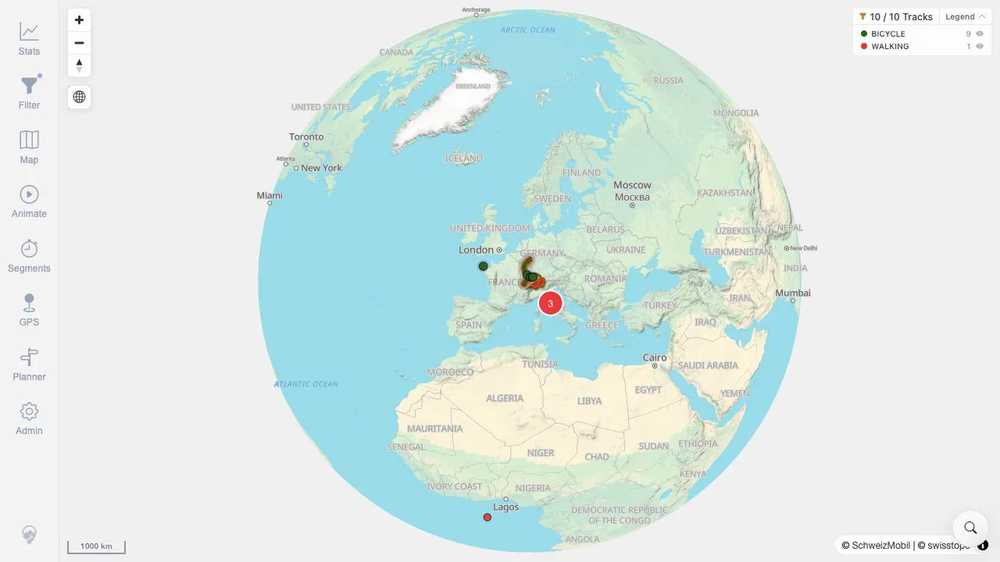</a>

**Text Evidence**
- [assets/GLB_03-manual-disable.txt](assets/GLB_03-manual-disable.txt) - Step-by-step DOM/class evidence for disable, nudge, and re-enable behavior. (476 B)

Excerpt: assets/GLB_03-manual-disable.txt

<pre><code>Manual globe disable sequence:
1. Zoomed out until globe was active at 2000 km scale.
   - class: `mtl-globe-btn mtl-globe-active`
2. Clicked `Toggle globe mode`.
   - class: `mtl-globe-btn`
   - globe control remained visible but inactive at 2000 km scale.
3. Nudged low zoom with Zoom out/Zoom in.
   - class stayed `mtl-globe-btn`
   - globe remained inactive at 1000 km scale.
4. Clicked `Toggle globe mode` again.
   - class returned to `mtl-globe-btn mtl-globe-active`.
</code></pre>

### Packet GLB_04

- Packet file: [packets/GLB_04.md](packets/GLB_04.md)
- Coverage ID: `GLB_04`
- Status: **PASS**
- Action: At low zoom, dragged horizontally in both directions, then zoomed back into flat view.
- Expected: Zoom limits do not trap the map at edges.
- Actual: Low-zoom panning kept the map rendered, and subsequent Zoom in controls still changed from 2000 km globe to 5 km flat view.

**Timings**

| Step | Timing |
|---|---:|
| Pan at low zoom and zoom back in | <1 min |

**Handoff Notes**
- Completed: GLB_04 passed.
- Remaining unfinished coverage: ADM_01 through RUN_CLEANUP.
- Blocked or not applicable: None.
- State left for the next packet: Map is zoomed in with globe inactive.

**Evidence**

<a href="assets/GLB_04-low-zoom-pan.webp">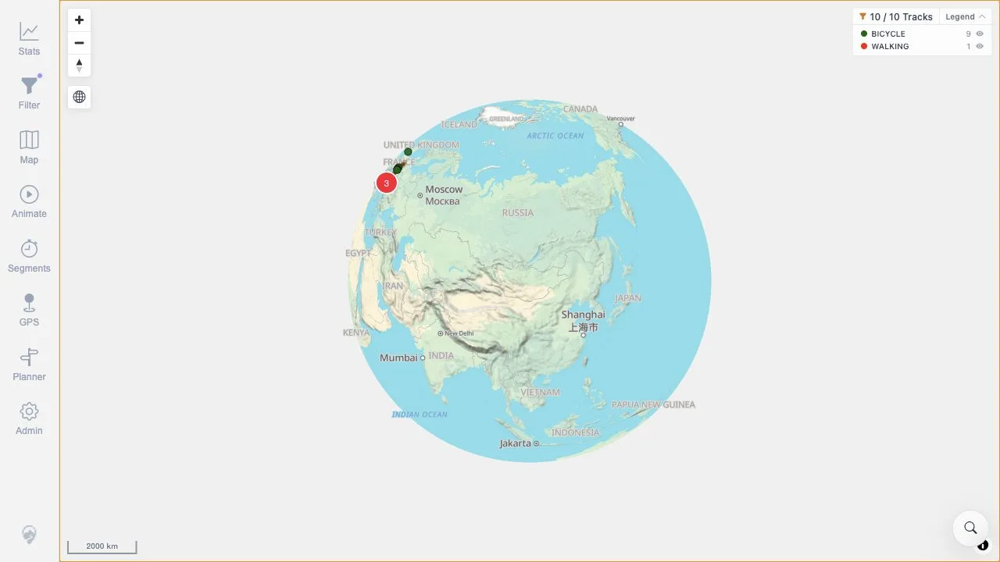</a>
<a href="assets/GLB_04-zoomed-back-in.webp">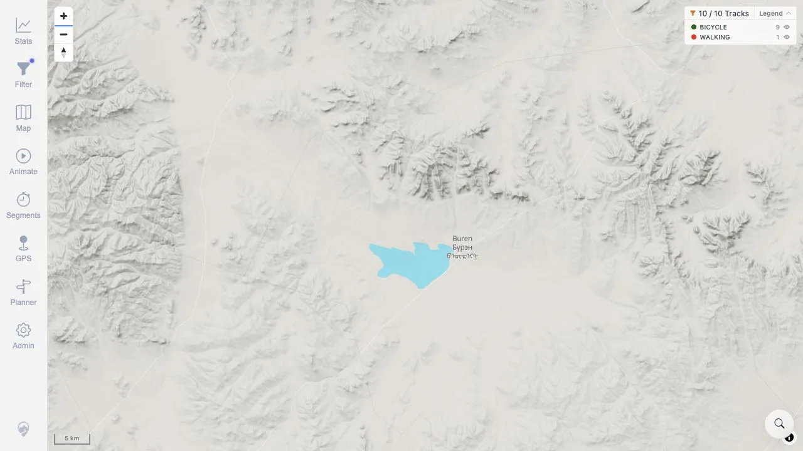</a>

**Text Evidence**
- [assets/GLB_04-zoom-limits.txt](assets/GLB_04-zoom-limits.txt) - Recorded scale/control state before and after edge panning. (585 B)

Excerpt: assets/GLB_04-zoom-limits.txt

<pre><code>Zoom/edge-limit sequence:
1. Started at low zoom/globe state.
   - scale: 2000 km
   - globe active: true
   - map canvas count: 1
2. Dragged the map hard left and right at low zoom.
   - scale stayed 2000 km
   - globe active stayed true
   - map canvas count stayed 1
   - map controls/sidebar remained visible
3. Zoomed in repeatedly after edge panning.
   - scale changed to 5 km
   - globe active: false
   - globe control hidden
   - map canvas count stayed 1

Conclusion: zoom/pan edge limits did not trap the map; zoom controls still changed state after low-zoom edge panning.
</code></pre>

### Packet GPS_01

- Packet file: [packets/GPS_01.md](packets/GPS_01.md)
- Coverage ID: `GPS_01`
- Status: **PASS**
- Action: Verified the active app URL/security context and opened the GPS tool.
- Expected: Remote plain-HTTP quick-install runs should be treated as non-secure origins; live GPS permission/marker rows are not applicable unless tested on localhost or HTTPS.
- Actual: The app was loaded from `http://178.105.173.254:18080/mtl/`, not localhost or HTTPS. Browser geolocation was not exposed in the page context. Opening GPS produced only a transient app info toast and no usable browser permission/marker validation path.

**Timings**

| Step | Timing |
|---|---:|
| Origin/geolocation inspection and GPS panel screenshot | <1 min |

**Handoff Notes**
- Completed: GPS_01 confirms the expected remote plain-HTTP geolocation limitation.
- Remaining unfinished coverage: GPS_02 through RUN_CLEANUP.
- Blocked or not applicable: GPS_02-GPS_05 should be closed individually as `NOT APPLICABLE` for this run unless a secure-origin context is introduced.
- State left for the next packet: GPS tool has been opened; map remains usable with the imported dataset.

**Evidence**

**Text Evidence**
- [assets/GPS_01-secure-context.txt](assets/GPS_01-secure-context.txt) - Recorded target origin and geolocation availability for the remote plain-HTTP run. (639 B)

Excerpt: assets/GPS_01-secure-context.txt

<pre><code>Target URL: http://178.105.173.254:18080/mtl/
Origin: http://178.105.173.254:18080
Protocol: http:
Host: 178.105.173.254:18080
Localhost-equivalent: false
Browser geolocation exposed in page context: false
Visible app state after opening GPS: map remained usable with 10 / 10 tracks; a transient "GPS started" info toast appeared, but no browser permission prompt or live-location marker could be verified on the remote plain-HTTP origin.

Coverage conclusion: GPS_01 confirms this quick-install run is on a remote plain-HTTP host, so live GPS permission and marker checks must be terminal NOT APPLICABLE per the frontend regression plan.
</code></pre>

### Packet HMO_01

- Packet file: [packets/HMO_01.md](packets/HMO_01.md)
- Coverage ID: `HMO_01`
- Status: **PASS**
- Action: Navigated to Lannion track geometry, captured heatmap enabled, toggled Heatmap off, then re-enabled it and lowered the opacity to about 38%.
- Expected: Heatmap draws over the map without hiding tracks and opacity changes are reflected.
- Actual: Heatmap density rendered around the track while the track line stayed visible above it. Turning Heatmap off removed the density overlay. Re-enabling with lower opacity restored a weaker overlay without hiding the track.

**Timings**

| Step | Timing |
|---|---:|
| Heatmap toggle and opacity checks | ~7 min |

**Handoff Notes**
- Completed: HMO_01.
- Remaining unfinished coverage: HMO_02 onward.
- Blocked or not applicable: None.
- State left for the next packet: Lannion map viewport; Heatmap enabled at reduced opacity; worldwide MTB overlay is enabled and available for HMO_02 overlay coverage.

**Evidence**

<a href="assets/HMO_01-heatmap-full.webp">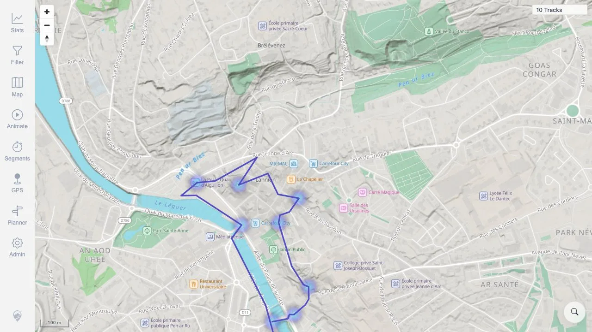</a>
<a href="assets/HMO_01-heatmap-off.webp">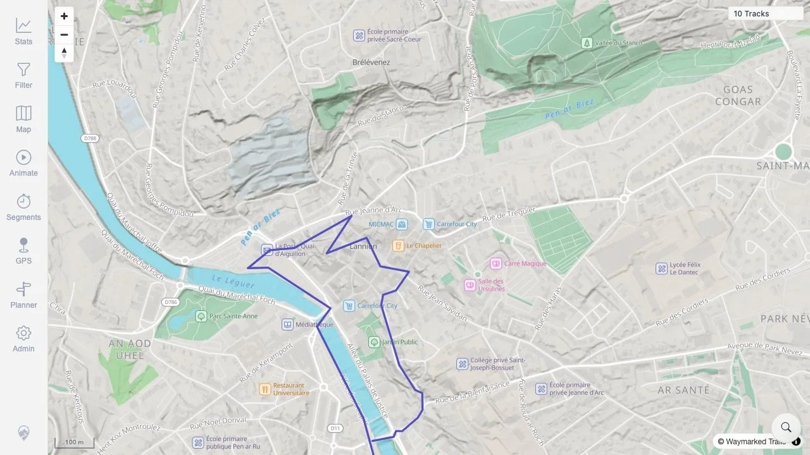</a>
<a href="assets/HMO_01-heatmap-low-opacity.webp">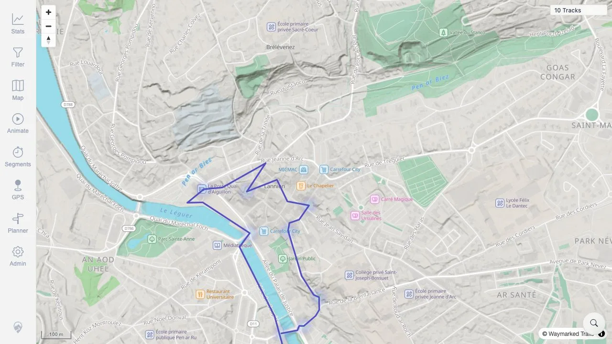</a>

**Text Evidence**
- [assets/HMO_01-actions.txt](assets/HMO_01-actions.txt) - Action sequence and state notes. (762 B)

Excerpt: assets/HMO_01-actions.txt

<pre><code>Heatmap toggle and opacity evidence for HMO_01.

Test viewport:
- Location search: Lannion, France
- Visible track: Lannion_Plestin_parcours24.4RE.gpx geometry in blue/purple over the map.

Actions:
1. Captured heatmap enabled at full opacity. Heatmap density rendered around the track and the track line remained visible above it.
2. Toggled Heatmap off from Maps and data. The density glow disappeared and the track line remained visible.
3. Toggled Heatmap on again and clicked the heatmap opacity track at about 38%. The heatmap returned at lower intensity while the track line remained visible.

State left:
- Heatmap enabled at reduced opacity.
- A worldwide MTB overlay was accidentally enabled during interaction and is left for HMO_02 overlay coverage.
</code></pre>

### Packet HMO_02

- Packet file: [packets/HMO_02.md](packets/HMO_02.md)
- Coverage ID: `HMO_02`
- Status: **PASS**
- Action: In Lannion, toggled worldwide Hiking/Cycling/MTB overlays independently and moved opacity sliders. In Delémont, toggled Swiss Hiking Routes/Bike Routes/MTB Routes/Hiking Trails independently and moved opacity sliders for representative Swiss overlays.
- Expected: Each overlay can be toggled independently; opacity sliders work; overlay ordering keeps tracks usable/visible.
- Actual: Worldwide and Swiss overlay controls switched independently. Opacity handles moved for worldwide and Swiss overlays. Waymarked Trails and Swiss overlays rendered without making the visible GPS track layer disappear.

**Timings**

| Step | Timing |
|---|---:|
| Worldwide and Swiss overlay checks | ~12 min |

**Handoff Notes**
- Completed: HMO_02.
- Remaining unfinished coverage: HMO_03 onward.
- Blocked or not applicable: None.
- State left for the next packet: Delémont viewport; Swiss overlays enabled; worldwide overlays off; heatmap off.

**Evidence**

<a href="assets/HMO_02-worldwide-overlays.webp">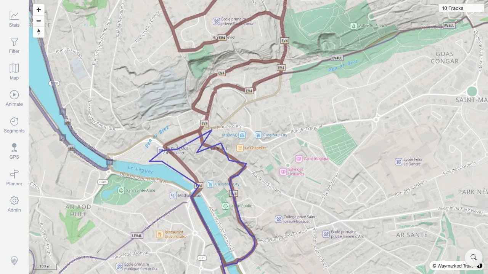</a>
<a href="assets/HMO_02-swiss-overlays.webp">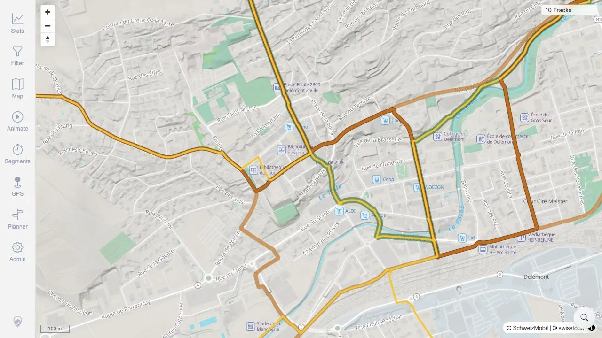</a>

**Text Evidence**
- [assets/HMO_02-overlay-states.txt](assets/HMO_02-overlay-states.txt) - Toggle/opacity state summary for worldwide and Swiss overlay controls. (1.0 KB)

Excerpt: assets/HMO_02-overlay-states.txt

<pre><code>Overlay toggle and opacity evidence for HMO_02.

Worldwide overlays at Lannion:
- Off baseline states:
  - Hiking (worldwide): off
  - Cycling (worldwide): off
  - MTB (worldwide): off
- Enabled independently:
  - Hiking (worldwide): on, opacity set near 45%
  - Cycling (worldwide): on, opacity set near 60%
  - MTB (worldwide): on, opacity set near 75%
- Result: Waymarked Trails route overlays appeared; existing GPS track line remained visible above/alongside overlay routes.

Swiss overlays at Delémont:
- Off baseline states:
  - Hiking Routes: off
  - Bike Routes: off
  - MTB Routes: off
  - Hiking Trails: off
- Enabled independently:
  - Hiking Routes: on, opacity set near 55%
  - Bike Routes: on, opacity set near 70%
  - MTB Routes: on
  - Hiking Trails: on
- Result: SchweizMobil/swisstopo overlays appeared in the Swiss viewport; visible GPS track geometry remained present while overlays rendered around it.

State left:
- Worldwide overlays off.
- Swiss Hiking Routes, Bike Routes, MTB Routes, and Hiking Trails on.
- Heatmap off.
</code></pre>

### Packet HMO_03

- Packet file: [packets/HMO_03.md](packets/HMO_03.md)
- Coverage ID: `HMO_03`
- Status: **PASS**
- Action: Enabled heatmap at Lannion, selected `Activities by keyword`, entered `Jura`, then cleared the keyword.
- Expected: Heatmap updates when filters change.
- Actual: With empty keyword, Lannion showed `10 / 10 Tracks` and the local heatmap. Entering `Jura` reduced the map to `1 / 10 Tracks` and removed the Lannion track/heatmap. Clearing the keyword restored `10 / 10 Tracks` and the Lannion heatmap.

**Timings**

| Step | Timing |
|---|---:|
| Filter heatmap update test | ~9 min |

**Handoff Notes**
- Completed: HMO_03.
- Remaining unfinished coverage: GPS_01 onward.
- Blocked or not applicable: None.
- State left for the next packet: Lannion viewport; filtering on with empty keyword; heatmap enabled; Swiss overlays still enabled but visually irrelevant outside Switzerland.

**Evidence**

<a href="assets/HMO_03-all-tracks-heatmap.webp">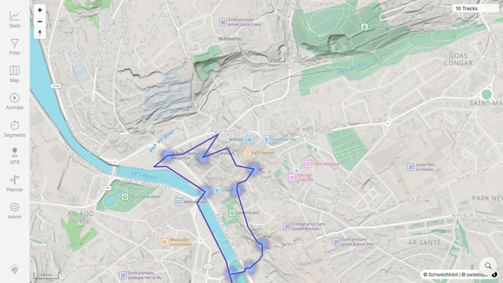</a>
<a href="assets/HMO_03-jura-filter-heatmap.webp">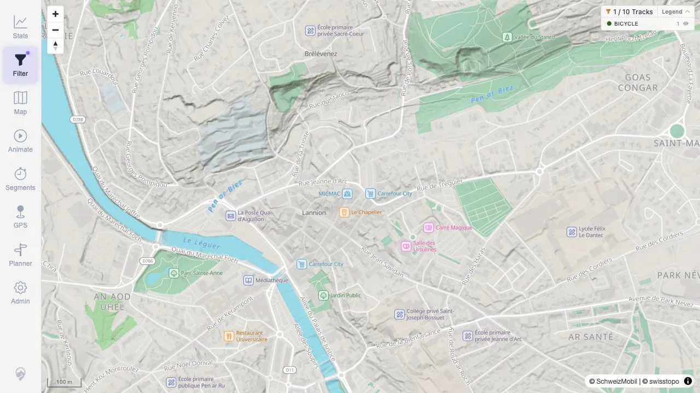</a>
<a href="assets/HMO_03-restored-heatmap.webp">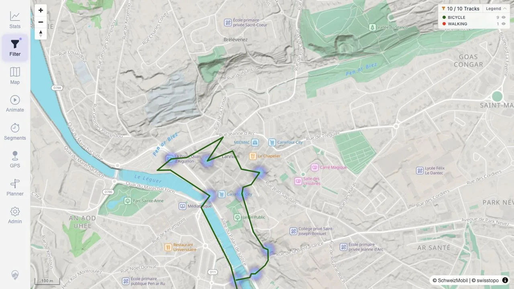</a>

**Text Evidence**
- [assets/HMO_03-filter-heatmap.txt](assets/HMO_03-filter-heatmap.txt) - Filter action and observed count/heatmap transitions. (692 B)

Excerpt: assets/HMO_03-filter-heatmap.txt

<pre><code>Filter-driven heatmap evidence for HMO_03.

Setup:
- Viewport: Lannion, France.
- Heatmap enabled at high opacity.
- Filter enabled with Activities by keyword selected.

Actions and observations:
1. Empty keyword / all tracks:
   - Map legend showed 10 / 10 Tracks.
   - Lannion track and heatmap glow were visible.
2. Keyword set to Jura:
   - Live filter reduced map to 1 / 10 Tracks.
   - Lannion track disappeared.
   - Lannion heatmap glow disappeared.
3. Keyword cleared via keyboard:
   - Map returned to 10 / 10 Tracks.
   - Lannion track and heatmap glow returned.

State left:
- Filtering remains on with Activities by keyword selected and empty keyword.
- Heatmap remains enabled.
</code></pre>

### Packet IMP_01

- Packet file: [packets/IMP_01.md](packets/IMP_01.md)
- Coverage ID: `IMP_01`
- Status: **PASS**
- Action: Captured map, Stats overview, Admin workspace/jobs, and Freshness panels before import.
- Expected: Baseline map count, browser/stat totals, freshness token, and indexer state are recorded before data mutations.
- Actual: Map showed `0 Tracks`; stats showed no matching tracks; Admin jobs were done with 0 totals and routing/location-search ready; freshness token was in sync with `index:0`, `media:0`, `track_geometry:0`, `tracks:0`.

**Timings**

| Step | Timing |
|---|---:|
| Baseline browser capture | 3m |

**Handoff Notes**
- Completed: IMP_01 terminal PASS.
- Remaining unfinished coverage: continue with IMP_02 import.
- Blocked or not applicable: none.
- State left for the next packet: app remains at 0 tracks; source files are still staged outside watched import folder.

**Evidence**

<a href="assets/IMP_01-stats-baseline.webp">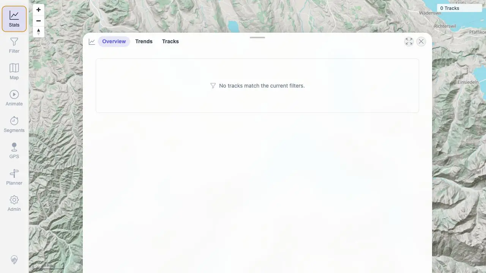</a>
<a href="assets/IMP_01-admin-baseline.webp">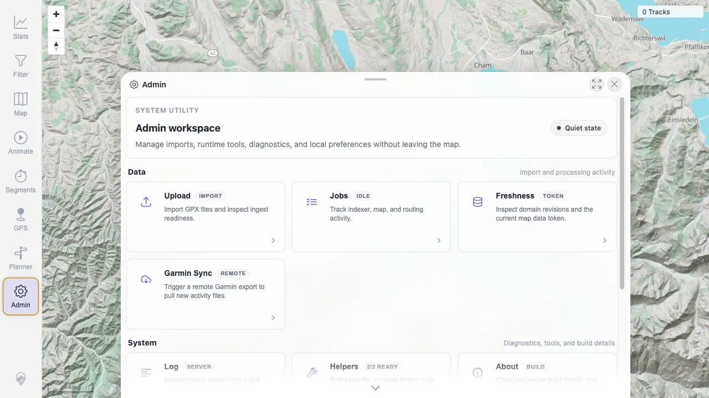</a>
<a href="assets/IMP_01-jobs-baseline.webp">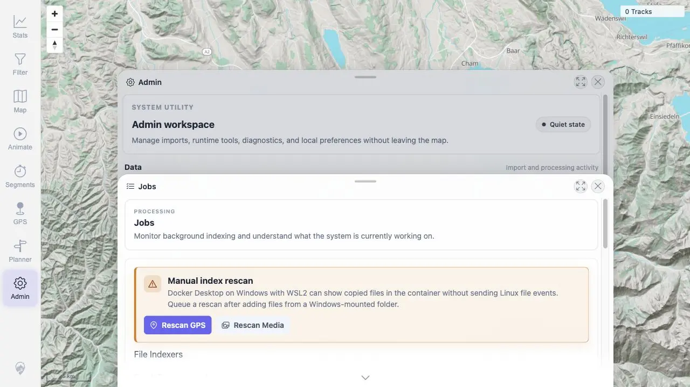</a>

**Text Evidence**
- [assets/IMP_01-baseline-summary.txt](assets/IMP_01-baseline-summary.txt) - Compact text summary of baseline values. (370 B)

Excerpt: assets/IMP_01-baseline-summary.txt

<pre><code>Pre-import baseline captured 2026-05-26 06:13 CEST.

- Map badge: 0 Tracks.
- Statistics overview: "No tracks match the current filters."
- Admin jobs: Duplicate Finder, Activity Classifier, Exploration Score all done with 0 total; location search done; routing segments ready.
- Freshness token: server/client in sync with index:0, media:0, track_geometry:0, tracks:0.
</code></pre>

### Packet IMP_02

- Packet file: [packets/IMP_02.md](packets/IMP_02.md)
- Coverage ID: `IMP_02`
- Status: **PASS**
- Action: Copied the five staged GPX files into README watched folder `./data/gpx`.
- Expected: All five GPX files enter the documented import folder with expected names/checksums.
- Actual: All five files were copied to `data/gpx`; sizes and SHA-256 values matched the source manifest.

**Timings**

| Step | Timing |
|---|---:|
| IMP_02 execution | <1m |

**Handoff Notes**
- Completed: IMP_02 terminal PASS.
- Remaining unfinished coverage: continue queue.
- Blocked or not applicable: none.
- State left for the next packet: five GPX tracks imported and visible; FIT not imported yet; no deletion performed.

**Evidence**

**Text Evidence**
- [assets/IMP_02-copy-gpx.txt](assets/IMP_02-copy-gpx.txt) - Copy command output, file list, and checksums. (985 B)

Excerpt: assets/IMP_02-copy-gpx.txt

<pre><code>COPY_START=2026-05-26T04:14:50+00:00
COPY_END=2026-05-26T04:14:50+00:00
DEST=data/gpx
-rw-r--r-- 1 root root 199962 May 26 04:14 data/gpx/JuraRoute72011.gpx
-rw-r--r-- 1 root root  60917 May 26 04:14 data/gpx/Lannion_Plestin_parcours24.4RE.gpx
-rw-r--r-- 1 root root 415326 May 26 04:14 data/gpx/MoselradwegAusWiki.gpx
-rw-r--r-- 1 root root 238349 May 26 04:14 data/gpx/Vitry-le-Francois_Langres.gpx
-rw-r--r-- 1 root root 183733 May 26 04:14 data/gpx/VoieVerteHauteVosges.gpx
fcff577bd3c1a6dc2bb9e53abba8051d510d282f4fb0049d38be5300f92e354e  data/gpx/JuraRoute72011.gpx
e76c692cbb5580f20013ce19995a9383361a8a0babec2db3e36f7064f316e85f  data/gpx/Lannion_Plestin_parcours24.4RE.gpx
0f5263dee95a345a42585bde148ec741af4ed4eeb7451702f59c9c7f9bf761c3  data/gpx/MoselradwegAusWiki.gpx
401218e3c1d1f366ee27ea8bc138d8422eff3bf6348a77183be83fef3e8d7d67  data/gpx/Vitry-le-Francois_Langres.gpx
0f417d6e76cfa581d3ada969e728694933fbffd062f61a8352ccc87637135f78  data/gpx/VoieVerteHauteVosges.gpx
</code></pre>

### Packet IMP_03

- Packet file: [packets/IMP_03.md](packets/IMP_03.md)
- Coverage ID: `IMP_03`
- Status: **PASS**
- Action: Monitored live watcher and indexing logs after copy.
- Expected: Indexing finishes; if live watch misses files, Rescan GPS is triggered and recorded.
- Actual: Live watcher detected all five CREATE events and all five files completed `status=SUCCESS`; manual Rescan GPS was not required.

**Timings**

| Step | Timing |
|---|---:|
| IMP_03 execution | 16s |

**Handoff Notes**
- Completed: IMP_03 terminal PASS.
- Remaining unfinished coverage: continue queue.
- Blocked or not applicable: none.
- State left for the next packet: five GPX tracks imported and visible; FIT not imported yet; no deletion performed.

**Evidence**

**Text Evidence**
- [assets/IMP_03-index-monitor.txt](assets/IMP_03-index-monitor.txt) - Cropped watcher create and SUCCESS lines under 5 KB. (4.7 KB)

Excerpt: assets/IMP_03-index-monitor.txt

<pre><code>GPX index monitor cropped at 2026-05-26T04:15:22+00:00
Live watcher creates:
app-1  | 2026-05-26T04:14:50.984Z  INFO 1 --- [watch-GPS] FileIndexerImpl              : Live watcher detected CREATE for: JuraRoute72011.gpx
app-1  | 2026-05-26T04:14:50.994Z  INFO 1 --- [watch-GPS] FileIndexerImpl              : Live watcher detected CREATE for: Lannion_Plestin_parcours24.4RE.gpx
app-1  | 2026-05-26T04:14:50.995Z  INFO 1 --- [watch-GPS] FileIndexerImpl              : Live watcher detected CREATE for: MoselradwegAusWiki.gpx
app-1  | 2026-05-26T04:14:50.995Z  INFO 1 --- [watch-GPS] FileIndexerImpl              : Live watcher detected CREATE for: Vitry-le-Francois_Langres.gpx
app-1  | 2026-05-26T04:14:50.995Z  INFO 1 --- [watch-GPS] FileIndexerImpl              : Live watcher detected CREATE for: VoieVerteHauteVosges.gpx
SUCCESS lines:
app-1  | 2026-05-26T04:15:04.383Z  INFO 1 --- [idx-1] GPXStoreService              : GPS ingest timing trackId=100003 file=/Lannion_Plestin_parcours24.4RE.gpx status=SUCCESS Timing total 1.29s; slowest simplified shapes 536ms, raw points 369ms, cleaned points 142ms, parse XML 58ms, motion/stops/events 51ms, denoise 27ms, outlier filter 21ms, break-stop filter 19ms.
app-1  | 2026-05-26T04:15:04.399Z  INFO 1 --- [idx-1] GPXStoreService              : Reading of track id=100003 and path= file=Lannion_Plestin_parcours24.4RE.gpx did complete with status=SUCCESS and took processingTime=1.31s
app-1  | 2026-05-26T04:15:05.265Z  INFO 1 --- [idx-3] GPXStoreService              : GPS ingest timing trackId=100000 file=/Vitry-le-Francois_Langres.gpx status=SUCCESS Timing total 4.23s; slowest raw points 1.79s, simplified shapes 1.00s, cleaned points 478ms, denoise 385ms, parse XML 286ms, break-stop filter 107ms, motion/stops/events 47ms, distance stats 41ms.
app-1  | 2026-05-26T04:15:05.269Z  INFO 1 --- [idx-3] GPXStoreService              : Reading of track id=100000 and path= file=Vitry-le-Francois_Langres.gpx did complete with status=SUCCESS and took processingTime=4.23s
app-1  | 2026-05-26T04:15:05.385Z  INFO 1 --- [idx-4] GPXStoreService              : GPS ingest timing trackId=100001 file=/JuraRoute72011.gpx status=SUCCESS Timing total 4.35s; slowest raw points 1.77s, simplified shapes 1.24s, cleaned points 389ms, denoise 363ms, parse XML 304ms, break-stop filter 72ms, distance stats 64ms, outlier filter 47ms.
app-1  | 2026-05-26T04:15:05.387Z  INFO 1 --- [idx-4] GPXStoreService              : Reading of track id=100001 and path= file=JuraRoute72011.gpx did complete with status=SUCCESS and took processingTime=4.35s
app-1  | 2026-05-26T04:15:05.924Z  INFO 1 --- [idx-1] GPXStoreService              : GPS ingest timing trackId=100004 file=/VoieVerteHauteVosges.gpx status=SUCCESS Timing total 1.47s; slowest simplified shapes 687ms, cleaned points 269ms, raw points 240ms, denoise 85ms, parse XML 60ms, motion/stops/events 38ms, break-stop filter 37ms, split segments 18ms.
app-1  | 2026-05-26T04:15:05.927Z  INFO 1 --- [idx-1] GPXStoreService              : Reading of track id=100004 and path= file=VoieVerteHauteVosges.gpx did complete with status=SUCCESS and took processingTime=1.47s
app-1  | 2026-05-26T04:15:06.096Z  INFO 1 --- [idx-2] GPXStoreService              : GPS ingest timing trackId=100002 file=/MoselradwegAusWiki.gpx status=SUCCESS Timing total 5.06s; slowest raw points 1.83s, simplified shapes 1.67s, cleaned points 563ms, parse XML 397ms, denoise 288ms, break-stop filter 186ms, outlier filter 43ms, motion/stops/events 40ms.
app-1  | 2026-05-26T04:15:06.099Z  INFO 1 --- [idx-2] GPXStoreService              : Reading of track id=100002 and path= file=MoselradwegAusWiki.gpx did complete with status=SUCCESS and took processingTime=5.07s
Indexed-file status hints:
app-1  | 2026-05-26T04:15:04.399Z  INFO 1 --- [idx-1] GPXStoreService              : Reading of track id=100003 and path= file=Lannion_Plestin_parcours24.4RE.gpx did complete with status=SUCCESS and took processingTime=1.31s
app-1  | 2026-05-26T04:15:05.269Z  INFO 1 --- [idx-3] GPXStoreService              : Reading of track id=100000 and path= file=Vitry-le-Francois_Langres.gpx did complete with status=SUCCESS and took processingTime=4.23s
app-1  | 2026-05-26T04:15:05.387Z  INFO 1 --- [idx-4] GPXStoreService              : Reading of track id=100001 and path= file=JuraRoute72011.gpx did complete with status=SUCCESS and took processingTime=4.35s
app-1  | 2026-05-26T04:15:05.927Z  INFO 1 --- [idx-1] GPXStoreService              : Reading of track id=100004 and path= file=VoieVerteHauteVosges.gpx did complete with status=SUCCESS and took processingTime=1.47s
app-1  | 2026-05-26T04:15:06.099Z  INFO 1 --- [idx-2] GPXStoreService              : Reading of track id=100002 and path= file=MoselradwegAusWiki.gpx did complete with status=SUCCESS and took processingTime=5.07s
</code></pre>

### Packet IMP_04

- Packet file: [packets/IMP_04.md](packets/IMP_04.md)
- Coverage ID: `IMP_04`
- Status: **PASS**
- Action: Verified upload/index status and background job settlement from logs and Admin Jobs.
- Expected: All five source files complete; no unexpected GPS failures; freshness changes; background jobs settle.
- Actual: All five source files reached SUCCESS; Admin Jobs showed quiet/idle processing, no visible GPS failures, and data freshness moved out of sync after import.

**Timings**

| Step | Timing |
|---|---:|
| IMP_04 execution | <1m |

**Handoff Notes**
- Completed: IMP_04 terminal PASS.
- Remaining unfinished coverage: continue queue.
- Blocked or not applicable: none.
- State left for the next packet: five GPX tracks imported and visible; FIT not imported yet; no deletion performed.

**Evidence**

<a href="assets/IMP_04-freshness-out-of-sync.webp">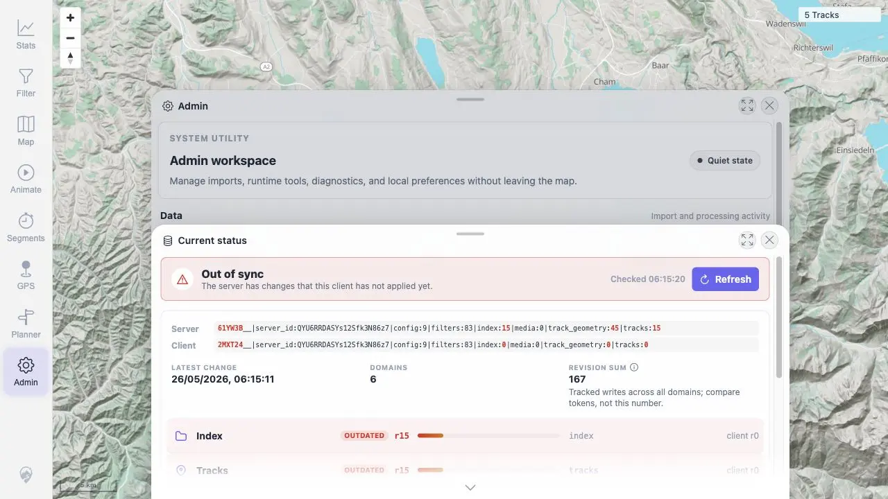</a>

**Text Evidence**
- [assets/IMP_03-index-monitor.txt](assets/IMP_03-index-monitor.txt) - Import SUCCESS lines. (4.7 KB)

Excerpt: assets/IMP_03-index-monitor.txt

<pre><code>GPX index monitor cropped at 2026-05-26T04:15:22+00:00
Live watcher creates:
app-1  | 2026-05-26T04:14:50.984Z  INFO 1 --- [watch-GPS] FileIndexerImpl              : Live watcher detected CREATE for: JuraRoute72011.gpx
app-1  | 2026-05-26T04:14:50.994Z  INFO 1 --- [watch-GPS] FileIndexerImpl              : Live watcher detected CREATE for: Lannion_Plestin_parcours24.4RE.gpx
app-1  | 2026-05-26T04:14:50.995Z  INFO 1 --- [watch-GPS] FileIndexerImpl              : Live watcher detected CREATE for: MoselradwegAusWiki.gpx
app-1  | 2026-05-26T04:14:50.995Z  INFO 1 --- [watch-GPS] FileIndexerImpl              : Live watcher detected CREATE for: Vitry-le-Francois_Langres.gpx
app-1  | 2026-05-26T04:14:50.995Z  INFO 1 --- [watch-GPS] FileIndexerImpl              : Live watcher detected CREATE for: VoieVerteHauteVosges.gpx
SUCCESS lines:
app-1  | 2026-05-26T04:15:04.383Z  INFO 1 --- [idx-1] GPXStoreService              : GPS ingest timing trackId=100003 file=/Lannion_Plestin_parcours24.4RE.gpx status=SUCCESS Timing total 1.29s; slowest simplified shapes 536ms, raw points 369ms, cleaned points 142ms, parse XML 58ms, motion/stops/events 51ms, denoise 27ms, outlier filter 21ms, break-stop filter 19ms.
app-1  | 2026-05-26T04:15:04.399Z  INFO 1 --- [idx-1] GPXStoreService              : Reading of track id=100003 and path= file=Lannion_Plestin_parcours24.4RE.gpx did complete with status=SUCCESS and took processingTime=1.31s
app-1  | 2026-05-26T04:15:05.265Z  INFO 1 --- [idx-3] GPXStoreService              : GPS ingest timing trackId=100000 file=/Vitry-le-Francois_Langres.gpx status=SUCCESS Timing total 4.23s; slowest raw points 1.79s, simplified shapes 1.00s, cleaned points 478ms, denoise 385ms, parse XML 286ms, break-stop filter 107ms, motion/stops/events 47ms, distance stats 41ms.
app-1  | 2026-05-26T04:15:05.269Z  INFO 1 --- [idx-3] GPXStoreService              : Reading of track id=100000 and path= file=Vitry-le-Francois_Langres.gpx did complete with status=SUCCESS and took processingTime=4.23s
app-1  | 2026-05-26T04:15:05.385Z  INFO 1 --- [idx-4] GPXStoreService              : GPS ingest timing trackId=100001 file=/JuraRoute72011.gpx status=SUCCESS Timing total 4.35s; slowest raw points 1.77s, simplified shapes 1.24s, cleaned points 389ms, denoise 363ms, parse XML 304ms, break-stop filter 72ms, distance stats 64ms, outlier filter 47ms.
app-1  | 2026-05-26T04:15:05.387Z  INFO 1 --- [idx-4] GPXStoreService              : Reading of track id=100001 and path= file=JuraRoute72011.gpx did complete with status=SUCCESS and took processingTime=4.35s
app-1  | 2026-05-26T04:15:05.924Z  INFO 1 --- [idx-1] GPXStoreService              : GPS ingest timing trackId=100004 file=/VoieVerteHauteVosges.gpx status=SUCCESS Timing total 1.47s; slowest simplified shapes 687ms, cleaned points 269ms, raw points 240ms, denoise 85ms, parse XML 60ms, motion/stops/events 38ms, break-stop filter 37ms, split segments 18ms.
app-1  | 2026-05-26T04:15:05.927Z  INFO 1 --- [idx-1] GPXStoreService              : Reading of track id=100004 and path= file=VoieVerteHauteVosges.gpx did complete with status=SUCCESS and took processingTime=1.47s
app-1  | 2026-05-26T04:15:06.096Z  INFO 1 --- [idx-2] GPXStoreService              : GPS ingest timing trackId=100002 file=/MoselradwegAusWiki.gpx status=SUCCESS Timing total 5.06s; slowest raw points 1.83s, simplified shapes 1.67s, cleaned points 563ms, parse XML 397ms, denoise 288ms, break-stop filter 186ms, outlier filter 43ms, motion/stops/events 40ms.
app-1  | 2026-05-26T04:15:06.099Z  INFO 1 --- [idx-2] GPXStoreService              : Reading of track id=100002 and path= file=MoselradwegAusWiki.gpx did complete with status=SUCCESS and took processingTime=5.07s
Indexed-file status hints:
app-1  | 2026-05-26T04:15:04.399Z  INFO 1 --- [idx-1] GPXStoreService              : Reading of track id=100003 and path= file=Lannion_Plestin_parcours24.4RE.gpx did complete with status=SUCCESS and took processingTime=1.31s
app-1  | 2026-05-26T04:15:05.269Z  INFO 1 --- [idx-3] GPXStoreService              : Reading of track id=100000 and path= file=Vitry-le-Francois_Langres.gpx did complete with status=SUCCESS and took processingTime=4.23s
app-1  | 2026-05-26T04:15:05.387Z  INFO 1 --- [idx-4] GPXStoreService              : Reading of track id=100001 and path= file=JuraRoute72011.gpx did complete with status=SUCCESS and took processingTime=4.35s
app-1  | 2026-05-26T04:15:05.927Z  INFO 1 --- [idx-1] GPXStoreService              : Reading of track id=100004 and path= file=VoieVerteHauteVosges.gpx did complete with status=SUCCESS and took processingTime=1.47s
app-1  | 2026-05-26T04:15:06.099Z  INFO 1 --- [idx-2] GPXStoreService              : Reading of track id=100002 and path= file=MoselradwegAusWiki.gpx did complete with status=SUCCESS and took processingTime=5.07s
</code></pre>

### Packet IMP_05

- Packet file: [packets/IMP_05.md](packets/IMP_05.md)
- Coverage ID: `IMP_05`
- Status: **PASS**
- Action: Used the freshness Refresh action and checked map, track list/stats, and filter panel after reload.
- Expected: Map, track browser, filters, and statistics all show the new data after freshness reload/helper reload.
- Actual: Freshness refresh returned the app to the map with `5 Tracks`; Stats overview/table showed 5 tracks and totals; Filter panel opened against the 5-track state.

**Timings**

| Step | Timing |
|---|---:|
| IMP_05 execution | <1m |

**Handoff Notes**
- Completed: IMP_05 terminal PASS.
- Remaining unfinished coverage: continue queue.
- Blocked or not applicable: none.
- State left for the next packet: five GPX tracks imported and visible; FIT not imported yet; no deletion performed.

**Evidence**

<a href="assets/IMP_05-freshness-before-refresh.webp">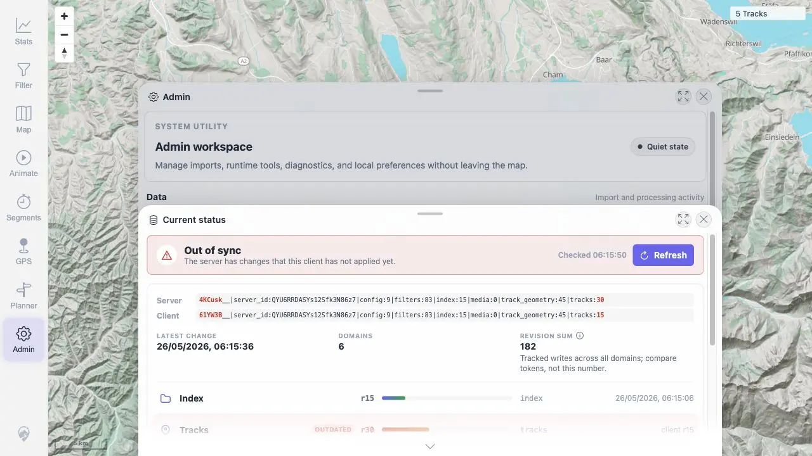</a>

<a href="assets/IMP_05-filter-after-import.webp">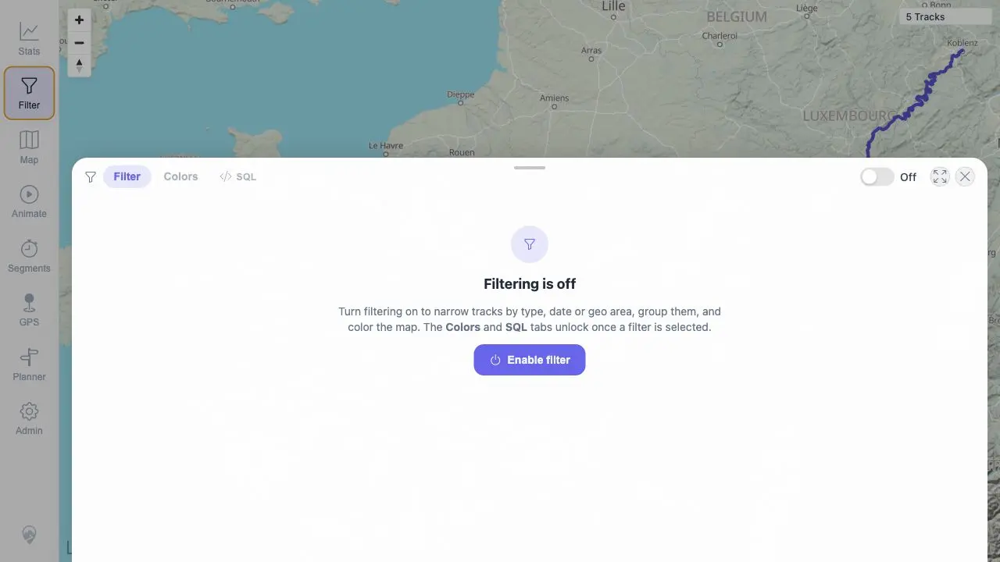</a>

### Packet IMP_06

- Packet file: [packets/IMP_06.md](packets/IMP_06.md)
- Coverage ID: `IMP_06`
- Status: **PASS**
- Action: Verified each imported file by visible name in Stats > Tracks search, mapping, stats summaries, map display, and filter context.
- Expected: Each imported file appears by name in track browser search, map, statistics summaries, and at least one filter result/context.
- Actual: Each of the five files mapped to a visible track ID/name; track-browser searches for Jura, Mosel, Vitry, Voie, and Lannion returned one matching row; map showed 5 tracks; stats highlights/recent activity contained the imported names; filter panel opened with the imported 5-track state.

**Timings**

| Step | Timing |
|---|---:|
| IMP_06 execution | <1m |

**Handoff Notes**
- Completed: IMP_06 terminal PASS.
- Remaining unfinished coverage: continue queue.
- Blocked or not applicable: none.
- State left for the next packet: five GPX tracks imported and visible; FIT not imported yet; no deletion performed.

**Evidence**

<a href="assets/IMP_06-track-list-after-import.webp">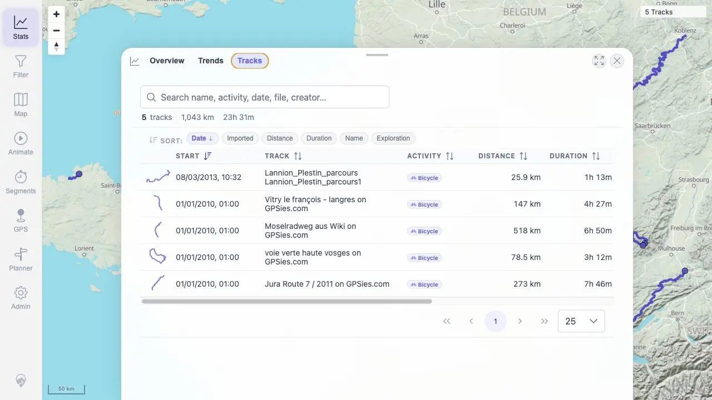</a>

**Text Evidence**
- [assets/IMP_06-imported-track-mapping.txt](assets/IMP_06-imported-track-mapping.txt) - Source-to-ID/name mapping. (919 B)

Excerpt: assets/IMP_06-imported-track-mapping.txt

<pre><code>Imported GPX mapping after five-file import.

| Source file | Imported track id | Visible track name | UI evidence |
|---|---:|---|---|
| Vitry-le-Francois_Langres.gpx | 100000 | Vitry le françois - langres on GPSies.com | Track browser row and stats highlights |
| JuraRoute72011.gpx | 100001 | Jura Route 7 / 2011 on GPSies.com | Track browser row and stats highlights |
| MoselradwegAusWiki.gpx | 100002 | Moselradweg aus Wiki on GPSies.com | Track browser row and stats highlights |
| Lannion_Plestin_parcours24.4RE.gpx | 100003 | Lannion_Plestin_parcours Lannion_Plestin_parcours1 | Track browser row and recent activity |
| VoieVerteHauteVosges.gpx | 100004 | voie verte haute vosges on GPSies.com | Track browser row and recent activity |

Track ids came from app ingest log SUCCESS lines in `IMP_03-index-monitor.txt`.
Visible names came from the Stats &gt; Tracks table in `IMP_06-track-list-after-import.webp`.
</code></pre>

- [assets/IMP_06-track-browser-search-results.txt](assets/IMP_06-track-browser-search-results.txt) - Per-name search results. (714 B)

Excerpt: assets/IMP_06-track-browser-search-results.txt

<pre><code>QUERY=Jura
ROW_COUNT=1
01/01/2010, 01:00 Jura Route 7 / 2011 on GPSies.com Bicycle 273 km 7h 46m 35.1 1808 Wh 100.0% 26/05/2026, 06:15

QUERY=Mosel
ROW_COUNT=1
01/01/2010, 01:00 Moselradweg aus Wiki on GPSies.com Bicycle 518 km 6h 50m 75.7 1616 Wh 100.0% 26/05/2026, 06:15

QUERY=Vitry
ROW_COUNT=1
01/01/2010, 01:00 Vitry le françois - langres on GPSies.com Bicycle 147 km 4h 27m 33.0 471 Wh 100.0% 26/05/2026, 06:15

QUERY=Voie
ROW_COUNT=1
01/01/2010, 01:00 voie verte haute vosges on GPSies.com Bicycle 78.5 km 3h 12m 24.4 436 Wh 100.0% 26/05/2026, 06:15

QUERY=Lannion
ROW_COUNT=1
08/03/2013, 10:32 Lannion_Plestin_parcours Lannion_Plestin_parcours1 Bicycle 25.9 km 1h 13m 21.1 198 Wh 100.0% 26/05/2026, 06:15
</code></pre>

### Packet IMP_07

- Packet file: [packets/IMP_07.md](packets/IMP_07.md)
- Coverage ID: `IMP_07`
- Status: **PASS**
- Action: Clicked visible map lines for all five imported GPX tracks; used the overlap selection list for Mosel/VoieVerte.
- Expected: Map zoom/click selection opens details, point/selection UI is usable, geometry is visible, and no stale/duplicate lines appear.
- Actual: CUA viewport clicks opened Lannion #100003, Vitry #100000, Jura #100001 directly; overlapping Mosel/VoieVerte click produced a two-track selection list and each row opened #100002/#100004. No stale or duplicate lines were visible in captured map evidence.

**Timings**

| Step | Timing |
|---|---:|
| IMP_07 execution | 5m |

**Handoff Notes**
- Completed: IMP_07 terminal PASS.
- Remaining unfinished coverage: continue queue.
- Blocked or not applicable: none.
- State left for the next packet: five GPX tracks imported and visible; FIT not imported yet; no deletion performed.

**Evidence**

<a href="assets/IMP_07-cua-click-lannion.webp">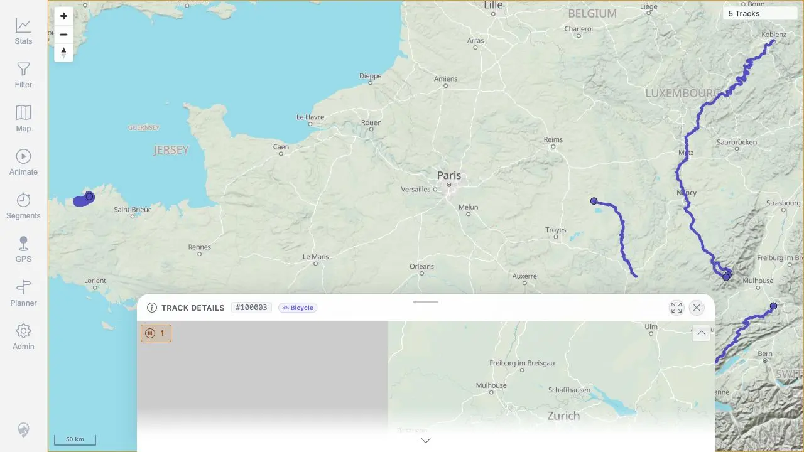</a>
<a href="assets/IMP_07-map-click-vitry.webp">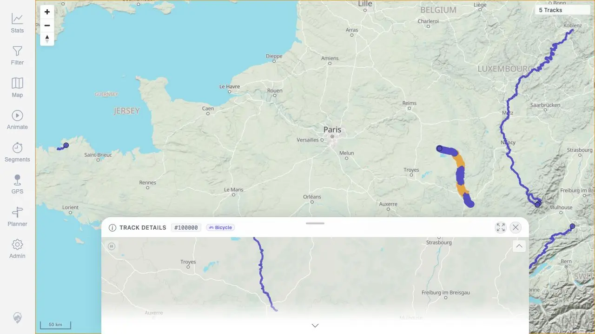</a>
<a href="assets/IMP_07-map-click-jura.webp">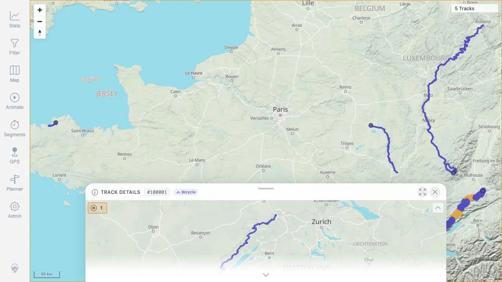</a>
<a href="assets/IMP_07-map-selection-mosel.webp">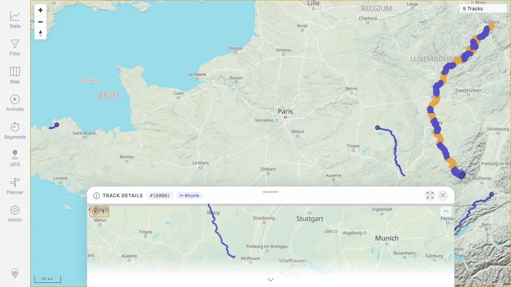</a>
<a href="assets/IMP_07-map-selection-voieverte.webp">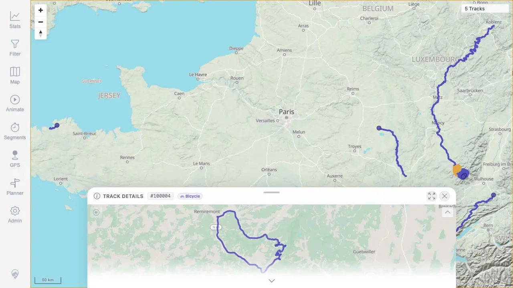</a>

**Text Evidence**
- [assets/IMP_07-map-click-results.txt](assets/IMP_07-map-click-results.txt) - Coordinate click and opened track IDs. (651 B)

Excerpt: assets/IMP_07-map-click-results.txt

<pre><code>Map click results against visible imported GPX lines
lannion	x=137	y=314	id=100003	title=Lannion_Plestin_parcours Lannion_Plestin_parcours1	Opened in prior CUA click and screenshot IMP_07-cua-click-lannion.png
vitry	x=982	y=370	id=100000	title=Vitry le françois - langres on GPSies.com
mosel	x=1137	y=276	id=NO_DETAIL_ID	title=NO_TITLE
voieverte	x=1156	y=438	id=NO_DETAIL_ID	title=Moselradweg aus Wiki on GPSies.com
jura	x=1198	y=505	id=100001	title=Jura Route 7 / 2011 on GPSies.com

Overlap selection results
mosel	rowY=538	id=100002	title=Moselradweg aus Wiki on GPSies.com
voieverte	rowY=599	id=100004	title=voie verte haute vosges on GPSies.com
</code></pre>

### Packet IMP_08

- Packet file: [packets/IMP_08.md](packets/IMP_08.md)
- Coverage ID: `IMP_08`
- Status: **PASS**
- Action: Compared baseline and post-import counts.
- Expected: Statistics count increases by five unless a source legitimately splits, with mapping recorded.
- Actual: Track count increased from 0 to 5; each GPX source produced exactly one imported track ID (100000-100004).

**Timings**

| Step | Timing |
|---|---:|
| IMP_08 execution | <1m |

**Handoff Notes**
- Completed: IMP_08 terminal PASS.
- Remaining unfinished coverage: continue queue.
- Blocked or not applicable: none.
- State left for the next packet: five GPX tracks imported and visible; FIT not imported yet; no deletion performed.

**Evidence**

**Text Evidence**
- [assets/IMP_01-baseline-summary.txt](assets/IMP_01-baseline-summary.txt) - Pre-import 0-track baseline. (370 B)

Excerpt: assets/IMP_01-baseline-summary.txt

<pre><code>Pre-import baseline captured 2026-05-26 06:13 CEST.

- Map badge: 0 Tracks.
- Statistics overview: "No tracks match the current filters."
- Admin jobs: Duplicate Finder, Activity Classifier, Exploration Score all done with 0 total; location search done; routing segments ready.
- Freshness token: server/client in sync with index:0, media:0, track_geometry:0, tracks:0.
</code></pre>

- [assets/IMP_06-imported-track-mapping.txt](assets/IMP_06-imported-track-mapping.txt) - Five one-to-one imported tracks. (919 B)

Excerpt: assets/IMP_06-imported-track-mapping.txt

<pre><code>Imported GPX mapping after five-file import.

| Source file | Imported track id | Visible track name | UI evidence |
|---|---:|---|---|
| Vitry-le-Francois_Langres.gpx | 100000 | Vitry le françois - langres on GPSies.com | Track browser row and stats highlights |
| JuraRoute72011.gpx | 100001 | Jura Route 7 / 2011 on GPSies.com | Track browser row and stats highlights |
| MoselradwegAusWiki.gpx | 100002 | Moselradweg aus Wiki on GPSies.com | Track browser row and stats highlights |
| Lannion_Plestin_parcours24.4RE.gpx | 100003 | Lannion_Plestin_parcours Lannion_Plestin_parcours1 | Track browser row and recent activity |
| VoieVerteHauteVosges.gpx | 100004 | voie verte haute vosges on GPSies.com | Track browser row and recent activity |

Track ids came from app ingest log SUCCESS lines in `IMP_03-index-monitor.txt`.
Visible names came from the Stats &gt; Tracks table in `IMP_06-track-list-after-import.webp`.
</code></pre>

### Packet IMP_09

- Packet file: [packets/IMP_09.md](packets/IMP_09.md)
- Coverage ID: `IMP_09`
- Status: **PASS**
- Action: Verified stats/browser totals, direction of totals, activity breakdown, period summaries, rankings, heatmap density, and track-browser summary.
- Expected: Totals change in the correct direction for distance, duration, ascent/descent, activity, period charts, rankings, heatmap, and browser summary.
- Actual: Stats increased to 5 tracks, 1,043 km, 23h31m, 4,527 Wh with Bicycle breakdown, rankings/highlights, active periods, and track-browser summary; heatmap rendered density over imported tracks.

**Timings**

| Step | Timing |
|---|---:|
| IMP_09 execution | <1m |

**Handoff Notes**
- Completed: IMP_09 terminal PASS.
- Remaining unfinished coverage: continue queue.
- Blocked or not applicable: none.
- State left for the next packet: five GPX tracks imported and visible; FIT not imported yet; no deletion performed.

**Evidence**

<a href="assets/IMP_09-heatmap-map-visible.webp">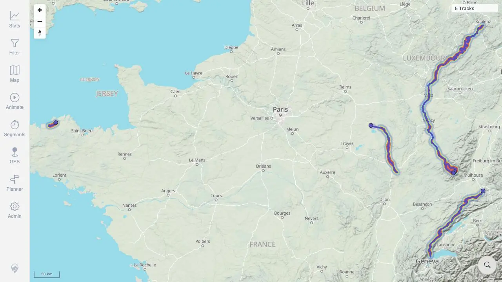</a>

### Packet LOC_01

- Packet file: [packets/LOC_01.md](packets/LOC_01.md)
- Coverage ID: `LOC_01`
- Status: **PASS**
- Action: Restored en-GB in Settings, inspected the Settings preview and Stats overview values.
- Expected: Numbers, distances, durations, and dates render in the expected locale format.
- Actual: en-GB preview used `26/05/2026` and `12,345.67`; Stats showed grouped values such as `1,262 km`, `7,054 Wh`, dates like `26/05/2026, 11:20`, and compact durations such as `2m 00s`.

**Timings**

| Step | Timing |
|---|---:|
| Settings and Stats inspection | <2 min |

**Handoff Notes**
- Completed: LOC_01 passed.
- Remaining unfinished coverage: LOC_02 through RUN_CLEANUP.
- Blocked or not applicable: None.
- State left for the next packet: Signed in; locale can be changed from Settings.

**Evidence**

**Text Evidence**
- [assets/LOC_01-locale-baseline.txt](assets/LOC_01-locale-baseline.txt) - Settings and Stats formatting observations for en-GB. (1016 B)

Excerpt: assets/LOC_01-locale-baseline.txt

<pre><code>LOC_01 en-GB formatting baseline

State:
- Settings locale restored to en-GB.
- Browser timezone: Europe/Zurich.
- Visible map/data state: 14 / 14 Tracks after LOC_04 disposable imports.

Settings evidence:
- Format locale: en-GB (31/12/2025, 1,234.56)
- Preview: 26/05/2026 11:13:17 - 12,345.67
- Auto-detected: en-GB (browser: en-GB, timezone: Europe/Zurich)

Stats evidence:
- Summary distance: 1,262 km
- Summary duration: 1d 03h
- Summary energy: 7,054 Wh
- Highlight ascent: 6,324 m
- Highlight ascent rate: 3,919 m/h
- Recent LOC_04 Null Elevation date/distance/duration: 26/05/2026, 11:20; 94.26 m; 2m 00s
- Recent LOC_04 Boundary Formatting date/distance/duration: 26/05/2026, 11:12; 15.69 m; 1m 00s

Bad-value scan on visible body text:
- NaN: not present
- undefined: not present
- null: not present
- Infinity: not present

Result: PASS. Dates use day/month/year, grouped large numbers use commas, decimals use periods, and durations render as compact day/hour/minute text for the selected en-GB locale.
</code></pre>

### Packet LOC_03

- Packet file: [packets/LOC_03.md](packets/LOC_03.md)
- Coverage ID: `LOC_03`
- Status: **PASS**
- Action: Hard reloaded with de-DE selected, reopened Admin -> Settings, and inspected the selected locale and preview.
- Expected: Locale persists across reload.
- Actual: After reload, Settings still showed de-DE selected and the preview stayed in de-DE format: `26.05.2026 ... 12.345,67`.

**Timings**

| Step | Timing |
|---|---:|
| Reload and reopen Settings | <2 min |

**Handoff Notes**
- Completed: LOC_03 passed.
- Remaining unfinished coverage: LOC_04 through RUN_CLEANUP.
- Blocked or not applicable: None.
- State left for the next packet: de-DE persistence verified; locale restored to en-GB after LOC_04 evidence collection.

**Evidence**

**Text Evidence**
- [assets/LOC_03-locale-persistence.txt](assets/LOC_03-locale-persistence.txt) - Selected-locale and preview evidence after reload. (515 B)

Excerpt: assets/LOC_03-locale-persistence.txt

<pre><code>LOC_03 locale persistence evidence

Action:
- Selected de-DE in Admin -&gt; Settings -&gt; Format locale.
- Hard reloaded the application.
- Reopened Admin -&gt; Settings.

Observed after hard reload:
- Selected locale remained: de-DE (31.12.2025, 1.234,56)
- Preview after reload: 26.05.2026 11:08:12 - 12.345,67
- Auto-detected browser locale remained visible as en-GB, distinct from the selected de-DE preference.
- Map returned to usable state after reload.

Result: PASS. Locale selection persisted across hard reload.
</code></pre>

### Packet LOC_04

- Packet file: [packets/LOC_04.md](packets/LOC_04.md)
- Coverage ID: `LOC_04`
- Status: **PASS**
- Action: Uploaded `LOC_04-boundary.gpx` and `LOC_04-null-elevation.gpx`, refreshed to 14 tracks, and inspected Stats recent activity and API import stats.
- Expected: Boundary values render sensibly, not as `NaN` or blank.
- Actual: Zero ascent/descent and no-elevation imports rendered as normal recent activity rows with dates, distances, and durations. Visible body text did not contain `NaN`, `undefined`, `null`, or `Infinity`.

**Timings**

| Step | Timing |
|---|---:|
| Upload, refresh, and inspect boundary tracks | <5 min |

**Handoff Notes**
- Completed: LOC_04 passed.
- Remaining unfinished coverage: MOB_01 through RUN_CLEANUP.
- Blocked or not applicable: None.
- State left for the next packet: Signed in, en-GB restored, hard reload cleared the freshness banner, 14 tracks visible.

**Evidence**

**Text Evidence**
- [assets/LOC_04-boundary-values.txt](assets/LOC_04-boundary-values.txt) - Upload/API/UI observations for boundary-value tracks. (1.1 KB)

Excerpt: assets/LOC_04-boundary-values.txt

<pre><code>LOC_04 boundary values evidence

Disposable imports:
- Uploaded LOC_04-boundary.gpx through /api/gpx-upload/upload.
- Uploaded LOC_04-null-elevation.gpx through /api/gpx-upload/upload.
- Client refreshed to 14 / 14 Tracks.

API import details:
- LOC_04 Boundary Formatting indexed as track 100023 with loadStatus SUCCESS.
- Track 100023 stats: 2 points, 15.69 m, 0.0 m ascent, 150.0 m descent, min altitude 50.0 m, max altitude 200.0 m.
- LOC_04 Null Elevation indexed as track 100024 with loadStatus SUCCESS.
- Track 100024 stats: 3 points, 94.26 m, 0.0 m ascent, 0.0 m descent, min altitude 0.0 m, max altitude 0.0 m.

Visible UI evidence in Stats -&gt; Overview -&gt; Recent Activity:
- LOC_04 Null Elevation; Bicycle; 26/05/2026, 11:20; 94.26 m; 2m 00s
- LOC_04 Boundary Formatting; Bicycle; 26/05/2026, 11:12; 15.69 m; 1m 00s
- Summary totals remained populated: 14 tracks, 1,262 km, 1d 03h, 7,054 Wh.

Bad-value scan on visible body text:
- NaN: not present
- undefined: not present
- null: not present
- Infinity: not present

Result: PASS. Zero ascent/descent and no-elevation imports rendered as ordinary formatted values without blank or NaN-style output.
</code></pre>

**Other Evidence Files**
- [assets/LOC_04-boundary.gpx](assets/LOC_04-boundary.gpx) - Disposable descending/zero-ascent boundary GPX. (788 B)
- [assets/LOC_04-null-elevation.gpx](assets/LOC_04-null-elevation.gpx) - Disposable no-elevation GPX. (627 B)

### Packet MAP_01

- Packet file: [packets/MAP_01.md](packets/MAP_01.md)
- Coverage ID: `MAP_01`
- Status: **PASS**
- Action: Opened the app after valid sign-in and observed the first map view.
- Expected: Base map and overlays load on first open.
- Actual: The first ready map rendered map controls, scale, primary navigation, and 10 visible tracks without a blank-map state.

**Timings**

| Step | Timing |
|---|---:|
| First map load | 5.2s |

**Handoff Notes**
- Completed: MAP_01 terminal PASS.
- Remaining unfinished coverage: continue with MAP_02.
- Blocked or not applicable: detailed overlay switching deferred to HMO_02.
- State left for the next packet: no data changed.

**Evidence**

**Text Evidence**
- [assets/SGN_02-valid-login-map.txt](assets/SGN_02-valid-login-map.txt) - First-open map text summary. (163 B)

Excerpt: assets/SGN_02-valid-login-map.txt

<pre><code>initial_inputs=2
url=http://178.105.173.254:18080/mtl/
login_to_ready_ms=5213
visible_excerpt=500 km 10 Tracks Stats Filter Map Animate Segments GPS Planner Admin
</code></pre>

### Packet MAP_03

- Packet file: [packets/MAP_03.md](packets/MAP_03.md)
- Coverage ID: `MAP_03`
- Status: **PASS**
- Action: Accepted/reloaded from data freshness after imports and observed map/list update.
- Expected: Newly imported tracks appear without a full browser restart.
- Actual: Freshness reload after GPX import updated the map from baseline to imported data; later hard reload after format imports showed the expanded 10-track visible dataset.

**Timings**

| Step | Timing |
|---|---:|
| Freshness reload observation | <1m |

**Handoff Notes**
- Completed: MAP_03 terminal PASS.
- Remaining unfinished coverage: continue with MAP_04.
- Blocked or not applicable: none.
- State left for the next packet: no data changed.

**Evidence**

**Text Evidence**
- [assets/FMT_01-unique-format-status.txt](assets/FMT_01-unique-format-status.txt) - Format import watcher/status lines. (4.6 KB)

Excerpt: assets/FMT_01-unique-format-status.txt

<pre><code>app-1  | 2026-05-26T04:44:00.930Z  INFO 1 --- [watch-GPS] FileIndexerImpl              : Live watcher detected CREATE for: FMT_TCX_unique.tcx
app-1  | 2026-05-26T04:44:00.932Z  INFO 1 --- [watch-GPS] FileIndexerImpl              : Live watcher detected CREATE for: FMT_KML_unique.kml
app-1  | 2026-05-26T04:44:00.934Z  INFO 1 --- [watch-GPS] FileIndexerImpl              : Live watcher detected CREATE for: FMT_KMZ_unique.kmz
app-1  | 2026-05-26T04:44:00.935Z  INFO 1 --- [watch-GPS] FileIndexerImpl              : Live watcher detected CREATE for: FMT_IGC_unique.igc
app-1  | 2026-05-26T04:44:00.936Z  INFO 1 --- [watch-GPS] FileIndexerImpl              : Live watcher detected CREATE for: FMT_GEOJSON_unique.geojson
app-1  | 2026-05-26T04:44:00.938Z  INFO 1 --- [watch-GPS] FileIndexerImpl              : Live watcher detected CREATE for: FMT_GDB_unique.gdb
app-1  | 2026-05-26T04:44:00.940Z  INFO 1 --- [watch-GPS] FileIndexerImpl              : Live watcher detected CREATE for: FMT_NMEA_unique.nmea
app-1  | 2026-05-26T04:44:11.085Z  INFO 1 --- [idx-4] GPXStoreService              : GPS ingest timing trackId=100013 file=/FMT_TCX_unique.tcx status=SUCCESS Timing total 139ms; slowest simplified shapes 69ms, raw points 28ms, cleaned points 11ms, gpsbabel 9ms, denoise 7ms, parse XML 5ms, track row 2ms, motion/stops/events 2ms.
app-1  | 2026-05-26T04:44:11.086Z  INFO 1 --- [idx-4] GPXStoreService              : Reading of track id=100013 and path= file=FMT_TCX_unique.tcx did complete with status=SUCCESS and took processingTime=141ms
app-1  | 2026-05-26T04:44:11.201Z  INFO 1 --- [idx-4] GPXStoreService              : GPS ingest timing trackId=100014 file=/FMT_KML_unique.kml status=SUCCESS Timing total 109ms; slowest simplified shapes 44ms, parse XML 15ms, gpsbabel 11ms, raw points 10ms, cleaned points 10ms, denoise 6ms, outlier filter 4ms, delete old tracks 1ms.
app-1  | 2026-05-26T04:44:11.203Z  INFO 1 --- [idx-4] GPXStoreService              : Reading of track id=100014 and path= file=FMT_KML_unique.kml did complete with status=SUCCESS and took processingTime=112ms
app-1  | 2026-05-26T04:44:11.220Z ERROR 1 --- [idx-4] TrackFileConverterService    : GPSBabel failed (exit 1) for /app/gpx/FMT_KMZ_unique.kmz: Input type 'kmz' not recognized
app-1  | Caused by: java.io.IOException: GPSBabel conversion failed (exit 1) for /app/gpx/FMT_KMZ_unique.kmz: Input type 'kmz' not recognized
app-1  | 2026-05-26T04:44:11.409Z  INFO 1 --- [idx-4] GPXStoreService              : GPS ingest timing trackId=100015 file=/FMT_IGC_unique.igc status=SUCCESS Timing total 183ms; slowest simplified shapes 111ms, cleaned points 24ms, raw points 15ms, gpsbabel 8ms, denoise 6ms, parse XML 5ms, motion/stops/events 4ms, delete old tracks 1ms.
app-1  | 2026-05-26T04:44:11.412Z  INFO 1 --- [idx-4] GPXStoreService              : Reading of track id=100015 and path= file=FMT_IGC_unique.igc did complete with status=SUCCESS and took processingTime=186ms
app-1  | 2026-05-26T04:44:12.974Z  INFO 1 --- [idx-1] GPXReader                    : No waypoints for file=IndexedFile{id=300017, index='GPS', name='FMT_GEOJSON_unique.geojson', path=''}
app-1  | 2026-05-26T04:44:12.977Z  INFO 1 --- [idx-1] GPXStoreService              : GPS ingest timing trackId=100016 file=/FMT_GEOJSON_unique.geojson status=EMPTY_FILE Timing total 25ms; slowest gpsbabel 12ms, parse XML 4ms, delete old tracks 1ms, track row 1ms.
app-1  | 2026-05-26T04:44:12.980Z  INFO 1 --- [idx-1] GPXStoreService              : Reading of track id=100016 and path= file=FMT_GEOJSON_unique.geojson did complete with status=EMPTY_FILE and took processingTime=28ms
app-1  | 2026-05-26T04:44:13.100Z  INFO 1 --- [idx-3] GPXStoreService              : GPS ingest timing trackId=100017 file=/FMT_GDB_unique.gdb status=SUCCESS Timing total 148ms; slowest simplified shapes 57ms, raw points 32ms, gpsbabel 16ms, denoise 15ms, cleaned points 9ms, outlier filter 5ms, parse XML 3ms, delete old tracks 2ms.
app-1  | 2026-05-26T04:44:13.102Z  INFO 1 --- [idx-3] GPXStoreService              : Reading of track id=100017 and path= file=FMT_GDB_unique.gdb did complete with status=SUCCESS and took processingTime=150ms
app-1  | 2026-05-26T04:44:13.126Z  INFO 1 --- [idx-4] GPXStoreService              : GPS ingest timing trackId=100018 file=/FMT_NMEA_unique.nmea status=SUCCESS Timing total 175ms; slowest simplified shapes 58ms, gpsbabel 48ms, raw points 21ms, cleaned points 13ms, track row 11ms, motion/stops/events 8ms, denoise 4ms, delete old tracks 2ms.
app-1  | 2026-05-26T04:44:13.128Z  INFO 1 --- [idx-4] GPXStoreService              : Reading of track id=100018 and path= file=FMT_NMEA_unique.nmea did complete with status=SUCCESS and took processingTime=177ms
</code></pre>

### Packet MAP_04

- Packet file: [packets/MAP_04.md](packets/MAP_04.md)
- Coverage ID: `MAP_04`
- Status: **PASS**
- Action: Verified map and user-visible surfaces after deleting two source files.
- Expected: Deleted tracks disappear from map sources, selection lists, and popups.
- Actual: Map/heatmap dropped to 3 GPX tracks at that stage; searches for Vitry and Voie returned no matches; remaining tracks still opened.

**Timings**

| Step | Timing |
|---|---:|
| Post-delete map check | <1m |

**Handoff Notes**
- Completed: MAP_04 terminal PASS.
- Remaining unfinished coverage: continue with MAP_05.
- Blocked or not applicable: none.
- State left for the next packet: no data changed.

**Evidence**

**Text Evidence**
- [assets/DEL_03-search-after-delete.txt](assets/DEL_03-search-after-delete.txt) - Deleted names absent from search. (533 B)

Excerpt: assets/DEL_03-search-after-delete.txt

<pre><code>QUERY=Vitry
ROW_COUNT=1
No tracks match “Vitry”

QUERY=Voie
ROW_COUNT=1
No tracks match “Voie”

QUERY=Jura
ROW_COUNT=1
01/01/2010, 01:00 Jura Route 7 / 2011 on GPSies.com Bicycle 273 km 7h 46m 35.1 1808 Wh 100.0% 26/05/2026, 06:15

QUERY=Mosel
ROW_COUNT=1
01/01/2010, 01:00 Moselradweg aus Wiki on GPSies.com Bicycle 518 km 6h 50m 75.7 1616 Wh 100.0% 26/05/2026, 06:15

QUERY=Lannion
ROW_COUNT=1
08/03/2013, 10:32 Lannion_Plestin_parcours Lannion_Plestin_parcours1 Bicycle 25.9 km 1h 13m 21.1 198 Wh 100.0% 26/05/2026, 06:15
</code></pre>

### Packet MAP_05

- Packet file: [packets/MAP_05.md](packets/MAP_05.md)
- Coverage ID: `MAP_05`
- Status: **PASS**
- Action: Zoomed to imported GPX tracks and opened track selections/details.
- Expected: Detail/precision improves at zoom; no duplicated or broken lines.
- Actual: Zoomed/clicked imported tracks rendered continuous line geometry and opened selections/details without stale duplicate lines.

**Timings**

| Step | Timing |
|---|---:|
| Zoom/click check | <1m |

**Handoff Notes**
- Completed: MAP_05 terminal PASS.
- Remaining unfinished coverage: continue with MAP_06.
- Blocked or not applicable: none.
- State left for the next packet: no data changed.

**Evidence**

<a href="assets/IMP_07-zoom-lannion.webp">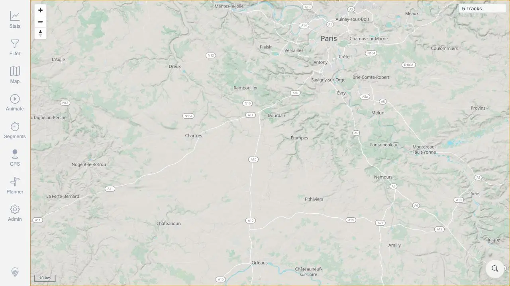</a>

**Text Evidence**
- [assets/IMP_07-map-click-results.txt](assets/IMP_07-map-click-results.txt) - Map click/selection summary. (651 B)

Excerpt: assets/IMP_07-map-click-results.txt

<pre><code>Map click results against visible imported GPX lines
lannion	x=137	y=314	id=100003	title=Lannion_Plestin_parcours Lannion_Plestin_parcours1	Opened in prior CUA click and screenshot IMP_07-cua-click-lannion.png
vitry	x=982	y=370	id=100000	title=Vitry le françois - langres on GPSies.com
mosel	x=1137	y=276	id=NO_DETAIL_ID	title=NO_TITLE
voieverte	x=1156	y=438	id=NO_DETAIL_ID	title=Moselradweg aus Wiki on GPSies.com
jura	x=1198	y=505	id=100001	title=Jura Route 7 / 2011 on GPSies.com

Overlap selection results
mosel	rowY=538	id=100002	title=Moselradweg aus Wiki on GPSies.com
voieverte	rowY=599	id=100004	title=voie verte haute vosges on GPSies.com
</code></pre>

### Packet MAP_06

- Packet file: [packets/MAP_06.md](packets/MAP_06.md)
- Coverage ID: `MAP_06`
- Status: **PASS**
- Action: Performed repeated wheel zooms and drag pans, then waited for the map to settle.
- Expected: Fast pan/zoom does not leave stale lines, missing tiles, or runaway loading spinners.
- Actual: Map remained usable with 10-track overlay and no visible loading/spinner text. Request log showed tile/API aborts from rapid movement but no frozen UI.

**Timings**

| Step | Timing |
|---|---:|
| Pan/zoom stress | <1m |

**Handoff Notes**
- Completed: MAP_06 terminal PASS.
- Remaining unfinished coverage: continue with MAP_07.
- Blocked or not applicable: none.
- State left for the next packet: no data changed.

**Evidence**

<a href="assets/MAP_06-fast-pan-zoom.webp">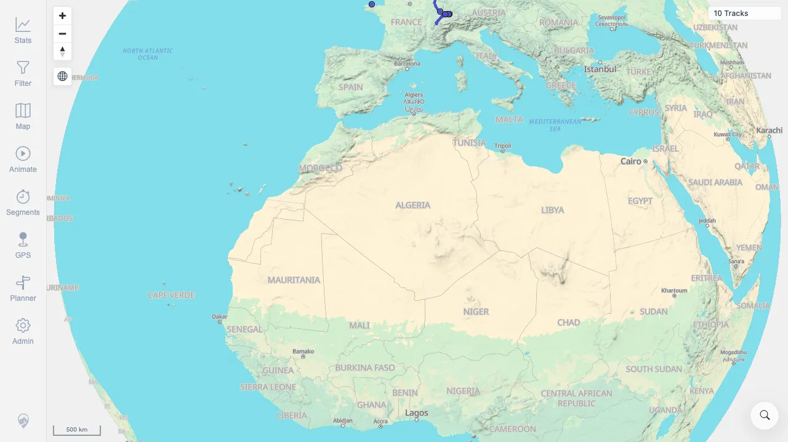</a>

**Text Evidence**
- [assets/MAP_06-fast-pan-zoom.txt](assets/MAP_06-fast-pan-zoom.txt) - Visible text, console, and request-failure summary. (1.2 KB)

Excerpt: assets/MAP_06-fast-pan-zoom.txt

<pre><code>visible_text=500 km 10 Tracks Stats Filter Map Animate Segments GPS Planner Admin
console_errors=2
Failed to load resource: the server responded with a status of 401 ()
Failed to load resource: the server responded with a status of 401 ()
failed_requests=88
HEAD http://178.105.173.254:18080/mtl/api/info/build net::ERR_ABORTED
HEAD https://protomaps.github.io/basemaps-assets/fonts/Noto%20Sans%20Regular/0-255.pbf net::ERR_ABORTED
HEAD https://protomaps.github.io/basemaps-assets/sprites/v4/light.json net::ERR_ABORTED
HEAD https://tile.openstreetmap.org/0/0/0.png net::ERR_ABORTED
HEAD https://tiles.mapterhorn.com/0/0/0.webp net::ERR_ABORTED
GET https://tiles.mapterhorn.com/4/8/5.webp net::ERR_ABORTED
GET https://tiles.mapterhorn.com/4/7/5.webp net::ERR_ABORTED
GET http://178.105.173.254:18080/mtl/api/map-proxy/prod/planet.pmtiles?mtl-map-source=public&amp;mtl-map-archive=public-default net::ERR_ABORTED
GET http://178.105.173.254:18080/mtl/api/map-proxy/prod/planet.pmtiles?mtl-map-source=public&amp;mtl-map-archive=public-default net::ERR_ABORTED
GET http://178.105.173.254:18080/mtl/api/map-proxy/prod/planet.pmtiles?mtl-map-source=public&amp;mtl-map-archive=public-default net::ERR_ABORTED
loading_text_present=false
</code></pre>

### Packet MAP_08

- Packet file: [packets/MAP_08.md](packets/MAP_08.md)
- Coverage ID: `MAP_08`
- Status: **PASS**
- Action: Clicked single imported tracks on the map.
- Expected: A clicked track highlights and details open.
- Actual: Lannion, Vitry, and Jura single-track clicks opened their detail/selection state without stale geometry.

**Timings**

| Step | Timing |
|---|---:|
| Single-track clicks | <1m |

**Handoff Notes**
- Completed: MAP_08 terminal PASS.
- Remaining unfinished coverage: continue with MAP_09.
- Blocked or not applicable: none.
- State left for the next packet: no data changed.

**Evidence**

**Text Evidence**
- [assets/IMP_07-map-click-results.txt](assets/IMP_07-map-click-results.txt) - Map click result summary. (651 B)

Excerpt: assets/IMP_07-map-click-results.txt

<pre><code>Map click results against visible imported GPX lines
lannion	x=137	y=314	id=100003	title=Lannion_Plestin_parcours Lannion_Plestin_parcours1	Opened in prior CUA click and screenshot IMP_07-cua-click-lannion.png
vitry	x=982	y=370	id=100000	title=Vitry le françois - langres on GPSies.com
mosel	x=1137	y=276	id=NO_DETAIL_ID	title=NO_TITLE
voieverte	x=1156	y=438	id=NO_DETAIL_ID	title=Moselradweg aus Wiki on GPSies.com
jura	x=1198	y=505	id=100001	title=Jura Route 7 / 2011 on GPSies.com

Overlap selection results
mosel	rowY=538	id=100002	title=Moselradweg aus Wiki on GPSies.com
voieverte	rowY=599	id=100004	title=voie verte haute vosges on GPSies.com
</code></pre>

### Packet MAP_09

- Packet file: [packets/MAP_09.md](packets/MAP_09.md)
- Coverage ID: `MAP_09`
- Status: **PASS**
- Action: Clicked a map area with overlapping Mosel/VoieVerte tracks and selected each result.
- Expected: Selection list appears; picking one opens its details.
- Actual: A two-track selection list appeared; selecting Mosel opened #100002 and selecting VoieVerte opened #100004.

**Timings**

| Step | Timing |
|---|---:|
| Overlap click selection | <1m |

**Handoff Notes**
- Completed: MAP_09 terminal PASS.
- Remaining unfinished coverage: continue with MAP_10.
- Blocked or not applicable: none.
- State left for the next packet: no data changed.

**Evidence**

**Text Evidence**
- [assets/IMP_07-map-click-results.txt](assets/IMP_07-map-click-results.txt) - Overlap click result summary. (651 B)

Excerpt: assets/IMP_07-map-click-results.txt

<pre><code>Map click results against visible imported GPX lines
lannion	x=137	y=314	id=100003	title=Lannion_Plestin_parcours Lannion_Plestin_parcours1	Opened in prior CUA click and screenshot IMP_07-cua-click-lannion.png
vitry	x=982	y=370	id=100000	title=Vitry le françois - langres on GPSies.com
mosel	x=1137	y=276	id=NO_DETAIL_ID	title=NO_TITLE
voieverte	x=1156	y=438	id=NO_DETAIL_ID	title=Moselradweg aus Wiki on GPSies.com
jura	x=1198	y=505	id=100001	title=Jura Route 7 / 2011 on GPSies.com

Overlap selection results
mosel	rowY=538	id=100002	title=Moselradweg aus Wiki on GPSies.com
voieverte	rowY=599	id=100004	title=voie verte haute vosges on GPSies.com
</code></pre>

### Packet MAP_10

- Packet file: [packets/MAP_10.md](packets/MAP_10.md)
- Coverage ID: `MAP_10`
- Status: **PASS**
- Action: Clicked current overlap cluster, then clicked the selection sheet `Close` button.
- Expected: Closing/deselecting selection returns map to normal state.
- Actual: An 8-track selection list opened; after Close, the selection text disappeared and the normal 10-track map state remained.

**Timings**

| Step | Timing |
|---|---:|
| Open/close selection | <1m |

**Handoff Notes**
- Completed: MAP_10 terminal PASS.
- Remaining unfinished coverage: continue with MAP_11.
- Blocked or not applicable: none.
- State left for the next packet: no data changed.

**Evidence**

<a href="assets/MAP_10-current-selection-closed.webp">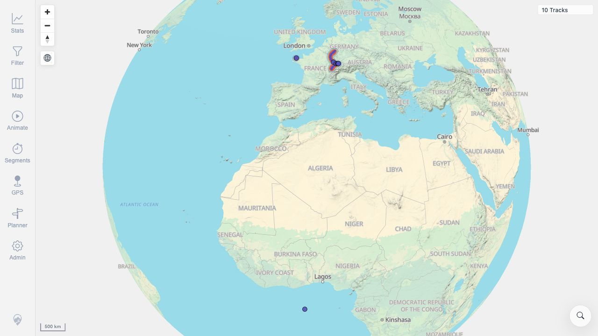</a>

**Text Evidence**
- [assets/MAP_10-current-selection-close.txt](assets/MAP_10-current-selection-close.txt) - Close result summary. (810 B)

Excerpt: assets/MAP_10-current-selection-close.txt

<pre><code>close_count=0
closed_has_selection=false
closed_excerpt=- region "Map"
- region "Map"
- button "Zoom in"
- button "Zoom out"
- button "Drag to rotate map, click to reset north"
- button "Toggle globe mode":
  - generic: 
- generic: 500 km
- button "Search location":
  - generic: 
- generic: 10 Tracks
- button " Stats":
  - generic: 
  - generic: Stats
- button " Filter":
  - generic: 
  - generic: Filter
- button " Map":
  - generic: 
  - generic: Map
- button " Animate":
  - generic: 
  - generic: Animate
- button " Segments":
  - generic: 
  - generic: Segments
- button " GPS":
  - generic: 
  - generic: GPS
- button " Planner":
  - generic: 
  - generic: Planner
- button " Admin":
  - generic: 
  - generic: Admin
- button "About MTL Explorer"
</code></pre>

### Packet MCT_01

- Packet file: [packets/MCT_01.md](packets/MCT_01.md)
- Coverage ID: `MCT_01`
- Status: **PASS**
- Action: Opened Segment Analyzer, moved to Lannion, placed A/B zones on the visible Lannion track, and ran Analyze.
- Expected: Result list of crossing tracks appears with speed/time/distance.
- Actual: Analyzer showed A/B zones each crossing 1 track; Analyze produced a 1/1 track table with Lannion result, duration `3h 42m`, and A-B speed metric `-1.03`, with metric controls for speed/time/distance.

**Timings**

| Step | Timing |
|---|---:|
| Segment analyzer setup and run | <8m |

**Handoff Notes**
- Completed: MCT_01 terminal PASS.
- Remaining unfinished coverage: continue with MCT_02.
- Blocked or not applicable: none.
- State left for the next packet: Segment Analyzer result table open with one Lannion result.

**Evidence**

<a href="assets/MCT_01-lannion-map.webp">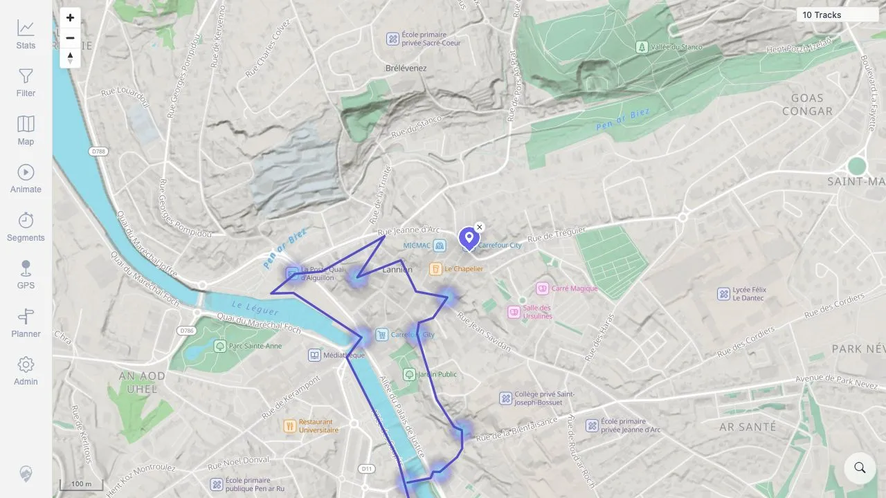</a>
<a href="assets/MCT_01-zones-placed.webp">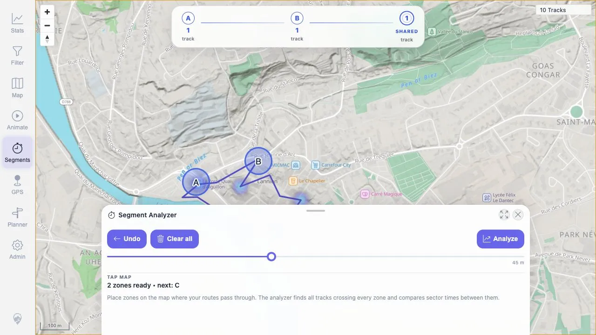</a>
<a href="assets/MCT_01-results.webp">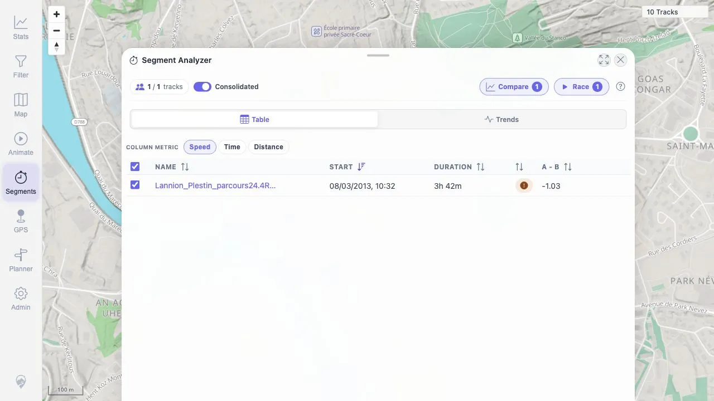</a>
<a href="assets/MCT_01-segments-open.webp">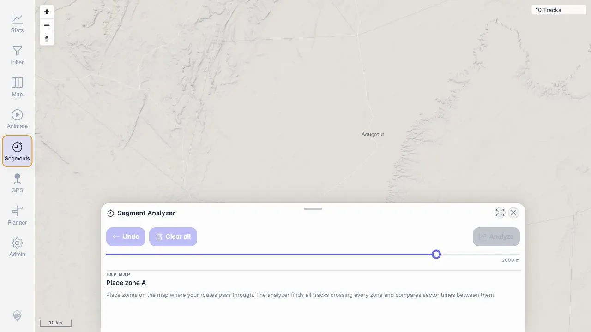</a>
<a href="assets/MCT_01-location-search-open.webp">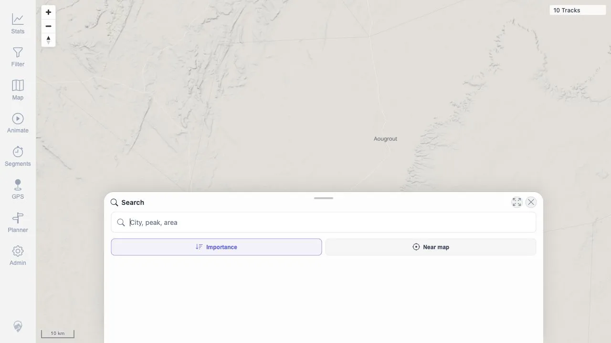</a>

### Packet MCT_02

- Packet file: [packets/MCT_02.md](packets/MCT_02.md)
- Coverage ID: `MCT_02`
- Status: **PASS**
- Action: Clicked the Lannion result row in the Segment Analyzer table.
- Expected: Clicking a result opens that track's details or segment view.
- Actual: Track Details opened for `#100003` with Lannion overview metrics while Segment Analyzer remained available behind it.

**Timings**

| Step | Timing |
|---|---:|
| Result click | <2m |

**Handoff Notes**
- Completed: MCT_02 terminal PASS.
- Remaining unfinished coverage: continue with MCT_03.
- Blocked or not applicable: none.
- State left for the next packet: Track Details open above Segment Analyzer.

**Evidence**

<a href="assets/MCT_02-result-click.webp">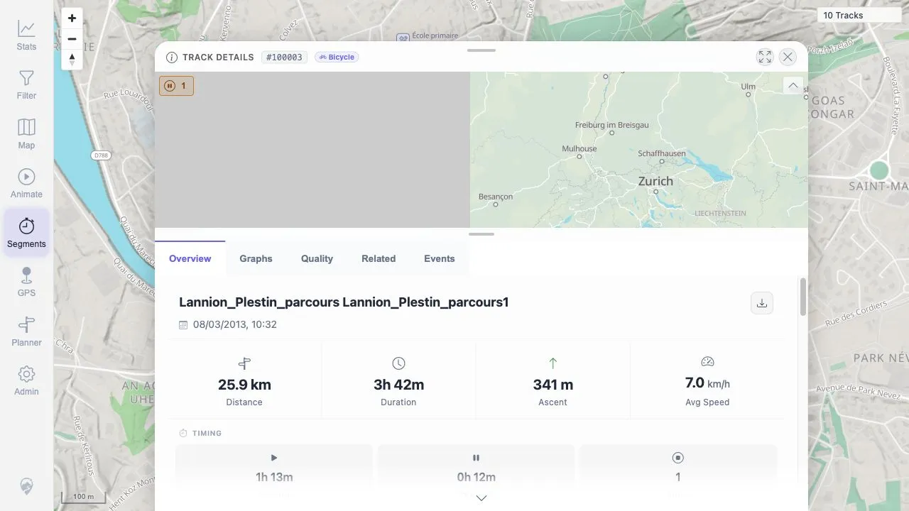</a>

### Packet MCT_03

- Packet file: [packets/MCT_03.md](packets/MCT_03.md)
- Coverage ID: `MCT_03`
- Status: **PASS**
- Action: Closed Track Details, then closed Segment Analyzer.
- Expected: Stopping the measure tool cleans up temporary markers and listeners.
- Actual: After closing Segment Analyzer, the side button was no longer active, the analyzer sheet was gone, and the map no longer showed A/B zone markers or analyzer result UI.

**Timings**

| Step | Timing |
|---|---:|
| Analyzer cleanup | <3m |

**Handoff Notes**
- Completed: MCT_03 terminal PASS.
- Remaining unfinished coverage: continue with MCT_04.
- Blocked or not applicable: none.
- State left for the next packet: map centered on Lannion; Segment Analyzer closed.

**Evidence**

### Packet MCT_05

- Packet file: [packets/MCT_05.md](packets/MCT_05.md)
- Coverage ID: `MCT_05`
- Status: **PASS**
- Action: Used the crossing endpoint to identify the `JuraRoute72011.nmea` A-B crossing, then requested `/api/tracks/details/get-sub-track?trackDataPointFrom=676448&trackDataPointTo=676536`.
- Expected: Sub-track extraction between two points on one track returns the expected ordered slice.
- Actual: Returned 89 ordered points on one `gpsTrackDataId` from index 8 to 96. First/last coordinates matched the requested segment, distance delta was 18,101.42 m, duration delta was 4,017 s, and missing moving-window speed values did not break extraction.

**Timings**

| Step | Timing |
|---|---:|
| Sub-track API validation | <5m |

**Handoff Notes**
- Completed: MCT_05 terminal PASS.
- Remaining unfinished coverage: continue with AVR_01.
- Blocked or not applicable: none.
- State left for the next packet: Segment Analyzer overlays closed; map returned to normal Jura-region view.

**Evidence**

**Text Evidence**
- [assets/MCT_05-subtrack-response.txt](assets/MCT_05-subtrack-response.txt) - Compact endpoint summary for the returned sub-track slice. (803 B)

Excerpt: assets/MCT_05-subtrack-response.txt

<pre><code>Sub-track extraction check
Endpoint: /mtl/api/tracks/details/get-sub-track?trackDataPointFrom=676448&amp;trackDataPointTo=676536
Source crossing: exact API A/B zones near JuraRoute72011 with 500 m radius; NMEA track #100012 last A-&gt;B crossing.

Returned slice:
- count: 89 points
- first id/index: 676448 / 8
- last id/index: 676536 / 96
- gpsTrackDataId unique count: 1 (200091)
- index range: 8..96
- first lon/lat: 7.5850230586, 47.5500787306
- last lon/lat: 7.4513857107, 47.4564288488
- distance delta: 18101.42 m
- duration delta: 4017 s
- null metric tolerance: speed moving-window null for 63/89 points, but altitude and energy were present.

Verdict: PASS - the endpoint returned an ordered in-track slice between the requested point IDs and tolerated missing per-point speed data without failing.
</code></pre>

### Packet MED_01

- Packet file: [packets/MED_01.md](packets/MED_01.md)
- Coverage ID: `MED_01`
- Status: **PASS**
- Action: Opened the map settings sheet near Arezzo, toggled Photos & Media off, then toggled it back on.
- Expected: Photo/media pins or clusters appear in the map view when the layer is enabled.
- Actual: With the layer disabled no red media marker was visible; after enabling Photos & Media, the red cluster marker `2` appeared over the indexed Arezzo media coordinate.

**Timings**

| Step | Timing |
|---|---:|
| Toggle off/on and verify cluster | ~1 min |

**Handoff Notes**
- Completed: MED_01.
- Remaining unfinished coverage: MED_02 onward.
- Blocked or not applicable: None.
- State left for the next packet: Desktop map remains centered on Arezzo with Photos & Media enabled and map settings open.

**Evidence**

<a href="assets/MED_01-media-layer-on.webp">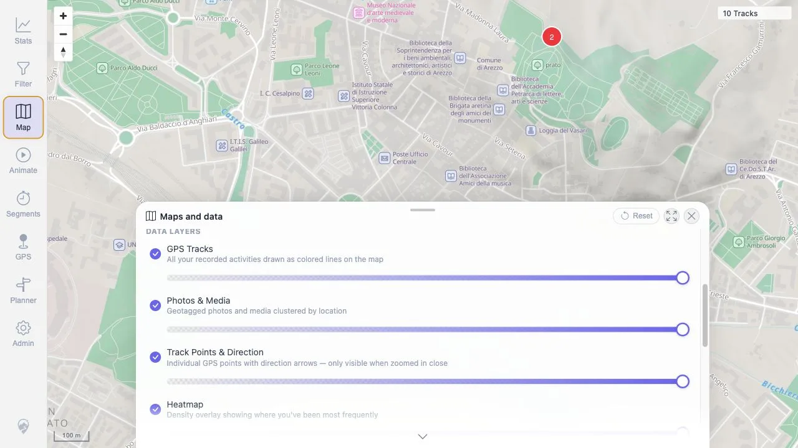</a>

**Text Evidence**
- [assets/MED_01-media-api.txt](assets/MED_01-media-api.txt) - API confirmation of the two in-bounds media points used for the visible cluster. (663 B)

Excerpt: assets/MED_01-media-api.txt

<pre><code>Media setup and viewport API check for MED_01.

Target app: http://178.105.173.254:18080/mtl/
Indexed sample media:
- 400001 MED_JPEG_02_DSCN0010_COPY.jpg at lat 43.46745, lng 11.88513
- 400002 MED_JPEG_01_DSCN0010.jpg at lat 43.46745, lng 11.88513

Bounds request used while centered around Arezzo:
GET /api/media/get-media-in-bounds?minLat=43.45&amp;minLng=11.85&amp;maxLat=43.49&amp;maxLng=11.92

Response:
[{"id":400001,"lat":43.46745,"lng":11.88513},{"id":400002,"lat":43.46745,"lng":11.88513}]

UI result:
- Photos &amp; Media layer toggled off: media marker disappeared.
- Photos &amp; Media layer toggled on: red cluster marker "2" appeared over the Arezzo media coordinate.
</code></pre>

### Packet MED_02

- Packet file: [packets/MED_02.md](packets/MED_02.md)
- Coverage ID: `MED_02`
- Status: **PASS**
- Action: With Photos & Media enabled, started in the Arezzo viewport, panned and zoomed to a nearby west-Arezzo viewport, then returned to Arezzo. Queried media bounds for the populated and nearby empty viewports.
- Expected: Media markers load for the current viewport instead of showing every indexed media item globally.
- Actual: Arezzo showed the red cluster `2`; after pan/zoom away no media marker was visible; returning to Arezzo showed cluster `2` again. API bounds returned the two Arezzo media IDs for Arezzo bounds and `[]` for west-Arezzo bounds, while all indexed regression media globally contained three items.

**Timings**

| Step | Timing |
|---|---:|
| Pan/zoom, return, and API checks | ~3 min |

**Handoff Notes**
- Completed: MED_02.
- Remaining unfinished coverage: MED_03 onward.
- Blocked or not applicable: None.
- State left for the next packet: Desktop map remains at Arezzo with Photos & Media enabled and the cluster `2` visible.

**Evidence**

<a href="assets/MED_02-pan-zoom-away.webp">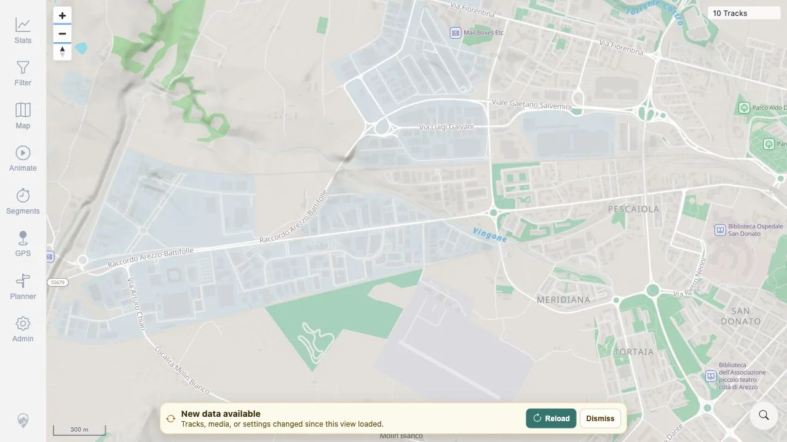</a>
<a href="assets/MED_02-return-arezzo.webp">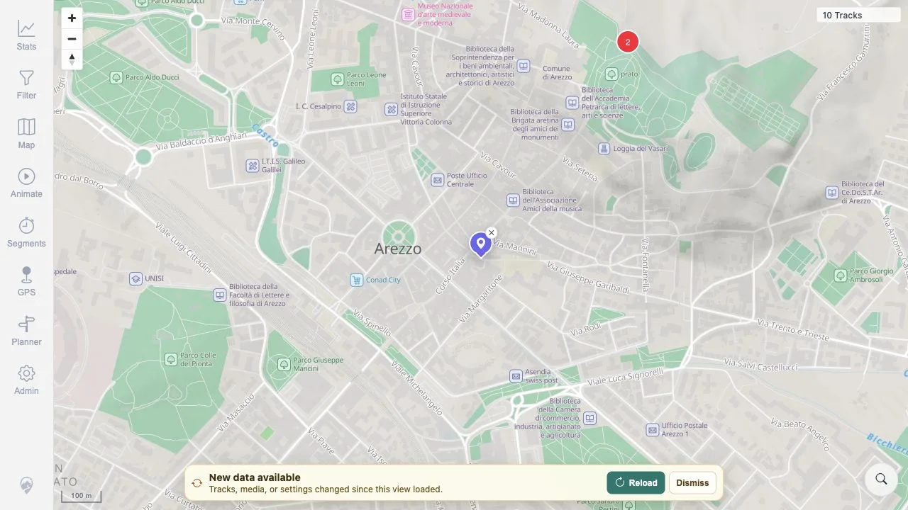</a>

**Text Evidence**
- [assets/MED_02-viewport-api.txt](assets/MED_02-viewport-api.txt) - API evidence for all media, populated Arezzo bounds, and empty nearby bounds. (853 B)

Excerpt: assets/MED_02-viewport-api.txt

<pre><code>Viewport loading evidence for MED_02.

All indexed regression media:
[{"id":400000,"name":"MED_HEIC_01_IMG_5195.HEIC","lat":-94.28877222,"lng":39.05134444},{"id":400001,"name":"MED_JPEG_02_DSCN0010_COPY.jpg","lat":11.88512667,"lng":43.46744833},{"id":400002,"name":"MED_JPEG_01_DSCN0010.jpg","lat":11.88512667,"lng":43.46744833}]

Arezzo media bounds:
GET /api/media/get-media-in-bounds?minLat=43.45&amp;minLng=11.85&amp;maxLat=43.49&amp;maxLng=11.92
[{"id":400001,"lat":43.46745,"lng":11.88513},{"id":400002,"lat":43.46745,"lng":11.88513}]

Nearby west-Arezzo bounds after pan/zoom:
GET /api/media/get-media-in-bounds?minLat=43.45&amp;minLng=11.80&amp;maxLat=43.50&amp;maxLng=11.86
[]

UI result:
- Arezzo viewport showed media cluster "2".
- After pan and zoom to the west-Arezzo area, the media cluster disappeared.
- Returning to Arezzo showed the media cluster "2" again.
</code></pre>

### Packet MED_03

- Packet file: [packets/MED_03.md](packets/MED_03.md)
- Coverage ID: `MED_03`
- Status: **PASS**
- Action: Clicked the Arezzo cluster, clicked the expanded media point, then used Previous and Next in the photo preview.
- Expected: Photo preview opens; previous/next navigation works between media items.
- Actual: Photo sheet opened with image `MED_JPEG_01_DSCN0010.jpg` at `2 / 2`; Previous moved to `MED_JPEG_02_DSCN0010_COPY.jpg` at `1 / 2`; Next returned to `MED_JPEG_01_DSCN0010.jpg` at `2 / 2`.

**Timings**

| Step | Timing |
|---|---:|
| Cluster click, preview open, navigation | ~3 min |

**Handoff Notes**
- Completed: MED_03.
- Remaining unfinished coverage: MED_04 onward.
- Blocked or not applicable: None.
- State left for the next packet: Media preview remains open on `MED_JPEG_01_DSCN0010.jpg` at `2 / 2`.

**Evidence**

<a href="assets/MED_03-preview-2of2.webp">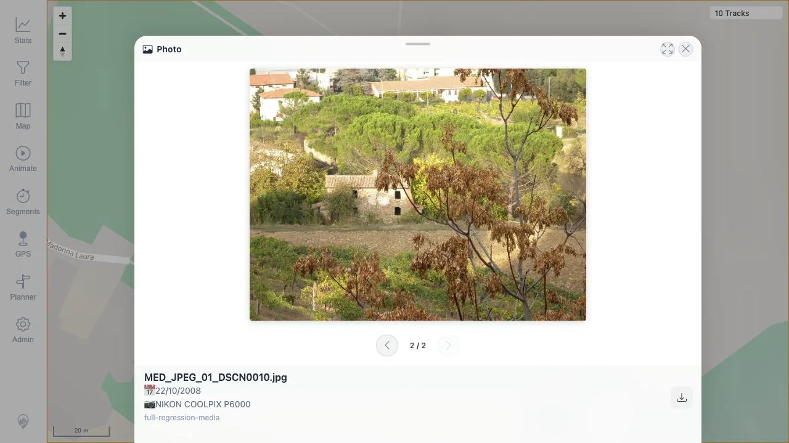</a>
<a href="assets/MED_03-preview-1of2.webp">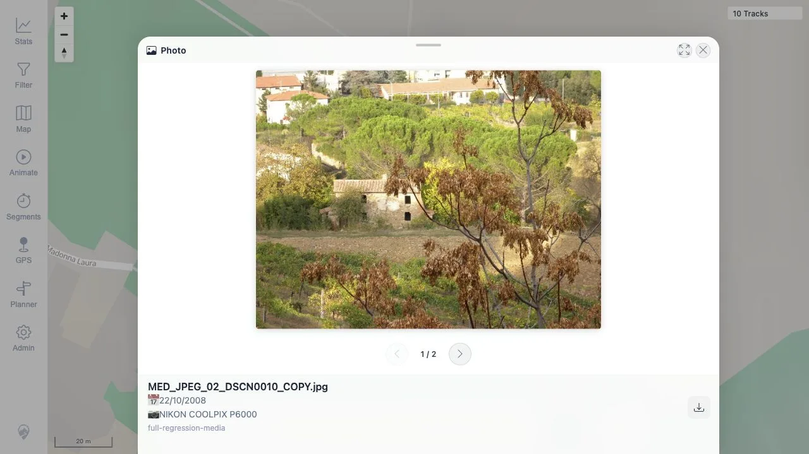</a>

**Text Evidence**
- [assets/MED_03-navigation.txt](assets/MED_03-navigation.txt) - DOM-observed preview counters, filenames, and content links before/after navigation. (557 B)

Excerpt: assets/MED_03-navigation.txt

<pre><code>Media preview navigation evidence for MED_03.

Opened from Arezzo media point:
- Initial state: counter 2 / 2, image MED_JPEG_01_DSCN0010.jpg, content link /mtl/api/media/get/400002/content.
- Previous photo button enabled; Next photo disabled.

After clicking Previous photo:
- Counter: 1 / 2
- Image: MED_JPEG_02_DSCN0010_COPY.jpg
- Previous photo disabled; Next photo enabled.
- Content link: /mtl/api/media/get/400001/content.

After clicking Next photo:
- Counter: 2 / 2
- Image: MED_JPEG_01_DSCN0010.jpg
- Previous photo enabled; Next photo disabled.
</code></pre>

### Packet MED_04

- Packet file: [packets/MED_04.md](packets/MED_04.md)
- Coverage ID: `MED_04`
- Status: **PASS**
- Action: Queried HEIC media info/content, navigated the media layer to Blue Springs, Missouri, and clicked the HEIC media point.
- Expected: HEIC media displays correctly, converted server-side for browser display.
- Actual: Content endpoint returned `HTTP 200` with `Content-Type: image/jpeg`; ImageMagick identified the response as a 793x1024 JPEG. The UI preview displayed the converted flower image with filename `MED_HEIC_01_IMG_5195.HEIC` and Apple iPhone metadata.

**Timings**

| Step | Timing |
|---|---:|
| API conversion checks and UI preview | ~5 min |

**Handoff Notes**
- Completed: MED_04.
- Remaining unfinished coverage: MED_05 onward.
- Blocked or not applicable: None.
- State left for the next packet: HEIC media preview remains open; media layer enabled near Blue Springs.

**Evidence**

<a href="assets/MED_04-heic-preview.webp">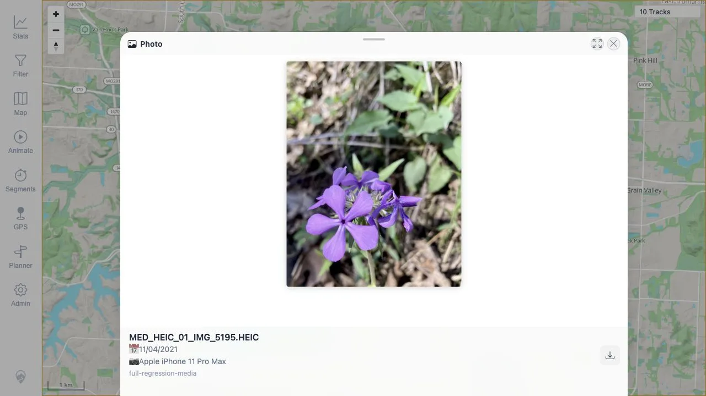</a>

**Text Evidence**
- [assets/MED_04-heic-api.txt](assets/MED_04-heic-api.txt) - Media info, bounds, response headers, and file identification for server-side HEIC conversion. (950 B)

Excerpt: assets/MED_04-heic-api.txt

<pre><code>HEIC conversion evidence for MED_04.

Media info:
{"id":400000,"name":"MED_HEIC_01_IMG_5195.HEIC","path":"full-regression-media","fullPath":"/app/media/full-regression-media/MED_HEIC_01_IMG_5195.HEIC","cameraMake":"Apple","cameraModel":"iPhone 11 Pro Max","date":"2021-04-11T15:47:53.000+0000"}

Bounds check:
GET /api/media/get-media-in-bounds?minLat=39.03&amp;minLng=-94.32&amp;maxLat=39.07&amp;maxLng=-94.26
[{"id":400000,"lat":39.05134,"lng":-94.28877}]

Content conversion check:
GET /api/media/get/400000/content?maxSize=1024
HTTP/1.1 200
Content-Type: image/jpeg
ETag: "media-400000-833284-1779778247134-jpeg92-s1024"

Downloaded bytes:
/tmp/mtl-heic-content.bin: JPEG image data, Exif Standard, manufacturer=Apple, model=iPhone 11 Pro Max
ImageMagick identify: JPEG 793x1024 227533B

UI result:
- Media layer showed a single HEIC media point near Blue Springs, Missouri.
- Clicking the point opened a visible photo preview for MED_HEIC_01_IMG_5195.HEIC.
</code></pre>

### Packet MOB_03

- Packet file: [packets/MOB_03.md](packets/MOB_03.md)
- Coverage ID: `MOB_03`
- Status: **PASS**
- Action: Opened Stats, switched Trends and Tracks tabs, inspected mobile row content and page width, then clicked map Zoom in.
- Expected: Tables, charts, and map controls stay usable; no text overflows.
- Actual: Stats tabs were clickable, Tracks showed mobile list rows and sort controls, document width stayed at 390 px, and Zoom in changed scale from 1000 km to 500 km.

**Timings**

| Step | Timing |
|---|---:|
| Mobile Stats and map controls | <3 min |

**Handoff Notes**
- Completed: MOB_03 passed.
- Remaining unfinished coverage: MOB_04 through RUN_CLEANUP.
- Blocked or not applicable: None for this row.
- State left for the next packet: Desktop viewport restored after mobile checks.

**Evidence**

**Text Evidence**
- [assets/MOB_03-mobile-usability.txt](assets/MOB_03-mobile-usability.txt) - Narrow viewport usability and overflow checks. (1.1 KB)

Excerpt: assets/MOB_03-mobile-usability.txt

<pre><code>MOB_03 narrow viewport usability evidence

Viewport:
- 390 x 844.
- Document clientWidth 390, scrollWidth 390: no page-level horizontal overflow.

Map controls:
- Zoom in button was visible and clickable.
- Scale changed from 1000 km to 500 km after clicking Zoom in.
- Map retained 14 / 14 Tracks and legend counts.

Stats/tables/charts:
- Stats opened in the mobile layout.
- Overview, Trends, and Tracks tabs were visible and clickable.
- Tracks tab showed mobile list/card content with Sort controls and rows for LOC_04 Null Elevation, LOC_04 Boundary Formatting, SYN_05 Dismiss Validation, ADM_02 Upload Validation, and other tracks.
- Visible bad-value scan: no NaN, undefined, or Infinity in body text.

Layout notes:
- Page-level width stayed at 390 px. Hidden or internally scrollable table DOM measured wider than the viewport, but the visible mobile Tracks surface presented the row data through the mobile list layout and did not expand the page.

Result: PASS. Tables/list content, chart tab navigation, and map controls remained usable at narrow width without page-level overflow.
</code></pre>

### Packet NET_02

- Packet file: [packets/NET_02.md](packets/NET_02.md)
- Coverage ID: `NET_02`
- Status: **PASS**
- Action: Logged in in an isolated browser context, cleared cached track data, aborted `/mtl/api/**`, and reloaded.
- Expected: A flaky connection shows recoverable error states, not a blank screen.
- Actual: The app showed `Unable to load tracks - no server connection and no cached data available.` with a visible Retry button; splash was not frozen and the map shell/nav remained visible.

**Timings**

| Step | Timing |
|---|---:|
| Isolated network failure check | <5 min |

**Handoff Notes**
- Completed: NET_02 passed.
- Remaining unfinished coverage: NET_03 through RUN_CLEANUP.
- Blocked or not applicable: None.
- State left for the next packet: Main browser remains signed in; isolated test context closed.

**Evidence**

**Text Evidence**
- [assets/NET_02-network-recovery.txt](assets/NET_02-network-recovery.txt) - Network failure output and visible recovery state. (1.2 KB)

Excerpt: assets/NET_02-network-recovery.txt

<pre><code>NET_02 flaky/API-failure recovery evidence

Tooling:
- Ran Playwright 1.60.0 from a temporary /tmp install using the system Google Chrome channel.
- Test spec: assets/NET_02-network-recovery.spec.ts

Actions:
1. Logged in with README credentials in a clean browser context.
2. Cleared IndexedDB database mtl_db and browser caches.
3. Aborted all /mtl/api/** requests.
4. Reloaded the app URL.

Failed requests observed:
- GET /mtl/api/filter/get
- GET /mtl/api/filter/info?filterName=SmartBaseFilter&amp;filterDomain=GPS_TRACK
- GET /mtl/api/map/config
- POST /mtl/api/analytics/client-environment
- GET /mtl/api/info/build
- GET /mtl/api/config/get?domain1=CLIENT&amp;domain2=COLOR_PALETTE
- GET /mtl/api/indexer/status
- GET /mtl/api/jobs/status
- GET /mtl/api/map/status
- GET /mtl/api/location-search/status
- GET /mtl/api/data-freshness
- HEAD /mtl/api/info/build

Visible result:
- Unable to load tracks - no server connection and no cached data available.
- Retry button visible: true
- Frozen splash: false
- Map shell remained present with 0 Tracks and nav controls.

Result: PASS. API/network failure produced a recoverable Retry state instead of a blank screen or frozen splash.
</code></pre>

- [assets/NET_02-network-recovery.spec.ts](assets/NET_02-network-recovery.spec.ts) - Isolated Playwright check used to abort API requests. (1.8 KB)

Excerpt: assets/NET_02-network-recovery.spec.ts

<pre><code>import { test, expect } from '@playwright/test';

test.use({ channel: 'chrome' });

test('MTL Explorer startup API failure shows retry state', async ({ page }) =&gt; {
  const baseUrl = 'http://178.105.173.254:18080/mtl/';
  const failedRequests: string[] = [];

  await page.goto(`${baseUrl}login`);
  await page.getByPlaceholder('Username').fill('mtl');
  await page.getByPlaceholder('Password').fill('change-me');
  await page.getByRole('button', { name: 'Sign In' }).click();
  await page.waitForURL(baseUrl, { timeout: 30000 });
  await page.getByText(/Tracks/).first().waitFor({ timeout: 30000 });

  await page.evaluate(async () =&gt; {
    await new Promise&lt;void&gt;((resolve) =&gt; {
      const request = indexedDB.deleteDatabase('mtl_db');
      request.onsuccess = () =&gt; resolve();
      request.onerror = () =&gt; resolve();
      request.onblocked = () =&gt; resolve();
    });
    if ('caches' in window) {
      const keys = await caches.keys();
      await Promise.all(keys.map((key) =&gt; caches.delete(key)));
    }
  });

  await page.route('**/mtl/api/**', async (route) =&gt; {
    const request = route.request();
    failedRequests.push(`${request.method()} ${new URL(request.url()).pathname}${new URL(request.url()).search}`);
    await route.abort('failed');
  });

  await page.goto(baseUrl);
  await expect(page.getByText('Unable to load tracks')).toBeVisible({ timeout: 30000 });
  await expect(page.getByRole('button', { name: 'Retry' })).toBeVisible({ timeout: 10000 });

  const text = (await page.locator('body').innerText()).replace(/\s+/g, ' ').trim();
  console.log(JSON.stringify({
    failedRequests,
    retryPresent: await page.getByRole('button', { name: 'Retry' }).isVisible(),
    frozenSplash: text.includes('LOADING YOUR TRAILS') &amp;&amp; !text.includes('Unable to load tracks'),
    visibleText: text.slice(0, 500),
  }));
});
</code></pre>

### Packet NET_03

- Packet file: [packets/NET_03.md](packets/NET_03.md)
- Coverage ID: `NET_03`
- Status: **PASS**
- Action: Logged in in an isolated context, replaced `mtl.jwt` with an invalid token, and reloaded.
- Expected: 401/403 from the server redirects to login.
- Actual: The app redirected to `/mtl/login?reason=expired` and showed the login form.

**Timings**

| Step | Timing |
|---|---:|
| Invalid-auth reload check | <3 min |

**Handoff Notes**
- Completed: NET_03 passed.
- Remaining unfinished coverage: NET_04 through RUN_CLEANUP.
- Blocked or not applicable: None.
- State left for the next packet: Main browser remains signed in; isolated test context closed.

**Evidence**

**Text Evidence**
- [assets/NET_03-auth-redirect.txt](assets/NET_03-auth-redirect.txt) - Invalid-auth redirect evidence. (717 B)

Excerpt: assets/NET_03-auth-redirect.txt

<pre><code>NET_03 401/403 auth redirect evidence

Tooling:
- Ran Playwright 1.60.0 from a temporary /tmp install using the system Google Chrome channel.
- Test spec: assets/NET_03-auth-redirect.spec.ts

Actions:
1. Logged in with README credentials in a clean browser context.
2. Waited for the main app at http://178.105.173.254:18080/mtl/.
3. Replaced localStorage key mtl.jwt with an invalid token.
4. Reloaded the app so API requests used the invalid Authorization header.

Observed:
- Browser redirected to: http://178.105.173.254:18080/mtl/login?reason=expired
- Username field was visible on the login page.
- Visible text included: AGPL-3.0 Sign In.

Result: PASS. Invalid/expired auth caused a clean redirect to login.
</code></pre>

- [assets/NET_03-auth-redirect.spec.ts](assets/NET_03-auth-redirect.spec.ts) - Isolated Playwright check used to corrupt auth token. (1.1 KB)

Excerpt: assets/NET_03-auth-redirect.spec.ts

<pre><code>import { test, expect } from '@playwright/test';

test.use({ channel: 'chrome' });

test('MTL Explorer invalid auth redirects to login', async ({ page }) =&gt; {
  const baseUrl = 'http://178.105.173.254:18080/mtl/';

  await page.goto(`${baseUrl}login`);
  await page.getByPlaceholder('Username').fill('mtl');
  await page.getByPlaceholder('Password').fill('change-me');
  await page.getByRole('button', { name: 'Sign In' }).click();
  await page.waitForURL(baseUrl, { timeout: 30000 });
  await page.getByText(/Tracks/).first().waitFor({ timeout: 30000 });

  await page.evaluate(() =&gt; {
    localStorage.setItem('mtl.jwt', 'invalid-token-for-net-03');
  });

  await page.reload();
  await expect(page).toHaveURL(/\/mtl\/login/, { timeout: 30000 });
  await expect(page.getByPlaceholder('Username')).toBeVisible({ timeout: 10000 });

  const text = (await page.locator('body').innerText()).replace(/\s+/g, ' ').trim();
  console.log(JSON.stringify({
    url: page.url(),
    loginVisible: await page.getByPlaceholder('Username').isVisible(),
    visibleText: text.slice(0, 500),
  }));
});
</code></pre>

### Packet PLN_01

- Packet file: [packets/PLN_01.md](packets/PLN_01.md)
- Coverage ID: `PLN_01`
- Status: **PASS**
- Action: Opened Planner, expanded the profile selector, and changed the profile from Hiking to Road Bike.
- Expected: Planner opens and a routing profile can be picked.
- Actual: Planner opened in Drawing mode, showed `BRouter status: ready`, exposed Hiking/Road Bike/Mountain Hiking/Car profile options, and selected Road Bike.

**Timings**

| Step | Timing |
|---|---:|
| Planner open/profile selection | <3m |

**Handoff Notes**
- Completed: PLN_01 terminal PASS.
- Remaining unfinished coverage: continue with PLN_02.
- Blocked or not applicable: none.
- State left for the next packet: Planner open in Drawing mode with Road Bike selected.

**Evidence**

<a href="assets/PLN_01-planner-open.webp">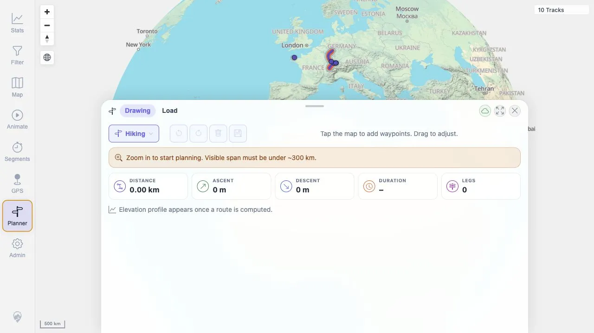</a>
<a href="assets/PLN_01-road-bike-selected.webp">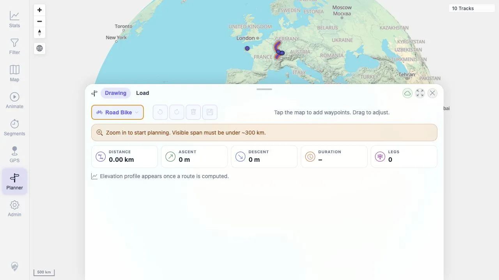</a>

### Packet PLN_02

- Packet file: [packets/PLN_02.md](packets/PLN_02.md)
- Coverage ID: `PLN_02`
- Status: **PASS**
- Action: Zoomed past the planner span guard and clicked two points on the visible map.
- Expected: Map clicks add waypoints, and the planner computes and draws a route.
- Actual: After zooming to 10 km scale, two map clicks enabled Undo/Clear/Save, produced 1 leg, 1.93 km distance, 5 m descent, and 4m duration.

**Timings**

| Step | Timing |
|---|---:|
| Zoom and two waypoint clicks | <5m |

**Handoff Notes**
- Completed: PLN_02 terminal PASS.
- Remaining unfinished coverage: continue with PLN_03.
- Blocked or not applicable: none.
- State left for the next packet: unsaved two-waypoint route remains active with one computed leg.

**Evidence**

<a href="assets/PLN_02-zoomed-under-span.webp">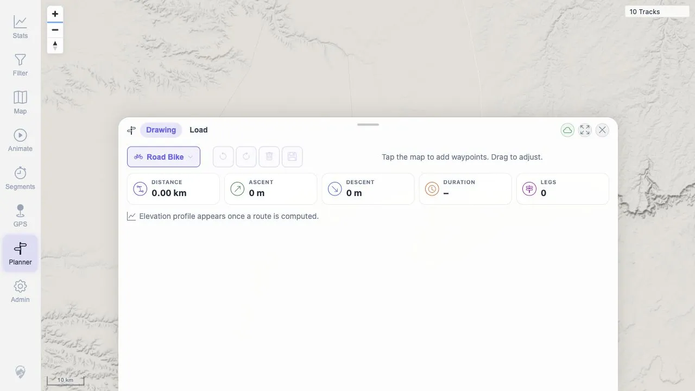</a>
<a href="assets/PLN_02-route-computed.webp">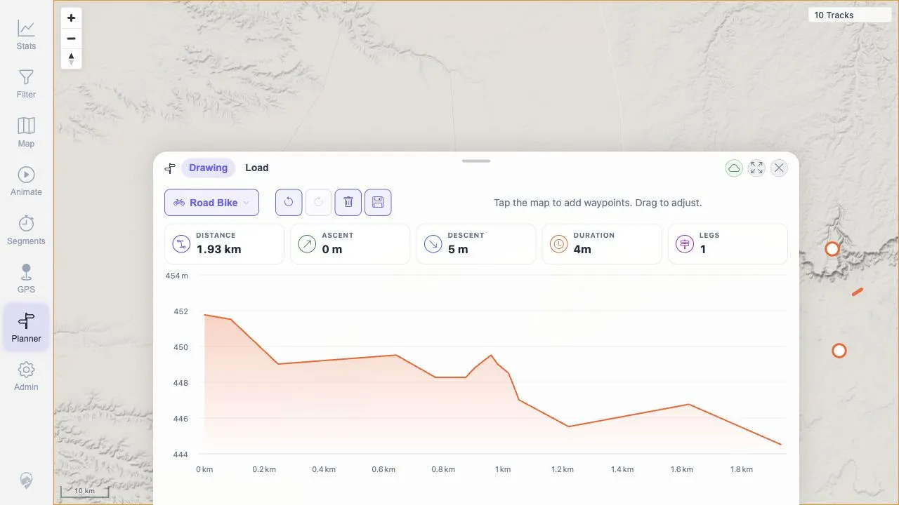</a>
<a href="assets/PLN_02-zoomed-ready.webp">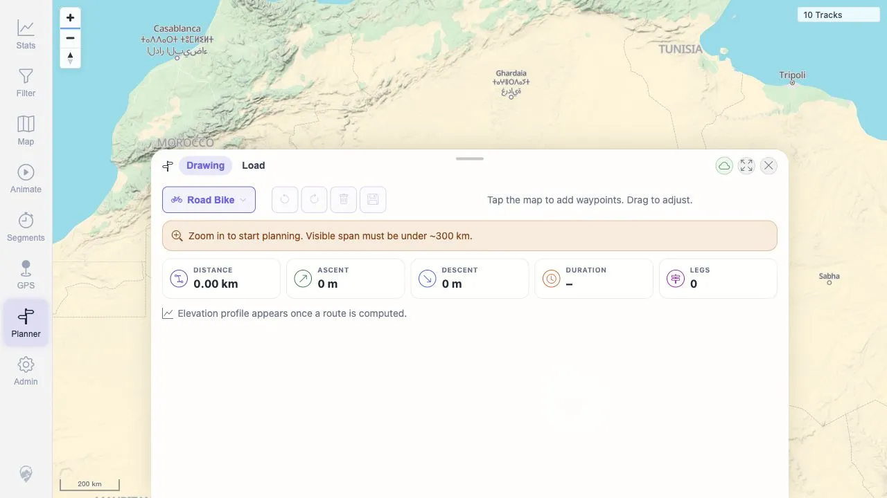</a>
<a href="assets/PLN_02-current-zoom.webp">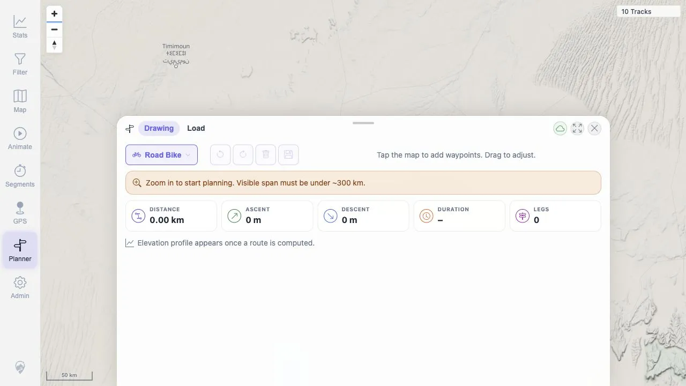</a>

### Packet PLN_04

- Packet file: [packets/PLN_04.md](packets/PLN_04.md)
- Coverage ID: `PLN_04`
- Status: **PASS**
- Action: Rebuilt a two-waypoint route, dragged one endpoint, deleted the selected waypoint, then exercised undo/redo and clear/undo/redo.
- Expected: Waypoints can be moved and deleted; clear, undo, and redo all work.
- Actual: Dragging the selected waypoint changed distance from 0.33 km to 5.79 km; `Delete selected waypoint` reduced the route; Undo restored it, Redo deleted it again; Clear set 0.00 km/0 legs; Undo restored route, Redo cleared it.

**Timings**

| Step | Timing |
|---|---:|
| Edit/delete/clear/undo/redo workflow | <8m |

**Handoff Notes**
- Completed: PLN_04 terminal PASS.
- Remaining unfinished coverage: continue with PLN_05.
- Blocked or not applicable: none.
- State left for the next packet: planner route is cleared; undo is available to restore the temporary route.

**Evidence**

<a href="assets/PLN_04-route-before-move.webp">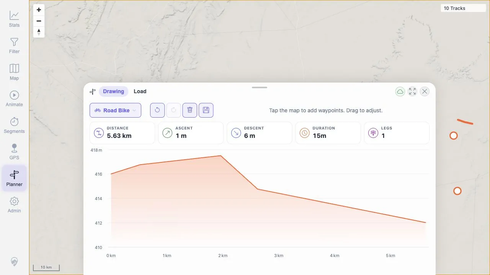</a>
<a href="assets/PLN_04-waypoint-moved.webp">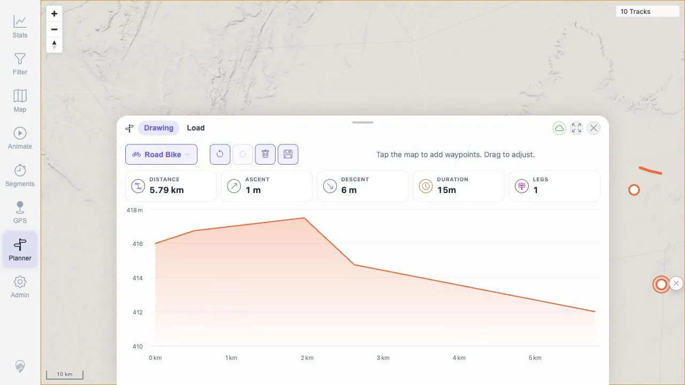</a>
<a href="assets/PLN_04-waypoint-deleted.webp">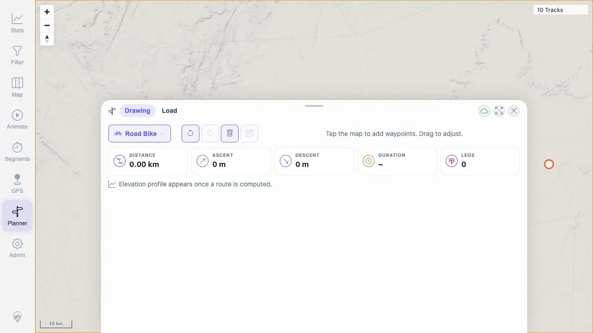</a>
<a href="assets/PLN_04-undo-restored.webp">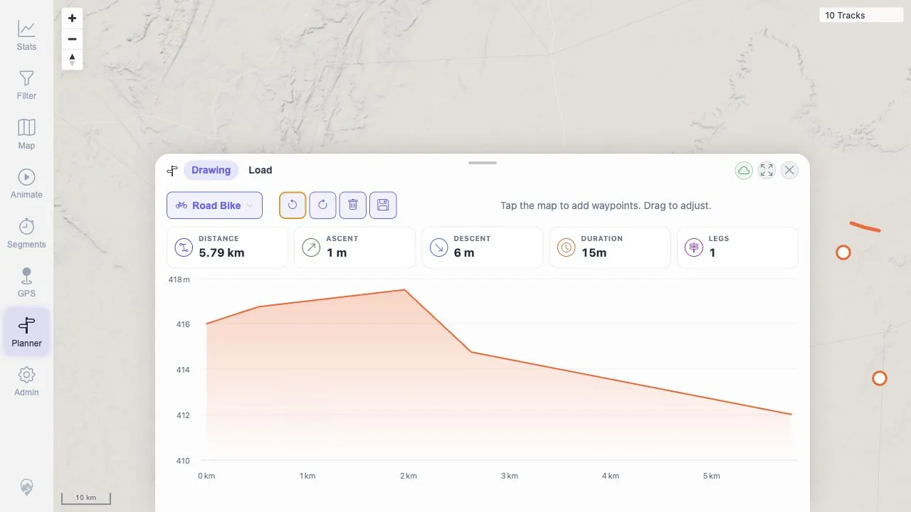</a>
<a href="assets/PLN_04-redo-deleted.webp">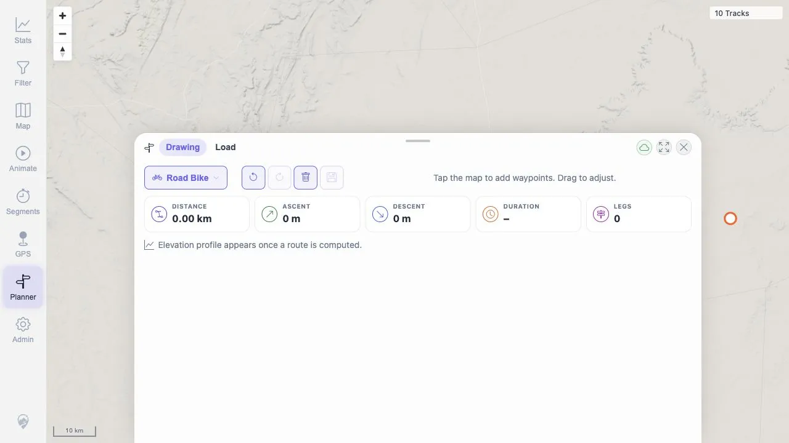</a>

<a href="assets/PLN_04-redo-clear.webp">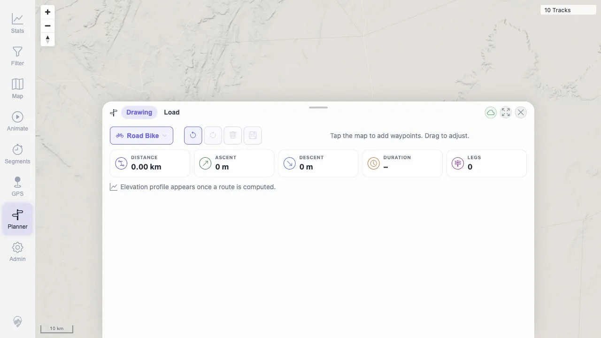</a>

### Packet PLN_05

- Packet file: [packets/PLN_05.md](packets/PLN_05.md)
- Coverage ID: `PLN_05`
- Status: **PASS**
- Action: Reviewed the live stats bar before and after moving/deleting/clearing the planner route during PLN_04.
- Expected: Live stats bar updates distance, ascent, time, and leg count as the route is edited.
- Actual: Stats changed from 0.33 km/0m/0m/0m/1 leg to 5.79 km/1m/6m/15m/1 leg after moving a waypoint, then returned to 0.00 km/0 legs after delete/clear states.

**Timings**

| Step | Timing |
|---|---:|
| Live stats evidence review | <1m |

**Handoff Notes**
- Completed: PLN_05 terminal PASS.
- Remaining unfinished coverage: continue with PLN_06.
- Blocked or not applicable: none.
- State left for the next packet: planner route remains cleared; undo can restore the temporary route.

**Evidence**

### Packet PLN_06

- Packet file: [packets/PLN_06.md](packets/PLN_06.md)
- Coverage ID: `PLN_06`
- Status: **PASS**
- Action: Restored a route, inspected the elevation profile, then hovered the profile line.
- Expected: Elevation profile renders and hovering it highlights the matching map point.
- Actual: Profile rendered with route elevation values; hovering showed a chart tooltip (`5.79 km`, `412 m`, `-0.1%`) and an orange hover marker on the visible route point.

**Timings**

| Step | Timing |
|---|---:|
| Elevation profile hover check | <4m |

**Handoff Notes**
- Completed: PLN_06 terminal PASS.
- Remaining unfinished coverage: continue with PLN_07.
- Blocked or not applicable: none.
- State left for the next packet: unsaved planner route is active and ready to save.

**Evidence**

<a href="assets/PLN_06-profile-hover-retry.webp">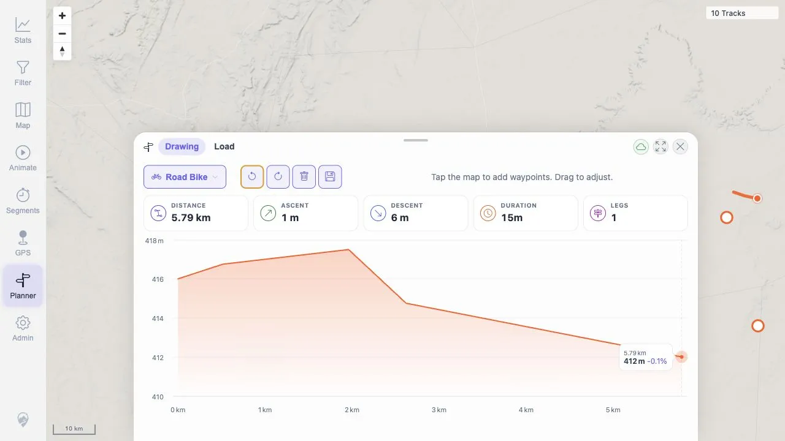</a>

### Packet PLN_07

- Packet file: [packets/PLN_07.md](packets/PLN_07.md)
- Coverage ID: `PLN_07`
- Status: **PASS**
- Action: Saved `Regression PLN07 disposable route`, opened Load, loaded it, then deleted it from the saved route list.
- Expected: Save plan, list saved plans, load a saved plan, and delete a plan all work.
- Actual: Save dialog accepted name/description; Load showed the saved route with 5.8 km metadata; selecting it restored the Drawing view with the route; delete confirmation removed it and the list returned to `No saved routes yet`.

**Timings**

| Step | Timing |
|---|---:|
| Save/list/load/delete route | <8m |

**Handoff Notes**
- Completed: PLN_07 terminal PASS.
- Remaining unfinished coverage: continue with PLN_08.
- Blocked or not applicable: none.
- State left for the next packet: saved-route list empty; the loaded route remains available in Drawing state.

**Evidence**

<a href="assets/PLN_07-save-dialog.webp">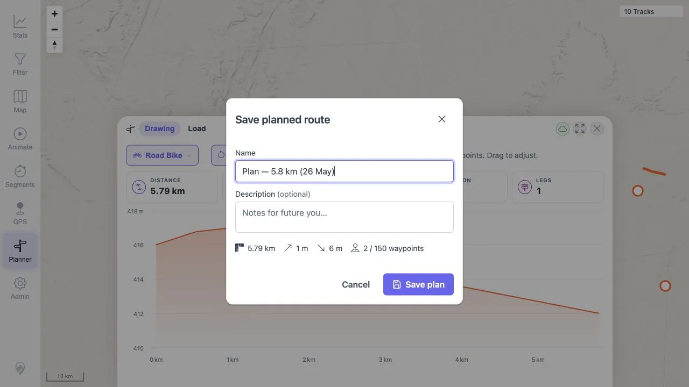</a>

<a href="assets/PLN_07-delete-dialog.webp">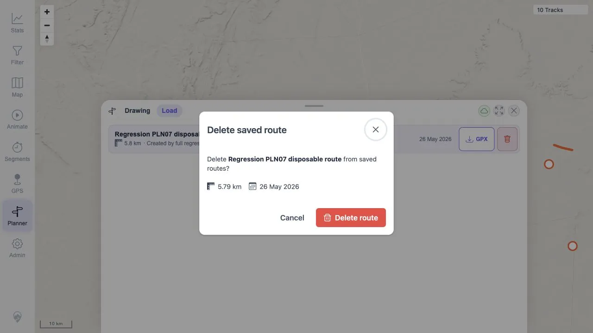</a>
<a href="assets/PLN_07-after-delete.webp">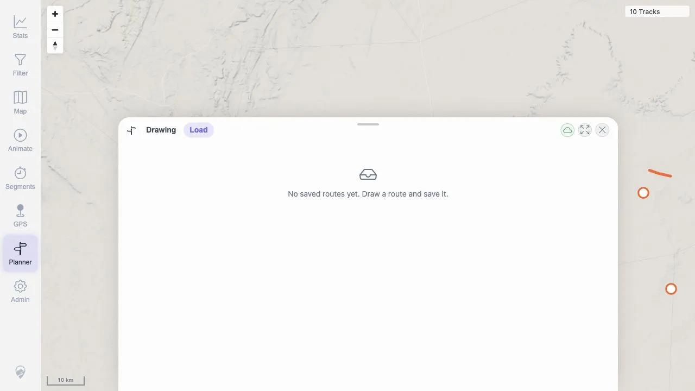</a>

### Packet PLN_08

- Packet file: [packets/PLN_08.md](packets/PLN_08.md)
- Coverage ID: `PLN_08`
- Status: **PASS**
- Action: Saved `Regression PLN08 export route`, downloaded `/api/planner/plans/{id}/gpx`, validated GPX against saved-plan detail, then deleted the plan.
- Expected: Download plan as GPX returns a valid GPX file matching the planned route.
- Actual: Download returned HTTP 200 `application/gpx+xml`; GPX root/name were valid; 5 `<trkpt>` entries matched the saved-plan detail coordinate count and first/last coordinates; disposable plan delete returned 204.

**Timings**

| Step | Timing |
|---|---:|
| Save/export/validate/delete | <5m |

**Handoff Notes**
- Completed: PLN_08 terminal PASS.
- Remaining unfinished coverage: continue with PLN_09.
- Blocked or not applicable: none.
- State left for the next packet: disposable PLN_08 saved route deleted; planner still open.

**Evidence**

<a href="assets/PLN_08-after-save.webp">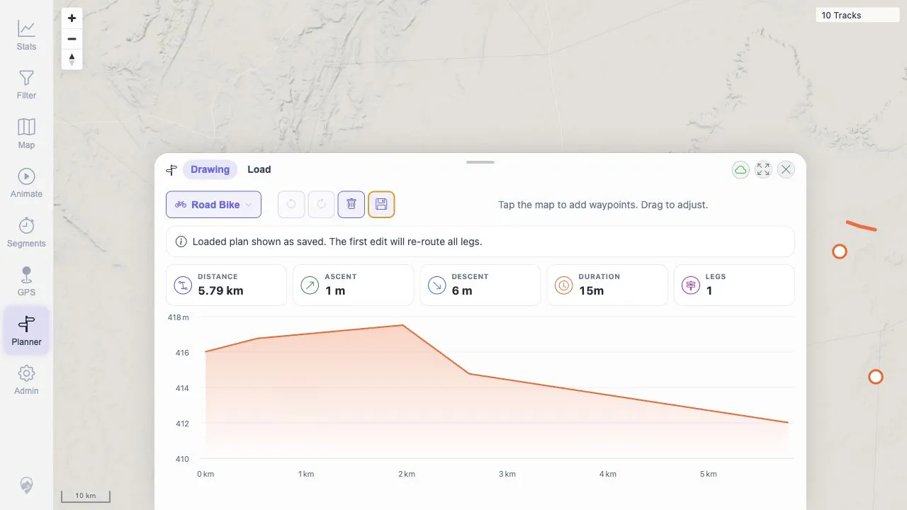</a>

**Text Evidence**
- [assets/PLN_08-download-headers.txt](assets/PLN_08-download-headers.txt) - Planner GPX response headers. (709 B)

Excerpt: assets/PLN_08-download-headers.txt

<pre><code>HTTP/1.1 200 
Cache-Control: no-store
Content-Disposition: form-data; name="attachment"; filename="planned-route-100020.gpx"
X-Content-Type-Options: nosniff
X-XSS-Protection: 0
X-Frame-Options: DENY
Content-Security-Policy: default-src 'self'; script-src 'self'; style-src 'self' 'unsafe-inline'; img-src 'self' data: blob: https:; font-src 'self' data: https:; connect-src 'self' https: http://localhost:* http://127.0.0.1:*; worker-src 'self' blob:; base-uri 'self'; object-src 'none'; frame-ancestors 'none'
Referrer-Policy: same-origin
Permissions-Policy: camera=(), microphone=(), geolocation=(self)
Content-Type: application/gpx+xml
Content-Length: 579
Date: Tue, 26 May 2026 06:16:45 GMT

</code></pre>

- [assets/PLN_08-download-verification.txt](assets/PLN_08-download-verification.txt) - GPX validation and cleanup result. (278 B)

Excerpt: assets/PLN_08-download-verification.txt

<pre><code>plan_id=100020
plan_name=Regression PLN08 export route
distance_m=5789
detail_coordinate_count=5
gpx_trkpt_count=5
gpx_has_root=true
gpx_name_matches=true
trkpt_count_matches_detail=true
first_point_matches_detail=true
last_point_matches_detail=true
bytes=579
delete_status=204
</code></pre>

**Other Evidence Files**
- [assets/PLN_08-export.gpx](assets/PLN_08-export.gpx) - Downloaded planner GPX file. (579 B)

### Packet RUN_CLEANUP

- Packet file: [packets/RUN_CLEANUP.md](packets/RUN_CLEANUP.md)
- Coverage ID: `RUN_CLEANUP`
- Status: **PASS**
- Action: Ran the finalization gate, `docker compose down` in the disposable compose directory, verified no quick-install containers/port listener remained, and removed the disposable parent directory.
- Expected: Cleanup starts only after gate PASS; installed stack stops; disposable directory is removed; unrelated Docker resources are left alone.
- Actual: Gate passed with 168 terminal IDs. Compose removed the app, brouter, db, location-search containers and network. Verification showed 0 `mtl-explorer-*` containers, no disposable directory, and no listener on port 18080.

**Timings**

| Step | Timing |
|---|---:|
| Compose shutdown and directory removal | ~12s |
| Post-cleanup verification | <1s |

**Handoff Notes**
- Completed: RUN_CLEANUP passed.
- Remaining unfinished coverage: none.
- Blocked or not applicable: none for cleanup.
- State left for the next packet: No next packet; final report assembly complete after cleanup status is written.

**Evidence**

**Text Evidence**
- [assets/RUN_CLEANUP-cleanup.txt](assets/RUN_CLEANUP-cleanup.txt) - Gate and cleanup verification output. (915 B)

Excerpt: assets/RUN_CLEANUP-cleanup.txt

<pre><code>RUN_CLEANUP evidence

Finalization gate:
- Command: documentation/testing/full-regression/workflow/check-finalization-gate.py documentation/testing/full-regression/test_runs/2026-05-26_0606-remote-178-full-regression/run-state.md
- Result: Finalization gate: PASS (168 coverage IDs terminal)

Cleanup actions:
- Connected to target over SSH as root.
- Ran docker compose down from /root/mtl-full-regression-2026-05-26_0606/mtl-explorer.
- Removed containers:
  - mtl-explorer-app-1
  - mtl-explorer-brouter-1
  - mtl-explorer-db-1
  - mtl-explorer-location-search-1
- Removed network: mtl-explorer_default
- Removed disposable directory: /root/mtl-full-regression-2026-05-26_0606

Verification:
- Running mtl-explorer containers: 0
- Disposable directory exists: no
- Listener on port 18080: 0

Result: PASS. Quick-install stack stopped and disposable directory removed without touching unrelated Docker resources.
</code></pre>

### Packet RUN_SETUP

- Packet file: [packets/RUN_SETUP.md](packets/RUN_SETUP.md)
- Coverage ID: `RUN_SETUP`
- Status: **PASS**
- Action: Connected over SSH, verified Docker/Compose, followed README quick start in `/root/mtl-full-regression-2026-05-26_0606/mtl-explorer`, verified local and remote app URLs, opened login and signed in with README credentials.
- Expected: Docker prerequisites are present or installed separately, app starts from GitHub `main` compose file, `http://localhost:18080/mtl/` and browser URL work, empty baseline is visible.
- Actual: Debian 13 target already had Docker 29.5.2 and Compose v5.1.4; port `18080` was free; compose stack started in 13s; local and remote URLs returned HTTP 200 with title `MTL Explorer`; signed-in baseline showed `0 Tracks`.

**Timings**

| Step | Timing |
|---|---:|
| Quick install / compose start | 13s |
| App readiness after compose start | 5s |

**Handoff Notes**
- Completed: fresh quick install, README facts, login, and empty map baseline.
- Remaining unfinished coverage: start coverage queue at `ACC_01`.
- Blocked or not applicable: none for setup.
- State left for the next packet: app running at `http://178.105.173.254:18080/mtl/`, compose directory `/root/mtl-full-regression-2026-05-26_0606/mtl-explorer`, browser signed in as README user.

**Evidence**

**Text Evidence**
- [assets/RUN_SETUP-ssh-prereq.txt](assets/RUN_SETUP-ssh-prereq.txt) - Target OS, Docker/Compose versions, and initial port/container state. (171 B)

Excerpt: assets/RUN_SETUP-ssh-prereq.txt

<pre><code>HOST=MTL-FULL-REGRESSION-TEST-v3-ChatGPT
DATE=2026-05-26T04:08:11+00:00
OS=Debian GNU/Linux 13 (trixie)
Docker version 29.5.2, build 79eb04c
Docker Compose version v5.1.4
</code></pre>

- [assets/RUN_SETUP-quick-install.txt](assets/RUN_SETUP-quick-install.txt) - README quick-install command result and compose services. (1.1 KB)

Excerpt: assets/RUN_SETUP-quick-install.txt

<pre><code>RUN_PARENT=/root/mtl-full-regression-2026-05-26_0606
COMPOSE_DIR=/root/mtl-full-regression-2026-05-26_0606/mtl-explorer
QUICK_INSTALL_SECONDS=13
NAME                             IMAGE                                          COMMAND                  SERVICE           CREATED          STATUS                    PORTS
mtl-explorer-app-1               wauwau0977/mytraillog:latest                   "/my-entrypoint.sh j…"   app               11 seconds ago   Up Less than a second     0.0.0.0:18080-&gt;8080/tcp, [::]:18080-&gt;8080/tcp
mtl-explorer-brouter-1           wauwau0977/mytraillog-brouter:latest           "/opt/brouter-orches…"   brouter           11 seconds ago   Up 10 seconds             17777-17778/tcp
mtl-explorer-db-1                postgis/postgis:18-3.6                         "docker-entrypoint.s…"   db                11 seconds ago   Up 10 seconds (healthy)   5432/tcp
mtl-explorer-location-search-1   wauwau0977/mytraillog-location-search:latest   "python /app/locatio…"   location-search   11 seconds ago   Up 10 seconds (healthy)   0.0.0.0:18083-&gt;8083/tcp, [::]:18083-&gt;8083/tcp
</code></pre>

- [assets/RUN_SETUP-readiness.txt](assets/RUN_SETUP-readiness.txt) - Local/remote HTTP readiness and data directories. (1.5 KB)

Excerpt: assets/RUN_SETUP-readiness.txt

<pre><code>LOCAL_HTTP_CODE=200
APP_READINESS_SECONDS=5
TITLE=MTL Explorer
DATA_DIRS=data data/brouter-segments data/gpx data/gpx/GPX-UPLOAD data/logs data/media data/postgis data/postgis/base data/postgis/global data/postgis/pg_commit_ts data/postgis/pg_dynshmem data/postgis/pg_logical data/postgis/pg_multixact data/postgis/pg_notify data/postgis/pg_replslot data/postgis/pg_serial data/postgis/pg_snapshots data/postgis/pg_stat data/postgis/pg_stat_tmp data/postgis/pg_subtrans data/postgis/pg_tblspc data/postgis/pg_twophase data/postgis/pg_wal data/postgis/pg_xact 
REMOTE_HTTP_CODE=200
NAME                             IMAGE                                          COMMAND                  SERVICE           CREATED          STATUS                    PORTS
mtl-explorer-app-1               wauwau0977/mytraillog:latest                   "/my-entrypoint.sh j…"   app               41 seconds ago   Up 29 seconds             0.0.0.0:18080-&gt;8080/tcp, [::]:18080-&gt;8080/tcp
mtl-explorer-brouter-1           wauwau0977/mytraillog-brouter:latest           "/opt/brouter-orches…"   brouter           41 seconds ago   Up 40 seconds             17777-17778/tcp
mtl-explorer-db-1                postgis/postgis:18-3.6                         "docker-entrypoint.s…"   db                41 seconds ago   Up 40 seconds (healthy)   5432/tcp
mtl-explorer-location-search-1   wauwau0977/mytraillog-location-search:latest   "python /app/locatio…"   location-search   41 seconds ago   Up 40 seconds (healthy)   0.0.0.0:18083-&gt;8083/tcp, [::]:18083-&gt;8083/tcp
</code></pre>

### Packet SGN_01

- Packet file: [packets/SGN_01.md](packets/SGN_01.md)
- Coverage ID: `SGN_01`
- Status: **PASS**
- Action: Opened `/mtl/` in a fresh unsigned browser context.
- Expected: App redirects to the login screen.
- Actual: Browser reached `http://178.105.173.254:18080/mtl/login` and showed the sign-in screen.

**Timings**

| Step | Timing |
|---|---:|
| Signed-out redirect | 1.2s |

**Handoff Notes**
- Completed: SGN_01 terminal PASS.
- Remaining unfinished coverage: continue with SGN_02.
- Blocked or not applicable: none.
- State left for the next packet: no server data changed.

**Evidence**

<a href="assets/SGN_01-login-redirect.webp">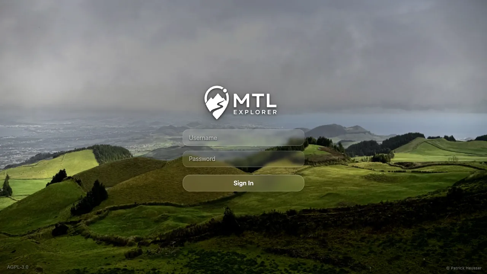</a>

**Text Evidence**
- [assets/SGN_01-login-redirect.txt](assets/SGN_01-login-redirect.txt) - URL, timing, and visible text summary. (105 B)

Excerpt: assets/SGN_01-login-redirect.txt

<pre><code>url=http://178.105.173.254:18080/mtl/login
load_ms=1173
visible_text=© Patrick Heusser AGPL-3.0 Sign In
</code></pre>

### Packet SGN_02

- Packet file: [packets/SGN_02.md](packets/SGN_02.md)
- Coverage ID: `SGN_02`
- Status: **PASS**
- Action: Signed in with `mtl` / `change-me` from the login screen.
- Expected: Valid credentials reach the map.
- Actual: Login succeeded, URL returned to `/mtl/`, and the map shell showed 10 tracks plus primary navigation.

**Timings**

| Step | Timing |
|---|---:|
| Valid login to ready map | 5.2s |

**Handoff Notes**
- Completed: SGN_02 terminal PASS.
- Remaining unfinished coverage: continue with SGN_03.
- Blocked or not applicable: none.
- State left for the next packet: no server data changed.

**Evidence**

**Text Evidence**
- [assets/SGN_02-valid-login-map.txt](assets/SGN_02-valid-login-map.txt) - URL, timing, and visible text summary. (163 B)

Excerpt: assets/SGN_02-valid-login-map.txt

<pre><code>initial_inputs=2
url=http://178.105.173.254:18080/mtl/
login_to_ready_ms=5213
visible_excerpt=500 km 10 Tracks Stats Filter Map Animate Segments GPS Planner Admin
</code></pre>

### Packet SGN_03

- Packet file: [packets/SGN_03.md](packets/SGN_03.md)
- Coverage ID: `SGN_03`
- Status: **PASS**
- Action: Submitted username `mtl` with an invalid password.
- Expected: A clear error appears and the browser remains on the login screen.
- Actual: The page stayed at `/mtl/login` and displayed `Invalid username or password.`

**Timings**

| Step | Timing |
|---|---:|
| Wrong-password response | 2.5s |

**Handoff Notes**
- Completed: SGN_03 terminal PASS.
- Remaining unfinished coverage: continue with SGN_04.
- Blocked or not applicable: none.
- State left for the next packet: no server data changed.

**Evidence**

<a href="assets/SGN_03-wrong-credentials.webp">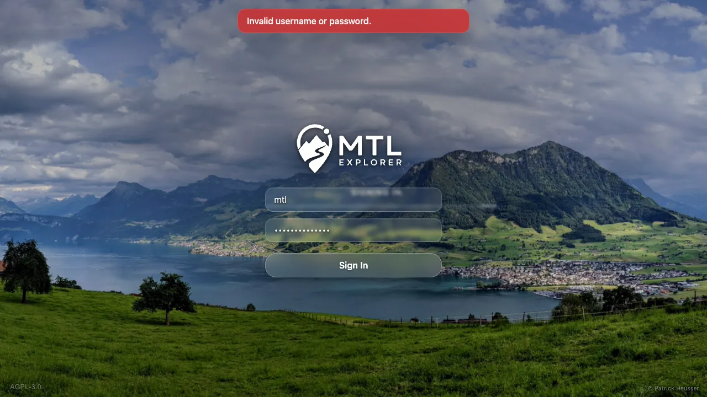</a>

**Text Evidence**
- [assets/SGN_03-wrong-credentials.txt](assets/SGN_03-wrong-credentials.txt) - URL and visible text summary. (149 B)

Excerpt: assets/SGN_03-wrong-credentials.txt

<pre><code>url=http://178.105.173.254:18080/mtl/login
elapsed_ms=2464
visible_text=Invalid username or password. © Patrick Heusser AGPL-3.0 Sign In SIGNING IN
</code></pre>

### Packet SGN_05

- Packet file: [packets/SGN_05.md](packets/SGN_05.md)
- Coverage ID: `SGN_05`
- Status: **PASS**
- Action: Signed in, opened Admin → Session, clicked `Logout`, then signed in again.
- Expected: Logout returns to login; signing in again works.
- Actual: `Logout` returned to `/mtl/login`; signing in again reached `/mtl/` with 10 tracks visible.

**Timings**

| Step | Timing |
|---|---:|
| Re-login to ready map | 3.6s |

**Handoff Notes**
- Completed: SGN_05 terminal PASS.
- Remaining unfinished coverage: continue with SGN_06.
- Blocked or not applicable: none.
- State left for the next packet: no server data changed.

**Evidence**

<a href="assets/SGN_05-admin-session-scan.webp">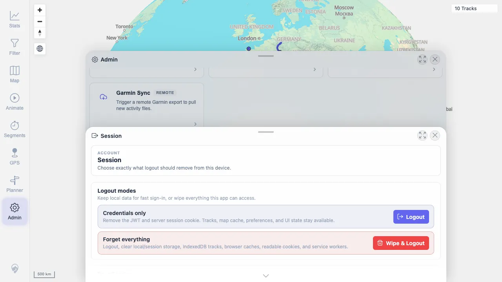</a>
<a href="assets/SGN_05-logout-login.webp">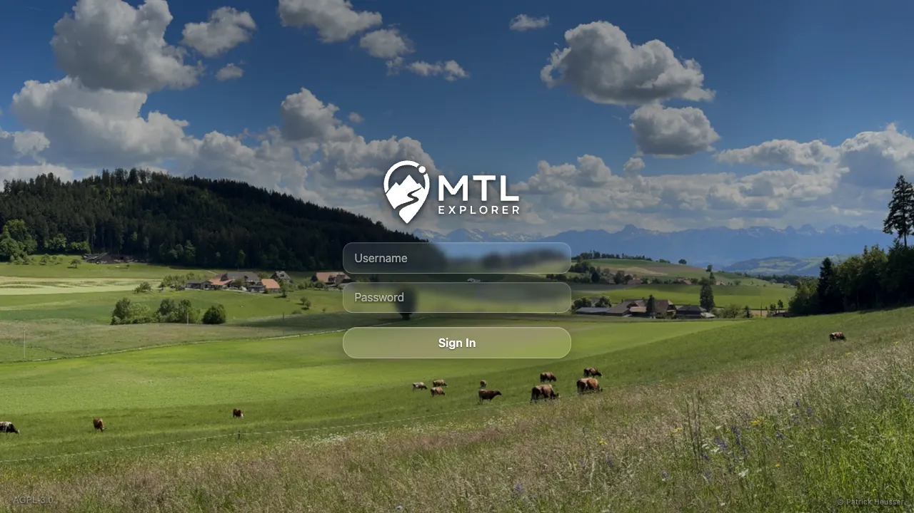</a>
<a href="assets/SGN_05-relogin-map.webp">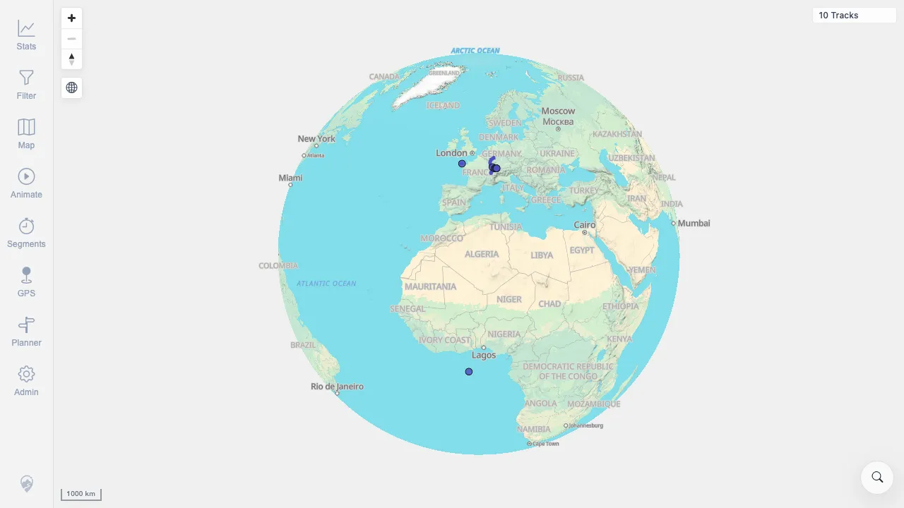</a>

**Text Evidence**
- [assets/SGN_05-logout-relogin.txt](assets/SGN_05-logout-relogin.txt) - URL/text/timing summary. (269 B)

Excerpt: assets/SGN_05-logout-relogin.txt

<pre><code>after_logout_url=http://178.105.173.254:18080/mtl/login
after_logout_text=© Patrick Heusser AGPL-3.0 Sign In
relogin_url=http://178.105.173.254:18080/mtl/
relogin_ready_ms=3628
relogin_text_excerpt=1000 km 10 Tracks Stats Filter Map Animate Segments GPS Planner Admin
</code></pre>

- [assets/SGN_05-signout-scan.txt](assets/SGN_05-signout-scan.txt) - Initial scan showing logout was not top-level. (2.8 KB)

Excerpt: assets/SGN_05-signout-scan.txt

<pre><code>url=http://178.105.173.254:18080/mtl/
candidate_signout_controls=NONE
buttons_before_about:
0: Zoom in
1: Zoom out
2: Drag to rotate map, click to reset north
3: Toggle globe mode
4: Search location
5: Stats
6: Filter
7: Map
8: Animate
9: Segments
10: GPS
11: Planner
12: Admin
13: About MTL Explorer
14: Fullscreen
15: Close
16: location-search__sort-button location-search__sort-button--active
17: location-search__sort-button
18: Reset all layers to defaults
19: Fullscreen
20: Close
21: Fullscreen
22: Close
23: Fullscreen
24: Close
25: Undo last point
26: Clear all
27: measure-toolbar-btn measure-toolbar-btn--analyze
28: planner-header-tab planner-header-tab--active
29: planner-header-tab
30: BRouter status: checking
31: Fullscreen
32: Close
33: planner-toolbar__profile-btn
34: Undo
35: Redo
36: Clear route
37: Save route
38: stats-header-tab stats-header-tab--active
39: stats-header-tab
40: stats-header-tab
41: Fullscreen
42: Close
43: cf-tab cf-tab--active
44: cf-tab cf-tab--disabled
45: SQL
46: Fullscreen
47: Close
48: cf-primary-btn
49: Fullscreen
50: Close
51: Back
52: First Page
53: Previous Page
54: Next Page
55: Last Page
56: Fullscreen
57: Close
58: Open Upload
59: Open Jobs
60: Open Freshness
61: Open Garmin Sync
62: Open Log
63: Open Helpers
64: Open About
65: Open Settings
66: Open Session
67: Open Attribution
68: Fullscreen
69: Close
70: Fullscreen
71: Close
72: Fullscreen
73: Close
buttons_links_after_about:
0: Zoom in
1: Zoom out
... [truncated in this report; open linked file for full evidence]</code></pre>

- [assets/SGN_05-admin-session-scan.txt](assets/SGN_05-admin-session-scan.txt) - Admin Session tab exposing logout controls. (2.6 KB)

Excerpt: assets/SGN_05-admin-session-scan.txt

<pre><code>url=http://178.105.173.254:18080/mtl/
session_tab_button_count=1
candidate_auth_controls=65: Session LOGOUT Logout credentials only or wipe all local app data. | 69: Logout | 70: Wipe &amp; Logout | 71: Show session id
visible_text_excerpt:
500 km 10 Tracks Stats Filter Map Animate Segments GPS Planner Admin Admin SYSTEM UTILITY Admin workspace Manage imports, runtime tools, diagnostics, and local preferences without leaving the map. Quiet state Data Import and processing activity Upload IMPORT Import GPX files and inspect ingest readiness. Jobs IDLE Track indexer, map, and routing activity. Freshness TOKEN Inspect domain revisions and the current map data token. Garmin Sync REMOTE Trigger a remote Garmin export to pull new activity files. System Diagnostics, tools, and build details Log SERVER Inspect recent server output and runtime issues. Helpers 2/2 READY Reload tracks, manage helper tools, and run installs. About BUILD Client and server build details and runtime info. Session Preferences and account controls Settings LIGHT Adjust color scheme and locale formatting. Session LOGOUT Logout credentials only or wipe all local app data. Attribution SOURCES Libraries, datasets, and map data references. Session ACCOUNT Session Choose exactly what logout should remove from this device. Logout modes Keep local data for fast sign-in, or wipe everything this app can access. Credentials only Remove the JWT and server session cookie. Tracks, map cache, preferences, and UI state stay available. Logout Forget everything Logout, clear local/session storage, IndexedDB tracks, browser caches, readable cookies, and service workers. Wipe &amp; Logout Your Session Request correlation id and token timing. Copy Created 26/05/2026, 06
controls_excerpt:
55: Fullscreen
56: Close
57: Upload IMPORT Import GPX files and inspect ingest readiness.
58: Jobs IDLE Track indexer, map, and routing activity.
59: Freshness TOKEN Inspect domain revisions and the current map data token.
60: Garmin Sync REMOTE Trigger a remote Garmin export to pull new activity files.
61: Log SERVER Inspect recent server output and runtime issues.
62: Helpers 2/2 READY Reload tracks, manage helper tools, and run installs.
63: About BUILD Client and server build details and runtime info.
64: Settings LIGHT Adjust color scheme and locale formatting.
65: Session LOGOUT Logout credentials only or wipe all local app data.
66: Attribution SOURCES Libraries, datasets, and map data references.
67: Fullscreen
68: Close
69: Logout
70: Wipe &amp; Logout
71: Show session id
72: Copy
73: Fullscreen
74: Close
75: Fullscreen
76: Close
77: Fullscreen
78: Close</code></pre>

### Packet SGN_06

- Packet file: [packets/SGN_06.md](packets/SGN_06.md)
- Coverage ID: `SGN_06`
- Status: **PASS**
- Action: Captured the startup state immediately after valid sign-in, then waited for the ready map.
- Expected: Splash/logo/message displays during startup and disappears once map/tracks are loaded.
- Actual: `LOADING YOUR TRAILS` appeared during startup, then disappeared after 2.6s and the ready map showed 10 tracks.

**Timings**

| Step | Timing |
|---|---:|
| Splash to ready map | 2.6s |

**Handoff Notes**
- Completed: SGN_06 terminal PASS.
- Remaining unfinished coverage: continue with SGN_07.
- Blocked or not applicable: none.
- State left for the next packet: no server data changed.

**Evidence**

<a href="assets/SGN_06-ready-map.webp">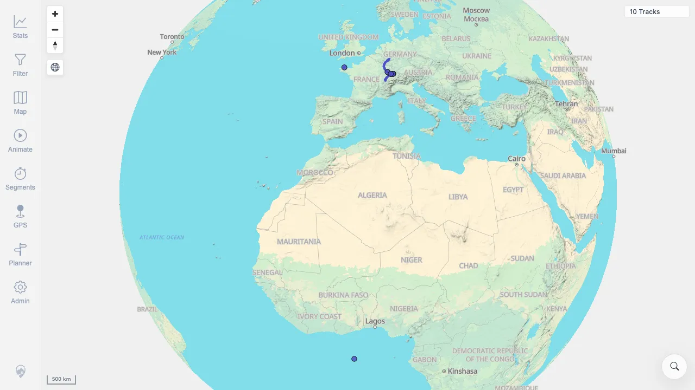</a>

**Text Evidence**
- [assets/SGN_06-splash-summary.txt](assets/SGN_06-splash-summary.txt) - Text and timing summary. (168 B)

Excerpt: assets/SGN_06-splash-summary.txt

<pre><code>splash_text=© Patrick Heusser AGPL-3.0 Sign In LOADING YOUR TRAILS
ready_after_ms=2577
ready_text=500 km 10 Tracks Stats Filter Map Animate Segments GPS Planner Admin
</code></pre>

### Packet SGN_07

- Packet file: [packets/SGN_07.md](packets/SGN_07.md)
- Coverage ID: `SGN_07`
- Status: **PASS**
- Action: Reopened the app with saved auth state while aborting `/mtl/api/**` requests.
- Expected: Startup failure offers retry instead of freezing on splash.
- Actual: The app showed `Unable to load tracks — no server connection and no cached data available. Retry`; no frozen splash remained.

**Timings**

| Step | Timing |
|---|---:|
| Failure observation window | 7s |

**Handoff Notes**
- Completed: SGN_07 terminal PASS.
- Remaining unfinished coverage: continue with SGN_08.
- Blocked or not applicable: none.
- State left for the next packet: server remained running; API failures were browser-context-only.

**Evidence**

<a href="assets/SGN_07-storage-startup-api-failure.webp">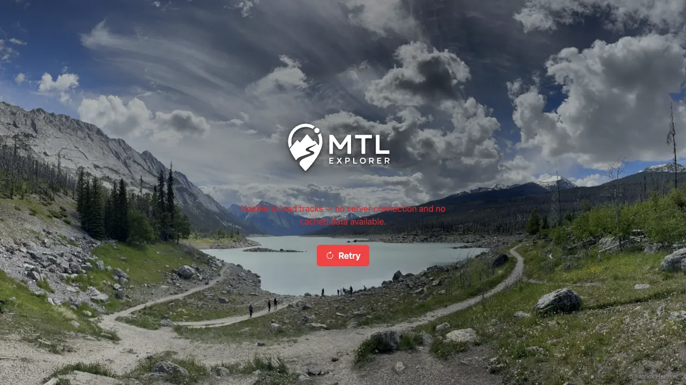</a>

**Text Evidence**
- [assets/SGN_07-storage-startup-api-failure.txt](assets/SGN_07-storage-startup-api-failure.txt) - Failed API requests, visible text, and retry detection. (1.3 KB)

Excerpt: assets/SGN_07-storage-startup-api-failure.txt

<pre><code>url=http://178.105.173.254:18080/mtl/
failed_requests=GET /mtl/api/map/config net::ERR_FAILED
POST /mtl/api/analytics/client-environment net::ERR_FAILED
GET /mtl/api/info/build net::ERR_FAILED
GET /mtl/api/config/get?domain1=CLIENT&amp;domain2=COLOR_PALETTE net::ERR_FAILED
GET /mtl/api/info/build net::ERR_FAILED
GET /mtl/api/indexer/status net::ERR_FAILED
GET /mtl/api/jobs/status net::ERR_FAILED
GET /mtl/api/map/config net::ERR_FAILED
GET /mtl/api/map/status net::ERR_FAILED
GET /mtl/api/location-search/status net::ERR_FAILED
GET /mtl/api/data-freshness net::ERR_FAILED
GET /mtl/api/info/build net::ERR_FAILED
GET /mtl/api/map/config net::ERR_FAILED
HEAD /mtl/api/info/build net::ERR_FAILED
GET /mtl/api/filter/get net::ERR_FAILED
GET /mtl/api/data-freshness net::ERR_FAILED
POST /mtl/api/tracks/get-simplified?filterName=SmartBaseFilter&amp;mode=ids net::ERR_FAILED
POST /mtl/api/tracks/get-simplified?filterName=SmartBaseFilter&amp;mode=ids net::ERR_FAILED
visible_text=© Patrick Heusser Unable to load tracks — no server connection and no cached data available. Retry 500 km 0 Tracks Stats Filter Map Animate Segments GPS Planner Admin
retry_present=true
frozen_splash=false
storage_origins=http://178.105.173.254:18080:mtl.map.config-cache,mtl-applied-data-freshness-token,mtl.backgrounds.displayed,mtl.jwt,clientFilterConfig
</code></pre>

- [assets/SGN_07-startup-api-failure.txt](assets/SGN_07-startup-api-failure.txt) - Cached-data fallback probe. (1.1 KB)

Excerpt: assets/SGN_07-startup-api-failure.txt

<pre><code>url=http://178.105.173.254:18080/mtl/
failed_requests=GET /mtl/api/map/config net::ERR_FAILED
POST /mtl/api/analytics/client-environment net::ERR_FAILED
GET /mtl/api/info/build net::ERR_FAILED
GET /mtl/api/config/get?domain1=CLIENT&amp;domain2=COLOR_PALETTE net::ERR_FAILED
GET /mtl/api/info/build net::ERR_FAILED
GET /mtl/api/indexer/status net::ERR_FAILED
GET /mtl/api/jobs/status net::ERR_FAILED
GET /mtl/api/map/config net::ERR_FAILED
GET /mtl/api/map/status net::ERR_FAILED
GET /mtl/api/location-search/status net::ERR_FAILED
GET /mtl/api/data-freshness net::ERR_FAILED
GET /mtl/api/info/build net::ERR_FAILED
GET /mtl/api/map/config net::ERR_FAILED
HEAD /mtl/api/info/build net::ERR_FAILED
GET /mtl/api/filter/get net::ERR_FAILED
GET /mtl/api/data-freshness net::ERR_FAILED
POST /mtl/api/tracks/get-simplified?filterName=SmartBaseFilter&amp;mode=ids net::ERR_FAILED
POST /mtl/api/tracks/get-simplified?filterName=SmartBaseFilter&amp;mode=ids net::ERR_FAILED
visible_text=500 km 10 Tracks Offline — displaying cached tracks Stats Filter Map Animate Segments GPS Planner Admin
retry_present=false
</code></pre>

### Packet SGN_08

- Packet file: [packets/SGN_08.md](packets/SGN_08.md)
- Coverage ID: `SGN_08`
- Status: **PASS**
- Action: Opened About dialog after sign-in.
- Expected: `MTL Explorer` branding appears in About/public-facing copy.
- Actual: About dialog heading and copy both used `MTL Explorer`.

**Timings**

| Step | Timing |
|---|---:|
| About branding check | <1m |

**Handoff Notes**
- Completed: SGN_08 terminal PASS.
- Remaining unfinished coverage: continue with SGN_09.
- Blocked or not applicable: none.
- State left for the next packet: no server data changed.

**Evidence**

<a href="assets/SGN_08-about-branding.webp">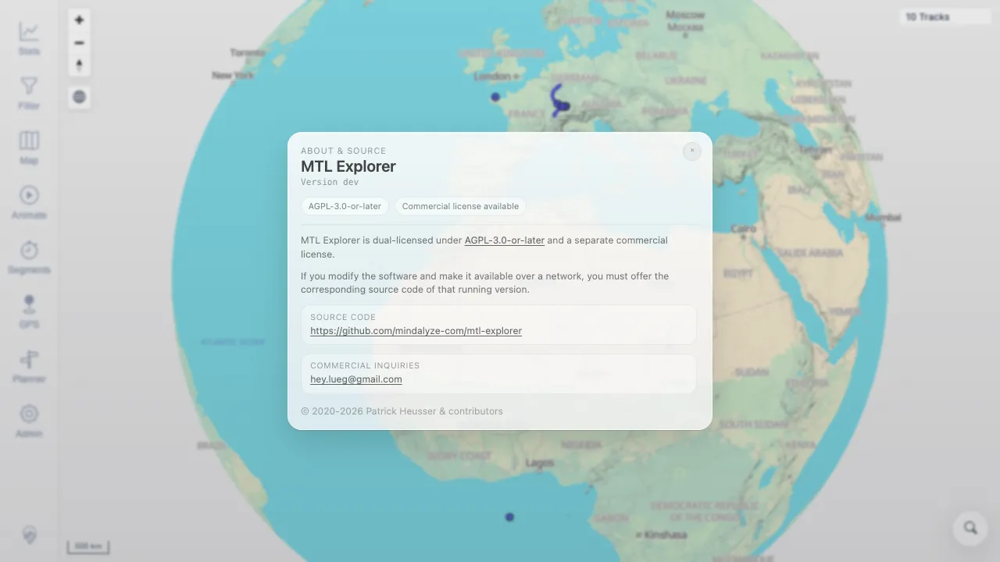</a>

**Text Evidence**
- [assets/SGN_08-about-branding.txt](assets/SGN_08-about-branding.txt) - Text excerpt confirming branding. (567 B)

Excerpt: assets/SGN_08-about-branding.txt

<pre><code>mtl_explorer_present=true
visible_excerpt=500 km 10 Tracks Stats Filter Map Animate Segments GPS Planner Admin × ABOUT &amp; SOURCE MTL Explorer Version dev AGPL-3.0-or-later Commercial license available MTL Explorer is dual-licensed under AGPL-3.0-or-later and a separate commercial license. If you modify the software and make it available over a network, you must offer the corresponding source code of that running version. SOURCE CODE https://github.com/mindalyze-com/mtl-explorer COMMERCIAL INQUIRIES hey.lueg@gmail.com © 2020-2026 Patrick Heusser &amp; contributors
</code></pre>

### Packet SRC_01

- Packet file: [packets/SRC_01.md](packets/SRC_01.md)
- Coverage ID: `SRC_01`
- Status: **PASS**
- Action: Opened Location Search and typed `Bern`.
- Expected: Search results appear for the typed place name.
- Actual: Results appeared in the search panel, headed by `Bern, Switzerland`, followed by additional matching places.

**Timings**

| Step | Timing |
|---|---:|
| Search open, query, result wait | <1 min |

**Handoff Notes**
- Completed: SRC_01 passed.
- Remaining unfinished coverage: SRC_02 through RUN_CLEANUP.
- Blocked or not applicable: None.
- State left for the next packet: Search panel remains open with query `Bern` and visible results.

**Evidence**

<a href="assets/SRC_01-search-results.webp">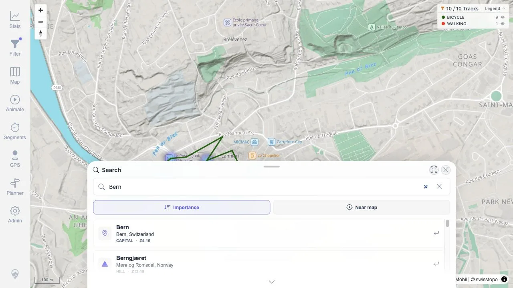</a>

**Text Evidence**
- [assets/SRC_01-search-results.txt](assets/SRC_01-search-results.txt) - Compact text capture of representative results. (403 B)

Excerpt: assets/SRC_01-search-results.txt

<pre><code>Search action: opened Location Search and entered "Bern".
Result state: results appeared without page reload.
Representative results:
- Bern, Switzerland / CAPITAL / Z4-15
- Berngjaeret, More og Romsdal, Norway / HILL / Z12-15
- Bernartice, South Bohemian Region, Czechia / VILLAGE / Z11-15
- Bernville, Pennsylvania, United States / VILLAGE / Z11-15
- Bernina, Grisons, Switzerland / MOUNTAIN / Z12-15
</code></pre>

### Packet SRC_02

- Packet file: [packets/SRC_02.md](packets/SRC_02.md)
- Coverage ID: `SRC_02`
- Status: **PASS**
- Action: Selected the top `Bern, Switzerland` search result.
- Expected: Map flies to the selected result and places a marker.
- Actual: Search panel closed back to the map and a visible `mtl-location-search-marker` appeared with an associated clear-marker button.

**Timings**

| Step | Timing |
|---|---:|
| Result selection and marker verification | <1 min |

**Handoff Notes**
- Completed: SRC_02 passed.
- Remaining unfinished coverage: SRC_03 through RUN_CLEANUP.
- Blocked or not applicable: None.
- State left for the next packet: Bern search marker is visible on the map.

**Evidence**

<a href="assets/SRC_02-bern-selected.webp">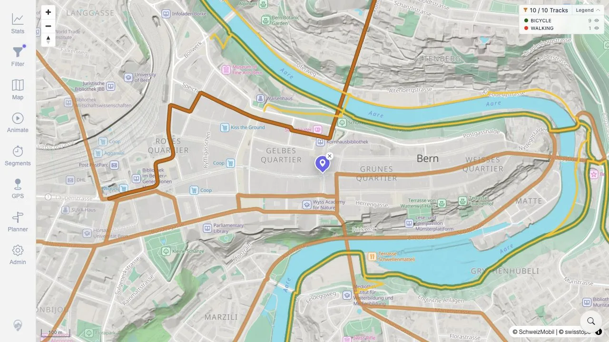</a>

**Text Evidence**
- [assets/SRC_02-bern-selected.txt](assets/SRC_02-bern-selected.txt) - DOM evidence for the placed location-search marker. (341 B)

Excerpt: assets/SRC_02-bern-selected.txt

<pre><code>Selected result: Bern, Switzerland / Capital / z4-15.
Result after selection:
- Search panel closed back to the map.
- DOM contained `mtl-location-search-marker maplibregl-marker`.
- Marker aria-label: Map marker.
- Marker transform placed it in the visible viewport.
- Marker clear button was present with aria-label `Clear search marker`.
</code></pre>

### Packet SRC_03

- Packet file: [packets/SRC_03.md](packets/SRC_03.md)
- Coverage ID: `SRC_03`
- Status: **PASS**
- Action: Clicked the Bern marker's `Clear search marker` control.
- Expected: Search marker is removed cleanly.
- Actual: Marker and clear-button DOM nodes were removed, and the map remained usable with `10 / 10 Tracks`.

**Timings**

| Step | Timing |
|---|---:|
| Clear marker and verify DOM | <1 min |

**Handoff Notes**
- Completed: SRC_03 passed.
- Remaining unfinished coverage: SRC_04 through RUN_CLEANUP.
- Blocked or not applicable: None.
- State left for the next packet: Map visible, no location-search marker present.

**Evidence**

<a href="assets/SRC_03-marker-cleared.webp">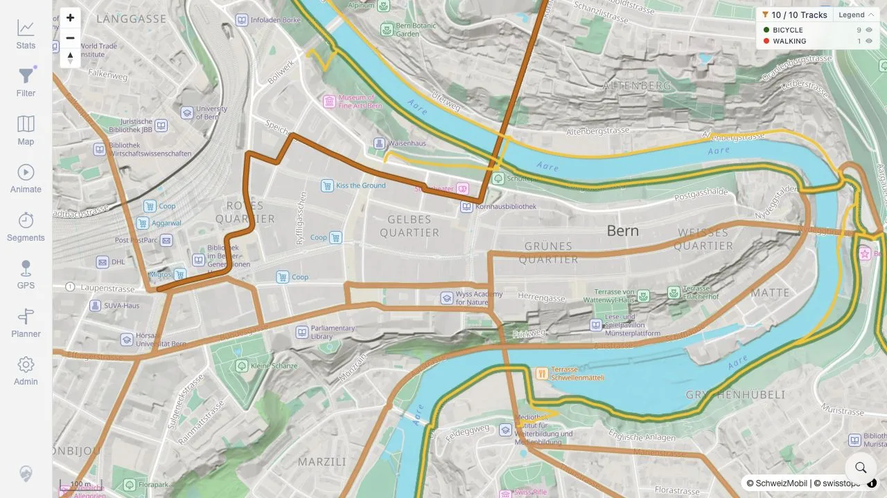</a>

**Text Evidence**
- [assets/SRC_03-marker-cleared.txt](assets/SRC_03-marker-cleared.txt) - DOM evidence that marker and clear-button nodes were removed. (317 B)

Excerpt: assets/SRC_03-marker-cleared.txt

<pre><code>Clear action: clicked the visible `Clear search marker` button on the Bern marker.
Post-clear DOM check:
- `.mtl-location-search-marker`: 0
- `.mtl-location-search-marker__clear`: 0
- `[aria-label="Map marker"]`: 0
- `[aria-label="Clear search marker"]`: 0
Visible app state: map remained usable with 10 / 10 tracks.
</code></pre>

### Packet SRC_04

- Packet file: [packets/SRC_04.md](packets/SRC_04.md)
- Coverage ID: `SRC_04`
- Status: **PASS**
- Action: Searched for `zzzzzzzzzzqqqnotaplace`.
- Expected: Empty/no-result queries show a clear message.
- Actual: The search panel displayed `No matches`; no marker was placed and the map remained usable.

**Timings**

| Step | Timing |
|---|---:|
| No-result search | <1 min |

**Handoff Notes**
- Completed: SRC_04 passed.
- Remaining unfinished coverage: GLB_01 through RUN_CLEANUP.
- Blocked or not applicable: None.
- State left for the next packet: Search panel open with a no-result query; no search marker present.

**Evidence**

<a href="assets/SRC_04-no-results.webp">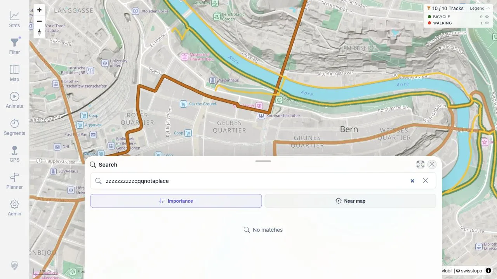</a>

**Text Evidence**
- [assets/SRC_04-no-results.txt](assets/SRC_04-no-results.txt) - Compact text evidence for the query, no-match message, and marker count. (164 B)

Excerpt: assets/SRC_04-no-results.txt

<pre><code>Search query: zzzzzzzzzzqqqnotaplace
Visible no-result message: No matches
Marker count after no-result query: 0
Map state: visible and usable with 10 / 10 tracks.
</code></pre>

### Packet SYN_01

- Packet file: [packets/SYN_01.md](packets/SYN_01.md)
- Coverage ID: `SYN_01`
- Status: **PASS**
- Action: Observed the app after ADM_02 upload and ADM_04 rescans.
- Expected: After server-side data changes, a data-freshness banner appears.
- Actual: Banner appeared with `New data available`, explanatory text, and `Reload`/`Dismiss` actions.

**Timings**

| Step | Timing |
|---|---:|
| Banner observation | <1 min |

**Handoff Notes**
- Completed: SYN_01 passed.
- Remaining unfinished coverage: SYN_02 through RUN_CLEANUP.
- Blocked or not applicable: None.
- State left for the next packet: Freshness banner remains visible and ready for `Reload`.

**Evidence**

<a href="assets/SYN_01-freshness-banner.webp">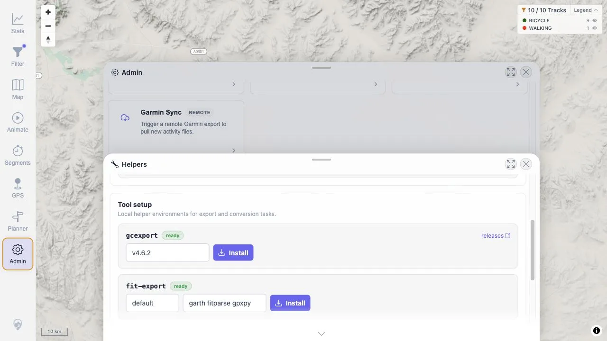</a>

**Text Evidence**
- [assets/SYN_01-freshness-banner.txt](assets/SYN_01-freshness-banner.txt) - Data-change source and banner text summary. (423 B)

Excerpt: assets/SYN_01-freshness-banner.txt

<pre><code>Server-side data changes before SYN_01:
- ADM_02 uploaded `ADM_02-upload-valid.gpx` to GPX-UPLOAD.
- ADM_04 triggered manual GPS and MEDIA rescans.

Visible banner:
- New data available
- Tracks, media, or settings changed since this view loaded.
- Actions: Reload, Dismiss

Admin Freshness context from ADM_07:
- Status: Out of sync
- Outdated domains: Index, Tracks, Geometry, Media
- Latest change: 26/05/2026, 10:13:38
</code></pre>

### Packet SYN_02

- Packet file: [packets/SYN_02.md](packets/SYN_02.md)
- Coverage ID: `SYN_02`
- Status: **PASS**
- Action: Closed Admin, clicked the freshness banner `Reload`, then checked map and Stats Overview.
- Expected: Reloading from the banner refreshes cached tracks and stats.
- Actual: Banner cleared; map changed from `10 / 10 Tracks` to `11 / 11 Tracks`; Stats Overview showed 11 tracks and included `ADM_02 Upload Validation` as latest/recent activity.

**Timings**

| Step | Timing |
|---|---:|
| Banner reload and map/stats verification | <2 min |

**Handoff Notes**
- Completed: SYN_02 passed.
- Remaining unfinished coverage: SYN_03 through RUN_CLEANUP.
- Blocked or not applicable: None.
- State left for the next packet: Client cache is refreshed to 11 visible tracks; Stats panel is open; freshness banner is cleared.

**Evidence**

**Text Evidence**
- [assets/SYN_02-reload-results.txt](assets/SYN_02-reload-results.txt) - Before/after map and stats evidence for banner reload. (785 B)

Excerpt: assets/SYN_02-reload-results.txt

<pre><code>Reload action:
- Before reload: freshness banner visible; map summary showed 10 / 10 Tracks; legend BICYCLE 9, WALKING 1.
- Closing Admin and clicking the freshness banner Reload cleared the banner.

Refreshed map/cache evidence:
- Banner present after reload: false
- Map summary after reload: 11 / 11 Tracks
- Legend after reload: BICYCLE 10, WALKING 1

Refreshed stats evidence:
- Stats Overview showed 11 TRACKS.
- Distance total: 1,262 km
- Duration total: 1d 03h
- Recent Activity included `ADM_02 Upload Validation`.
- Latest activity milestone updated to `ADM_02 Upload Validation`, 26/05/2026, 10:05.

Note: initial reload attempts while the Admin/Helpers overlay was open did not visibly apply; closing Admin and using the banner from the map surface refreshed successfully.
</code></pre>

### Packet SYN_03

- Packet file: [packets/SYN_03.md](packets/SYN_03.md)
- Coverage ID: `SYN_03`
- Status: **PASS**
- Action: Audited completed IMP/DEL packets for the required five-GPX import and delete-two sequence.
- Expected: Indexer state, freshness banner, map, browser, stats, filters, heatmap, and details all reflect source-of-truth file changes.
- Actual: Earlier packets directly verified import success, freshness reload, map/browser/stats/filter/heatmap/detail updates, automatic delete processing, and removal of deleted tracks from user-visible surfaces.

**Timings**

| Step | Timing |
|---|---:|
| Packet evidence audit | <1 min |

**Handoff Notes**
- Completed: SYN_03 passed.
- Remaining unfinished coverage: SYN_04 through RUN_CLEANUP.
- Blocked or not applicable: None.
- State left for the next packet: No app state mutation.

**Evidence**

**Text Evidence**
- [assets/SYN_03-five-gpx-delete-flow.txt](assets/SYN_03-five-gpx-delete-flow.txt) - Compact index of durable packet evidence for the required flow. (1.2 KB)

Excerpt: assets/SYN_03-five-gpx-delete-flow.txt

<pre><code>Five-GPX import and delete-two flow evidence from completed packets:
- IMP_02: five GPX files copied into README watched folder.
- IMP_03: live watcher detected all five files without manual rescan.
- IMP_04: all five GPX imports completed SUCCESS and freshness reflected import.
- IMP_05: freshness refresh showed imported data on map, stats, browser, and filter surfaces.
- IMP_06: five imported names appeared in track list/search/stats/map/filter context.
- IMP_07: map clicks opened all five imported GPX tracks.
- IMP_08: track count increased from 0 to 5, one track per GPX.
- IMP_09: stats/browser totals increased and heatmap rendered over imported tracks.
- DEL_01: Vitry and VoieVerte GPX source files deleted.
- DEL_02: automatic delete processing removed tracks 100000 and 100004.
- DEL_03: deleted tracks disappeared from map/heatmap/list/search/filter context and stats dropped to 3.
- DEL_04: remaining Jura track displayed and opened after deletion.
- DEL_05: deletion verdict used user-visible surfaces, not stale URL/API probes.

Conclusion: the required five-GPX import and delete-two flow passed across indexer state, freshness, map, browser, stats, filters, heatmap, and details.
</code></pre>

- [packets/IMP_02.md](packets/IMP_02.md) (1.8 KB)

Excerpt: packets/IMP_02.md

<pre><code># Packet: IMP_02

## Scope

- Coverage source: `documentation/testing/frontend-regression-test-plan.md`
- Coverage ID or run packet: IMP_02
- In scope: five-GPX import/index/map/stats flow.
- Out of scope: FIT import and delete-two-track flow unless referenced as later prerequisites.

## Prerequisites

- Required previous coverage IDs or run packets: RUN_SETUP, DAT source packets, IMP_01 baseline.
- Required app/data state: fresh app with public GPX files staged outside watched folder before IMP_02.
- Required browser context: desktop signed-in browser.

## Allowed Mutations

- Allowed: copy GPX files into `./data/gpx`, wait for indexing, use freshness reload, open UI panels, click tracks.
- Not allowed: delete source files or import FIT files in IMP packets.

## Actions And Results

| Coverage ID | Action | Expected result | Actual result | Status | Evidence |
|---|---|---|---|---|---|
| IMP_02 | Copied the five staged GPX files into README watched folder `./data/gpx`. | All five GPX files enter the documented import folder with expected names/checksums. | All five files were copied to `data/gpx`; sizes and SHA-256 values matched the source manifest. | PASS | `assets/IMP_02-copy-gpx.txt` |

## Issues

| ID | Severity | Summary | Reproduction | Expected | Actual | Evidence | Release impact |
|---|---|---|---|---|---|---|---|

## Evidence Files

| File | Purpose |
|---|---|
| assets/IMP_02-copy-gpx.txt | Copy command output, file list, and checksums. |

## Timings

| Step | Timing |
|---|---:|
| IMP_02 execution | &lt;1m |

## Handoff Notes

- Completed: IMP_02 terminal PASS.
- Remaining unfinished coverage: continue queue.
- Blocked or not applicable: none.
- State left for the next packet: five GPX tracks imported and visible; FIT not imported yet; no deletion performed.
</code></pre>

- [packets/IMP_09.md](packets/IMP_09.md) (2.2 KB)

Excerpt: packets/IMP_09.md

<pre><code># Packet: IMP_09

## Scope

- Coverage source: `documentation/testing/frontend-regression-test-plan.md`
- Coverage ID or run packet: IMP_09
- In scope: five-GPX import/index/map/stats flow.
- Out of scope: FIT import and delete-two-track flow unless referenced as later prerequisites.

## Prerequisites

- Required previous coverage IDs or run packets: RUN_SETUP, DAT source packets, IMP_01 baseline.
- Required app/data state: fresh app with public GPX files staged outside watched folder before IMP_02.
- Required browser context: desktop signed-in browser.

## Allowed Mutations

- Allowed: copy GPX files into `./data/gpx`, wait for indexing, use freshness reload, open UI panels, click tracks.
- Not allowed: delete source files or import FIT files in IMP packets.

## Actions And Results

| Coverage ID | Action | Expected result | Actual result | Status | Evidence |
|---|---|---|---|---|---|
| IMP_09 | Verified stats/browser totals, direction of totals, activity breakdown, period summaries, rankings, heatmap density, and track-browser summary. | Totals change in the correct direction for distance, duration, ascent/descent, activity, period charts, rankings, heatmap, and browser summary. | Stats increased to 5 tracks, 1,043 km, 23h31m, 4,527 Wh with Bicycle breakdown, rankings/highlights, active periods, and track-browser summary; heatmap rendered density over imported tracks. | PASS | `assets/IMP_05-stats-after-import.webp`, `assets/IMP_06-track-list-after-import.webp`, `assets/IMP_09-heatmap-map-visible.webp` |

## Issues

| ID | Severity | Summary | Reproduction | Expected | Actual | Evidence | Release impact |
|---|---|---|---|---|---|---|---|

## Evidence Files

| File | Purpose |
|---|---|
| assets/IMP_05-stats-after-import.webp | Post-import totals, breakdown, rankings, periods. |
| assets/IMP_06-track-list-after-import.webp | Track-browser summary row. |
| assets/IMP_09-heatmap-map-visible.webp | Heatmap density over imported tracks. |

## Timings

| Step | Timing |
|---|---:|
| IMP_09 execution | &lt;1m |

## Handoff Notes

- Completed: IMP_09 terminal PASS.
- Remaining unfinished coverage: continue queue.
- Blocked or not applicable: none.
- State left for the next packet: five GPX tracks imported and visible; FIT not imported yet; no deletion performed.
</code></pre>

- [packets/DEL_01.md](packets/DEL_01.md) (1.6 KB)

Excerpt: packets/DEL_01.md

<pre><code># Packet: DEL_01

## Scope

- Coverage source: `documentation/testing/frontend-regression-test-plan.md`
- Coverage ID or run packet: DEL_01
- In scope: delete-two-track flow for imported GPX source files.
- Out of scope: FIT import and non-deleted track format coverage.

## Prerequisites

- Required previous coverage IDs or run packets: IMP_01-IMP_09.
- Required app/data state: five GPX tracks imported before deletion.
- Required browser context: desktop signed-in browser.

## Allowed Mutations

- Allowed: delete selected GPX source files from `./data/gpx`, wait for watcher, refresh UI.
- Not allowed: delete unrelated files or perform Docker cleanup.

## Actions And Results

| Coverage ID | Action | Expected result | Actual result | Status | Evidence |
|---|---|---|---|---|---|
| DEL_01 | Deleted `Vitry-le-Francois_Langres.gpx` and `VoieVerteHauteVosges.gpx` from the watched folder. | Two imported source files are removed from the documented import folder. | Both files were removed from `data/gpx`; Jura, Lannion, and Mosel remained. | PASS | `assets/DEL_01-delete-files.txt` |

## Issues

| ID | Severity | Summary | Reproduction | Expected | Actual | Evidence | Release impact |
|---|---|---|---|---|---|---|---|

## Evidence Files

| File | Purpose |
|---|---|
| assets/DEL_01-delete-files.txt | Delete command and remaining source files. |

## Timings

| Step | Timing |
|---|---:|
| Delete flow step | &lt;1m |

## Handoff Notes

- Completed: DEL_01 terminal PASS.
- Remaining unfinished coverage: continue queue.
- Blocked or not applicable: none.
- State left for the next packet: three GPX tracks remain (Jura, Mosel, Lannion); FIT not imported yet.
</code></pre>

- [packets/DEL_05.md](packets/DEL_05.md) (1.8 KB)

Excerpt: packets/DEL_05.md

<pre><code># Packet: DEL_05

## Scope

- Coverage source: `documentation/testing/frontend-regression-test-plan.md`
- Coverage ID or run packet: DEL_05
- In scope: delete-two-track flow for imported GPX source files.
- Out of scope: FIT import and non-deleted track format coverage.

## Prerequisites

- Required previous coverage IDs or run packets: IMP_01-IMP_09.
- Required app/data state: five GPX tracks imported before deletion.
- Required browser context: desktop signed-in browser.

## Allowed Mutations

- Allowed: delete selected GPX source files from `./data/gpx`, wait for watcher, refresh UI.
- Not allowed: delete unrelated files or perform Docker cleanup.

## Actions And Results

| Coverage ID | Action | Expected result | Actual result | Status | Evidence |
|---|---|---|---|---|---|
| DEL_05 | Scoped deletion verdict to user-visible surfaces rather than stale API/URL probes. | Deleted-track stale URLs/API probes are not pass/fail criteria for the deletion flow. | Deletion status is based on user-visible map, heatmap, track browser/search, filter context, and remaining detail evidence. | PASS | `assets/DEL_03-map-after-delete.webp`, `assets/DEL_03-search-after-delete.txt` |

## Issues

| ID | Severity | Summary | Reproduction | Expected | Actual | Evidence | Release impact |
|---|---|---|---|---|---|---|---|

## Evidence Files

| File | Purpose |
|---|---|
| assets/DEL_03-map-after-delete.webp | User-visible map/heatmap state. |
| assets/DEL_03-search-after-delete.txt | User-visible browser search state. |

## Timings

| Step | Timing |
|---|---:|
| Delete flow step | &lt;1m |

## Handoff Notes

- Completed: DEL_05 terminal PASS.
- Remaining unfinished coverage: continue queue.
- Blocked or not applicable: none.
- State left for the next packet: three GPX tracks remain (Jura, Mosel, Lannion); FIT not imported yet.
</code></pre>

### Packet SYN_04

- Packet file: [packets/SYN_04.md](packets/SYN_04.md)
- Coverage ID: `SYN_04`
- Status: **PASS**
- Action: Audited completed FIT packets and sync reload behavior.
- Expected: FIT conversion import changes freshness and cache state the same way a native GPX import does.
- Actual: FIT conversion succeeded, became visible on map/list/stats/detail surfaces, and produced original/GPX downloads. Native freshness/cache reload behavior was also directly verified in SYN_01/SYN_02.

**Timings**

| Step | Timing |
|---|---:|
| Packet evidence audit | <1 min |

**Handoff Notes**
- Completed: SYN_04 passed.
- Remaining unfinished coverage: SYN_05 through RUN_CLEANUP.
- Blocked or not applicable: None.
- State left for the next packet: No app state mutation.

**Evidence**

**Text Evidence**
- [assets/SYN_04-fit-freshness-flow.txt](assets/SYN_04-fit-freshness-flow.txt) - Compact index of FIT and sync evidence. (829 B)

Excerpt: assets/SYN_04-fit-freshness-flow.txt

<pre><code>FIT conversion and freshness/cache evidence from completed packets:
- FIT_01: Activity.fit copied into the watched import folder.
- FIT_02: FIT converted via GPSBabel, indexed as #100005, displayed on map/list/stats.
- FIT_03: FIT-backed detail overview, graphs, quality, related, events, and mini-map rendered.
- FIT_04: original download returned Activity.fit matching uploaded checksum.
- FIT_05: GPX export returned valid GPX with 3,601 trkpt points.
- FIT_06: converter-unavailable state was not applicable because GPSBabel/FIT conversion succeeded.
- Related freshness/cache behavior was then exercised again in SYN_01/SYN_02 with a native GPX upload and banner reload.

Conclusion: the FIT import changed indexed/user-visible state the same way as native imports and produced usable map/list/stats/detail/export surfaces.
</code></pre>

- [packets/FIT_01.md](packets/FIT_01.md) (1.6 KB)

Excerpt: packets/FIT_01.md

<pre><code># Packet: FIT_01

## Scope

- Coverage source: `documentation/testing/frontend-regression-test-plan.md`
- Coverage ID or run packet: FIT_01
- In scope: FIT conversion/import/details/download flow.
- Out of scope: non-FIT format coverage.

## Prerequisites

- Required previous coverage IDs or run packets: DAT_05, DEL flow complete, app running.
- Required app/data state: Garmin `Activity.fit` staged before FIT_01.
- Required browser context: desktop signed-in browser; API token used only because in-app browser downloads are unsupported.

## Allowed Mutations

- Allowed: copy FIT to watched folder, use visible UI controls, download files from app endpoints.
- Not allowed: product source edits or workarounds that alter conversion behavior.

## Actions And Results

| Coverage ID | Action | Expected result | Actual result | Status | Evidence |
|---|---|---|---|---|---|
| FIT_01 | Copied Garmin `Activity.fit` into the watched import folder. | FIT activity file with GPS positions is imported. | `Activity.fit` copied to `data/gpx` with expected SHA-256. | PASS | `assets/FIT_01-copy-fit.txt` |

## Issues

| ID | Severity | Summary | Reproduction | Expected | Actual | Evidence | Release impact |
|---|---|---|---|---|---|---|---|

## Evidence Files

| File | Purpose |
|---|---|
| assets/FIT_01-copy-fit.txt | FIT copy and checksum evidence. |

## Timings

| Step | Timing |
|---|---:|
| FIT step | &lt;1m |

## Handoff Notes

- Completed: FIT_01 terminal PASS.
- Remaining unfinished coverage: continue queue.
- Blocked or not applicable: none unless stated.
- State left for the next packet: dataset contains three remaining GPX tracks plus FIT track #100005.
</code></pre>

- [packets/FIT_06.md](packets/FIT_06.md) (1.8 KB)

Excerpt: packets/FIT_06.md

<pre><code># Packet: FIT_06

## Scope

- Coverage source: `documentation/testing/frontend-regression-test-plan.md`
- Coverage ID or run packet: FIT_06
- In scope: FIT conversion/import/details/download flow.
- Out of scope: non-FIT format coverage.

## Prerequisites

- Required previous coverage IDs or run packets: DAT_05, DEL flow complete, app running.
- Required app/data state: Garmin `Activity.fit` staged before FIT_01.
- Required browser context: desktop signed-in browser; API token used only because in-app browser downloads are unsupported.

## Allowed Mutations

- Allowed: copy FIT to watched folder, use visible UI controls, download files from app endpoints.
- Not allowed: product source edits or workarounds that alter conversion behavior.

## Actions And Results

| Coverage ID | Action | Expected result | Actual result | Status | Evidence |
|---|---|---|---|---|---|
| FIT_06 | Checked converter availability through the FIT import result. | If GPSBabel/FIT conversion is unavailable, UI shows a clear conversion/indexing error and failure is blocking. | GPSBabel/FIT conversion was available and succeeded, so unavailable-converter error handling was not applicable in this run. | NOT APPLICABLE | `assets/FIT_02-index-monitor.txt` |

## Issues

| ID | Severity | Summary | Reproduction | Expected | Actual | Evidence | Release impact |
|---|---|---|---|---|---|---|---|

## Evidence Files

| File | Purpose |
|---|---|
| assets/FIT_02-index-monitor.txt | GPSBabel conversion success evidence. |

## Timings

| Step | Timing |
|---|---:|
| FIT step | &lt;1m |

## Handoff Notes

- Completed: FIT_06 terminal NOT APPLICABLE.
- Remaining unfinished coverage: continue queue.
- Blocked or not applicable: none unless stated.
- State left for the next packet: dataset contains three remaining GPX tracks plus FIT track #100005.
</code></pre>

- [packets/SYN_01.md](packets/SYN_01.md) (1.7 KB)

Excerpt: packets/SYN_01.md

<pre><code># Packet: SYN_01

## Scope

- Coverage source: `documentation/testing/frontend-regression-test-plan.md`
- Coverage ID or run packet: SYN_01
- In scope: Freshness banner after server-side data changes.
- Out of scope: Applying the reload.

## Prerequisites

- Required previous coverage IDs or run packets: ADM_11
- Required app/data state: Server-side upload/rescan changes have occurred and client has not reloaded cached data yet.
- Required browser context: Desktop browser.

## Allowed Mutations

- Allowed: Observe the banner.
- Not allowed: Click `Reload` before SYN_02.

## Actions And Results

| Coverage ID | Action | Expected result | Actual result | Status | Evidence |
|---|---|---|---|---|---|
| SYN_01 | Observed the app after ADM_02 upload and ADM_04 rescans. | After server-side data changes, a data-freshness banner appears. | Banner appeared with `New data available`, explanatory text, and `Reload`/`Dismiss` actions. | PASS | `assets/SYN_01-freshness-banner.webp`, `assets/SYN_01-freshness-banner.txt` |

## Issues

| ID | Severity | Summary | Reproduction | Expected | Actual | Evidence | Release impact |
|---|---|---|---|---|---|---|---|

## Evidence Files

| File | Purpose |
|---|---|
| assets/SYN_01-freshness-banner.webp | Screenshot of freshness banner after data changes. |
| assets/SYN_01-freshness-banner.txt | Data-change source and banner text summary. |

## Timings

| Step | Timing |
|---|---:|
| Banner observation | &lt;1 min |

## Handoff Notes

- Completed: SYN_01 passed.
- Remaining unfinished coverage: SYN_02 through RUN_CLEANUP.
- Blocked or not applicable: None.
- State left for the next packet: Freshness banner remains visible and ready for `Reload`.
</code></pre>

- [packets/SYN_02.md](packets/SYN_02.md) (1.7 KB)

Excerpt: packets/SYN_02.md

<pre><code># Packet: SYN_02

## Scope

- Coverage source: `documentation/testing/frontend-regression-test-plan.md`
- Coverage ID or run packet: SYN_02
- In scope: Apply data freshness banner reload and verify cached tracks/stats refresh.
- Out of scope: Full revalidation of every data surface.

## Prerequisites

- Required previous coverage IDs or run packets: SYN_01
- Required app/data state: Freshness banner visible after ADM_02 upload/rescans.
- Required browser context: Desktop browser.

## Allowed Mutations

- Allowed: Click the freshness banner `Reload`.
- Not allowed: Create additional imports for this packet.

## Actions And Results

| Coverage ID | Action | Expected result | Actual result | Status | Evidence |
|---|---|---|---|---|---|
| SYN_02 | Closed Admin, clicked the freshness banner `Reload`, then checked map and Stats Overview. | Reloading from the banner refreshes cached tracks and stats. | Banner cleared; map changed from `10 / 10 Tracks` to `11 / 11 Tracks`; Stats Overview showed 11 tracks and included `ADM_02 Upload Validation` as latest/recent activity. | PASS | `assets/SYN_02-reload-results.txt` |

## Issues

| ID | Severity | Summary | Reproduction | Expected | Actual | Evidence | Release impact |
|---|---|---|---|---|---|---|---|

## Evidence Files

| File | Purpose |
|---|---|
| assets/SYN_02-reload-results.txt | Before/after map and stats evidence for banner reload. |

## Timings

| Step | Timing |
|---|---:|
| Banner reload and map/stats verification | &lt;2 min |

## Handoff Notes

- Completed: SYN_02 passed.
- Remaining unfinished coverage: SYN_03 through RUN_CLEANUP.
- Blocked or not applicable: None.
- State left for the next packet: Client cache is refreshed to 11 visible tracks; Stats panel is open; freshness banner is cleared.
</code></pre>

### Packet SYN_06

- Packet file: [packets/SYN_06.md](packets/SYN_06.md)
- Coverage ID: `SYN_06`
- Status: **PASS**
- Action: Reloaded current data, logged out with safe Logout, signed back in, and waited.
- Expected: Logging out and back in does not re-trigger an automatic data refresh repeatedly.
- Actual: App returned to map with `12 / 12 Tracks`; no freshness banner appeared immediately after login or after a 10 second wait.

**Timings**

| Step | Timing |
|---|---:|
| Reload, logout, login, wait | <2 min |

**Handoff Notes**
- Completed: SYN_06 passed.
- Remaining unfinished coverage: SYN_07 through RUN_CLEANUP.
- Blocked or not applicable: None.
- State left for the next packet: Signed in on map with 12 visible tracks and no freshness banner.

**Evidence**

**Text Evidence**
- [assets/SYN_06-logout-login.txt](assets/SYN_06-logout-login.txt) - Logout/login sequence and after-login freshness observations. (682 B)

Excerpt: assets/SYN_06-logout-login.txt

<pre><code>Setup:
- Applied outstanding freshness reload from the map surface after closing Stats.
- Cache refreshed to 12 / 12 Tracks; legend BICYCLE 11, WALKING 1; banner cleared.

Logout/login sequence:
- Opened Admin -&gt; Session.
- Used the safe `Logout` action, not `Wipe &amp; Logout`.
- Reached `/mtl/login`.
- Signed in with README credentials.

After login:
- URL returned to `/mtl/`.
- Initial app text included `LOADING YOUR TRAILS`, then settled to map.
- Map showed 12 / 12 Tracks.
- Freshness banner after login: false.
- Freshness banner after an additional 10 second wait: false.

Conclusion: logout and login did not trigger an automatic refresh loop or repeated freshness banner.
</code></pre>

### Packet SYN_07

- Packet file: [packets/SYN_07.md](packets/SYN_07.md)
- Coverage ID: `SYN_07`
- Status: **PASS**
- Action: Triggered `Rescan Media`, observed Jobs processing state, and used map zoom.
- Expected: Indexer-running state surfaces as a badge and does not block map interaction.
- Actual: Jobs tile showed `PROCESSING`; the media rescan queued/settled; map Zoom in remained responsive and changed scale from 1000 km to 500 km.

**Timings**

| Step | Timing |
|---|---:|
| Rescan and zoom interaction | <2 min |

**Handoff Notes**
- Completed: SYN_07 passed.
- Remaining unfinished coverage: APP_01 through RUN_CLEANUP.
- Blocked or not applicable: None.
- State left for the next packet: Admin Jobs panel is open; map is at 500 km scale; client shows 12 visible tracks.

**Evidence**

**Text Evidence**
- [assets/SYN_07-indexer-running.txt](assets/SYN_07-indexer-running.txt) - Processing badge/state and map interaction evidence. (717 B)

Excerpt: assets/SYN_07-indexer-running.txt

<pre><code>Action:
- Opened Admin -&gt; Jobs.
- Clicked Rescan Media.

Visible running/badge state:
- Admin workspace Jobs tile showed `PROCESSING`.
- Jobs panel showed `Manual MEDIA rescan has been queued.`
- File Indexers section remained visible.
- Current status after the quick scan settled:
  - MEDIA DONE 100%, 5 / 5 total.
  - GPS DONE 81%, 18 completed, 2 failed, 22 total.
- Background jobs remained DONE 100%.

Map interaction check:
- Initial attempted Zoom out was disabled at current low zoom.
- Zoom in remained enabled and changed scale from 1000 km to 500 km while the Jobs/processing state was visible.

Conclusion: indexer activity surfaced as a visible processing badge/state and did not block map interaction.
</code></pre>

### Packet TBS_01

- Packet file: [packets/TBS_01.md](packets/TBS_01.md)
- Coverage ID: `TBS_01`
- Status: **PASS**
- Action: Opened Stats and switched to Tracks.
- Expected: Track browser lists all tracks with name, date, distance, duration, activity, and related fields.
- Actual: Tracks tab listed 10 tracks with Start, Track, Activity, Distance, Duration, Avg km/h, Energy, Exploration, Imported, summary totals, sort buttons, and pagination.

**Timings**

| Step | Timing |
|---|---:|
| Track browser listing check | <2m |

**Handoff Notes**
- Completed: TBS_01 terminal PASS.
- Remaining unfinished coverage: continue with TBS_02.
- Blocked or not applicable: none.
- State left for the next packet: Stats Tracks tab open, filtering off.

**Evidence**

### Packet TBS_02

- Packet file: [packets/TBS_02.md](packets/TBS_02.md)
- Coverage ID: `TBS_02`
- Status: **PASS**
- Action: Searched the Tracks tab for `Jura`, `IGCHDRS`, `20/07/2021`, `273 km`, `7h 46m`, `Walking`, and `Activity.fit`.
- Expected: Search matches names, descriptions, dates, distances, durations, activity, and file paths.
- Actual: Each representative term returned matching visible rows, including FIT source-file/path search returning Track #100005. Search was cleared afterward.

**Timings**

| Step | Timing |
|---|---:|
| Track browser search matrix | <3m |

**Handoff Notes**
- Completed: TBS_02 terminal PASS.
- Remaining unfinished coverage: continue with TBS_03.
- Blocked or not applicable: none.
- State left for the next packet: Tracks tab open, search cleared.

**Evidence**

<a href="assets/TBS_02-file-search.webp">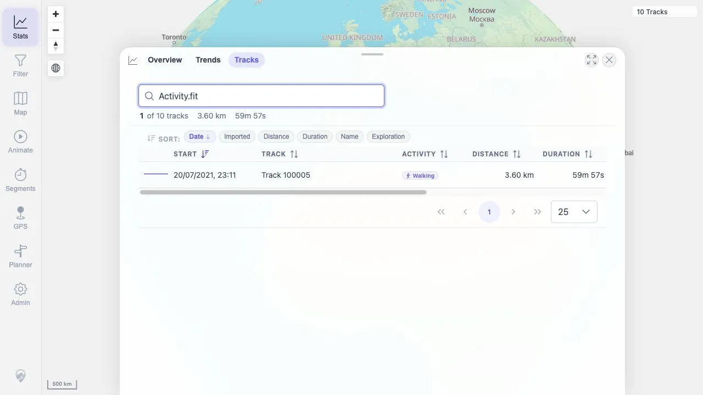</a>

**Text Evidence**
- [assets/TBS_02-search-results.txt](assets/TBS_02-search-results.txt) - Search term matrix and representative matching rows. (1.6 KB)

Excerpt: assets/TBS_02-search-results.txt

<pre><code>name: Jura -&gt; unknown tracks | 01/01/2010, 01:00 Jura Route 7 / 2011 on GPSies.com  Bicycle 273 km 7h 46m 35.1 1808 Wh 100.0% 26/05/2026, 06:15 || 01/01/2010, 01:00 GNSSALTTRK IGCHDRS~HFPLTPILOT:Unknown~  Bicycle 273 km 7h 46m 35.1 1808 Wh 100.0% 26/05/2026, 06:31 || 01/01/2010, 01:00 Track 100012  Bicycle 24.2 km 16m 15s 89.4 240 Wh 100.0% 26/05/2026, 06:33
description: IGCHDRS -&gt; unknown tracks | 01/01/2010, 01:00 GNSSALTTRK IGCHDRS~HFPLTPILOT:Unknown~  Bicycle 273 km 7h 46m 35.1 1808 Wh 100.0% 26/05/2026, 06:31 || 01/01/2010, 01:00 GNSSALTTRK IGCHDRS~HFPLTPILOT:Unknown~  Bicycle 35.9 km 37m 05s 58.1 243 Wh 100.0% 26/05/2026, 06:44
date: 20/07/2021 -&gt; unknown tracks | 20/07/2021, 23:11 Track 100005  Walking 3.60 km 59m 57s 3.6 347 Wh 100.0% 26/05/2026, 06:25
distance: 273 km -&gt; unknown tracks | 01/01/2010, 01:00 Jura Route 7 / 2011 on GPSies.com  Bicycle 273 km 7h 46m 35.1 1808 Wh 100.0% 26/05/2026, 06:15 || 01/01/2010, 01:00 GNSSALTTRK IGCHDRS~HFPLTPILOT:Unknown~  Bicycle 273 km 7h 46m 35.1 1808 Wh 100.0% 26/05/2026, 06:31
duration: 7h 46m -&gt; unknown tracks | 01/01/2010, 01:00 Jura Route 7 / 2011 on GPSies.com  Bicycle 273 km 7h 46m 35.1 1808 Wh 100.0% 26/05/2026, 06:15 || 01/01/2010, 01:00 GNSSALTTRK IGCHDRS~HFPLTPILOT:Unknown~  Bicycle 273 km 7h 46m 35.1 1808 Wh 100.0% 26/05/2026, 06:31
activity: Walking -&gt; unknown tracks | 20/07/2021, 23:11 Track 100005  Walking 3.60 km 59m 57s 3.6 347 Wh 100.0% 26/05/2026, 06:25
file path: Activity.fit -&gt; unknown tracks | 20/07/2021, 23:11 Track 100005  Walking 3.60 km 59m 57s 3.6 347 Wh 100.0% 26/05/2026, 06:25
</code></pre>

### Packet TBS_03

- Packet file: [packets/TBS_03.md](packets/TBS_03.md)
- Coverage ID: `TBS_03`
- Status: **PASS**
- Action: Clicked Date, Imported, Distance, Duration, Name, and Exploration sort controls; then searched `Walking` to check visible summary.
- Expected: Sorting by each column/control works; summary row reflects what is visible.
- Actual: Each sort control produced a distinct expected first row for the selected sort. Summary stayed at 10 tracks for all-track sorts and changed to `1 of 10 tracks` for the Walking subset.

**Timings**

| Step | Timing |
|---|---:|
| Sort and summary check | <4m |

**Handoff Notes**
- Completed: TBS_03 terminal PASS.
- Remaining unfinished coverage: continue with TBS_04.
- Blocked or not applicable: none.
- State left for the next packet: Tracks tab open, search cleared.

**Evidence**

**Text Evidence**
- [assets/TBS_03-sort-results.txt](assets/TBS_03-sort-results.txt) - Sort matrix with first-row evidence and subset summary. (846 B)

Excerpt: assets/TBS_03-sort-results.txt

<pre><code>Date: 10 tracks | first row: 20/07/2021, 23:11 Track 100005  Walking 3.60 km 59m 57s 3.6 347 Wh 100.0% 26/05/2026, 06:25
Imported: 10 tracks | first row: 01/01/2010, 01:00 Track 100018  Bicycle 35.7 km 37m 05s 57.8 307 Wh 100.0% 26/05/2026, 06:44
Distance: 10 tracks | first row: 01/01/2010, 01:00 Moselradweg aus Wiki on GPSies.com  Bicycle 518 km 6h 50m 75.7 1616 Wh 100.0% 26/05/2026, 06:15
Duration: 10 tracks | first row: 01/01/2010, 01:00 Jura Route 7 / 2011 on GPSies.com  Bicycle 273 km 7h 46m 35.1 1808 Wh 100.0% 26/05/2026, 06:15
Name: 10 tracks | first row: 01/01/2010, 01:00 Track 100018  Bicycle 35.7 km 37m 05s 57.8 307 Wh 100.0% 26/05/2026, 06:44
Exploration: 10 tracks | first row: 20/07/2021, 23:11 Track 100005  Walking 3.60 km 59m 57s 3.6 347 Wh 100.0% 26/05/2026, 06:25
subset search Walking: 1 of 10 tracks
</code></pre>

### Packet TBS_05

- Packet file: [packets/TBS_05.md](packets/TBS_05.md)
- Coverage ID: `TBS_05`
- Status: **PASS**
- Action: Clicked the Track #100005 row in the Tracks table.
- Expected: Clicking a row opens the track's details.
- Actual: The detail sheet opened for `#100005`, showing the FIT-backed overview with Activity.fit, distance, duration, ascent, and download buttons.

**Timings**

| Step | Timing |
|---|---:|
| Row click open detail | <2m |

**Handoff Notes**
- Completed: TBS_05 terminal PASS.
- Remaining unfinished coverage: continue with TBS_06.
- Blocked or not applicable: none.
- State left for the next packet: track #100005 details open over Stats Tracks tab.

**Evidence**

<a href="assets/TBS_05-row-opens-detail.webp">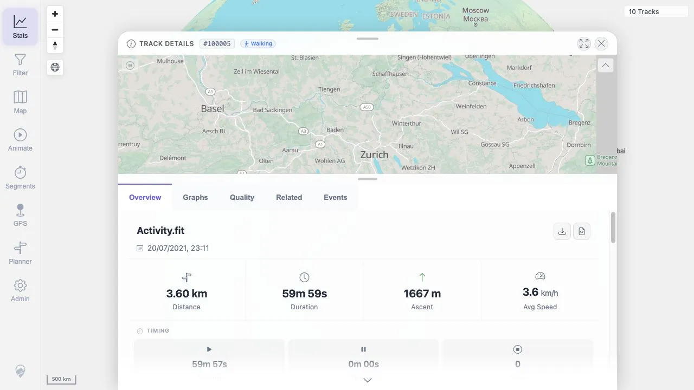</a>

### Packet TBS_06

- Packet file: [packets/TBS_06.md](packets/TBS_06.md)
- Coverage ID: `TBS_06`
- Status: **PASS**
- Action: Opened Stats Overview and reviewed the top and lower overview sections.
- Expected: Statistics overview shows total distance, time, elevation/energy-related totals, activity breakdown, rankings, milestones, and period summaries/charts.
- Actual: Overview showed 10 tracks, 1,262 km, 1d 03h duration, 7,052 Wh, Bicycle/Walking breakdown, highlight rankings, recent activity, most active day/week/month/weekday, milestones, and overall date range.

**Timings**

| Step | Timing |
|---|---:|
| Stats overview review | <3m |

**Handoff Notes**
- Completed: TBS_06 terminal PASS.
- Remaining unfinished coverage: continue with TBS_07.
- Blocked or not applicable: none.
- State left for the next packet: Stats Overview open.

**Evidence**

<a href="assets/TBS_06-overview-top.webp">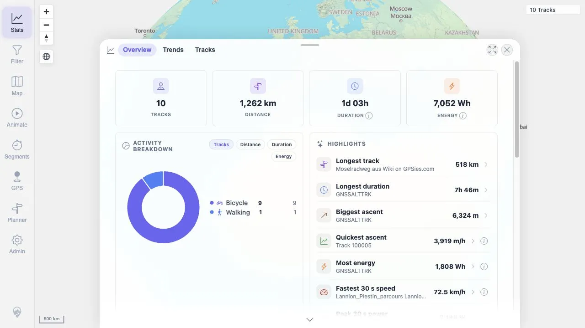</a>
<a href="assets/TBS_06-overview-lower.webp">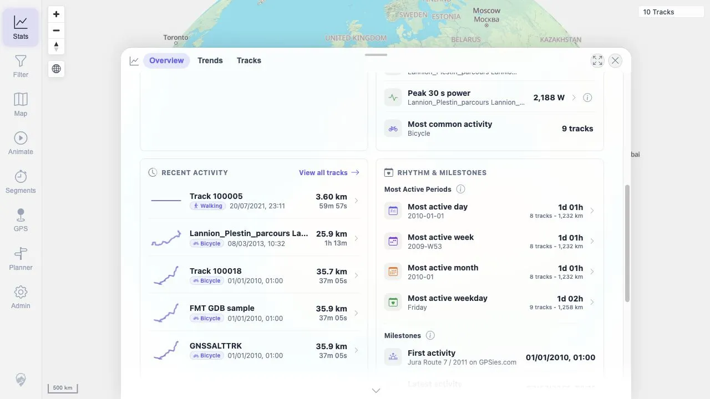</a>

### Packet TBS_07

- Packet file: [packets/TBS_07.md](packets/TBS_07.md)
- Coverage ID: `TBS_07`
- Status: **PASS**
- Action: Compared previously captured empty baseline, a one-track filtered stats view, and the current 10-track overview.
- Expected: Stats are correct for empty dataset, a single track, and many tracks.
- Actual: Empty baseline showed no imported tracks; filtered stats showed `Showing 1 of 10 tracks` with Jura-only totals; all-track overview showed 10 tracks, 1,262 km, 1d 03h, activity breakdown, highlights, and milestones.

**Timings**

| Step | Timing |
|---|---:|
| Cross-state stats evidence review | <1m |

**Handoff Notes**
- Completed: TBS_07 terminal PASS.
- Remaining unfinished coverage: continue with TBS_08.
- Blocked or not applicable: none.
- State left for the next packet: Stats Overview open.

**Evidence**

### Packet TBS_08

- Packet file: [packets/TBS_08.md](packets/TBS_08.md)
- Coverage ID: `TBS_08`
- Status: **PASS**
- Action: Reviewed the five-GPX import statistics evidence and the post-delete statistics/list evidence.
- Expected: Stats update after the required five-GPX import and again after deleting two imported tracks; no stale deleted-track totals remain.
- Actual: Five-GPX import increased stats to 5 tracks, 1,043 km, 23h31m, with rankings, period summaries, browser summary, and heatmap density. Deleting Vitry and VoieVerte dropped visible map/heatmap/list state to 3 tracks and searches for the deleted names returned no matching tracks.

**Timings**

| Step | Timing |
|---|---:|
| Cross-state evidence review | <1m |

**Handoff Notes**
- Completed: TBS_08 terminal PASS.
- Remaining unfinished coverage: continue with TBS_09.
- Blocked or not applicable: none.
- State left for the next packet: Stats Overview remains the expected starting view.

**Evidence**

**Text Evidence**
- [assets/DEL_03-search-after-delete.txt](assets/DEL_03-search-after-delete.txt) - Deleted-name search absence evidence. (533 B)

Excerpt: assets/DEL_03-search-after-delete.txt

<pre><code>QUERY=Vitry
ROW_COUNT=1
No tracks match “Vitry”

QUERY=Voie
ROW_COUNT=1
No tracks match “Voie”

QUERY=Jura
ROW_COUNT=1
01/01/2010, 01:00 Jura Route 7 / 2011 on GPSies.com Bicycle 273 km 7h 46m 35.1 1808 Wh 100.0% 26/05/2026, 06:15

QUERY=Mosel
ROW_COUNT=1
01/01/2010, 01:00 Moselradweg aus Wiki on GPSies.com Bicycle 518 km 6h 50m 75.7 1616 Wh 100.0% 26/05/2026, 06:15

QUERY=Lannion
ROW_COUNT=1
08/03/2013, 10:32 Lannion_Plestin_parcours Lannion_Plestin_parcours1 Bicycle 25.9 km 1h 13m 21.1 198 Wh 100.0% 26/05/2026, 06:15
</code></pre>

### Packet TBS_09

- Packet file: [packets/TBS_09.md](packets/TBS_09.md)
- Coverage ID: `TBS_09`
- Status: **PASS**
- Action: Opened Stats > Trends, kept Charts mode, and switched the period selector to monthly, weekly, and daily modes.
- Expected: Time-period charts render and switch correctly for daily, weekly, and monthly period groupings.
- Actual: Each selected mode updated the active combobox label, kept the 10-track/1,262 km/1d 03h totals, and rendered duration/distance bar charts without blank panels or layout errors.

**Timings**

| Step | Timing |
|---|---:|
| Trends chart switching | <4m |

**Handoff Notes**
- Completed: TBS_09 terminal PASS.
- Remaining unfinished coverage: continue with TBS_10.
- Blocked or not applicable: none.
- State left for the next packet: Stats Trends tab open in daily chart mode.

**Evidence**

<a href="assets/TBS_09-daily.webp">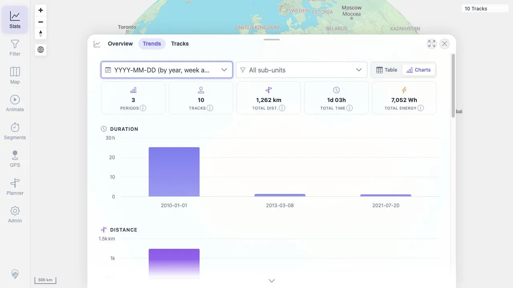</a>

### Packet TBS_10

- Packet file: [packets/TBS_10.md](packets/TBS_10.md)
- Coverage ID: `TBS_10`
- Status: **PASS**
- Action: Clicked the `Longest track` statistics highlight for Moselradweg.
- Expected: Clicking a stats entry navigates, filters, or highlights as expected.
- Actual: The clicked highlight became active and opened a ranked `Longest track` drilldown list headed by Moselradweg, with matching ranked tracks and per-track action rows.

**Timings**

| Step | Timing |
|---|---:|
| Highlight click | <2m |

**Handoff Notes**
- Completed: TBS_10 terminal PASS.
- Remaining unfinished coverage: continue with TBS_11.
- Blocked or not applicable: none.
- State left for the next packet: Stats Overview remains open with the `Longest track` drilldown visible.

**Evidence**

### Packet TBS_11

- Packet file: [packets/TBS_11.md](packets/TBS_11.md)
- Coverage ID: `TBS_11`
- Status: **PASS**
- Action: Opened the `Longest track` highlight drilldown, selected the top Moselradweg row, temporarily excluded Moselradweg from highlights, verified excluded-count exposure, and restored the exclusion state.
- Expected: Highlight drilldowns open the expected track list, a selected track opens, and excluded-highlight counts are exposed where applicable.
- Actual: The drilldown listed ranked tracks with Moselradweg first; selecting Moselradweg opened Track Details `#100002`; excluding it showed `1 track excluded`; restoring the API state and reloading returned Moselradweg to the highlight with no excluded-count badge.

**Issues**

| ID | Severity | Summary | Evidence |
|---|---|---|---|
| TBS-02 | P3 | Excluded-highlight count opens an empty track-browser search. | [assets/TBS_11-excluded-count.webp](assets/TBS_11-excluded-count.webp) |

**Timings**

| Step | Timing |
|---|---:|
| Highlight drilldown/open/exclusion check | <8m |

**Handoff Notes**
- Completed: TBS_11 terminal PASS with issue TBS-02 recorded.
- Remaining unfinished coverage: continue with PLN_01.
- Blocked or not applicable: none.
- State left for the next packet: Moselradweg highlight exclusion restored; Track Details `#100002` remains open over Stats.

**Evidence**

<a href="assets/TBS_11-selected-track-opened.webp">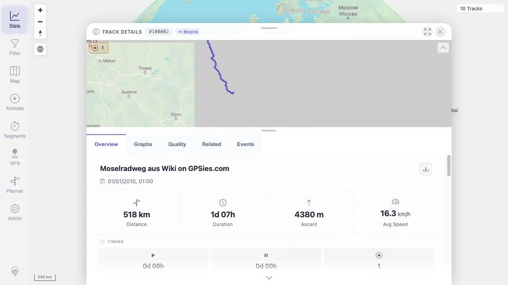</a>
<a href="assets/TBS_11-exclusion-dialog.webp">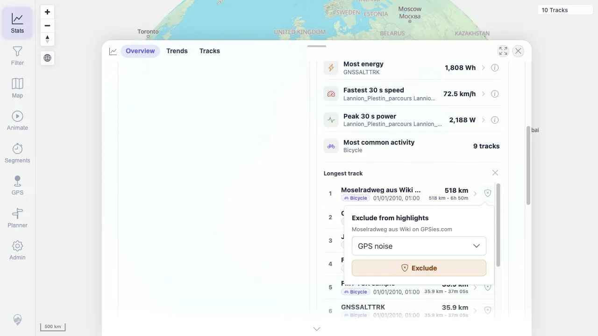</a>
<a href="assets/TBS_11-excluded-count.webp">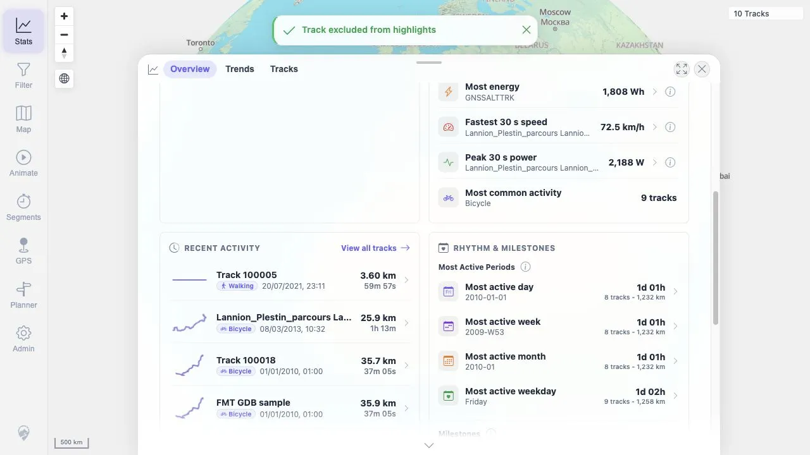</a>

**Text Evidence**
- [assets/TBS_11-highlight-restore.txt](assets/TBS_11-highlight-restore.txt) - Restoration note for temporary exclusion state. (349 B)

Excerpt: assets/TBS_11-highlight-restore.txt

<pre><code>Temporary highlight exclusion created during TBS_11 was restored after evidence capture.
Endpoint: PATCH /mtl/api/tracks/100002/statistics-exclusion
Payload: {"highlightExclusionReason":null,"statisticsExclusionReason":null}
Result: HTTP 200; subsequent reload showed Moselradweg restored as the Longest track highlight and no excluded-count badge.
</code></pre>

### Packet TRD_01

- Packet file: [packets/TRD_01.md](packets/TRD_01.md)
- Coverage ID: `TRD_01`
- Status: **PASS**
- Action: Opened GPX-backed Jura track and FIT-backed Activity track from user-facing navigation.
- Expected: At least one GPX-backed and one FIT-backed track open; IDs/source filenames are recorded.
- Actual: GPX-backed track #100001 (`JuraRoute72011.gpx`) opened from the map; FIT-backed track #100005 (`Activity.fit`) opened from track browser/detail flow.

**Timings**

| Step | Timing |
|---|---:|
| Detail opening evidence | Reused from IMP/FIT/MAP packets |

**Handoff Notes**
- Completed: TRD_01 terminal PASS.
- Remaining unfinished coverage: continue with TRD_02.
- Blocked or not applicable: none.
- State left for the next packet: no data changed.

**Evidence**

**Text Evidence**
- [assets/IMP_06-imported-track-mapping.txt](assets/IMP_06-imported-track-mapping.txt) - GPX source-to-track mapping. (919 B)

Excerpt: assets/IMP_06-imported-track-mapping.txt

<pre><code>Imported GPX mapping after five-file import.

| Source file | Imported track id | Visible track name | UI evidence |
|---|---:|---|---|
| Vitry-le-Francois_Langres.gpx | 100000 | Vitry le françois - langres on GPSies.com | Track browser row and stats highlights |
| JuraRoute72011.gpx | 100001 | Jura Route 7 / 2011 on GPSies.com | Track browser row and stats highlights |
| MoselradwegAusWiki.gpx | 100002 | Moselradweg aus Wiki on GPSies.com | Track browser row and stats highlights |
| Lannion_Plestin_parcours24.4RE.gpx | 100003 | Lannion_Plestin_parcours Lannion_Plestin_parcours1 | Track browser row and recent activity |
| VoieVerteHauteVosges.gpx | 100004 | voie verte haute vosges on GPSies.com | Track browser row and recent activity |

Track ids came from app ingest log SUCCESS lines in `IMP_03-index-monitor.txt`.
Visible names came from the Stats &gt; Tracks table in `IMP_06-track-list-after-import.webp`.
</code></pre>

- [assets/FIT_02-track-list-search-fit.txt](assets/FIT_02-track-list-search-fit.txt) - FIT track row/source evidence. (83 B)

Excerpt: assets/FIT_02-track-list-search-fit.txt

<pre><code>20/07/2021, 23:11 Track 100005 Walking 3.60 km 59m 57s 3.6 347 Wh 26/05/2026, 06:25</code></pre>

### Packet TRD_02

- Packet file: [packets/TRD_02.md](packets/TRD_02.md)
- Coverage ID: `TRD_02`
- Status: **PASS**
- Action: Opened FIT-backed track details and observed overview, graphs, quality, related, events, and mini-map.
- Expected: Opening a track loads overview, charts, related-tracks list, event list, mini-map, and quality info.
- Actual: FIT track #100005 rendered overview, graph, quality, related, and events views with mini-map context; GPX track #100001 also rendered overview/mini-map.

**Timings**

| Step | Timing |
|---|---:|
| Detail surface check | Reused from FIT_03/MAP_11 |

**Handoff Notes**
- Completed: TRD_02 terminal PASS.
- Remaining unfinished coverage: continue with TRD_03.
- Blocked or not applicable: none.
- State left for the next packet: no data changed.

**Evidence**

### Packet TRD_03

- Packet file: [packets/TRD_03.md](packets/TRD_03.md)
- Coverage ID: `TRD_03`
- Status: **PASS**
- Action: Switched through Overview, Graphs, Quality, Related, and Events on the FIT-backed detail view.
- Expected: Tabs do not refetch in a loop, lose state, or show blank panels.
- Actual: Each tab rendered content and remained usable; no blank tab state was captured.

**Timings**

| Step | Timing |
|---|---:|
| Tab switching | Reused from FIT_03 |

**Handoff Notes**
- Completed: TRD_03 terminal PASS.
- Remaining unfinished coverage: continue with TRD_04.
- Blocked or not applicable: none.
- State left for the next packet: no data changed.

**Evidence**

### Packet TRD_04

- Packet file: [packets/TRD_04.md](packets/TRD_04.md)
- Coverage ID: `TRD_04`
- Status: **PASS**
- Action: Opened the FIT-backed Graphs tab.
- Expected: Elevation, speed, distance, and gain charts render with readable values.
- Actual: Graphs tab rendered multiple chart panels with track metric axes/values instead of blank space.

**Timings**

| Step | Timing |
|---|---:|
| Graph render check | Reused from FIT_03 |

**Handoff Notes**
- Completed: TRD_04 terminal PASS.
- Remaining unfinished coverage: continue with TRD_05.
- Blocked or not applicable: none.
- State left for the next packet: no data changed.

**Evidence**

### Packet TRD_05

- Packet file: [packets/TRD_05.md](packets/TRD_05.md)
- Coverage ID: `TRD_05`
- Status: **PASS**
- Action: Switched x-axis from Time to Distance, toggled Range, increased chart point count, and increased graph height.
- Expected: Controls update charts without layout breakage.
- Actual: Distance became active, Range became inactive, point count increased from 350 to 375, and graph height control moved while charts remained rendered.

**Timings**

| Step | Timing |
|---|---:|
| Graph control interaction | <2m |

**Handoff Notes**
- Completed: TRD_05 terminal PASS.
- Remaining unfinished coverage: continue with TRD_06.
- Blocked or not applicable: none.
- State left for the next packet: graph controls left in modified display state only.

**Evidence**

<a href="assets/TRD_05-graphs-controls-after-visible.webp">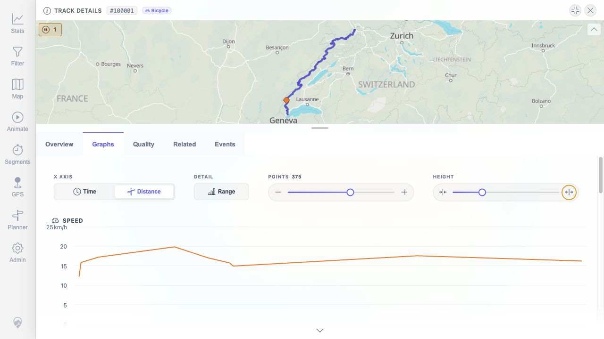</a>

**Text Evidence**
- [assets/TRD_05-graphs-controls-visible.txt](assets/TRD_05-graphs-controls-visible.txt) - Control DOM/state summary. (1.7 KB)

Excerpt: assets/TRD_05-graphs-controls-visible.txt

<pre><code>clicked=distance,range,point-plus,height-plus
control_dom=[
  {
    "aria": null,
    "cls": "toggle-btn",
    "i": 84,
    "pressed": null,
    "text": "Time"
  },
  {
    "aria": null,
    "cls": "toggle-btn toggle-btn--active",
    "i": 85,
    "pressed": null,
    "text": "Distance"
  },
  {
    "aria": null,
    "cls": "toggle-btn",
    "i": 86,
    "pressed": "false",
    "text": "Range"
  },
  {
    "aria": "Load fewer chart points",
    "cls": "graphs-slider-icon-btn",
    "i": 87,
    "pressed": null,
    "text": ""
  },
  {
    "aria": "Load more chart points",
    "cls": "graphs-slider-icon-btn",
    "i": 88,
    "pressed": null,
    "text": ""
  },
  {
    "aria": "Make graphs smaller",
    "cls": "graphs-slider-icon-btn",
    "i": 89,
    "pressed": null,
    "text": ""
  },
  {
    "aria": "Make graphs bigger",
    "cls": "graphs-slider-icon-btn",
    "i": 90,
    "pressed": null,
    "text": ""
  }
]
excerpt=- tabpanel "Graphs":
  - generic: X Axis
  - button " Time":
    - generic: 
    - text: Time
  - button " Distance":
    - generic: 
    - text: Distance
  - generic: Detail
  - button " Range":
    - generic: 
    - text: Range
  - text: Points
  - generic: "375"
  - button "Load fewer chart points":
    - generic: 
  - slider "Adjust chart point count"
  - button "Load more chart points":
    - generic: 
  - generic: Height
  - button "Make graphs smaller":
    - generic: 
  - slider "Adjust graph height"
  - button "Make graphs bigger" [active]:
    - generic: 
  - generic: 
  - text: Speed
  - generic: 
... [truncated in this report; open linked file for full evidence]</code></pre>

### Packet TRD_07

- Packet file: [packets/TRD_07.md](packets/TRD_07.md)
- Coverage ID: `TRD_07`
- Status: **PASS**
- Action: Checked track browser/stat rows, filter context, related tracks, and map selection list.
- Expected: Track shape preview is visible in browser, filters, stats, related tracks, and selection lists.
- Actual: Track browser/stat rows displayed line previews; related-track rows and overlap selection list displayed miniature track shapes; filter panel was captured with track geometry visible behind it.

**Timings**

| Step | Timing |
|---|---:|
| Preview surface check | Reused from existing packets |

**Handoff Notes**
- Completed: TRD_07 terminal PASS.
- Remaining unfinished coverage: continue with TRD_08.
- Blocked or not applicable: none.
- State left for the next packet: no data changed.

**Evidence**

### Packet TRD_08

- Packet file: [packets/TRD_08.md](packets/TRD_08.md)
- Coverage ID: `TRD_08`
- Status: **PASS**
- Action: Downloaded original source for GPX track #100001 and reused FIT original download evidence for #100005.
- Expected: Original source file downloads and matches uploaded one.
- Actual: GPX original returned HTTP 200, 199,962 bytes, 1,414 trackpoints, and matching SHA-256; FIT original previously matched uploaded checksum.

**Timings**

| Step | Timing |
|---|---:|
| Download verification | <1m |

**Handoff Notes**
- Completed: TRD_08 terminal PASS.
- Remaining unfinished coverage: continue with TRD_09.
- Blocked or not applicable: browser download events unsupported; authenticated installed-app endpoints used for file verification.
- State left for the next packet: no data changed.

**Evidence**

**Text Evidence**
- [assets/TRD_08-download-original-verification.txt](assets/TRD_08-download-original-verification.txt) - GPX source-file download verification plus FIT evidence reference. (285 B)

Excerpt: assets/TRD_08-download-original-verification.txt

<pre><code>gpx_track_id=100001
http=200
bytes=199962
sha256=fcff577bd3c1a6dc2bb9e53abba8051d510d282f4fb0049d38be5300f92e354e
expected_sha256=fcff577bd3c1a6dc2bb9e53abba8051d510d282f4fb0049d38be5300f92e354e
sha_match=yes
trkpt=1414
fit_original_evidence=assets/FIT_04_05-download-verification.txt
</code></pre>

- [assets/FIT_04_05-download-verification.txt](assets/FIT_04_05-download-verification.txt) - FIT original checksum verification. (698 B)

Excerpt: assets/FIT_04_05-download-verification.txt

<pre><code>{
  "url": "http://178.105.173.254:18080/mtl/",
  "trackId": 100005,
  "sourceEndpoint": "/mtl/api/tracks/100005/source-file",
  "gpxEndpoint": "/mtl/api/tracks/100005/gpx",
  "visibleControlsEvidence": "assets/FIT_04_05-download-controls.webp",
  "originalBytes": 94096,
  "originalSha256": "949a238e1bb75c3684479785f76fa9a16888bb394518844248f488171d591387",
  "originalMatchesUploaded": true,
  "gpxBytes": 479844,
  "gpxSha256": "8eaa4af6d85e92d4d471eb673d242748b32353f9055addddaefa525325fbc88d",
  "gpxTrkptCount": 3601,
  "gpxStartsWith": "&lt;?xml version=\"1.0\" encoding=\"UTF-8\"?&gt; &lt;gpx version=\"1.1\" creator=\"GPSBabel - https://www.gpsbabel.org\" xmlns=\"http://www.topografix.com/GPX"
}
</code></pre>

**Other Evidence Files**
- [assets/TRD_08-gpx-original-download.gpx](assets/TRD_08-gpx-original-download.gpx) - Downloaded GPX original for #100001. (195.3 KB)

### Packet TRD_09

- Packet file: [packets/TRD_09.md](packets/TRD_09.md)
- Coverage ID: `TRD_09`
- Status: **PASS**
- Action: Downloaded GPX export for GPX #100001 and reused FIT/non-GPX export evidence.
- Expected: A valid GPX downloads even if source was FIT or another format.
- Actual: GPX #100001 export returned HTTP 200 and 1,414 `trkpt`; FIT export returned 3,601 `trkpt`; successful non-GPX exports returned 180 `trkpt`. GeoJSON remains a known FMT failure with 0 `trkpt`.

**Timings**

| Step | Timing |
|---|---:|
| GPX export checks | <1m |

**Handoff Notes**
- Completed: TRD_09 terminal PASS for GPX/FIT/successful non-GPX sources.
- Remaining unfinished coverage: continue with TRD_10.
- Blocked or not applicable: GeoJSON export issue remains tracked under FMT, not counted as a pass.
- State left for the next packet: no data changed.

**Evidence**

**Text Evidence**
- [assets/TRD_09-download-as-gpx-verification.txt](assets/TRD_09-download-as-gpx-verification.txt) - GPX-backed GPX export verification. (273 B)

Excerpt: assets/TRD_09-download-as-gpx-verification.txt

<pre><code>gpx_track_id=100001
http=200
bytes=199962
trkpt=1414
root_prefix=&lt;?xml version="1.0" encoding="UTF-8"?&gt;
 &lt;gpx xmlns="http://www.topografix.com/GP
fit_gpx_evidence=assets/FIT_04_05-download-verification.txt
format_gpx_evidence=assets/FMT_02-unique-download-verification.txt
</code></pre>

- [assets/FIT_04_05-download-verification.txt](assets/FIT_04_05-download-verification.txt) - FIT GPX export verification. (698 B)

Excerpt: assets/FIT_04_05-download-verification.txt

<pre><code>{
  "url": "http://178.105.173.254:18080/mtl/",
  "trackId": 100005,
  "sourceEndpoint": "/mtl/api/tracks/100005/source-file",
  "gpxEndpoint": "/mtl/api/tracks/100005/gpx",
  "visibleControlsEvidence": "assets/FIT_04_05-download-controls.webp",
  "originalBytes": 94096,
  "originalSha256": "949a238e1bb75c3684479785f76fa9a16888bb394518844248f488171d591387",
  "originalMatchesUploaded": true,
  "gpxBytes": 479844,
  "gpxSha256": "8eaa4af6d85e92d4d471eb673d242748b32353f9055addddaefa525325fbc88d",
  "gpxTrkptCount": 3601,
  "gpxStartsWith": "&lt;?xml version=\"1.0\" encoding=\"UTF-8\"?&gt; &lt;gpx version=\"1.1\" creator=\"GPSBabel - https://www.gpsbabel.org\" xmlns=\"http://www.topografix.com/GPX"
}
</code></pre>

- [assets/FMT_02-unique-download-verification.txt](assets/FMT_02-unique-download-verification.txt) - Non-GPX GPX export verification. (312 B)

Excerpt: assets/FMT_02-unique-download-verification.txt

<pre><code>format	id	orig_http	orig_bytes	orig_sha_match	gpx_http	gpx_bytes	gpx_trkpt
tcx	100013	200	86643	yes	200	24823	180
kml	100014	200	156122	yes	200	196159	180
igc	100015	200	6802	yes	200	24740	180
gdb	100017	200	4423	yes	200	24699	180
nmea	100018	200	24840	yes	200	44688	180
geojson	100016	200	26276	yes	200	20356	0
</code></pre>

**Other Evidence Files**
- [assets/TRD_09-gpx-download-as-gpx.gpx](assets/TRD_09-gpx-download-as-gpx.gpx) - Downloaded GPX export for #100001. (195.3 KB)

### Packet TRD_13

- Packet file: [packets/TRD_13.md](packets/TRD_13.md)
- Coverage ID: `TRD_13`
- Status: **PASS**
- Action: Opened track #100001, switched to Related, verified related groups, then clicked related entry `Track #100005`.
- Expected: Related tracks show duplicates and previous/next tracks; clicking one navigates to that track.
- Actual: The Related tab showed Next Tracks and Duplicates for #100001. Clicking `Track #100005` navigated the detail panel to #100005 and refreshed related context.

**Timings**

| Step | Timing |
|---|---:|
| Related tab navigation | <2m |

**Handoff Notes**
- Completed: TRD_13 terminal PASS.
- Remaining unfinished coverage: continue with TRD_14.
- Blocked or not applicable: none.
- State left for the next packet: detail panel open on #100005 Related tab.

**Evidence**

<a href="assets/TRD_13-related-fullscreen.webp">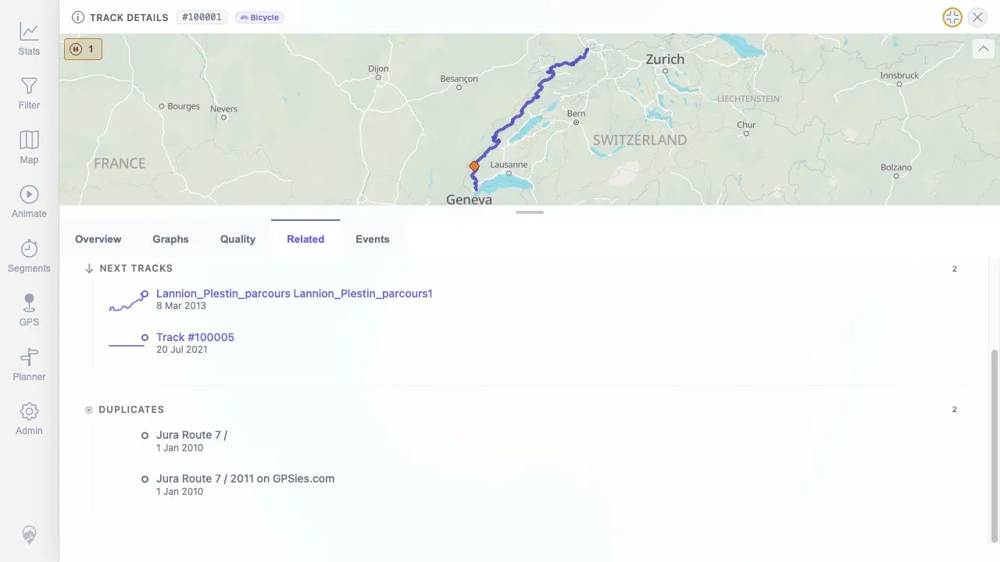</a>
<a href="assets/TRD_13-related-navigated.webp">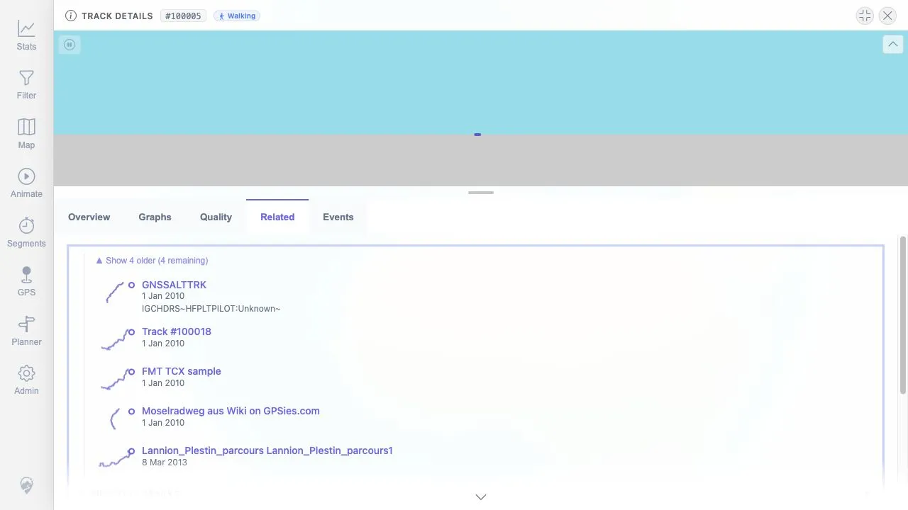</a>

### Packet TRD_14

- Packet file: [packets/TRD_14.md](packets/TRD_14.md)
- Coverage ID: `TRD_14`
- Status: **PASS**
- Action: Opened #100001 Events tab, selected Break 1, then clicked it again to clear selection.
- Expected: Events tab shows detected stops/GPS gaps where present; selecting an event highlights the matching mini-map position and deselects cleanly.
- Actual: Events showed `1 break`. Selecting Break 1 set the event button pressed and highlighted the matching location on the mini-map; clicking again removed the map highlight and cleared the pressed state.

**Timings**

| Step | Timing |
|---|---:|
| Event select/deselect | <2m |

**Handoff Notes**
- Completed: TRD_14 terminal PASS.
- Remaining unfinished coverage: continue with FLT_01.
- Blocked or not applicable: none.
- State left for the next packet: detail panel open on #100001 Events tab.

**Evidence**

<a href="assets/TRD_14-events-before-select.webp">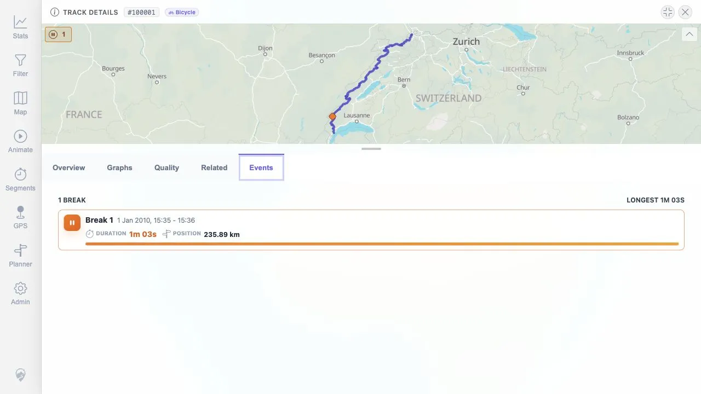</a>
<a href="assets/TRD_14-event-selected.webp">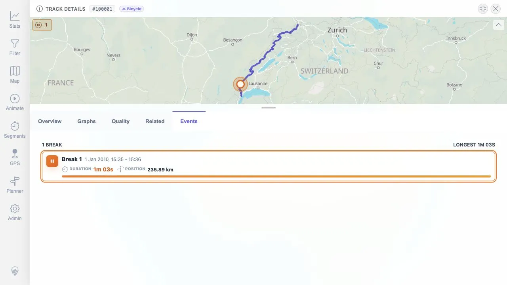</a>
<a href="assets/TRD_14-event-deselected.webp">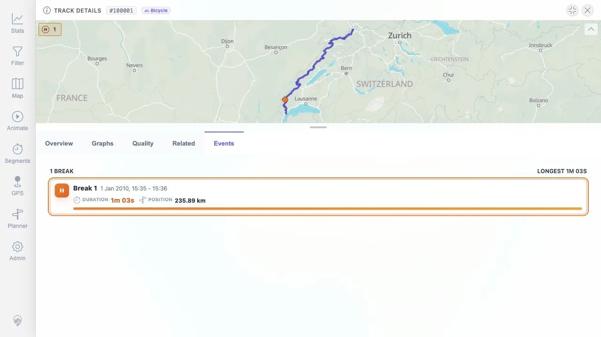</a>

