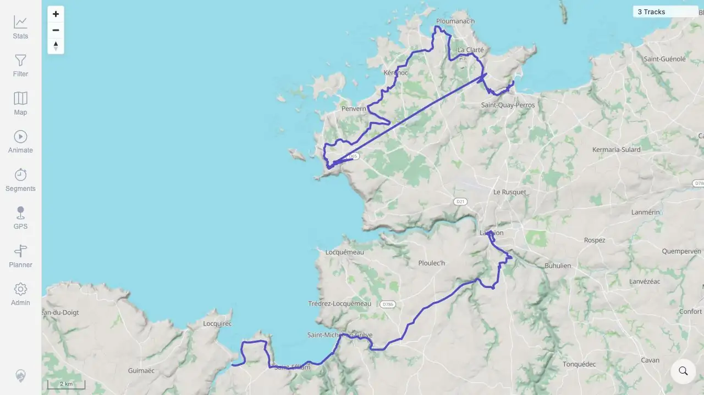
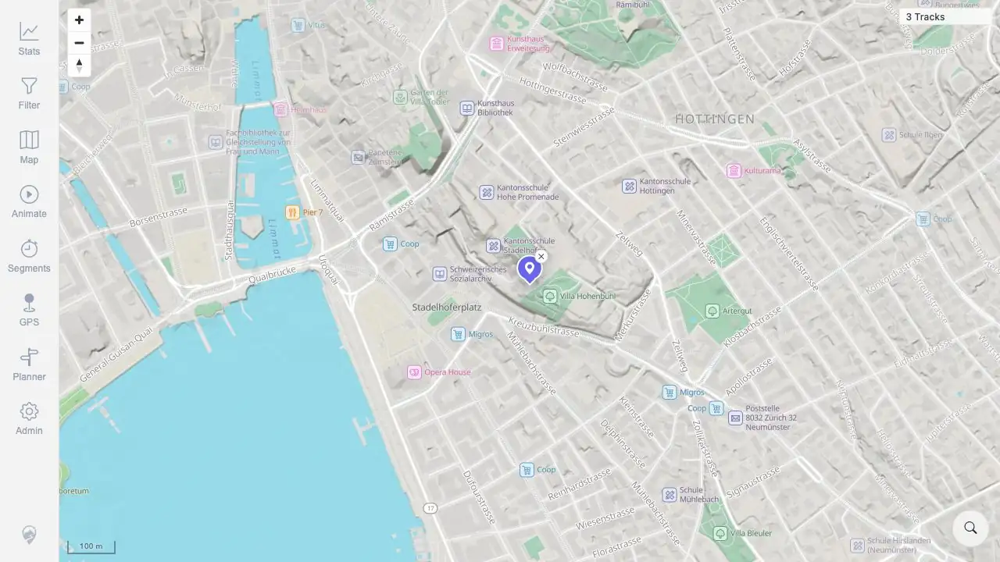
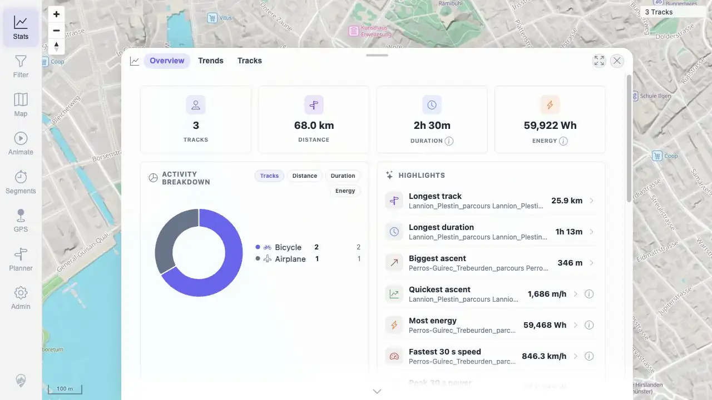
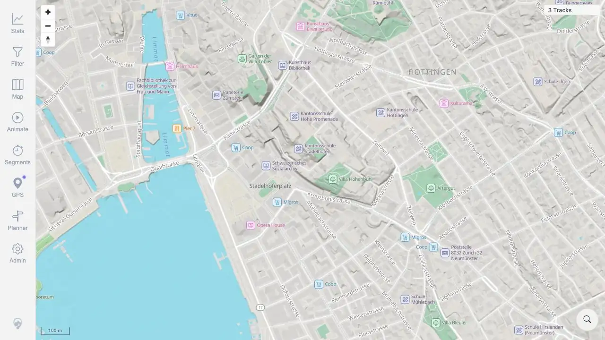
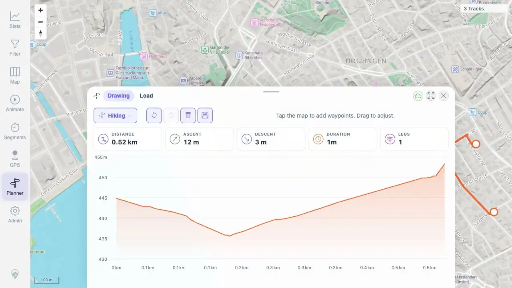
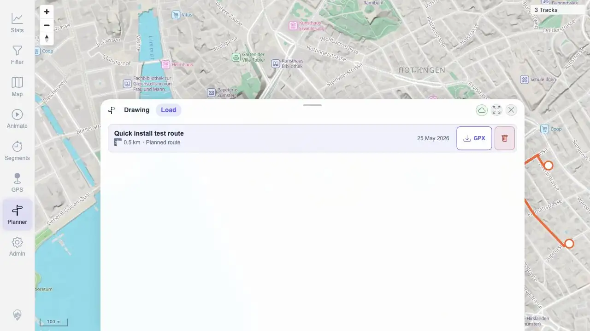

> **RESULT: PASS - README compose quick start worked end to end after installing missing Docker prerequisites**

## Goal

Verify the MTL Explorer README `Quick start` compose flow on server `178.105.202.176`, using GitHub `main` as the source of truth and the checked-out root `README.md` quick-start instructions.

The tested README checkout was:

| Item | Value |
|---|---|
| Repository | `https://github.com/mindalyze-com/mtl-explorer` |
| Branch | `main` |
| Commit | `dce522049dbe72637f66fb6b97cb684f274b866b` |
| Commit date | `2026-05-25T18:18:50+02:00` |
| Subject | `Merged back outstanding features. Added support for container based build. On Rsync to github also copy java classes with 'logs' in path which before by mistake was ignored.  (fixed unwanted github actions)` |

The README quick start section in that checkout documented:

```bash
mkdir mtl-explorer && cd mtl-explorer
curl -fsSL -o docker-compose.yml https://raw.githubusercontent.com/mindalyze-com/mtl-explorer/main/docker-compose.yml
docker compose up -d
```

## Environment

| Check | Result |
|---|---|
| Hostname | `MTL-TEST-QUICK-INSTALL-v5` |
| OS | Debian GNU/Linux 13 (trixie), `DEBIAN_VERSION_FULL=13.5` |
| Kernel | `Linux 6.12.88+deb13-cloud-amd64` |
| Virtualization | KVM, Hetzner vServer |
| Baseline RAM | 3.7 GiB total, 3.4 GiB available, no swap |
| Baseline disk | `/dev/sda1` 75G total, 988M used, 71G available |
| Final disk | `/dev/sda1` 75G total, 5.0G used, 67G available |

Access setup note: the root account initially required a forced password update, blocking non-interactive SSH with "Password change required but no TTY available." I completed that access step before product testing and used a temporary SSH public key for scripted evidence collection. This was not part of the MTL Explorer quick-start result.

## Prerequisites

README prerequisite: Docker Engine and the Docker Compose plugin must be installed and support `docker compose`.

Initial probe:

| Tool | Initial state |
|---|---|
| Docker Engine | Missing |
| Docker Compose plugin | Missing |
| Git | Missing |
| curl | Present at `/usr/bin/curl` |

Prerequisite setup performed separately from the MTL Explorer quick install:

```bash
apt-get update
DEBIAN_FRONTEND=noninteractive apt-get install -y ca-certificates curl gnupg git
install -m 0755 -d /etc/apt/keyrings
curl -fsSL https://download.docker.com/linux/debian/gpg -o /etc/apt/keyrings/docker.asc
chmod a+r /etc/apt/keyrings/docker.asc
printf 'deb [arch=%s signed-by=/etc/apt/keyrings/docker.asc] https://download.docker.com/linux/debian %s stable\n' "$ARCH" "$VERSION_CODENAME" > /etc/apt/sources.list.d/docker.list
apt-get update
apt-cache madison docker-ce | head -5
apt-cache madison docker-compose-plugin | head -5
DEBIAN_FRONTEND=noninteractive apt-get install -y docker-ce docker-ce-cli containerd.io docker-buildx-plugin docker-compose-plugin
systemctl enable --now docker
docker --version
docker compose version
```

Installed versions:

| Component | Version |
|---|---|
| Docker Engine | `Docker version 29.5.2, build 79eb04c` |
| Docker client/server | `Server=29.5.2 Client=29.5.2` |
| Docker Compose plugin | `Docker Compose version v5.1.4` |
| Docker package repository | Docker stable repo for Debian `trixie`; latest visible `docker-ce` was `5:29.5.2-1~debian.13~trixie`; latest visible `docker-compose-plugin` was `5.1.4-1~debian.13~trixie` |
| Git | `1:2.47.3-0+deb13u1` from Debian, used only to check out/read README |

## Timing Summary

| Phase | Duration | Result |
|---|---:|---|
| Docker prerequisite setup | 15s | PASS - Docker Engine and Compose plugin installed and verified |
| README/source checkout | 4s | PASS - `README.md` read from GitHub `main` commit `dce5220` |
| Quick-start directory/setup | 0s | PASS - `mkdir`, `cd`, and `curl` completed |
| Image pull/container startup | 26s | PASS - `docker compose up -d` completed |
| App readiness after compose up | 28s | PASS - `http://localhost:18080/mtl/` returned HTTP 200 |
| GPX download/import sync | About 30s to first imported-count observation | PASS - 3 GPX files imported as 4 tracks |
| Deletion sync | 8s | PASS - deleted GPX source removed from GUI/API count |
| GUI functional pass | 4m03s screenshot interval | PASS - login, map, search, stats, planner route, save/load covered |
| Final verification | <1s | PASS - containers up, app HTTP 200, imported count 3, saved route present |

## README Quick Start Execution

Fresh test parent: `/root/quick-install-compose-test`

Executed commands:

```bash
mkdir mtl-explorer
cd mtl-explorer
curl -fsSL -o docker-compose.yml https://raw.githubusercontent.com/mindalyze-com/mtl-explorer/main/docker-compose.yml
docker compose up -d
```

Command results:

| Step | Result |
|---|---|
| `mkdir mtl-explorer` | PASS |
| `cd mtl-explorer` | PASS |
| `curl -fsSL -o docker-compose.yml ...` | PASS |
| `docker-compose.yml` SHA-256 | `18d05ba498992bf230a32c41df3154fc93a7a2e93ef6b8e8a8d3d77071d3f0bc` |
| `docker compose up -d` | PASS |
| First HTTP verification | HTTP 200 at `/mtl/`; title probe `MTL Explorer` |

Started services:

| Service | Image | Status |
|---|---|---|
| `app` | `wauwau0977/mytraillog:latest` | Up, `0.0.0.0:18080->8080/tcp` |
| `db` | `postgis/postgis:18-3.6` | Up, healthy |
| `location-search` | `wauwau0977/mytraillog-location-search:latest` | Up, healthy, `0.0.0.0:18083->8083/tcp` |
| `brouter` | `wauwau0977/mytraillog-brouter:latest` | Up |

No README quick-start command failed.

## GPX Import Evidence

Imported files were placed under the README quick-start GPX folder: `./data/gpx/`.

| Source URL | Destination | SHA-256 | Size | `trkpt` | timestamped `trkpt` | Track name |
|---|---|---|---:|---:|---:|---|
| `https://raw.githubusercontent.com/gps-touring/sample-gpx/master/RoscoffCoastal/Lannion_Plestin_parcours24.4RE.gpx` | `lannion-plestin-parcours24.4re.gpx` | `e76c692cbb5580f20013ce19995a9383361a8a0babec2db3e36f7064f316e85f` | 60,917 | 381 | 381 | `Lannion_Plestin_parcours` |
| `https://raw.githubusercontent.com/gps-touring/sample-gpx/master/RoscoffCoastal/Perros-Guirec_Trebeurden_parcours23.6RE.gpx` | `perros-guirec-trebeurden-parcours23.6re.gpx` | `61458bda350b077f35b481b5284678a7b2f48e7111de5810830cf850ddc793c1` | 91,144 | 566 | 566 | `Perros-Guirec_Trebeurden_parcours` |
| `https://raw.githubusercontent.com/gps-touring/sample-gpx/master/RoscoffCoastal/Trebeurden_Lannion_parcours13.2RE.gpx` | `trebeurden-lannion-parcours13.2re.gpx` | `3dfc4feb491557f99e9e94c3eb5c41886445954033c1a89935d7ee1b8583060e` | 44,505 | 271 | 271 | `Trebeurden_Lannion_parcours` |

Import result:

| Check | Result |
|---|---|
| Before import | `trackCount=0` |
| After import | `trackCount=4`, distance `84.1 km`, duration `3h 15m` |
| Note | Three GPX files yielded four imported tracks because `perros-guirec-trebeurden-parcours23.6re.gpx` imported as two tracks/segments. |
| Import statuses | All imported rows reported `loadStatus=SUCCESS` |

Imported track summary:

```text
100002 trebeurden-lannion-parcours13.2re.gpx 265 pts 16.1 km SUCCESS
100003 perros-guirec-trebeurden-parcours23.6re.gpx 57 pts 18.5 km SUCCESS
100000 lannion-plestin-parcours24.4re.gpx 381 pts 25.9 km SUCCESS
100001 perros-guirec-trebeurden-parcours23.6re.gpx 413 pts 23.6 km SUCCESS
```

## Deletion Sync Evidence

Deleted file:

```bash
rm ./data/gpx/trebeurden-lannion-parcours13.2re.gpx
```

Result:

| Check | Result |
|---|---|
| Before deletion | `trackCount=4` |
| After deletion | `trackCount=3` |
| Sync duration | 8s |
| Deleted source visibility | `deleted_source_remaining=0` |
| Remaining imported sources | `lannion-plestin-parcours24.4re.gpx`, `perros-guirec-trebeurden-parcours23.6re.gpx` |

## GUI Functional Pass

Browser access used an SSH tunnel from local `http://localhost:18080/mtl/` to the server's `localhost:18080`.


| Function | UI action | Expected result | Actual result | Status |
|---|---|---|---|---|
| Login | Open `/mtl/`, enter `mtl` / `change-me`, click `Sign In` | Authenticated app view opens | Map view opened; DOM showed toolbar and `3 Tracks` | PASS |
| Map render | Observe post-login map canvas/tiles | Map tiles render with toolbar | Map rendered with Zurich map tiles and controls | PASS |
| GPX folder import | Add public GPX files to `./data/gpx/` | Imported tracks appear | After sync, imported tracks appeared in stats/API; after deletion, GUI showed `3 Tracks` | PASS |
| Imported track visibility | Open `Stats` panel | Imported tracks and summary are visible | Stats showed `3` tracks, `68.0 km`, recent imported activities | PASS |
| GPX deletion reflection | Delete one GPX from `./data/gpx/`, refresh GUI state | Deleted track no longer counted/visible | GUI count showed `3 Tracks`; stats no longer listed `Trebeurden_Lannion...` | PASS |
| Location search | Click search icon, type `Zurich`, select city result | Results appear and map centers/marks result | Results listed `Zürich, Zurich, Switzerland`; selecting it placed a map marker | PASS |
| Drawing/route editing controls | Open `Planner`, inspect controls, click map twice | Draw controls enabled after waypoints; route computes | Undo, clear, and save controls enabled; distance/ascent/descent/duration populated | PASS |
| Planner routing stats | Draw two-waypoint route | Computed distance/elevation/duration shown | UI showed `0.52 km`, `12 m` ascent, `3 m` descent, `1m`, `1` leg | PASS |
| Save planned route | Click `Save route`, set name, click `Save plan` | Planned route is saved | `Load` tab listed `Quick install test route`, `0.5 km` | PASS |














## Planner API Cross-Check

Before the BRouter sidecar had the needed routing segment, `/api/planner/route` returned:

```json
{"error":"segment-downloading","detail":"Routing data for this area is being downloaded. Please retry in about 30 seconds."}
```

After segment download, route calculation passed:

```json
{
  "stats": {
    "distanceM": 3165.0,
    "ascentM": 139.0,
    "descentM": 3.0,
    "durationSec": 1537.0,
    "legCount": 1,
    "anyLegCached": true
  }
}
```

Saved planned route final API check:

```json
[{"id":100004,"name":"Quick install test route","distanceM":523.992515458317,"centerLat":47.35791017086903,"centerLng":8.560822424957765,"createDate":"2026-05-25T17:13:03.424+00:00","profile":"trekking"}]
```

## Final Verification

Final server-side checks:

| Check | Result |
|---|---|
| `docker compose ps` | `app`, `db`, `location-search`, and `brouter` all up; `db` and `location-search` healthy |
| `curl http://localhost:18080/mtl/` | HTTP 200 |
| Page title | `MTL Explorer` |
| Imported-track overview after deletion | `trackCount=3`, distance `67991.25 m`, duration `9001000 ms`, energy `59922.2 Wh` |
| Saved route | `Quick install test route`, `523.99 m`, profile `trekking` |
| BRouter status | Available, running, `segmentsOnDisk=1`, `segmentsQueued=0` |

Focused evidence files:

| Asset | Purpose |
|---|---|
| `assets/source-readme-checkout.log` | Checkout commit and README quick-start excerpt |
| `assets/gpx-sample-metadata.tsv` | GPX URL, checksum, size, and trackpoint metadata |
| `assets/tracks-after-import-summary.txt` | Imported track summary |
| `assets/gpx-delete-sync.log` | Deletion wait loop evidence |
| `assets/final-verification.log` | Final container, HTTP, overview, planner, and disk checks |
| `assets/final-planner-plans.json` | Saved planner route API response |

## Issues And Observations

| Severity | Observation | Impact |
|---|---|---|
| Non-product prerequisite | Docker Engine and Docker Compose plugin were missing initially. | Not a quick-start failure because the README explicitly requires them. Installed separately and verified. |
| Non-product support package | Git was missing initially. | Installed only to check out GitHub `main` and read `README.md`; the README quick-start commands themselves did not use Git. |
| First-use routing delay | First planner API call returned `segment-downloading`. | Not blocking. After the BRouter sidecar downloaded the needed segment, routing passed and UI planner save/load passed. |
| Import-count nuance | Three GPX files imported as four tracks because one source GPX produced two tracks/segments. | Not a failure. Deletion verification used a single-track source for an unambiguous `4 -> 3` imported-track count change. |

## Conclusion

The README compose-based MTL Explorer quick install passed end to end on the target server after installing the missing Docker prerequisite. The documented quick-start commands completed without product workarounds, the stack served `http://localhost:18080/mtl/`, GPX import and deletion sync worked from `./data/gpx/`, and the main GUI workflows passed, including map rendering, location search, imported-track statistics, route planning, and saving a planned route.
